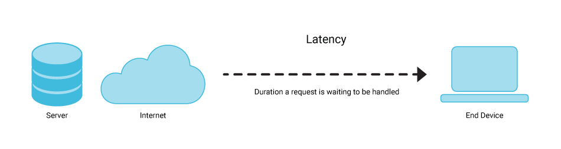

In the fast-paced world of trading, latency can have a significant impact on the effectiveness of a trading strategy. At its core, latency refers to any delay between the initiation and execution of a trading order. This delay can originate from various sources, such as network transmission times, processing delays within trading platforms, and data feed lags. These seemingly small delays can accumulate, potentially leading to missed trading opportunities or suboptimal execution prices. For instance, in high-frequency trading (HFT), where decisions are made in microseconds, even a slight increase in latency can diminish a strategy's edge over competitors.

Understanding how latency affects trading performance is crucial for both traders and developers. Traders must comprehend the potential performance erosions due to latency to better calibrate their expectations and optimize their strategies. Developers, on the other hand, need to identify and mitigate these latency sources within their trading systems to enhance performance and maintain competitiveness in a highly dynamic market environment.



In this context, latency is not just about the speed of execution but also involves the timeliness of receiving and processing market data. A trading system that efficiently processes the latest market information and executes trades with minimal delay is more likely to remain competitive and profitable. Therefore, assessing the impact of latency involves examining both the propagation of market data and the execution of trades, considering numerous metrics and methodologies.

This article will explore the methods and metrics used to assess the impact of latency on trading strategies. We'll investigate how latency can affect critical performance metrics and the tools available to measure and mitigate its effects. By exploring various facets of latency and its impact, this examination provides traders and developers with valuable insights to enhance their trading systems' efficiency and effectiveness.


## Table of Contents

## Understanding Latency in Trading

Latency in trading systems refers to the time delay from when a trading signal is generated to when an order is executed in the marketplace. It encompasses various forms of delays, each contributing to the overall sluggishness that can significantly impact trading outcomes, especially in high-frequency trading ([HFT](/wiki/high-frequency-trading-strategies)) and automated strategies.

Sources of latency in trading include:

1. **Network Delays:** These occur during data transmission over the internet or private networks. Factors such as the physical distance between servers, network congestion, and bandwidth limitations can exacerbate these delays. Packet loss and retransmissions further compound network latency, leading to slower data reception.

2. **Processing Times:** Within a trading system, several computational processes take place, from receiving and parsing market data to applying trading algorithms. Each step involves processing time, which can add up, particularly if the system's hardware or software is not optimized.

3. **Data Feed Lags:** Market data vendors and exchanges provide market data feeds, which can experience latency due to the time taken to gather, package, and distribute this data. Lags are more pronounced during periods of high market activity, where data throughput requirements spike.

Minimizing latency is crucial for HFT and other automated strategies due to the following reasons:

- **Speed of Execution:** In HFT, success often depends on being the first to enter or exit a position upon signal generation. Even microsecond delays can result in lost opportunities or adverse price movements.

- **Price Accuracy:** Latency can lead to discrepancies between the expected and actual prices at which orders are executed (slippage). Minimizing latency helps ensure that executions align closely with intended prices.

- **Competitive Edge:** In financial markets, being faster than competitors can mean the difference between profit and loss. Low-latency systems can seize trading opportunities before they are reflected in less responsive systems.

As a consequence, reducing latency through technological advancements such as co-location with exchanges, optimizing software algorithms, and employing direct market access is of paramount importance. This allows traders to quickly and accurately react to market changes, making latency management a key aspect of successful trading strategies.


## Types of Latency in Trading

Latency in trading systems can be categorized into three main types: network latency, server latency, and application latency. Each type plays a distinct role in influencing the speed and efficiency of trading operations.

**Network Latency** refers to the time it takes for data to travel from one point to another across a network. In trading, this involves the transmission of trading orders and market data between the trader's system and the exchange servers. High network latency means orders might arrive late, resulting in potential slippage or missed trading opportunities. Common scenarios where network latency can affect trading include periods of high market volatility, where rapid price changes require swift execution times to maintain profitability.

**Server Latency** occurs at the exchange or broker server level and involves the time taken to process incoming trading requests. This can be affected by the load on the server, with higher loads potentially increasing latency. Server latency can delay the execution of orders and the delivery of market updates, again leading to slippage or discrepancies in market data. During major economic announcements or unexpected market events, server latency may spike as a large number of traders are simultaneously accessing market resources.

**Application Latency** pertains to delays within the trading system's software, including the algorithms and processes that handle data and make trading decisions. This type of latency can stem from inefficient code or bottlenecks in data processing. For example, complex algorithms or poorly optimized database queries could slow down decision-making processes, causing delayed order submissions. Application latency can become pronounced when traders use sophisticated algorithms that require extensive computation.

In summary, network, server, and application latency each present unique challenges to trading strategy execution and market data handling. Understanding and managing these latency types is crucial for maintaining competitive advantage in the fast-paced trading environment.


## Measuring Latency and Its Effects

Measuring latency in trading systems is essential for optimizing performance and ensuring the reliability of trading strategies. One common method for measuring latency involves timestamping, which allows traders to track the time taken for a message to travel from the trading server to the exchange and back. Timestamping relies on precise time synchronization across systems, which can be achieved using protocols such as the Network Time Protocol (NTP) or the Precision Time Protocol (PTP). These protocols help maintain consistent timekeeping across distributed systems, crucial for accurate latency measurements.

Another key aspect of measuring latency is real-time monitoring and reporting. By continuously tracking latency metrics, trading systems can detect anomalies and inefficiencies as they occur. Real-time monitoring tools alert traders to potential issues, enabling them to make prompt adjustments to avoid adverse effects on trading performance. This proactive approach is vital for high-frequency trading setups where even the slightest delay can result in significant financial implications.

The combination of timestamping and real-time monitoring provides a comprehensive view of system latency, allowing traders to fine-tune their strategies for better execution and market data handling. By leveraging these techniques, trading systems can minimize slippage, improve fill rates, and ultimately enhance returns.


## Quantifying the Impact of Latency on Trading Performance

Quantifying the impact of latency on trading performance is crucial for understanding its effects on key metrics such as slippage, fill rates, and returns. Latency can have a direct influence on slippage, which occurs when there is a difference between the expected price of a trade and the actual price at which it is executed. High latency increases the likelihood of slippage because market conditions can change rapidly between the time an order is placed and when it is executed. This is particularly evident in high-frequency trading (HFT), where even microsecond delays can lead to significant financial discrepancies.

Fill rates, the percentage of orders that are successfully executed, are also affected by latency. A higher latency can cause orders to miss favorable price points, resulting in partial fills or no fills at all. In trading environments where milliseconds matter, even minor delays can lead to missed opportunities, causing strategies to underperform.

Returns, a fundamental metric of trading success, can be diminished by latency. When trades are executed at less favorable prices due to delays, the overall profitability of the strategy can decrease. This reduction in returns can be compounded over multiple trades, significantly affecting the bottom line for traders relying on speed for profitability.

Case studies and simulations illustrate the tangible impact of latency on trading performance. For instance, a simulation might show that a strategy achieving an average 60% fill rate at low latency experiences a drop to 50% when latency is increased by 10 milliseconds. The consequential reduction in profit margins could render a previously viable strategy unprofitable.

The effect of latency is not limited to live trading; it also influences [backtesting](/wiki/backtesting) and forward testing of strategies. Backtesting involves simulating a strategy on historical data to evaluate its potential performance. If latency is not accurately modeled, the results may be overly optimistic. Similarly, forward testing, which tests the strategy in a live but controlled environment, can produce misleading outcomes if latency conditions are not mirrored accurately. Accounting for latency in these testing phases ensures that the transition from theoretical performance to real-world application is smoother and more predictable.

Tools and methods for mitigating the negative effects of latency include optimizing execution algorithms, using faster data feeds, and utilizing co-location services. By doing so, traders can refine their strategies to account for, and ideally minimize, the detrimental effects of latency, ensuring more consistent performance and reliability.


## Strategies to Mitigate Latency

To minimize latency in trading systems, traders and developers can employ various strategies that target both infrastructure and software optimizations. 

**Co-location and High-Speed Networks**

Co-location involves positioning trading servers within the same data centers as exchange servers, thereby drastically reducing the round-trip time for data transmission. This proximity minimizes network latency, a major contributor to delays in trading systems. High-speed networks further enhance this setup. By leveraging fiber optic cables and direct market access (DMA), firms can communicate with exchanges with minimal delay. The lower the physical distance and the faster the communication channels, the nearer these systems approach ideal conditions for rapid trade execution.

**Optimizing Algorithms**

Algorithm optimization plays a critical role in reducing latency. One approach involves re[factor](/wiki/factor-investing)ing algorithms to reduce computational complexity, allowing faster decision-making and execution. Use advanced programming languages like C++ for speed-critical components, as these languages provide more control over hardware resources and execute commands more swiftly than interpreted languages. 

Here is an example code snippet in Python, showing how one might vectorize operations using NumPy to speed up algorithm components:

```python
import numpy as np

# Example of vectorizing operations to minimize processing time
large_array = np.random.rand(1000000)
threshold = 0.5

# Non-vectorized approach
filtered_list = [x for x in large_array if x > threshold]

# Vectorized approach using NumPy
filtered_array = large_array[large_array > threshold]
```

**Low-Latency Data Feeds**

Using low-latency data feeds is another effective strategy. Financial market data is highly time-sensitive, and delays in receiving this information can lead to inaccurate decisions. Choosing a data provider that prioritizes speed and offers reliable and fast data transmission can lead to significant improvements in trading performance. Opt for data feeds that offer direct market data and avoid consolidated feeds that aggregate data from multiple sources, as the latter can introduce additional delays.

By combining infrastructure improvements with algorithmic optimizations and choosing the right data solutions, trading systems can achieve minimal latency, enhancing their competitiveness and efficiency in high-frequency trading environments.


## Future Trends and Technologies in Latency Reduction

Innovations in technology continue to push the boundaries of what is possible in reducing latency in trading systems. One of the most promising advancements is the use of edge computing. By decentralizing data processing and bringing it closer to the source of data, edge computing can significantly decrease the latency associated with data transfers to central servers. This allows trading algorithms to access, analyze, and act on data in real-time without the delays caused by geographical distance. For trading strategies that require low latency, such as high-frequency trading, this can provide a substantial edge over competitors.

Emerging faster internet protocols also play a pivotal role in addressing latency issues. Protocols like HTTP/3 and QUIC are designed to enhance speed and reliability of data transmission. HTTP/3, which leverages the QUIC protocol, uses multiplexed connections to reduce latency by minimizing the overhead associated with TCP handshakes and retransmissions. This results in a more efficient transfer of market data and order executions, thereby enhancing trading performance.

Despite these advancements, challenges remain in latency management. As trading platforms become increasingly complex, the sheer [volume](/wiki/volume-trading-strategy) of data can introduce bottlenecks, making it imperative to continually optimize data processing pipelines. Moreover, while edge computing and faster protocols offer significant latency reductions, their implementation requires robust security measures to protect sensitive financial data from potential breaches.

The opportunities for reducing latency in trading systems are vast. As technologies such as quantum computing and blockchain evolve, they promise to further revolutionize trading strategies by offering unprecedented processing capabilities and transaction speeds. However, realizing these opportunities requires ongoing investment and innovation, as well as a keen understanding of both the technical and financial landscapes.

In summary, while the quest to reduce latency presents challenges, it also offers exciting opportunities to enhance trading performance through cutting-edge technologies. As these tools evolve, they will redefine what is possible in trading, enabling traders to execute strategies with greater precision and efficacy.


## Conclusion

The impact of latency on trading strategies cannot be overstated. Latency, introduced at various stages such as network, server, and application layers, can significantly alter the effectiveness of both high-frequency and automated trading strategies. Managing and minimizing latency is crucial for ensuring timely order execution, reducing slippage, and optimizing fill rates. Traders and developers must constantly monitor and refine their systems to account for latency and its effects.

Tools and techniques like timestamping, real-time monitoring, and time synchronization are critical for measuring latency with precision. By employing strategies such as co-location, using high-speed networks, and optimizing algorithms, traders can significantly mitigate latency, thereby enhancing strategy performance and returns.

Assessing and managing latency is not a one-time effort but a continuous process. As technology evolves, so will the sources and types of latency. Therefore, ongoing assessment and adaptation are crucial to staying competitive in the fast-evolving trading landscape. By staying vigilant and proactive in managing latency, traders can ensure optimal trading performance and maintain an edge in the market.


## References & Further Reading

[1]: Aldridge, I. (2013). ["High-Frequency Trading: A Practical Guide to Algorithmic Strategies and Trading Systems"](https://www.amazon.com/High-Frequency-Trading-Practical-Algorithmic-Strategies/dp/1118343506). Wiley.

[2]: Lewis, M. (2015). ["Flash Boys: A Wall Street Revolt"](https://www.amazon.com/Flash-Boys-Wall-Street-Revolt/dp/0393351599). W. W. Norton & Company.

[3]: Narang, R. K. (2013). ["Inside the Black Box: A Simple Guide to Quantitative and High-Frequency Trading"](https://www.amazon.com/Inside-Black-Box-Quantitative-Frequency/dp/1118362413). Wiley.

[4]: Kissell, R. L. (2013). ["The Science of Algorithmic Trading and Portfolio Management"](https://www.amazon.com/Science-Algorithmic-Trading-Portfolio-Management/dp/0124016898). Academic Press.

[5]: Johnson, B. R. (2010). ["Algorithmic Trading & DMA: An Introduction to Direct Access Trading Strategies"](https://www.amazon.com/Algorithmic-Trading-DMA-Introduction-Strategies/dp/0956399207). 4Myeloma Press.