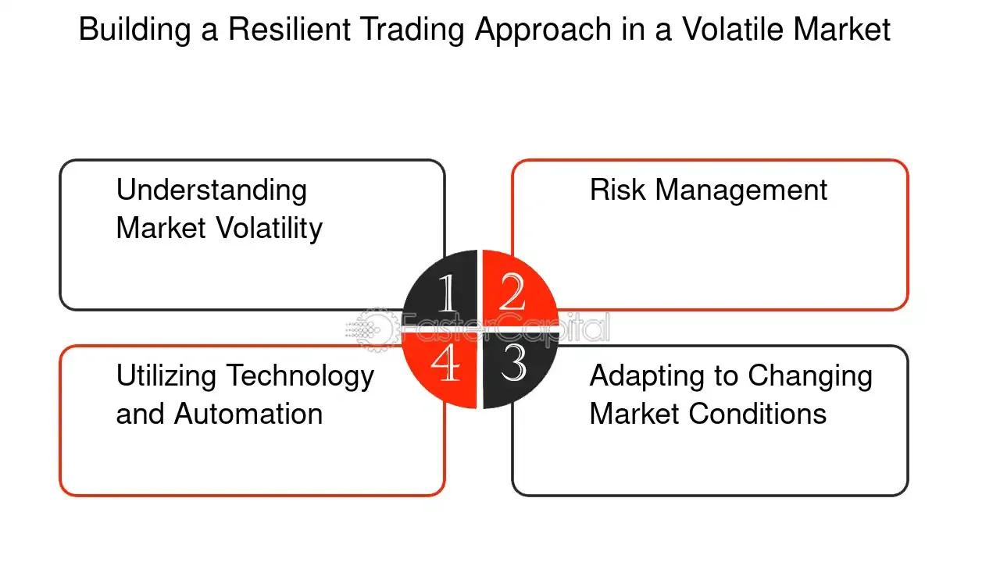

## Table of Contents

## What is a trading strategy?

A trading strategy is a set of rules and guidelines that a trader follows to make decisions about buying and selling financial assets like stocks, currencies, or commodities. It helps traders to be consistent and disciplined in their approach, reducing the impact of emotions on their trading decisions. A good trading strategy takes into account the trader's goals, risk tolerance, and the market conditions they are trading in.

There are many different types of trading strategies, and they can be based on technical analysis, fundamental analysis, or a combination of both. Technical analysis involves studying charts and using indicators to predict future price movements, while fundamental analysis looks at the financial health and performance of a company or economy. Some common strategies include trend following, where traders buy assets that are going up in value and sell those that are going down, and mean reversion, where traders bet on prices returning to their average levels after moving too far in one direction.

## Why is continuity of operations important for trading strategies?

Continuity of operations is important for trading strategies because it helps traders keep making money even when things go wrong. If a trader has a plan that works well most of the time, but then something unexpected happens, like a big market crash or a computer problem, they need to be ready to keep going. Having a good plan for these situations means the trader can quickly get back to trading and not lose a lot of money.

Also, continuity helps traders stick to their strategy and not make quick, bad decisions because they are scared or confused. If traders know they have a backup plan, they feel more confident and can focus on following their main strategy. This way, they are more likely to do well over time and not let short-term problems mess up their long-term goals.

## What are the basic components of a trading system?

A trading system has a few important parts that help it work well. The first part is the entry rules, which tell a trader when to buy or sell something. These rules are based on things like price charts, numbers that show how the market is doing, or news about a company. The second part is the [exit](/wiki/exit-strategy) rules, which tell a trader when to get out of a trade. This could be when they make a certain amount of money or if the trade is not going well and they need to stop losing money.

Another important part is the money management rules. These rules help traders decide how much money to use for each trade. This is important because it helps them not lose too much money if a trade goes wrong. The last part is the risk management rules. These rules help traders know how much risk they are taking and how to protect themselves from big losses. By having all these parts, a trading system can help traders make good decisions and do well in the market.

## How can you monitor the performance of a trading strategy?

To monitor the performance of a trading strategy, you need to keep track of how well it is doing over time. This means looking at things like how much money you are making or losing, how often your trades are successful, and how big your wins and losses are. You can use a trading journal or special software to write down all your trades and see how they add up. By doing this, you can see if your strategy is working as well as you hoped or if you need to make some changes.

It's also important to compare your strategy's performance to the market or other strategies. This helps you know if your strategy is doing better or worse than others. You can look at things like how much more or less you are making compared to the market, and how much risk you are taking to get those results. By keeping an eye on these things, you can make smart decisions about whether to keep using your strategy or try something new.

## What are common risks that can disrupt trading operations?

There are many things that can go wrong and mess up trading operations. One big problem is when the technology you use stops working. This can happen if your computer breaks, the internet goes down, or the trading platform you use has a glitch. If you can't use your tools, you can't make trades, and you might miss out on making money or lose money because you can't get out of a bad trade.

Another risk is when the market does something unexpected. This can happen if there is big news, like a war starting or a big company going bankrupt. These events can make prices move a lot and very quickly, which can be hard to handle if you're not ready. If you don't have a plan for these situations, you might make bad decisions and lose money.

Lastly, human errors can also cause problems. Even if you have a good plan, you might make a mistake, like buying the wrong thing or selling at the wrong time. Stress and emotions can make these mistakes more likely. That's why it's important to have rules and checks in place to catch these errors before they cause big problems.

## What are the essential backup systems for trading strategies?

Having backup systems is important for trading strategies because they help keep things running smoothly if something goes wrong. One key backup system is a backup internet connection. If your main internet goes down, you can switch to the backup to keep trading without missing out on opportunities or getting stuck in a bad trade. Another important backup is having a second computer or laptop ready to use. If your main computer breaks, you can quickly switch to the backup and keep going with your trades.

Another essential backup is having a plan for what to do if the market does something unexpected. This can include setting up automatic stop-loss orders that sell your investments if the price drops too much, protecting you from big losses. It's also good to have a list of emergency contacts, like your broker or a trading buddy, who can help you if you're not sure what to do. These backups help you stay calm and make smart choices even when things get tough.

Lastly, keeping a backup of your trading data and records is crucial. If you lose your main data, having a backup means you can still see your past trades and learn from them. You can use cloud storage or an external hard drive to save your data safely. By having these backup systems in place, you can keep your trading strategy going strong no matter what happens.

## How can you implement redundancy in a trading system?

Implementing redundancy in a trading system means having backup plans and tools so that if one thing stops working, you can still keep trading. One way to do this is by having a second internet connection. If your main internet goes down, you can switch to the backup and keep making trades without missing out on opportunities. Another way is to have a second computer or laptop ready. If your main computer breaks, you can quickly switch to the backup and continue trading without losing time.

Another important part of redundancy is having backup plans for unexpected market events. This can include setting up automatic stop-loss orders that sell your investments if the price drops too much, which helps protect you from big losses. It's also good to have a list of emergency contacts, like your broker or a trading buddy, who can help you if you're not sure what to do. These backups help you stay calm and make smart choices even when things get tough.

Lastly, keeping a backup of your trading data and records is crucial. If you lose your main data, having a backup means you can still see your past trades and learn from them. You can use cloud storage or an external hard drive to save your data safely. By having these backup systems in place, you can keep your trading strategy going strong no matter what happens.

## What role does automation play in ensuring continuity of trading operations?

Automation helps keep trading operations going smoothly by doing tasks automatically without needing a person to do them all the time. For example, if you set up automatic orders to buy or sell, the computer can do it for you even if you're not there. This means you won't miss out on making money or lose money because you couldn't trade. Automation also helps with things like checking the market all the time and making sure your trading plan is followed exactly, which can be hard for a person to do without making mistakes.

Another way automation helps is by making sure everything keeps working even if something goes wrong. If your main computer or internet stops working, an automated system can switch to a backup without you having to do anything. This keeps your trades going and protects you from losing money because of technical problems. By using automation, you can make sure your trading strategy keeps running well, no matter what happens.

## How can you manage data integrity and security in a trading environment?

Keeping your trading data safe and correct is really important. You can do this by using strong passwords and changing them often. It's also good to use two-[factor](/wiki/factor-investing) authentication, which means you need two ways to prove it's really you before you can log in. Make sure to back up your data regularly, so if something goes wrong, you can still get your information back. Keep your computers and software up to date to protect against viruses and hackers. By doing these things, you can help make sure your trading data stays safe and correct.

Another way to manage data integrity and security is by being careful with who can see your data. Only let people you trust have access to your trading information. Use encryption to make your data hard for others to read if they get it. Also, keep an eye on your accounts and watch for anything strange. If you see something that doesn't look right, like a trade you didn't make, you can act quickly to fix it. By being careful and using these methods, you can keep your trading data secure and make sure it stays accurate.

## What are the best practices for disaster recovery in trading systems?

Disaster recovery in trading systems is all about being ready for when things go wrong, like if your computer breaks or the internet goes down. The best way to do this is by having a good backup plan. This means having a second internet connection and another computer ready to use. If your main tools stop working, you can quickly switch to the backups and keep trading without losing time or money. It's also important to practice switching to your backup systems so you know exactly what to do if a disaster happens. This way, you won't panic and can keep your trading going smoothly.

Another important part of disaster recovery is having a plan for what to do if the market does something unexpected. This can include setting up automatic stop-loss orders that sell your investments if the price drops too much, which helps protect you from big losses. It's also good to have a list of emergency contacts, like your broker or a trading buddy, who can help you if you're not sure what to do. These backups help you stay calm and make smart choices even when things get tough. By having these plans in place, you can make sure your trading strategy keeps running well, no matter what happens.

## How can advanced analytics be used to predict and mitigate potential disruptions?

Advanced analytics can help traders see problems coming before they happen. By looking at a lot of data from the past, these tools can find patterns that show when the market might do something unexpected. For example, they can look at how prices have moved during big news events or when the market has crashed before. This helps traders get ready for these events by setting up plans to protect their money, like having automatic orders to sell if the price drops too much. It's like having a weather forecast for the market, so you know when to bring an umbrella.

Using advanced analytics also helps traders find weak spots in their trading systems. By running tests and simulations, they can see what might go wrong if their computer breaks or the internet goes down. This lets them make their backup plans stronger and practice switching to them. It's like doing fire drills at school, so everyone knows what to do if there's a real fire. By using these tools, traders can be ready for anything and keep their trading going smoothly, even when things get tough.

## What are the regulatory considerations for maintaining continuity in trading operations?

When it comes to keeping trading operations running smoothly, there are rules that traders need to follow. These rules come from places like the government or financial watchdogs. They want to make sure that if something goes wrong, like a big computer problem or a market crash, traders can still keep trading without losing a lot of money. These rules might say that traders need to have backup plans, like a second internet connection or another computer, so they can switch quickly if their main tools stop working. The rules also might say that traders need to keep good records and have plans for what to do if the market does something unexpected.

Following these rules is important because it helps keep the trading world safe and fair. If everyone has a good backup plan, it stops one trader from losing a lot of money while others keep trading. This makes the market more stable and helps everyone trust that things will keep working even when there are problems. Traders need to know these rules well and make sure they are doing everything right, so they don't get in trouble and can keep trading without any big surprises.

## References & Further Reading

[1]: Bergstra, J., Bardenet, R., Bengio, Y., & Kégl, B. (2011). ["Algorithms for Hyper-Parameter Optimization."](https://papers.nips.cc/paper_files/paper/2011/hash/86e8f7ab32cfd12577bc2619bc635690-Abstract.html) Advances in Neural Information Processing Systems 24.

[2]: ["Advances in Financial Machine Learning"](https://www.amazon.com/Advances-Financial-Machine-Learning-Marcos/dp/1119482089) by Marcos Lopez de Prado

[3]: ["Evidence-Based Technical Analysis: Applying the Scientific Method and Statistical Inference to Trading Signals"](https://www.wiley.com/en-gb/Evidence+Based+Technical+Analysis:+Applying+the+Scientific+Method+and+Statistical+Inference+to+Trading+Signals-p-9780470008744) by David Aronson

[4]: ["Machine Learning for Algorithmic Trading"](https://www.amazon.com/Machine-Learning-Algorithmic-Trading-intelligence/dp/9918608013) by Stefan Jansen

[5]: ["Quantitative Trading: How to Build Your Own Algorithmic Trading Business"](https://www.amazon.com/Quantitative-Trading-Build-Algorithmic-Business/dp/0470284889) by Ernest P. Chan