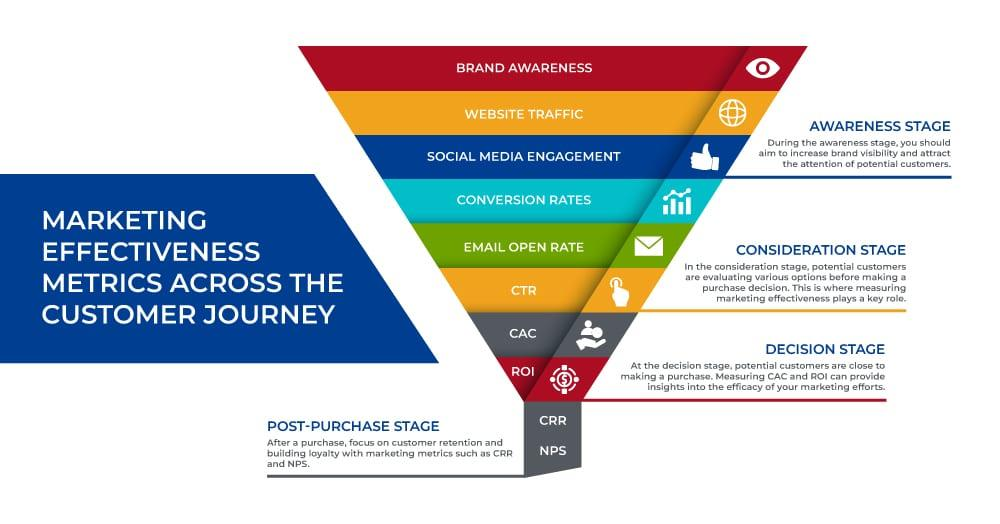

## Table of Contents

## What is market capacity and why is it important to assess it before launching a strategy?

Market capacity refers to the total amount of demand that exists within a specific market for a product or service. It's like figuring out how many people want to buy what you're selling and how much they are willing to buy. Understanding market capacity helps businesses know if there's enough room for their product or service in the market, or if the market is already full.

It's important to assess market capacity before launching a strategy because it helps you avoid wasting time and money on a product that might not sell well. If you find out that the market is already saturated with similar products, you might need to change your product or find a new market. On the other hand, if you see that there's a lot of demand and not many competitors, it could be a great opportunity to enter the market and do well. Knowing the market capacity helps you make smarter decisions and increases your chances of success.

## How can you identify your target market and segment it effectively?

To identify your target market, you need to understand who your product or service is for. Start by looking at who is already buying from you or who might need what you offer. Think about things like age, gender, income, where they live, and what they like to do. You can gather this information by talking to customers, doing surveys, or looking at data from your sales. The goal is to find a group of people who have a problem that your product or service can solve.

Once you know who your target market is, you can segment it effectively by breaking it down into smaller groups based on specific characteristics. For example, you might find that your product appeals to both young adults and seniors, but for different reasons. You can create segments like "young professionals" or "retired hobbyists." Each segment might need a different marketing approach or product variation. By segmenting your market, you can tailor your strategies to meet the unique needs and preferences of each group, making your efforts more effective and efficient.

## What are the basic methods to gather initial market data?

One way to gather initial market data is by doing surveys. You can ask people questions about what they like, what they need, and what they would buy. You can do surveys online, over the phone, or in person. The important thing is to ask the right questions to get useful information. Surveys can help you understand what people think about your product or service and what they might want in the future.

Another method is to look at existing data from other sources. This can include government reports, industry studies, or data from similar businesses. You can find a lot of this information online or in libraries. By looking at this data, you can learn about trends in the market, how big the market is, and who your competitors are. This helps you understand the bigger picture of the market you want to enter.

You can also use focus groups to gather initial market data. A focus group is a small group of people who discuss your product or service. You can watch and listen to what they say, which gives you a lot of detailed feedback. Focus groups are good for understanding how people feel about your product and what they might change about it. This method can help you make your product better before you launch it.

## How can you use surveys and focus groups to understand market needs and preferences?

Surveys are a great way to understand what people want and need from your product or service. You can ask a lot of people the same questions and get a clear picture of what they think. For example, you might ask them if they like your product, what they would change about it, and how much they would pay for it. By collecting this data, you can see patterns and trends in what people want. This helps you make your product better and more appealing to your target market. Surveys are easy to do online or over the phone, making it simple to reach a lot of people quickly.

Focus groups are another good way to learn about market needs and preferences. In a focus group, you bring together a small group of people to talk about your product. You can watch them discuss and listen to their thoughts and feelings. This gives you deep insights into what people like and don't like about your product. For example, they might tell you that they love the design but wish it came in more colors. Focus groups help you understand the 'why' behind people's preferences, which can be really helpful when you're trying to improve your product or service.

## What role do market trends play in assessing the potential impact of your strategy?

Market trends are like the direction the market is moving. They can tell you what people are starting to like more or what they might want in the future. When you are making a strategy, knowing these trends can help you see if your idea will work well. For example, if more people are buying eco-friendly products, and your strategy is to sell eco-friendly items, you might do well because you are following a popular trend.

Trends also help you see risks. If a trend is going down, like fewer people buying a certain type of product, you might want to change your strategy. For example, if people are using smartphones less and using tablets more, selling smartphone cases might not be a good idea. By looking at trends, you can make smart choices and adjust your strategy to fit what the market wants. This can make your strategy more likely to succeed.

## How can competitive analysis help in evaluating market capacity?

Competitive analysis is when you look at what other businesses are doing in your market. By studying your competitors, you can learn a lot about how much room there is for your product or service. For example, if there are already a lot of similar products out there, it might mean the market is full and it could be hard to sell more. But if you see that your competitors are not meeting all the needs of the customers, there might be space for your product to fill those gaps.

By doing a competitive analysis, you can also see how big your competitors are and how much they are selling. This helps you guess how much demand there is in the market. If your competitors are doing well and growing, it could mean there is a lot of demand and room for more businesses like yours. But if they are struggling, it might mean the market is not as big as you thought. Understanding these things can help you decide if your strategy will work and how you can make it better.

## What are the key financial metrics to consider when assessing market impact?

When you want to understand how your strategy might affect the market, you need to look at some important financial numbers. One key metric is market size, which tells you how much money people are spending on products like yours. Another important number is market growth rate, which shows if the market is getting bigger or smaller over time. This can help you see if there will be more customers in the future. You should also look at the market share of your competitors, which tells you how much of the market they control. If they have a big share, it might be harder for you to sell your product.

Another set of financial metrics to consider are related to your own business. Revenue is how much money you make from selling your product, and it's important to see if it's going up or down. Profit margins are also crucial because they show how much money you keep after paying for everything. If your profit margins are high, it means you are making good money on each sale. Lastly, return on investment (ROI) helps you understand if the money you put into your strategy is paying off. By looking at these numbers, you can better understand how your strategy might affect the market and your business.

## How can you use SWOT analysis to refine your strategy before it goes live?

SWOT analysis is a tool that helps you look at your strategy's Strengths, Weaknesses, Opportunities, and Threats. It's like taking a step back to see what you're good at, what you need to work on, what chances you have to grow, and what might go wrong. By doing a SWOT analysis, you can find out if your strategy is strong enough or if you need to make some changes before you start using it. For example, if you see that one of your weaknesses is not having enough money, you might decide to find investors or cut costs before you go live with your strategy.

Using SWOT analysis can also help you see new opportunities that you might not have thought of before. Maybe you find out that there's a new trend in the market that you can take advantage of. Or you might realize that one of your strengths is having a great team, and you can use that to make your strategy even better. On the other hand, SWOT analysis can help you spot threats, like new competitors coming into the market or changes in what customers want. By knowing about these threats, you can plan ahead and adjust your strategy to deal with them. This way, you can make your strategy stronger and more likely to succeed when you finally launch it.

## What advanced statistical tools and models can be used to predict market response?

To predict how the market might respond to your strategy, you can use advanced statistical tools like regression analysis. This tool helps you see how different factors, like price or advertising, affect how much people buy. For example, you can use regression to figure out if lowering the price of your product will make more people want to buy it. Another tool is time series analysis, which looks at data over time to find patterns and trends. This can help you predict future sales based on what has happened in the past. By using these tools, you can make smarter guesses about how the market will react to your strategy.

Another useful model is the conjoint analysis, which helps you understand what features of your product people value the most. You can use it to see if people would prefer a cheaper product with fewer features or a more expensive one with more features. This can guide you in deciding what kind of product to offer. Additionally, machine learning models, like decision trees or neural networks, can be used to predict market response by learning from large amounts of data. These models can find complex patterns that might be hard to see otherwise, helping you make better predictions about how your strategy will do in the market.

## How do you integrate qualitative and quantitative data for a comprehensive market assessment?

Integrating qualitative and quantitative data for a comprehensive market assessment means using both numbers and people's opinions to understand the market better. Quantitative data gives you hard numbers, like how many people bought your product last month or how much they spent. This helps you see clear patterns and trends. On the other hand, qualitative data is about what people think and feel. It comes from talking to customers, doing focus groups, or reading reviews. This type of data helps you understand why people buy your product and what they like or don't like about it.

To put these two types of data together, start by looking at the numbers to get a broad view of the market. For example, if you see that sales are going up, that's a good sign. Then, use qualitative data to dig deeper. Maybe customers are saying they like the new design of your product, which explains why sales are up. By combining both types of data, you get a fuller picture of the market. You can see not just what is happening, but also why it's happening. This helps you make better decisions about your strategy, like whether to keep doing what you're doing or to make changes based on what customers are telling you.

## What are the best practices for conducting a pilot test to gauge strategy effectiveness?

When you want to see if your strategy will work, you should do a pilot test. A pilot test is like a small experiment where you try out your strategy on a smaller group of people before you use it everywhere. Start by choosing a small part of your market that is similar to your whole market. Make sure you have clear goals for what you want to learn from the test. It's important to keep everything the same except for the thing you are testing, so you can see if your strategy makes a difference. Also, make sure you have a way to measure how well your strategy is working, like by looking at sales numbers or asking customers for feedback.

After you finish your pilot test, take time to look at the results carefully. See if your strategy did what you hoped it would do. If it worked well, think about what made it successful and how you can use that in your bigger plan. If it didn't work, try to figure out why and what you can change to make it better. It's a good idea to talk to the people who were part of the test to get their thoughts and feelings. By doing a pilot test and learning from it, you can make your strategy stronger and more likely to succeed when you use it on a bigger scale.

## How can scenario analysis be used to assess different potential outcomes of your market strategy?

Scenario analysis helps you look at different ways your market strategy might turn out. It's like playing "what if" with your plan. You think about different things that could happen, like if the economy gets better or worse, or if a new competitor comes into your market. By imagining these different scenarios, you can see how your strategy might work in each one. This helps you be ready for whatever might happen and make your plan more flexible.

To do scenario analysis, you start by [picking](/wiki/asset-class-picking) a few key things that could change, like customer tastes or the price of materials. Then, you make up different stories about how these things could change. For example, one story might be that customers start wanting eco-friendly products more, and another might be that a big company starts selling a similar product at a lower price. You then use these stories to see how your strategy would do in each case. By doing this, you can find weak spots in your plan and think of ways to make it better, so no matter what happens, you have a good chance of succeeding.

## How can one go about creating hypotheses and models?

Hypothesis generation is a critical aspect of strategic planning, providing a framework for predicting market behaviors and outcomes. At its core, it involves proposing explanations or predictions that can be tested through further research and data analysis. Hypotheses guide the direction of strategy development, ensuring that decisions are based on logical assumptions rather than guesswork.

Creating models to simulate different market scenarios involves converting these hypotheses into quantifiable forms that can be analyzed using computational tools. These models can take various forms, including quantitative models like regression analysis, [machine learning](/wiki/machine-learning) models, or qualitative frameworks. For instance, a simple linear regression model can predict sales based on factors like pricing and marketing spend:

$$
\text{Sales} = \beta_0 + \beta_1 \times \text{Price} + \beta_2 \times \text{Marketing Spend} + \epsilon
$$

Where $\beta_0$ is the intercept, $\beta_1$ and $\beta_2$ are coefficients representing the relationship strength between independent variables and sales, and $\epsilon$ is the error term.

For more complex scenario modeling, businesses can employ machine learning techniques like decision trees or [neural network](/wiki/neural-network)s. A decision tree, for example, can help simulate outcomes based on various strategic paths, providing a visual and analytical tool to understand potential impacts.

Predictive modeling offers significant benefits in assessing strategy impact. It enables businesses to foresee potential future scenarios and outcomes, allowing for more informed decision-making. This technique enhances the ability to anticipate market shifts and consumer responses, thus reducing the risk associated with strategic investments. Additionally, predictive models can identify trends and patterns that may not be immediately evident through traditional analysis, offering a competitive edge in rapidly evolving markets. 

Using Python or other programming languages to build these models can further refine their accuracy and relevance. For example, Python's libraries such as Pandas for data manipulation, Scikit-learn for building predictive models, and Matplotlib or Seaborn for data visualization can systematically aid in creating robust simulations. Here is a simple example using Python to create a predictive model:

```python
import pandas as pd
from sklearn.model_selection import train_test_split
from sklearn.linear_model import LinearRegression
import matplotlib.pyplot as plt

# Load dataset
data = pd.read_csv('market_data.csv')

# Define features and target variable
X = data[['Price', 'Marketing_Spend']]
y = data['Sales']

# Split the data
X_train, X_test, y_train, y_test = train_test_split(X, y, test_size=0.2, random_state=42)

# Create and train the model
model = LinearRegression()
model.fit(X_train, y_train)

# Predictions
predictions = model.predict(X_test)

# Visualization
plt.scatter(y_test, predictions)
plt.xlabel('True Values')
plt.ylabel('Predicted Values')
plt.title('Sales Prediction')
plt.show()
```

By integrating hypothesis generation with predictive modeling, businesses can craft well-informed and flexible strategies, capable of adapting to the dynamic demands of the market landscape.

## References & Further Reading

[1]: Marcos López de Prado. ["Advances in Financial Machine Learning"](https://www.amazon.com/Advances-Financial-Machine-Learning-Marcos/dp/1119482089). Wiley, 2018.

[2]: Ernest P. Chan. ["Quantitative Trading: How to Build Your Own Algorithmic Trading Business"](https://www.amazon.com/Quantitative-Trading-Build-Algorithmic-Business/dp/0470284889). Wiley, 2009.

[3]: David Aronson. ["Evidence-Based Technical Analysis: Applying the Scientific Method and Statistical Inference to Trading Signals"](https://www.wiley.com/en-gb/Evidence+Based+Technical+Analysis:+Applying+the+Scientific+Method+and+Statistical+Inference+to+Trading+Signals-p-9780470008744). Wiley, 2006.

[4]: Stefan Jansen. ["Machine Learning for Algorithmic Trading"](https://www.amazon.com/Machine-Learning-Algorithmic-Trading-intelligence/dp/9918608013). Packt Publishing, 2018.

[5]: (2012). ["Markets Microstructure Theory"](https://www.amazon.com/Trading-Exchanges-Market-Microstructure-Practitioners/dp/0198090544) by Larry Harris.