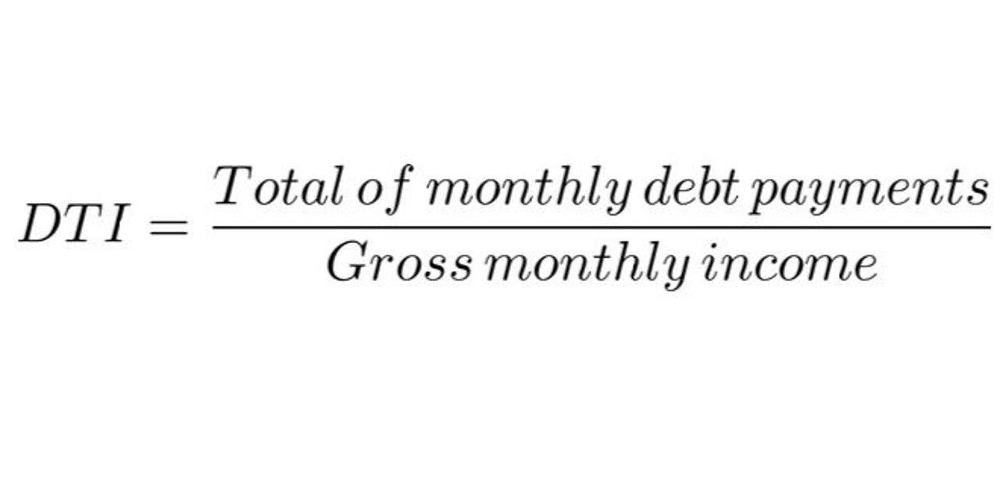

In a constantly evolving financial landscape, understanding key concepts in financial management, income generation, debt strategies, and algorithmic trading is crucial. These elements form the cornerstone of sound financial decision-making and are integral to achieving long-term financial success in both personal and business contexts. This article will explore these important areas and discuss effective strategies to maximize financial potential. 

Financial management encompasses the strategic planning, organizing, controlling, and monitoring of financial resources. It is a discipline that enables individuals and businesses to allocate resources optimally, assess financial performance through budgeting, forecasting, and analyzing financial statements. This systematic approach is essential for generating sustainable income, ensuring that financial resources are effectively directed towards opportunities that yield the highest returns.



Income generation is a multifaceted process that can be approached through various channels such as investments, side businesses, and passive income streams. A diverse portfolio of income sources not only enhances financial security but also provides greater resilience against economic fluctuations. Strategic investment in stocks, bonds, exchange-traded funds (ETFs), and commodities, when managed prudently, can significantly boost return on investment.

Debt, although often viewed as a liability, can also be a powerful tool for financial leverage when managed correctly. Understanding the intricacies of debt, including types, interest rates, and repayment terms, is critical for effective debt management. Strategies such as debt consolidation, refinancing, and systematic budgeting can greatly reduce the financial burden of debt and, when used judiciously, allow for strategic investment opportunities.

Algorithmic trading, a modern advancement in trading technology, utilizes automated systems to execute trades based on predefined criteria. This tool enables investors to engage in high-frequency trading, capitalizing on market opportunities that are typically unattainable through manual efforts. By implementing sophisticated trading strategies such as trend following, mean reversion, and machine learning-based models, investors can optimize portfolio performance and achieve superior trading outcomes.

The integration of these financial strategies—financial management, income generation, proficient debt handling, and algorithmic trading—can significantly enhance an individual's or business's financial health. By adopting a holistic approach to financial planning, stakeholders can better navigate market uncertainties and ensure sustained wealth growth. This guide aims to equip readers with the knowledge and tools needed to make informed financial decisions that contribute to long-term prosperity.

## Table of Contents

## Financial Management: The Foundation for Income Generation

Financial management is the cornerstone of achieving both personal and business financial objectives. It encompasses the systematic planning, organizing, controlling, and monitoring of financial assets to ensure optimal utilization and growth. Key elements that form the foundation of financial management include budgeting, forecasting, and understanding financial statements, all of which play a pivotal role in the effective allocation of resources.

Budgeting is the process of creating a plan to spend your money, ensuring that financial goals are met and resources are directed towards priority areas. By setting a budget, individuals and businesses can maintain control over their financial health and avoid unnecessary expenditures. A well-planned budget acts as a financial roadmap, allowing for strategic planning and allocation of funds.

Forecasting involves predicting future financial conditions and performance based on historical data and analysis. This allows businesses and individuals to anticipate financial needs and adjust their strategies accordingly. Accurate forecasting can aid in making informed decisions regarding investments, savings, and expenses, contributing to overall financial efficiency.

Understanding financial statements is crucial as they provide a summary of an entity's financial performance and position. The three main types of financial statements are the income statement, the balance sheet, and the cash flow statement. The income statement reflects profitability over a specific period, the balance sheet provides an overview of assets and liabilities at a given point in time, and the cash flow statement details the inflows and outflows of cash. Mastery of these documents enables better decision-making and opportunity evaluation.

Effective financial management is vital for income generation. It enables individuals and businesses to optimize resource allocation, identify, and seize opportunities that can lead to increased profitability. By maintaining a structured approach to managing finances, entities can improve efficiency and create a stable foundation for generating sustainable income.

The integration of financial technology (fintech) and automated investing are contemporary techniques that significantly enhance the efficiency of financial management. Fintech solutions offer innovative tools for budgeting, forecasting, and investment management, enabling seamless financial operations. Automated investing utilizes algorithms to manage investment portfolios, allowing for a data-driven approach that minimizes human error and maximizes returns. Such technologies provide enhanced precision, speed, and convenience in managing financial resources, leading to more strategic income generation.

In summary, financial management is a critical process that lays the groundwork for effective income generation. By employing strategic budgeting, accurate forecasting, and a solid understanding of financial statements, along with leveraging modern technological tools, individuals and businesses can optimize their financial health and achieve their economic goals.

## Income Generation Strategies

Income generation can be effectively achieved through a combination of strategic investments, entrepreneurial ventures, and the harnessing of passive income opportunities. These avenues not only provide financial growth but also help in building a diversified and resilient financial portfolio.

Investing in financial markets is one of the most accessible and potent means of generating income. Stocks, for instance, offer the potential for capital appreciation and dividend payments. Investors can utilize methods such as value investing, growth investing, and dividend reinvestment plans to maximize returns. Bonds, which are typically considered safer investments compared to stocks, provide steady interest income. They can be part of a balanced investment strategy that targets both capital preservation and appreciation.

Exchange-Traded Funds (ETFs) and commodities offer additional opportunities for income generation. ETFs, which are exchange-traded investment funds, give investors exposure to a variety of market sectors without the need to manage individual stocks. They provide the benefits of diversification and often have lower fees compared to mutual funds. Commodities, like gold and oil, can help hedge against inflation and currency fluctuations while offering lucrative returns under certain market conditions.

Developing multiple income streams is another crucial approach to enhancing financial security. This can involve diversifying investment portfolios across asset classes or venturing into side businesses. Side businesses leverage personal skills and interests to generate additional income. Examples include freelancing, consulting, or starting an e-commerce store. Such ventures not only supplement income but also provide an opportunity to explore new career interests.

Passive income sources are increasingly popular for their ability to generate revenue with minimal ongoing effort. Real estate investments, particularly rental properties, provide a consistent income stream along with potential property appreciation over time. Additionally, digital products such as e-[books](/wiki/algo-trading-books), online courses, or software can offer passive income by capitalizing on initial time and expertise investment.

Leveraging assets involves using existing resources to generate additional income, often through strategic financial instruments. For example, utilizing home equity loans for investments in other properties or businesses. Technology tools further augment income-[earning](/wiki/earning-announcement) potential by enabling automated investment strategies, financial analysis, and efficient business operations. Platforms like robo-advisors employ algorithms to create and manage investment portfolios tailored to individual risk preferences.

By integrating these diverse strategies, individuals and businesses can build a robust framework for income generation that withstands economic fluctuations while fostering financial independence and growth.

## Navigating Debt: Strategies for Success

Debt can be a double-edged sword, offering potential benefits in the form of investment leverage, but also risks if not carefully managed. Understanding the different types of debt and their respective terms is crucial for effective liability management. Key concepts such as interest rates, repayment schedules, and contract terms influence the overall cost of debt and its impact on financial health.

1. **Types of Debt**: There are various types of debt, including secured and unsecured debt. Secured debts, such as mortgages and auto loans, are backed by collateral, making them less risky for lenders and often carrying lower interest rates. Unsecured debts, such as credit cards and personal loans, carry higher interest rates due to increased lender risk.

2. **Interest Rates and Repayment Terms**: Interest rates are pivotal in assessing the cost of debt. Fixed-rate debts provide predictability in repayments, whereas variable-rate debts fluctuate with market interest conditions, introducing uncertainty. The repayment term for a debt, or the duration over which the debt must be repaid, also significantly affects the total interest cost. Longer repayment terms typically mean lower monthly payments but higher overall interest payments.

3. **Debt Consolidation and Refinancing**: Debt consolidation involves merging multiple debts into a single loan, ideally with a lower interest rate. This can simplify repayment and reduce the financial burden. Refinancing, on the other hand, involves replacing an existing debt obligation with a new one, generally to achieve a more favorable interest rate or loan terms.

   Example: Consider a scenario where an individual has multiple high-interest credit cards. Consolidating these into a single loan with a lower [interest rate](/wiki/interest-rate-trading-strategies) can reduce monthly payments and the total interest paid over time. In Python, this can be structured as:

   ```python
   def calculate_consolidation_savings(current_debts, new_rate):
       total_initial_cost = sum(debt['principal'] * (1 + debt['rate']) ** debt['term'] for debt in current_debts)
       total_new_cost = sum(debt['principal'] * (1 + new_rate) ** debt['term'] for debt in current_debts)
       savings = total_initial_cost - total_new_cost
       return savings
   ```

4. **Budgeting for Debt Management**: Budgeting is fundamental in debt management. By understanding income and expenses, individuals can allocate funds effectively, ensuring timely debt repayments and preventing further debt accumulation. A well-structured budget helps in maintaining a balanced financial state and can identify potential areas for cost savings, which can then be redirected towards reducing outstanding debts.

5. **Strategic Use of Debt**: Leveraging debt for investments can lead to significant financial gains. For instance, margin investing allows individuals to borrow funds to increase their investment size. If the investment yields returns surpassing the cost of debt, the strategy proves profitable. However, this introduces increased risk, and careful analysis of market conditions and risk tolerance is essential.

In summary, navigating debt effectively involves a comprehensive understanding of different debt types, interest rates, and repayment terms. Strategies such as debt consolidation, refinancing, and diligent budgeting play vital roles in minimizing debt burdens. While using debt strategically for investments can offer financial benefits, it requires cautious consideration and adequate risk management to avoid potential pitfalls.

## Algorithmic Trading: A Modern Tool for Investors

Algorithmic trading, often called algo trading, leverages computer programs to execute trades based on preset criteria. This method enables traders to engage in high-frequency trading—executing a large number of orders at extremely fast speeds—which is challenging for human traders to achieve manually. With trading volumes and data growing exponentially, [algorithmic trading](/wiki/algorithmic-trading) provides a significant advantage by allowing investors to efficiently manage portfolios and seize fleeting opportunities in the market.

High-frequency trading, a subset of algorithmic trading, relies on advanced algorithms to make rapid decisions and execute trades within fractions of a second. This capability is particularly valuable in markets where prices are highly volatile. By using historical data and quantitative models, algo trading systems can identify patterns and predict market movements, offering a competitive edge over traditional trading methods.

A core aspect of successful algorithmic trading involves understanding and implementing strategies such as [trend following](/wiki/trend-following), mean reversion, and [machine learning](/wiki/machine-learning)-based models. Trend following strategies involve tracking market trends and making trades that align with long-term movements. This approach reduces the risk of trading against the overall market direction. 

Mean reversion, on the other hand, operates on the assumption that asset prices will revert to their average over time. When prices deviate significantly from their historical average, algo trading systems can exploit these anomalies through strategic buying or selling.

Machine learning models offer modern enhancements to algorithmic trading, enabling systems to learn from new data and adapt to changing market conditions. Machine learning techniques such as supervised learning involve training models on labeled datasets to predict outcomes or classify data. In trading, this can be used to forecast stock price movements or identify optimal trading signals.

For example, a simple mean reversion strategy in Python might involve calculating the historical average of a stock's closing prices and identifying when the current price deviates from this average:

```python
import pandas as pd
import numpy as np

# Load historical stock data
data = pd.read_csv("historical_stock_data.csv")
data['Average'] = data['Close'].rolling(window=20).mean()  # 20-day moving average

# Define the mean reversion strategy
data['Signal'] = np.where(data['Close'] < data['Average'], 1, -1)  # Buy when price is below average, sell otherwise

# Execute trades based on signals
data['Position'] = data['Signal'].shift(1)  # Assume buying/selling happens at next day's open

# Calculate returns from trades
data['Strategy_Returns'] = data['Position'] * data['Close'].pct_change()
```

Algorithmic trading also requires meticulous risk management, including stop-loss settings and position sizing, to safeguard against significant losses in volatile markets. Moreover, understanding regulatory frameworks is crucial as the legality and implications of algo trading can vary by region.

As technological advancements continue, algorithmic trading will likely become an even more integral component of financial markets, offering increased efficiency and new opportunities for investors. Leveraging these capabilities requires a blend of financial acumen, quantitative skills, and the ability to interpret complex data—all essential for navigating the evolving financial landscape.

## Integration: Combining Strategies for Optimal Financial Health

Financial success necessitates a strategic integration of various financial approaches, balancing aspects such as income generation, effective debt management, and investment decisions. These various facets work synergistically to optimize financial wellness and stability.

A holistic approach to financial planning allows individuals and organizations to bolster their resilience against market fluctuations and uncertainties. This approach involves taking into account not only the direct income and expenditures but also broader aspects like market conditions, personal financial goals, and economic indicators. By doing so, it enhances the potential for sustainable wealth accumulation and growth. For instance, diversifying investments across different asset classes—such as stocks, bonds, and real estate—can mitigate the risk of market [volatility](/wiki/volatility-trading-strategies) and contribute to more stable financial outcomes.

Regularly reviewing and adjusting financial goals and strategies is crucial. This ongoing process ensures that financial plans remain aligned with any changes in personal circumstances, such as life events or shifts in income, as well as broader market conditions. Tools such as personal financial software and services can facilitate these reviews by providing automated updates and forecasts based on current financial data.

Leveraging technology tools and seeking expert financial advice can further optimize financial outcomes. The advent of financial technology has introduced a plethora of tools designed to automate and streamline financial management processes. These include budgeting apps, robo-advisors for investment management, and blockchain-based solutions that ensure transparency and security in transactions. Additionally, financial advisors can offer tailored advice that considers an individual's specific financial situation and objectives, potentially uncovering opportunities that technology alone may not reveal.

Moreover, integrating strategies effectively involves understanding the interplay between different financial tools and financial goals. For example, algorithmic trading can be used to enhance the growth potential of investment portfolios, while streams of passive income can stabilize household cash flows, providing a buffer against income fluctuations.

It is also important to apply learned financial concepts in real-time. Consider how debt can be strategically deployed; using low-interest loans to invest in higher-return opportunities can be a calculated move that supports growth, though it must be approached with caution. Employing strategies such as refinancing to secure lower interest rates, or strategically leveraging credit to extend cash flow, can significantly affect long-term financial health.

To summarize, integrating financial strategies requires a comprehensive, flexible approach that not only considers immediate financial needs and opportunities but also prepares for future uncertainties. By consistently reassessing one's financial position and leveraging both technology and expert insights, individuals and businesses can achieve their financial goals more effectively and sustainably.

## Conclusion

Mastering financial management, income generation, debt strategies, and algorithmic trading is essential in today's dynamic economic environment. These core areas form the pillars of financial prosperity, providing individuals and businesses with the tools necessary to navigate the complexities of modern finance.

By utilizing the insights and strategies outlined in this article, individuals and businesses can enhance their financial acumen. Having a well-rounded understanding of how to manage financial resources effectively, generate additional revenue streams, and leverage technology for trading can significantly increase the potential for success. Effective financial planning and management lead to better decision-making, ensuring that resources are allocated in a manner that maximizes returns and minimizes risks.

Continuously learning and adapting is crucial to maintaining and growing wealth in an ever-changing world. Global markets and financial landscapes can shift rapidly due to technological advancements, policy changes, and economic trends. Staying informed about new developments and adjusting strategies accordingly is vital. This commitment to lifelong learning can be facilitated by engaging with financial education resources, attending seminars, and applying real-world experiences to one's financial strategy.

The journey to financial prosperity is ongoing, and integrating these strategies can pave the way for future success. Building a robust financial foundation involves more than merely understanding individual components; it requires an integrated approach that aligns with personal or organizational goals. Consistent evaluation of financial strategies and the incorporation of new tools and insights as they arise ensure ongoing relevancy and effectiveness.

Ultimately, achieving financial mastery involves both a strategic mindset and the willingness to adapt. By embracing these principles, individuals and businesses can build sustainable wealth, weather economic uncertainties, and secure their financial futures.

## References & Further Reading

[1]: Bergstra, J., Bardenet, R., Bengio, Y., & Kégl, B. (2011). ["Algorithms for Hyper-Parameter Optimization."](https://papers.nips.cc/paper/4443-algorithms-for-hyper-parameter-optimization) Advances in Neural Information Processing Systems 24.

[2]: ["Advances in Financial Machine Learning"](https://www.amazon.com/Advances-Financial-Machine-Learning-Marcos/dp/1119482089) by Marcos Lopez de Prado

[3]: ["Evidence-Based Technical Analysis: Applying the Scientific Method and Statistical Inference to Trading Signals"](https://www.amazon.com/Evidence-Based-Technical-Analysis-Scientific-Statistical/dp/0470008741) by David Aronson

[4]: ["Machine Learning for Algorithmic Trading"](https://github.com/stefan-jansen/machine-learning-for-trading) by Stefan Jansen

[5]: ["Quantitative Trading: How to Build Your Own Algorithmic Trading Business"](https://www.amazon.com/Quantitative-Trading-Build-Algorithmic-Business/dp/1119800064) by Ernest P. Chan