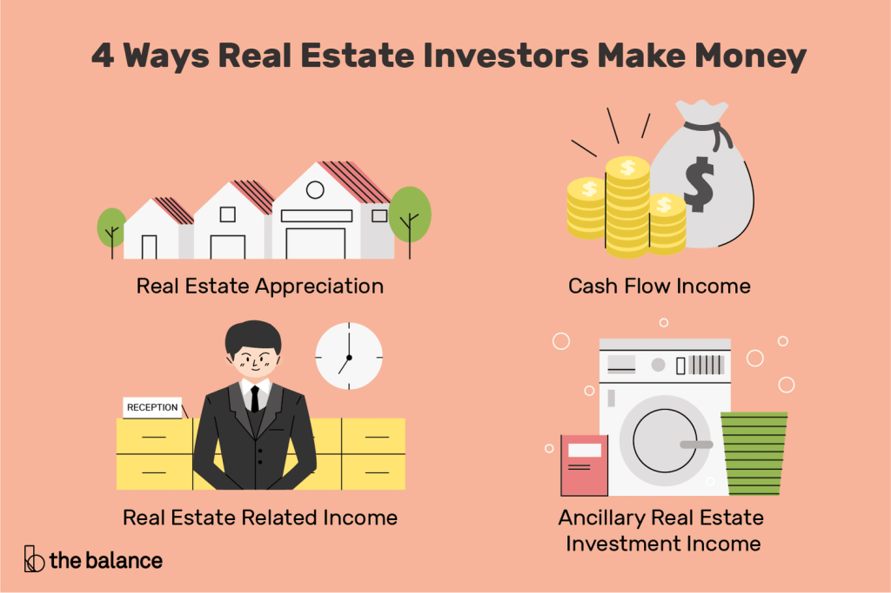

## Table of Contents

## What is debt and how does it work?

Debt is money that you borrow from someone else, like a bank or a friend, and promise to pay back later. When you take out a loan or use a credit card, you are going into debt. You usually have to pay back the money you borrowed plus some extra money called interest. Interest is like a fee for borrowing the money. The amount of interest you pay depends on things like how much you borrowed, how long you take to pay it back, and the interest rate, which is a percentage set by the lender.

Debt can be useful because it lets you buy things you need or want right away, like a house or a car, without having to save up all the money first. But it can also be risky. If you can't pay back the money you borrowed, you might get into big trouble. You could lose your house or other things you own, and it can be hard to borrow money again in the future. It's important to think carefully about how much debt you take on and make sure you can pay it back on time.

## Can you explain the concept of using debt to generate income?

Using debt to generate income means borrowing money to invest in something that will make you more money than the cost of the debt. For example, you might take out a loan to start a business or buy a rental property. If the business makes a profit or the rental property brings in more money than the loan payments, you are using debt to generate income. The key is that the money you earn from your investment needs to be more than the interest you pay on the loan.

However, this can be risky. If your business doesn't make enough money or if you can't find tenants for your rental property, you might not be able to pay back the loan. This could lead to financial problems, like losing the business or the property. It's important to do a lot of research and make sure you have a good plan before using debt to generate income. If done right, it can help you grow your wealth, but if done wrong, it can lead to big financial troubles.

## What are some common examples of income-generating debt?

One common example of income-generating debt is taking out a loan to start a small business. Let's say you borrow money to open a bakery. If the bakery makes more money than what you have to pay back on the loan, including interest, you are using debt to generate income. This can help you grow your business and make more money over time. But if the bakery doesn't do well, you might struggle to pay back the loan and could lose your business.

Another example is using a loan to buy a rental property. You might borrow money to buy a house and then rent it out to tenants. If the rent you collect is more than the loan payments, you are making money from the debt. This can be a good way to earn regular income and build wealth. However, if you can't find tenants or if they don't pay the rent, you might not be able to cover the loan payments, which could lead to losing the property.

## How does leveraging debt in real estate work?

Leveraging debt in real estate means using borrowed money to buy a property that you hope will make you more money than the cost of the loan. For example, you might take out a mortgage to buy a house and then rent it out. If the rent you get each month is more than the mortgage payment, you are making money from the property. This extra money is your profit, and it can help you pay off the loan faster or invest in more properties.

However, using debt to buy real estate can be risky. If you can't find someone to rent the house or if the rent doesn't cover the mortgage, you might struggle to make the loan payments. If you can't pay back the loan, the bank could take the house away from you. It's important to do a lot of research and make sure you have a good plan before using debt to buy real estate. If done right, it can help you build wealth, but if done wrong, it can lead to big financial problems.

## What are the risks associated with using debt to generate income?

Using debt to generate income can be risky. One big risk is that you might not make enough money to pay back the loan. If your business doesn't do well or if you can't find tenants for your rental property, you could struggle to make the loan payments. If you can't pay back the loan, you might lose the business or the property. This can lead to big financial problems and make it hard to borrow money again in the future.

Another risk is that the value of your investment might go down. For example, if you buy a rental property and the housing market crashes, the property might be worth less than what you owe on the loan. This is called being "underwater" on your loan. It can be hard to sell the property without losing money, and if you can't make the loan payments, the bank could take the property away from you. It's important to think carefully about these risks before using debt to generate income.

## How can one assess their risk tolerance before using debt as an income strategy?

Assessing your risk tolerance before using debt as an income strategy is important. It means figuring out how much financial risk you are okay with. To do this, think about how much money you have saved up and how much you can afford to lose if things don't go as planned. Ask yourself if you can handle the stress of making loan payments if your business or investment doesn't make money right away. It's also a good idea to talk to a financial advisor who can help you understand your options and the risks involved.

Another way to assess your risk tolerance is to look at your past experiences with money. If you have taken risks before and they worked out, you might be more comfortable taking risks again. But if past risks led to big problems, you might want to be more careful. Also, think about your overall financial goals. If you want to grow your wealth quickly, you might be willing to take on more risk. But if you want to keep things stable and safe, you might want to take on less risk. Understanding your risk tolerance can help you make smarter decisions about using debt to generate income.

## What is the difference between good debt and bad debt in the context of income generation?

Good debt and bad debt are terms used to describe how debt can affect your financial health. Good debt is when you borrow money to invest in something that can make you more money in the future. For example, if you take out a loan to start a business or buy a rental property, and the business or property makes more money than the loan payments, that's good debt. It helps you build wealth because the money you earn is more than the interest you pay on the loan.

Bad debt, on the other hand, is when you borrow money for things that don't help you make more money. For example, if you use a credit card to buy things you don't need, like clothes or gadgets, and you can't pay it off right away, that's bad debt. It can hurt your financial health because the interest you pay on the debt can add up quickly, and you're not getting any money back from what you bought. The key difference is that good debt can help you grow your wealth, while bad debt can make it harder to reach your financial goals.

## How can debt be used to invest in stocks or other financial instruments?

Debt can be used to invest in stocks or other financial instruments by borrowing money to buy them. For example, you might take out a loan or use a margin account to buy stocks. A margin account lets you borrow money from your broker to buy more stocks than you could with just your own money. If the stocks go up in value, you can sell them for a profit and pay back the loan, keeping the extra money as your gain. This can be a way to make more money than you could with just your own savings.

However, using debt to invest in stocks can be very risky. If the stocks go down in value, you might lose money and still have to pay back the loan, including interest. This can lead to big financial problems if you can't cover the loan payments. It's important to think carefully about how much risk you are willing to take and to have a good plan before using debt to invest in stocks or other financial instruments. If done right, it can help you grow your wealth, but if done wrong, it can lead to big losses.

## What are the tax implications of using debt to generate income?

Using debt to generate income can have tax benefits. For example, if you take out a loan to start a business or buy a rental property, you can often deduct the interest you pay on the loan from your taxes. This means you pay less in taxes because the interest is considered a business expense. It's like getting a discount on your taxes for using debt to make money. But you need to keep good records and follow the tax rules to make sure you can claim these deductions.

However, there are also some things to watch out for. If you use debt to buy stocks or other investments, the tax rules can be different. You might have to pay taxes on any money you make from selling the investments, and you might not be able to deduct the interest on the loan. It's important to talk to a tax professional to understand all the tax implications of using debt to generate income. They can help you make sure you're doing everything right and taking advantage of any tax benefits you can.

## How does one manage and monitor debt used for income generation effectively?

Managing and monitoring debt used for income generation means keeping a close eye on your loans and making sure you're using the money wisely. You need to keep track of how much you owe, how much interest you're paying, and how much money you're making from your investment. For example, if you took out a loan to start a business, you should regularly check your business's profits and compare them to your loan payments. This helps you see if you're making enough money to cover the debt and if you need to make any changes to your plan.

It's also important to have a budget and stick to it. This means planning how you'll use the money you borrowed and making sure you're spending it on things that will help you make more money. If you're using debt to buy a rental property, for example, you should set aside money for repairs and other costs, not just the loan payments. Regularly reviewing your budget and your investment's performance can help you stay on track and make smart decisions about your debt. If you're not sure how to manage your debt, talking to a financial advisor can be a big help.

## What advanced strategies exist for using debt to maximize income?

One advanced strategy for using debt to maximize income is called "debt stacking." This means taking out multiple loans to invest in different things that can make you money. For example, you might use one loan to start a business, another to buy a rental property, and a third to invest in stocks. The idea is to spread your risk across different investments so that if one doesn't do well, the others might still make enough money to cover all your loan payments. This can be a good way to grow your wealth, but it's also more complicated and risky, so you need to be careful and have a good plan.

Another strategy is called "refinancing." This means taking out a new loan with better terms to pay off an old loan. For example, if you have a loan with a high [interest rate](/wiki/interest-rate-trading-strategies), you might be able to get a new loan with a lower interest rate. This can save you money on interest and let you use more of your income to pay down the debt faster. You can then use the money you save to invest in more income-generating opportunities. Refinancing can be a smart move, but it's important to make sure the new loan really is better and that you can still afford the payments.

## Can you discuss case studies or examples of successful income generation through debt?

One example of successful income generation through debt is the story of Sarah, who took out a small business loan to start her own bakery. She used the loan to buy equipment and ingredients, and opened her bakery in a busy neighborhood. The bakery did well right from the start, and Sarah was able to pay back the loan quickly because her profits were higher than her loan payments. After paying off the loan, she used the extra money to open a second location, which also did well. By using debt to start her business, Sarah was able to build a successful bakery chain and create a steady income for herself.

Another example is John, who used a mortgage to buy a rental property. He did a lot of research and found a house in a good location that he could afford. John rented out the house to tenants and used their rent payments to cover his mortgage. The rent was higher than his mortgage payments, so he was making money every month. Over time, the value of the house went up, and John was able to sell it for a profit. He used the money from the sale to buy more rental properties, and now he has a portfolio of income-generating real estate. By using debt wisely, John was able to build wealth through real estate investing.

## References & Further Reading

[1]: Bergstra, J., Bardenet, R., Bengio, Y., & Kégl, B. (2011). ["Algorithms for Hyper-Parameter Optimization."](https://papers.nips.cc/paper/4443-algorithms-for-hyper-parameter-optimization) Advances in Neural Information Processing Systems 24.

[2]: ["Advances in Financial Machine Learning"](https://www.amazon.com/Advances-Financial-Machine-Learning-Marcos/dp/1119482089) by Marcos Lopez de Prado

[3]: ["Evidence-Based Technical Analysis: Applying the Scientific Method and Statistical Inference to Trading Signals"](https://www.amazon.com/Evidence-Based-Technical-Analysis-Scientific-Statistical/dp/0470008741) by David Aronson

[4]: ["Machine Learning for Algorithmic Trading"](https://github.com/stefan-jansen/machine-learning-for-trading) by Stefan Jansen

[5]: ["Quantitative Trading: How to Build Your Own Algorithmic Trading Business"](https://www.amazon.com/Quantitative-Trading-Build-Algorithmic-Business/dp/1119800064) by Ernest P. Chan