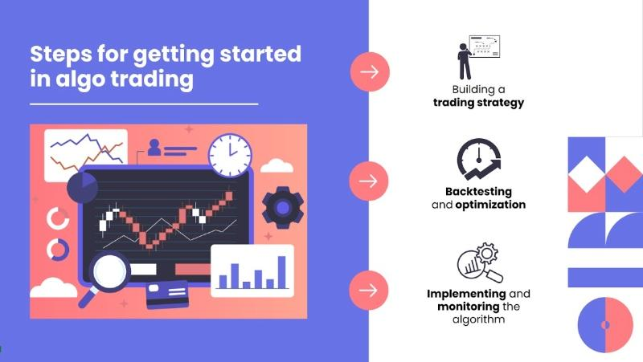

## Table of Contents

## What is algorithmic trading and why might someone want to start a company focused on it?

Algorithmic trading is when computers use math formulas to buy and sell things like stocks or currencies automatically. Instead of people making the decisions, the computer follows the rules set in the algorithm to trade. This can happen very quickly, often in fractions of a second, which is much faster than a human could do it.

Someone might want to start a company focused on algorithmic trading because it can be very profitable. If the algorithms are good, they can make money by finding small price differences in the market and trading on them. Also, starting a company in this area can be exciting because it combines technology and finance, attracting people who are interested in both fields. It's a growing industry, so there's a lot of potential for growth and innovation.

## What are the basic requirements to start an algorithmic trading company?

To start an algorithmic trading company, you need a few key things. First, you need to know a lot about trading and how markets work. This means understanding stocks, currencies, and other things you can trade. You also need to be good with computers and math because you'll be creating and using algorithms. These are the rules that tell the computer when to buy and sell. You'll need to hire people who are experts in these areas or learn a lot yourself.

Second, you need the right technology. This includes powerful computers that can run your algorithms quickly and software to help you develop and test them. You'll also need a good internet connection because trading happens fast, and you don't want to miss opportunities. It's important to have a safe and reliable way to connect to the markets where you'll be trading. This might mean working with a broker or using special trading platforms.

Lastly, you need money to start and run your company. This includes money for technology, salaries for your team, and possibly fees to trade. You might need to find investors who believe in your idea and are willing to give you money to get started. It's also important to follow the rules and get any licenses you need to trade legally. Starting an [algorithmic trading](/wiki/algorithmic-trading) company can be challenging, but with the right knowledge, technology, and funding, it can be a rewarding venture.

## How do I develop a business plan for an algorithmic trading company?

To develop a business plan for an algorithmic trading company, start by clearly defining your business idea and goals. Think about what kind of trading you want to focus on, like stocks, [forex](/wiki/forex-system), or commodities. Explain how your algorithms will work and why they will be successful. This part of your plan should show that you understand the market and have a unique approach. You should also describe your target customers, like individual investors or big institutions, and how you plan to reach them.

Next, you need to include a financial plan. This means figuring out how much money you need to start your company and keep it running. Include costs for technology, like computers and software, and salaries for your team. You should also think about how you will make money and how much profit you expect to earn. It's important to show potential investors that your business can be profitable. Finally, consider any risks and challenges you might face, like competition or changes in the market, and how you will handle them. This will make your business plan more realistic and convincing.

## What are the legal and regulatory considerations for starting an algorithmic trading company?

Starting an algorithmic trading company involves navigating a lot of legal and regulatory rules. Different countries have different laws about trading and finance. In the United States, for example, you need to follow rules from the Securities and Exchange Commission (SEC) and the Commodity Futures Trading Commission (CFTC). These rules are there to make sure trading is fair and safe. You might need licenses or permits to trade legally, and you'll have to keep good records of all your trades. It's important to know these rules well because breaking them can lead to big fines or even shutting down your company.

Another important part is data protection and cybersecurity. Since algorithmic trading relies on a lot of data and computer systems, you need to protect this information from hackers. Laws like the General Data Protection Regulation (GDPR) in Europe set strict rules on how you can use and store data. You also need to make sure your trading systems are safe and can't be easily manipulated. This means having good security measures in place and regularly checking your systems for any weaknesses. Following these legal and regulatory considerations is crucial for running a successful and lawful algorithmic trading company.

## How can I fund my algorithmic trading startup?

To fund your algorithmic trading startup, you might want to start by using your own savings. This is called bootstrapping. It's a good way to keep control of your company, but it might not give you enough money to do everything you need. Another option is to ask friends and family for money. They might be willing to help you out, but it's important to be clear about the risks and what they might get back.

If you need more money, you can look for investors. Angel investors and venture capitalists are people or groups that give money to new companies in exchange for part of the company. They can give you a lot of money, but you'll have to give up some control and share your profits with them. You can also try to get a loan from a bank, but banks might see algorithmic trading as risky, so they might not want to lend you money.

Another way to get money is through crowdfunding. This is when you ask a lot of people to each give you a little bit of money. Websites like Kickstarter or Indiegogo can help you do this. You'll need to make a good pitch to convince people to invest in your idea. No matter which way you choose, it's important to have a solid business plan to show people why your algorithmic trading startup is a good investment.

## What technology and infrastructure do I need to set up for algorithmic trading?

To set up for algorithmic trading, you need powerful computers that can run your trading algorithms quickly. These computers should have a lot of processing power and memory to handle the complex calculations and data analysis that trading requires. You'll also need reliable software to develop, test, and run your algorithms. This software should be able to connect to the markets where you want to trade, like stock exchanges or forex markets. A fast and stable internet connection is crucial because trading happens in milliseconds, and you don't want to miss any opportunities due to slow internet.

In addition to the hardware and software, you need a good trading platform that can execute your trades automatically. This platform should be able to handle high-frequency trading and have low latency, meaning it can send and receive data very quickly. You also need to set up a secure and reliable data feed to get real-time market data. This data is what your algorithms will use to make trading decisions. Finally, you should have a backup system in place to make sure your trading can continue even if something goes wrong with your main setup. This includes backup servers and a plan for what to do if your internet goes down or your computers fail.

## How do I recruit and build a team for an algorithmic trading company?

To recruit and build a team for an algorithmic trading company, start by figuring out what kinds of people you need. You'll want people who are good at math and computers because they'll be working on the algorithms. You'll also need people who know a lot about trading and finance. Look for people with experience in these areas. You can find them by posting job ads on websites like LinkedIn or by going to job fairs and industry events. It's also a good idea to network with people in the industry because they might know someone who would be a good fit for your team.

Once you start hiring, make sure to explain clearly what your company does and what you expect from your team. It's important that everyone understands the goals and how their work helps reach those goals. You should also create a good work environment where people feel valued and can work well together. This means having clear communication, giving feedback, and making sure everyone has the tools they need to do their job. A strong team is key to making your algorithmic trading company successful.

## What are the key strategies and algorithms used in algorithmic trading?

In algorithmic trading, one common strategy is called [trend following](/wiki/trend-following). This means the computer looks at the market to see if prices are going up or down over time. If it sees a trend, it will buy when the price is going up and sell when it's going down. Another strategy is mean reversion, which is based on the idea that prices will eventually go back to their average. So, if a price goes too high, the algorithm might sell, expecting it to come back down, and if it goes too low, it might buy, expecting it to go back up. These strategies use math to find patterns and make trades based on those patterns.

Another important part of algorithmic trading is using different algorithms. One popular type is the moving average convergence divergence (MACD) algorithm, which helps find when to buy or sell by looking at the difference between two moving averages of a stock's price. Another type is the [arbitrage](/wiki/arbitrage) algorithm, which looks for small differences in price between markets and trades to make a profit from those differences. These algorithms need to be tested a lot to make sure they work well and can make money. By using these strategies and algorithms, traders can make quick and smart decisions without having to do everything by hand.

## How do I test and validate my trading algorithms before going live?

Before you start using your trading algorithms for real, it's important to test them to make sure they work well. One way to do this is by using historical data. You can feed your algorithm old market data to see how it would have performed in the past. This is called [backtesting](/wiki/backtesting). It helps you see if your algorithm can make money and if it follows the rules you set. Another way to test your algorithm is by using a demo account. This is like a practice account where you can trade without using real money. It lets you see how your algorithm works in real-time market conditions without any risk.

After testing, you need to validate your algorithms. This means making sure they are reliable and can handle different market situations. One way to do this is by using a forward testing or paper trading method. Here, you run your algorithm in real-time but still don't use real money. This helps you see how it performs in current market conditions. You should also keep an eye on how your algorithm does over time and make changes if needed. By testing and validating your algorithms carefully, you can feel more confident that they will work well when you start trading for real.

## What are the best practices for risk management in algorithmic trading?

Risk management is super important in algorithmic trading. You need to set limits on how much money you can lose on each trade. This is called setting a stop-loss. It helps stop you from losing too much if the market moves against you. You should also spread your money around, which means not putting all your money into one trade or one type of investment. This is called diversification. It helps lower the risk because if one trade goes bad, you still have other trades that might do well.

Another good practice is to keep an eye on your algorithms all the time. You need to watch how they are doing and be ready to step in if something goes wrong. This means having good systems in place to monitor your trades and the market. It's also smart to test your algorithms a lot before using them for real. This helps you find any problems and fix them before you start losing money. By following these practices, you can manage the risks better and make your trading safer.

## How can I scale my algorithmic trading operations as the company grows?

As your algorithmic trading company grows, you need to think about how to handle more trades and bigger amounts of money. One way to do this is by using better technology. You might need more powerful computers and faster internet to keep up with the growing number of trades. You can also use cloud computing to help manage all the data and calculations. This means you can use servers online instead of having to buy more computers. Another thing to think about is hiring more people. As you get busier, you'll need more experts to help develop and watch over your algorithms. This will help make sure everything runs smoothly even as you handle more trades.

Another important part of scaling is making sure your risk management gets better too. As you trade more, the risks can get bigger. You need to keep setting limits on how much you can lose and make sure you're still spreading your money around in different investments. It's also a good idea to keep testing and updating your algorithms to make sure they still work well with the bigger amounts of money. By growing your technology and team, and keeping a close eye on risks, you can scale your algorithmic trading operations successfully.

## What are the latest trends and future directions in algorithmic trading that I should be aware of?

One of the latest trends in algorithmic trading is the use of [artificial intelligence](/wiki/ai-artificial-intelligence) and [machine learning](/wiki/machine-learning). These technologies help make algorithms smarter by letting them learn from past trades and market data. This means they can get better at finding patterns and making decisions over time. Another trend is the growing use of big data. Traders are using more and more data from different places, like social media and news, to help their algorithms make better predictions. This can give them an edge in the fast-moving world of trading.

In the future, we might see more use of blockchain and cryptocurrencies in algorithmic trading. Blockchain can make trading safer and more transparent, while cryptocurrencies open up new markets to trade in. Another direction to watch is the rise of automated trading platforms that make it easier for more people to start trading with algorithms. These platforms can help people who don't have a lot of money or experience to get into algorithmic trading. As technology keeps getting better, these trends will likely shape how algorithmic trading grows and changes in the coming years.

## References & Further Reading

[1]: Bergstra, J., Bardenet, R., Bengio, Y., & Kégl, B. (2011). ["Algorithms for Hyper-Parameter Optimization."](https://papers.nips.cc/paper_files/paper/2011/hash/86e8f7ab32cfd12577bc2619bc635690-Abstract.html) Advances in Neural Information Processing Systems 24.

[2]: ["Advances in Financial Machine Learning"](https://www.amazon.com/Advances-Financial-Machine-Learning-Marcos/dp/1119482089) by Marcos Lopez de Prado

[3]: ["Evidence-Based Technical Analysis: Applying the Scientific Method and Statistical Inference to Trading Signals"](https://www.wiley.com/en-gb/Evidence+Based+Technical+Analysis:+Applying+the+Scientific+Method+and+Statistical+Inference+to+Trading+Signals-p-9780470008744) by David Aronson

[4]: ["Machine Learning for Algorithmic Trading"](https://www.amazon.com/Machine-Learning-Algorithmic-Trading-intelligence/dp/9918608013) by Stefan Jansen

[5]: ["Quantitative Trading: How to Build Your Own Algorithmic Trading Business"](https://www.amazon.com/Quantitative-Trading-Build-Algorithmic-Business/dp/0470284889) by Ernest P. Chan