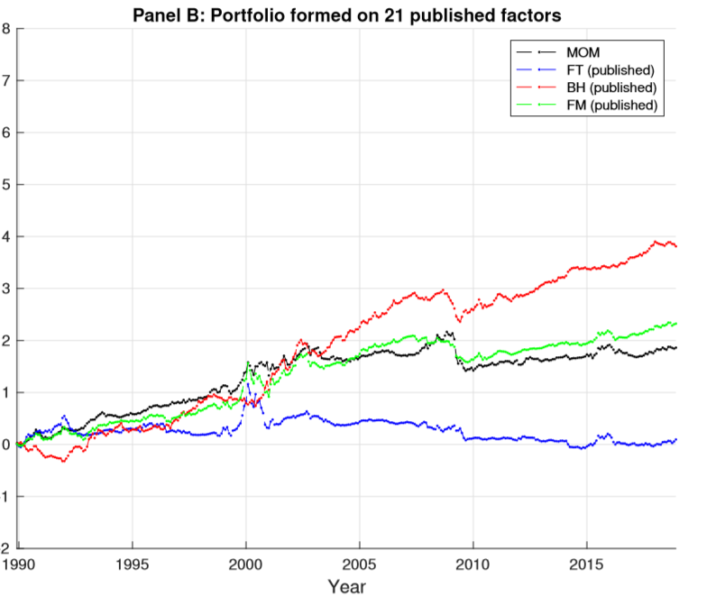

## Table of Contents

## What is an investment strategy?

An investment strategy is a plan that people use to grow their money over time. It involves deciding where to put your money, like in stocks, bonds, or real estate, based on your goals and how much risk you are willing to take. For example, if you want to save for retirement, you might choose a strategy that focuses on long-term growth and stability.

There are many different types of investment strategies, and the best one for you depends on your personal situation. Some people might choose a conservative strategy, putting their money in safe investments like government bonds. Others might go for a more aggressive approach, investing in stocks that could go up a lot but also come with more risk. The key is to pick a strategy that matches your financial goals and comfort with risk.

## Why is it important to evaluate investment strategies after they are published?

It's important to evaluate investment strategies after they are published because things can change over time. The economy might go up or down, new laws might come into effect, or new technologies might change how businesses work. If you don't check your strategy, you might miss out on better opportunities or keep your money in investments that aren't doing well anymore.

Also, evaluating your strategy helps you see if it's working the way you hoped. Maybe you thought a certain stock would grow a lot, but it didn't. By looking at your results, you can decide if you need to change your plan or stick with it. This way, you can keep your money growing and make sure you're on track to reach your goals.

## How can the performance of an investment strategy be measured?

The performance of an investment strategy can be measured by looking at how much money it makes over time. This is often done by calculating the return on investment (ROI), which shows the profit or loss from the investments as a percentage of the initial amount invested. For example, if you invest $100 and it grows to $110, your ROI is 10%. You can compare this to other investments or to a benchmark, like the stock market average, to see if your strategy is doing well.

Another way to measure performance is by looking at risk-adjusted returns. This means considering not just how much money you made, but also how much risk you took to get that return. A common measure for this is the Sharpe ratio, which compares the return of your investment to the risk-free rate of return (like what you'd get from a government bond) and adjusts for the [volatility](/wiki/volatility-trading-strategies) of your investment. A higher Sharpe ratio means you got a better return for the level of risk you took. By using these measures, you can get a clear picture of how well your investment strategy is working.

## What are common benchmarks used to compare investment strategy performance?

Common benchmarks used to compare investment strategy performance include the S&P 500 and the Dow Jones Industrial Average. The S&P 500 is an index that tracks the stock performance of 500 large companies in the U.S. It's often used as a benchmark because it represents a broad section of the market. If your investment strategy does better than the S&P 500, it means you're beating the market. The Dow Jones Industrial Average, or just the Dow, tracks 30 big companies. It's another way to see how well your strategy is doing compared to these major companies.

Another benchmark is the Bloomberg Barclays U.S. Aggregate Bond Index, which measures the performance of the U.S. bond market. This is useful if your strategy includes bonds. By comparing your bond investments to this index, you can see if you're doing better or worse than the overall bond market. These benchmarks help investors understand if their strategy is working well or if they need to make changes.

## How does the publication of an investment strategy affect its performance?

When an investment strategy is published, it can affect its performance in a few ways. First, if a lot of people start following the same strategy, it can change how the market works. For example, if everyone starts buying the same stocks because they read about them in a strategy, those stocks might go up in price because of all the buying. But then, if everyone decides to sell at the same time, the price could drop a lot. This is called a "crowding effect," and it can make the strategy less effective because the market has changed.

Second, publishing a strategy can also attract attention from other investors and analysts. They might start looking at the same investments more closely, which can lead to more information and different opinions about those investments. This extra attention can either help or hurt the strategy's performance. If the extra attention brings out new information that makes the investments look better, it can help the strategy. But if it shows problems or risks that weren't known before, it could make the investments less attractive and hurt the strategy's performance.

## Can you explain the concept of 'data snooping' and its impact on published strategies?

Data snooping is when someone looks through a lot of old information to find patterns that seem to work well. They might test a bunch of different investment strategies on past data until they find one that looks really good. The problem is, this strategy might just look good because it fits the past data perfectly, but it might not work well in the future. It's like finding a key that fits a lock after trying thousands of keys; it might not open any other locks.

When a strategy that was found through data snooping gets published, people might start using it without realizing it might not work as well going forward. Because the strategy was made to fit past data, it could fail when new, different data comes in. This can lead to people losing money if they put too much trust in a strategy that was just good at explaining the past, not predicting the future. So, it's important to be careful with strategies that were found this way and to test them with new data to see if they really work.

## What role does market efficiency play in the post-publication performance of strategies?

Market efficiency means that the prices of stocks and other investments already include all the information that's out there. When an investment strategy is published, everyone can see it and might start using it. If lots of people follow the same strategy, it can affect the market. For example, if everyone buys the same stocks, those stocks might go up in price because of all the buying. But if the market is efficient, the prices will quickly adjust to all this new buying and selling, so the strategy might not work as well anymore.

In an efficient market, it's hard for published strategies to keep doing better than the market because any good ideas get used up fast. People who read about a strategy will start using it, and that can make the strategy less effective. This is why strategies that work well right after they are published might not keep working well over time. The market changes and adapts, making it tough for any one strategy to beat the market for a long time.

## How do transaction costs and fees influence the real-world performance of published strategies?

Transaction costs and fees can make a big difference in how well a published investment strategy works in real life. When you buy or sell investments, you often have to pay fees to brokers or other financial services. These costs can add up, especially if the strategy involves a lot of buying and selling. If the strategy looks good on paper but doesn't take these costs into account, it might not make as much money as you expect. The fees can eat into your profits, making the strategy less successful than it seemed when it was just published.

Also, different investments can have different fees. For example, some mutual funds charge high management fees, which can take a big chunk out of your returns. If a published strategy suggests investing in these funds, the high fees might make the strategy less attractive. It's important to look at all the costs and fees involved with a strategy to see if it will really work well for you. This way, you can make a better decision about whether to follow the strategy or look for one that might be more cost-effective.

## What are some examples of investment strategies that have performed well or poorly after publication?

One example of an investment strategy that performed well after publication is the Dogs of the Dow strategy. This strategy involves buying the 10 highest-yielding stocks in the Dow Jones Industrial Average at the start of each year. It was first published in 1991 by Michael B. O'Higgins in his book "Beating the Dow." Many people started following this strategy, and it did well for several years, often beating the overall market. However, its performance has been mixed in recent years, showing that even good strategies can change over time.

On the other hand, the Long-Term Capital Management (LTCM) strategy is an example of one that performed poorly after publication. LTCM was a [hedge fund](/wiki/hedge-fund-trading-strategies) that used complex mathematical models to make bets on bonds and other financial instruments. The strategy was successful at first, but after it was widely discussed and published, many other investors started using similar strategies. This led to a big problem in 1998 when Russia defaulted on its debt, causing a financial crisis. LTCM lost a lot of money and almost collapsed the global financial system. This shows how publishing a strategy can lead to too many people following it, which can make it fail when things go wrong.

## How can investors adjust published strategies to potentially improve their performance?

Investors can adjust published strategies to potentially improve their performance by keeping an eye on how the market changes. For example, if a strategy suggests buying certain stocks, but those stocks start doing badly, the investor might want to switch to other stocks that are doing better. It's also important to think about the fees and costs of the strategy. If the strategy involves a lot of buying and selling, those costs can add up and eat into the profits. So, an investor might decide to buy and hold investments for longer to save on costs.

Another way to adjust a strategy is to think about how much risk you're willing to take. If a strategy is too risky, an investor might choose to put some money in safer investments like bonds. This can help balance out the risk and make the overall strategy more stable. Also, it's a good idea to test the strategy with new data to see if it still works well. If it doesn't, the investor can tweak the strategy based on what's happening now, not just what worked in the past. By making these adjustments, investors can try to make the most of a published strategy.

## What advanced statistical methods are used to analyze the post-publication performance of investment strategies?

Advanced statistical methods help investors understand how well a strategy works after it's been shared with everyone. One common method is [backtesting](/wiki/backtesting), which means using old data to see how the strategy would have done in the past. But just looking at the past isn't enough. Investors also use something called out-of-sample testing, where they test the strategy with new data that wasn't used to make the strategy. This helps them see if the strategy will work in the future, not just in the past. Another method is the use of Monte Carlo simulations, which run the strategy many times with different possible future scenarios to see how it might perform under different conditions.

Another important statistical tool is regression analysis. This helps investors figure out which parts of the strategy really make a difference in its performance. By looking at how different factors, like the economy or interest rates, affect the strategy, investors can make better decisions. They also use risk-adjusted performance measures, like the Sharpe ratio, to see if the strategy's returns are worth the risk. These methods help investors see the whole picture and make smarter choices about how to use a published strategy.

## How do regulatory changes and market conditions affect the long-term viability of published investment strategies?

Regulatory changes can really shake things up for published investment strategies. If the government makes new rules about what you can invest in or how much risk you can take, it might mean that a strategy that used to work well doesn't fit anymore. For example, if a strategy involves a lot of borrowing to invest, but then the government puts limits on borrowing, the strategy might not be able to do what it used to. So, investors need to keep an eye on new laws and rules and be ready to change their strategy to make sure it stays legal and effective.

Market conditions also play a big role in how well a strategy keeps working over time. The economy can go up and down, and different industries can do better or worse depending on what's happening in the world. If a strategy is all about investing in one type of business, like tech companies, and then something changes—like a new technology or a big economic problem—that can hurt the strategy's performance. Investors need to watch the market and be ready to switch things up, maybe by spreading their money across different types of investments to handle whatever the market throws at them.

## Is There Profitability After Publication?

Post-publication, a strategy's returns often diminish but they do not typically vanish immediately. This phenomenon can be attributed to the initial dissemination of the strategy, where early adopters, including hedge funds and institutional investors, capitalize on new information prior to widespread adoption. Publications often provide a window of opportunity where the strategy remains under-exploited, thus allowing early implementers to earn above-average returns. Nevertheless, as more market participants become aware of the strategy and attempt to deploy it, the associated profits begin to erode due to increased competition.

Despite the decline in profitability, investment strategies rarely become obsolete overnight. Empirical evidence demonstrates that some strategies manage to retain partial profitability long after their initial publication. This persistence is partly due to the inefficiencies that remain in financial markets, as well as the adaptive behavior of skilled investors who can refine and enhance published strategies to sustain returns.

There is also a noteworthy transition where initially novel strategies evolve into established smart beta factors. Smart beta strategies aim to harness systematic risk factors that are not captured by traditional market indices. As such factors become more recognized and incorporated into investment models, they continue to yield value. For example, strategies focusing on factors like size, value, [momentum](/wiki/momentum), and volatility have endured over time, continuing to deliver returns that contribute positively to diversified portfolios.

Quantitative analysis reinforces the importance of modifying and refining strategies in alignment with evolving market dynamics. Consider a regression model that quantifies the diminished yet persistent profitability of a published strategy over time. The model might resemble:

$$
R_t = \alpha + \beta_1 \cdot Strategy_{Pre} + \beta_2 \cdot Strategy_{Post} + \epsilon_t
$$

Where $R_t$ represents the returns at time $t$, $Strategy_{Pre}$ and $Strategy_{Post}$ denote the strategy returns before and after publication, and $\epsilon_t$ is the error term. The coefficients $\beta_1$ and $\beta_2$ illustrate the relative contributions to returns in both stages, indicating a potential decline but not an entire disappearance post-publication.

Furthermore, integrating programming and data analysis techniques can assist in quantifying these changes. For instance, Python, along with libraries such as pandas and numpy, can be employed to simulate and backtest strategy adjustments, thereby enhancing the ability to maintain profitability effectively.

In conclusion, while the publication of an investment strategy generally triggers a reduction in its profitability, the complete disappearance of returns is not immediate. The strategic timing of implementation and the evolution into recognized investment factors help sustain certain strategies' relevance, thereby continuing to offer benefits within diversified investment frameworks.

## What is Factor Timing?

Correctly timing investment strategies is a crucial element in maintaining profitability, particularly after the initial publication of these strategies. The concept of [factor](/wiki/factor-investing) timing revolves around the ability to predict and utilize factors that could enhance the performance of an investment portfolio. This proactive approach presents significant opportunities to sustain returns, adapting to the dynamic nature of financial markets.

Several approaches within quantitative finance literature focus on the precise timing of market anomalies. Anomaly momentum strategies, for example, leverage historic performance data to predict future price movements. By structuring portfolios around these anomalies, investors can capture substantial returns. Despite the inherent challenges posed by transaction costs and potential data-snooping biases, these strategies remain viable. Data-snooping can lead to spurious correlations if not carefully managed, but robust statistical techniques can mitigate this risk.

Timing portfolios based on past performances involve an analysis of previous price behaviors to identify patterns likely to recur. For instance, a momentum-based strategy assumes that assets displaying strong performance will continue to do so in the near future. Conversely, if a previously high-performing factor shows signs of waning, shifting to a more promising factor can preserve overall returns. This shifting requires adaptive algorithms capable of swift recalibrations, often implemented through [machine learning](/wiki/machine-learning) models that sift through complex data streams.

Quantitative methods offer precise adjustments to timing strategies, enhancing their effectiveness over extended periods. Techniques such as regression analysis, machine learning, and time-series analysis enable investors to discern patterns and project future performance. The formula for the Sharpe ratio, which is used to measure risk-adjusted returns, can be a helpful tool in this context:

$$
\text{Sharpe Ratio} = \frac{E[R_i - R_f]}{\sigma_i}
$$

where $E[R_i - R_f]$ is the expected excess return of the investment over the risk-free rate, and $\sigma_i$ is the standard deviation of the return. This formula can assist in evaluating the efficacy of timed strategies, ensuring they align with the investor’s risk appetite.

Python code is often employed to automate these procedures, allowing for real-time adjustments to factor timing strategies. An example of applying a machine learning model to time a factor might involve using a decision tree algorithm to identify which factors signal an opportunity:

```python
from sklearn.tree import DecisionTreeClassifier
from sklearn.model_selection import train_test_split

# Hypothetical data: factors and their subsequent returns
data = load_factor_data()

# Split data into training and test sets
X_train, X_test, y_train, y_test = train_test_split(data['factors'], data['returns'], test_size=0.2)

# Initialize Decision Tree Classifier
clf = DecisionTreeClassifier()

# Train the model
clf.fit(X_train, y_train)

# Predict returns based on factors
predictions = clf.predict(X_test)
```

In conclusion, factor timing stands as a vital tool in extending the profitability of investment strategies beyond their initial introduction to the market. By employing sophisticated quantitative techniques and agile algorithmic adaptations, investors can navigate the complexities of evolving market conditions to maintain their competitive edge.

## References & Further Reading

[1]: McLean, R. David, & Pontiff, Jeffrey. (2016). ["Does Academic Research Destroy Stock Return Predictability?"](https://onlinelibrary.wiley.com/doi/abs/10.1111/jofi.12365) The Review of Financial Studies, 29(2), 319-356.

[2]: Arnott, R. D., Beck, N., Kalesnik, V., & West, J. (2016). ["How Can 'Smart Beta' Go Horribly Wrong?"](https://papers.ssrn.com/sol3/papers.cfm?abstract_id=3040949) Research Affiliates.

[3]: Fama, Eugene F., & French, Kenneth R. (1993). ["Common Risk Factors in the Returns on Stocks and Bonds."](https://people.hec.edu/rosu/wp-content/uploads/sites/43/2023/09/Fama-French-Common-risk-factors-1993.pdf) Journal of Financial Economics, 33(1), 3-56.

[4]: Lo, Andrew W. (2004). ["The Adaptive Markets Hypothesis: Market Efficiency from an Evolutionary Perspective."](https://papers.ssrn.com/sol3/papers.cfm?abstract_id=602222) Journal of Portfolio Management, 30(5), 15-29.

[5]: Hou, Kewei, Xue, Chen, & Zhang, Lu. (2015). ["Digesting Anomalies: An Investment Approach."](https://academic.oup.com/rfs/article/28/3/650/1574802) The Review of Financial Studies, 28(3), 650-705.