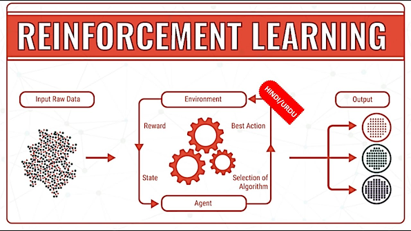

Algorithmic trading has revolutionized the way financial markets operate by leveraging computer algorithms to execute trades at speeds and frequencies that are impossible for a human trader. This method uses predefined criteria to make decisions, which may include timing, price, or quantity, often based on complex mathematical models and high-frequency data analysis. As financial markets grow in complexity and volume, the significance of algorithmic trading continues to expand, making it a vital tool for investors and institutions seeking to enhance efficiency and precision in their trading activities.

Reinforcement learning (RL) is a groundbreaking subset of artificial intelligence (AI) that focuses on training algorithms to make sequences of decisions by interacting with an environment. Unlike supervised learning, where models are trained on a dataset with explicit inputs and outputs, reinforcement learning involves learning through trial and error to achieve a specified goal. In RL, an agent learns to make decisions by receiving feedback from its actions in the form of rewards, dynamically optimizing its strategy to maximize cumulative reward over time. This method is particularly beneficial in situations where a model must adapt to changes and learn optimal decision-making processes autonomously.

The intersection of AI, reinforcement learning, and algorithmic trading represents an exciting frontier in financial technology. AI provides the framework to process and analyze large datasets, identify patterns, and automate complex trading tasks. Within this framework, reinforcement learning offers a unique advantage due to its dynamic learning capabilities and adaptability to complex, stochastic environments like financial markets. By employing RL, traders can develop adaptive trading strategies that not only react to market changes but also optimize themselves through continuous learning and real-time feedback. The integration of these technologies promises to enhance the accuracy, efficiency, and profitability of trading strategies, marking a significant shift in how algorithmic trading is approached and implemented in modern financial markets.

## Table of Contents

## Understanding Reinforcement Learning

Reinforcement L[earning](/wiki/earning-announcement) (RL) is a distinct paradigm within [machine learning](/wiki/machine-learning), renowned for its efficiency in decision-making processes. Unlike supervised learning, where models learn from a labeled dataset, or unsupervised learning, which involves finding patterns in unlabeled data, RL focuses on learning through interactions with an environment to achieve a certain goal. This trial-and-error approach enables an RL model to learn a policy that dictates the best action to take in a given state to maximize cumulative reward over time.

In RL, there are several fundamental components:

1. **Agents**: The learner or decision-maker that interacts with the environment. The agent seeks to learn a policy to take actions that will maximize the received cumulative reward.

2. **Environment**: The external system with which the agent interacts. It presents the agent with states and rewards based on the actions taken by the agent.

3. **Actions**: The set of all possible moves the agent can make. Choosing the optimal action in each state is key to maximizing rewards.

4. **Rewards**: Feedback from the environment in response to the agent's action. It is crucial in guiding the agent to learn successful behaviors. Rewards can be positive or negative, encouraging or discouraging the actions that led to them.

5. **Policies**: A policy is a strategy used by the agent to determine the next action based on the current state. It maps states to actions to maximize the reward over time.

Key concepts within [reinforcement learning](/wiki/reinforcement-learning) include **exploration** and **exploitation**. Exploration involves trying new actions to discover their potential benefits, while exploitation utilizes the known information to make the best decision based on past experiences. Balancing exploration and exploitation is essential for effective learning, as too much exploration can lead to unnecessary risk, while excessive exploitation may cause the agent to miss out on potentially better strategies.

The role of **rewards** in learning cannot be underestimated. Rewards serve as signals that guide the agent to adjust its policies. By consistently reinforcing the actions that yield higher returns, the agent refines its decision-making process, progressively learning the most effective strategies. The continuous evaluation and adaptation of policies through interaction with the environment form the crux of reinforcement learning, enabling [agents](/wiki/agents) to operate efficiently in complex and dynamic systems.

## Application of Reinforcement Learning in Algorithmic Trading

Reinforcement learning (RL) is increasingly being recognized as a powerful tool for [algorithmic trading](/wiki/algorithmic-trading) due to its dynamic adaptability and self-learning capability. Trading environments are inherently stochastic, with continuous changes and uncertainties in market conditions. RL is suitable for such environments because it can model trading as a sequential decision-making process where an agent learns to make optimal decisions by interacting with the environment, receiving feedback, and improving its strategy over time.

The primary benefit of applying RL in trading is its ability to learn optimal trading strategies through trial and error, without requiring explicit programming rules for each possible market scenario. In traditional trading systems, strategies often need continuous manual adjustments to adhere to the evolving market. In contrast, RL algorithms dynamically adjust their strategies based on received rewards, optimizing actions to maximize long-term gains.

Reinforcement learning can optimize trading strategies by utilizing its components: agents, environment, actions, rewards, and policies. In a trading context, the "agent" could be a trading bot, the "environment" refers to the market conditions, "actions" are the trades executed, and "rewards" correspond to the profitability of these trades. The "policy" is the strategy that the agent utilizes to decide its actions based on the state of the environment.

One of the key concepts in reinforcement learning is the trade-off between exploration and exploitation. Exploration involves trying out new strategies to discover their benefits, while exploitation uses existing knowledge to maximize immediate rewards. In trading, this concept is crucial as it helps in balancing the need to adapt to new market conditions while leveraging previously successful strategies.

Typical use cases of RL in algorithmic trading include asset price prediction, portfolio management, and automated trading execution. For predicting asset prices, RL models can process vast amounts of historical and real-time data to identify patterns and predict future price movements, even in highly volatile markets. In portfolio management, RL helps in optimizing the asset allocation, adjusting the investment ratios to achieve the desired risk-return profiles. Automated trading execution is another prominent application, where RL-driven algorithms can perform trades, continuously evaluating market conditions and adapting their strategies in real-time to exploit market inefficiencies.

In summary, reinforcement learning provides a framework that can significantly enhance trading strategies by learning to optimize actions through feedback from market interactions, thus offering a promising approach to managing compl[exit](/wiki/exit-strategy)ies associated with modern trading environments.

## Challenges and Limitations

Implementing reinforcement learning (RL) in algorithmic trading presents numerous challenges and limitations, impacting its effectiveness and efficiency. A significant hurdle is the need for extensive data sets and substantial computational resources. Reinforcement learning models, specifically deep reinforcement learning, require vast amounts of historical market data for training. The complexity of these algorithms dictates the use of powerful computational resources to expedite the training process, often beyond the reach of smaller trading firms or individual traders.

Overfitting is another critical limitation faced by traders using reinforcement learning in algorithmic settings. In RL, overfitting occurs when the model learns the noise or random fluctuations in the training data rather than the underlying market patterns. This results in a model that performs exceptionally well on historical data but poorly on unseen market conditions. To mitigate overfitting, techniques such as regularization, dropout in [neural network](/wiki/neural-network)s, and validation on unseen data sets can be employed. Additionally, implementing strategies like cross-validation can help ensure that the model generalizes better to new data.

Market unpredictability and the dynamic nature of financial markets pose further challenges. Reinforcement learning models may struggle to adapt quickly to sudden market changes or unexpected events, such as geopolitical crises or economic announcements, which can dramatically alter market conditions. Traders can address this by incorporating external data sources, such as news feeds or economic indicators, as additional inputs to help the model account for broader market dynamics.

Simulating real-world market environments for training purposes is inherently difficult. Market environments are complex and influenced by myriad [factor](/wiki/factor-investing)s, many of which are challenging to replicate accurately in simulations. This can result in discrepancies between the simulated environment used for training and actual market conditions. One approach to bridge this gap is using more sophisticated simulation techniques such as generative adversarial networks (GANs) to create more realistic market scenarios. Additionally, continuous model evaluation and updating during live trading can help to refine the model's understanding of the current market environment.

In summary, while reinforcement learning holds great potential for transforming algorithmic trading, it comes with significant challenges. Addressing the need for large data sets, computational power, preventing overfitting, and accurately simulating market conditions are crucial for successful implementation. Continuous research and development, along with technological advancements, are essential to overcoming these challenges and unlocking the full potential of reinforcement learning in trading.

## Case Studies and Real-World Examples

In recent years, reinforcement learning (RL) has made significant inroads into the world of algorithmic trading, with both financial institutions and innovative startups exploring its potential to enhance trading strategies. Real-world examples reveal the practical applications, outcomes, and lessons that come with applying RL to trading.

One notable example is from JPMorgan Chase, where the bank implemented a reinforcement learning algorithm to optimize execution strategies for trades. By utilizing RL, the bank's trading systems were able to adapt to complex, dynamic market conditions more efficiently than traditional algorithms. The model focused on learning the optimal policy to execute orders while minimizing costs associated with market impact. The success at JPMorgan highlighted the importance of marrying financial expertise with advanced machine learning techniques to achieve desirable outcomes.

Another example can be seen in the efforts of DeepMind, a subsidiary of Alphabet Inc., which has experimented with applying its deep reinforcement learning expertise to trading. By collaborating with traditional trading firms, DeepMind has demonstrated how RL can be leveraged to predict market movements and manage risk more effectively. The cooperation emphasized the advantage of interdisciplinary collaboration, combining machine learning experts with veteran traders to refine models that account for the complexities and unpredictability of financial markets.

Further illustrating RL's utility in trading is the case of Alpaca, a fintech startup, which developed an RL-based trading platform that democratizes access to sophisticated trading algorithms for retail investors. Alpaca's platform uses RL to continuously improve its trading strategies as it receives more data, showcasing the capacity of RL to cater not only to institutional players but also to individual investors.

These case studies highlight several key lessons and best practices:

1. Data Quality and Quantity: One of the central lessons is the need for high-quality and extensive datasets to train reinforcement learning models effectively. The dynamic nature of financial markets requires algorithms to be trained on diverse scenarios to generalize well.

2. Integration of Domain Expertise: Successful RL applications in trading often involve close collaboration between machine learning specialists and domain experts. This ensures models are tailored to the unique characteristics of financial markets.

3. Continuous Learning: A distinctive advantage of RL is its ability to learn continuously. By updating strategies with fresh data, RL systems can stay relevant in the face of evolving market conditions.

4. Risk Management: Incorporating risk metrics into the RL framework is crucial, as financial markets are inherently uncertain. Optimal policies should balance profitability with risk exposure to avoid catastrophic losses.

In conclusion, these case studies underscore the transformative potential of reinforcement learning in trading. By addressing the challenges and leveraging best practices, firms can harness RL to unlock new possibilities in financial markets.

## Future Prospects of Reinforcement Learning in Trading

The future of reinforcement learning (RL) in algorithmic trading holds significant promise as the financial sector increasingly leverages AI technologies to enhance efficiency and profitability. As RL continues to evolve, several key developments and trends are likely to shape its role in trading.

First, the integration of emerging technologies, such as quantum computing and advanced data analytics, could significantly bolster the capabilities of RL algorithms. Quantum computing, for example, has the potential to enhance RL by drastically improving processing speeds and optimizing complex computations required for large-scale data analysis. This could enable real-time decision-making and adaptive learning, thereby refining trading strategies and improving market predictions.

Advanced data analytics is another technology that could complement RL in trading. By harnessing big data, RL algorithms can gain deeper insights into market trends, sentiment analysis, and customer behavior. This enhanced data-driven approach allows traders to refine their strategies, improve risk management, and potentially increase their return on investment.

Moreover, the synergy between RL and [deep learning](/wiki/deep-learning) could lead to more sophisticated trading algorithms capable of processing and learning from high-dimensional data. This integration is instrumental in modeling non-linear and complex relationships in financial markets, which traditional models may struggle to capture. 

The potential for RL to transform financial markets is profound. By autonomously learning optimal trading rules and adapting to market dynamics, RL systems could outperform traditional trading algorithms. Furthermore, as RL algorithms improve in their ability to simulate complex environments, they can provide more accurate assessments of market states and potential future scenarios, offering a competitive edge.

However, the transformative effect of RL in trading will depend on overcoming existing challenges. Ensuring data quality, addressing ethical concerns, and managing the interpretability of complex models remain critical to unlocking the full potential of RL in financial markets.

In conclusion, the fusion of reinforcement learning with emerging technologies and deep learning techniques is poised to revolutionize algorithmic trading, offering unprecedented opportunities for innovation and transformation in the financial sector. Ongoing advancements in computational power and data analytics will continue to refine and enhance the application of RL in trading, paving the way for a more intelligent and adaptive financial ecosystem.

## Conclusion

Reinforcement learning (RL) is making significant strides in the domain of algorithmic trading, fundamentally transforming how trading strategies are devised and executed. The intersection of RL with financial markets provides a dynamic and adaptive method of approaching market complexities, offering the potential for enhanced decision-making and optimized trading strategies. One of the key benefits of RL in algorithmic trading is its ability to learn and adapt from the environment, which allows for continuous improvement and refinement of trading models. This capacity for adaptation is crucial in the always-changing landscape of financial markets.

However, the integration of RL into trading systems is not without its challenges. The sophisticated models require large amounts of data and considerable computational resources, which can be a barrier to entry for smaller firms. Furthermore, the risk of overfitting to historical data remains a critical issue, potentially leading to suboptimal performance when applied to live trading scenarios. The stochastic nature of financial markets introduces an additional layer of unpredictability that RL models must contend with, making the simulation of real-world conditions a complex task.

Despite these challenges, the solutions emerging from ongoing research—such as better algorithms for generalization and the use of robust data sets—demonstrate the promising avenues for overcoming existing limitations. The evolution of computational technology, including areas like cloud computing and big data analytics, further supports the growth and feasibility of RL methods in trading.

The future potential of RL in algorithmic trading is vast. Continued exploration into this synergy between AI and finance could lead to groundbreaking advancements, potentially reshaping the structures and efficiencies of financial markets. As researchers and practitioners further refine RL techniques and tackle existing drawbacks, the role of RL in trading is expected to become more integrated and impactful. Encouragement toward such ongoing innovation and exploration is essential as the finance industry seeks ways to leverage AI for improved market strategies and outcomes.

