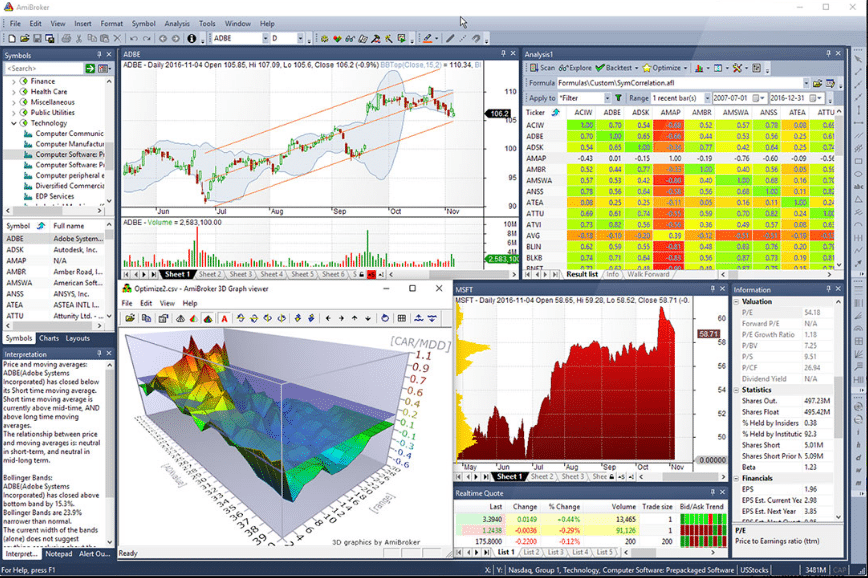

The world of trading has transformed significantly over the past few decades, primarily due to technological advancements that have brought forth sophisticated mechanisms transcending traditional manual trading. Gone are the days when traders relied solely on gut feelings and manual chart analyses. Today, we stand at the forefront of a digital era that offers powerful tools capable of automating strategies and testing their effectiveness against historical data.

For many individuals interested in tapping into these advanced trading techniques, a significant hurdle presents itself: the lack of programming skills. The art of programmatically automating trades and backtesting them often seems like an impenetrable fortress, accessible only to those fluent in coding languages. This perception can be daunting and may deter many potential traders from fully harnessing the capabilities that modern trading platforms offer.



However, the landscape is changing. With the advent of user-friendly interfaces and no-code platforms, even those without any programming background can now engage with trading automation and backtesting processes. These tools have democratized access by providing intuitive mechanisms that simplify strategy development and testing, making it more inclusive for everyone to participate in the financial markets.

This article delves into various methods and tools available today that allow traders to automate and backtest their strategies without the requisite of programming expertise. By exploring these modern solutions, traders can optimize their approaches, reduce the emotional biases often associated with manual trading, and efficiently manage their strategies in a 24/7 market environment.


## Table of Contents

## Understanding Trading Strategy Automation

Automating a trading strategy involves the use of technology to execute a pre-defined set of trading rules without human intervention. This process entails the integration of algorithms to evaluate market conditions, trigger trades, and manage positions. The primary objective of trading automation is to increase the efficiency and consistency of entering and [exit](/wiki/exit-strategy)ing trades.

One of the most significant benefits of automating trading strategies is increased efficiency. Automated systems can process complex calculations and identify trading opportunities faster than a human. This swiftness is crucial in financial markets, where prices can change in fractions of a second. Furthermore, automated strategies minimize emotional trading, a common pitfall for human traders. Emotional trading often leads to irrational decision-making and can result in significant losses. By relying on pre-set parameters, traders can maintain disciplined trading practices and mitigate the influence of fear or greed on their trading decisions.

Another considerable advantage is the ability to trade around the clock. Unlike humans, automated systems can operate without the need for breaks, enabling traders to capitalize on opportunities in global markets across different time zones. This 24/7 operation ensures that traders do not miss valuable trading opportunities and can engage with multiple markets simultaneously.

Despite its advantages, there are common misconceptions about trading automation. A prevalent misconception is that it requires an in-depth understanding of programming and sophisticated computational skills. However, many modern platforms offer intuitive interfaces, making them accessible even to those with minimal technical expertise.

Concerns about the complexity of trading automation also include the fear of mechanical failures and the potential for software bugs. While these are valid considerations, they can be addressed through proper maintenance and rigorous testing. By extensively [backtesting](/wiki/backtesting) strategies, traders can identify and rectify potential issues before deploying them in live markets.

In conclusion, automating trading strategies serves to enhance trading efficiency, reduce emotional biases, and allow continual market engagement. While certain complexities and risks exist, they can be managed through careful strategy design and the use of user-friendly platforms, making automated trading a viable option for both novice and experienced traders.


 to Backtesting

Backtesting is a fundamental component of developing a trading strategy. It involves applying a trading strategy to historical market data to assess how it would have performed in the past. This retrospective analysis is crucial because it enables traders to evaluate the potential effectiveness of a strategy without risking actual capital in the present market. By doing so, traders can refine their strategies, mitigate risks, and enhance their understanding of market dynamics.

One of the primary benefits of backtesting is the improvement of strategy performance. By analyzing past market data, traders can identify strengths and weaknesses in their strategies, allowing them to make data-driven adjustments. For instance, if a strategy shows a consistent pattern of losses during bearish market conditions, a trader might decide to incorporate additional indicators or risk management techniques to navigate such environments better.

Additionally, backtesting serves as a validation tool for trading ideas. Before deploying a new concept in live trading, testing it against historical data can confirm its viability. A strategy that performs well over diverse market scenarios in the past is more likely to succeed in future real-time trading than an untested one. This reduces the chance of significant losses due to unverified assumptions about market behavior.

Moreover, backtesting provides a valuable l[earning](/wiki/earning-announcement) opportunity. By reviewing historical data, traders can gain insights into market trends, price patterns, and economic events that have influenced asset prices. This historical context can be instrumental in sharpening a trader's analytical skills and market acumen.

There are several common methods of backtesting, ranging from manual analysis to sophisticated automated systems. Manual backtesting involves simulating trades on historical charts, which can be time-consuming and subject to human bias. However, it offers a deep understanding of the strategy’s interaction with the market. On the other hand, automated backtesting uses software tools that execute trades based on predefined conditions, providing scalability and efficiency.

For non-programmers, backtesting might seem daunting, but modern platforms have simplified the process significantly. Many trading platforms now offer intuitive interfaces where users can test their strategies with drag-and-drop elements and pre-built algorithms. Such tools enable individuals with no coding skills to engage in effective backtesting by providing accessible analytics and risk assessments.

In conclusion, backtesting is an invaluable technique in the development and refinement of trading strategies. Its ability to enhance strategy performance, validate new ideas, and offer educational insights make it an essential practice for traders seeking consistency and success. Even for those without programming skills, the availability of user-friendly platforms ensures that backtesting remains an accessible and potent tool in the trader's toolkit.


## Tools for Automating and Backtesting Without Coding

Trading has become more accessible with the rise of platforms that allow traders to automate and backtest strategies without programming skills. These no-code solutions simplify the process by providing user-friendly interfaces and a suite of features that cater to traders of all expertise levels.

No-code platforms for trading typically function through intuitive drag-and-drop interfaces, allowing users to construct trading strategies by connecting blocks that represent buy/sell orders, technical indicators, and other market functions. This visual approach removes the need for writing code, enabling users to focus on strategy development rather than syntax. Additionally, these platforms often come with pre-built templates, which serve as starting points for users to customize according to their specific trading goals. These templates are particularly useful for beginners who might not yet grasp complex trading dynamics but want to implement effective strategies quickly.

When choosing a non-coding trading platform, several key features ensure a beneficial experience:

1. **Ease of Use**: The platform should require minimal learning time, with features that guide the user through the process of building and testing strategies. This includes comprehensive tutorials, user support, and a clean, organized interface.

2. **Market Support**: An effective no-code platform should support a wide range of markets, including forex, stocks, cryptocurrencies, and commodities. This versatility allows traders to diversify their strategies across different asset classes, mitigating risk and potentially increasing returns.

3. **Robust Analytical Tools**: Users should look for platforms that offer extensive analytical capabilities, including performance metrics, real-time data feeds, and the ability to simulate different market conditions. Such tools enable traders to thoroughly backtest their strategies and make data-informed decisions. These analytical features can help identify potential weaknesses in a strategy and offer insights for optimization.

By focusing on these features, traders can harness the power of automation and backtesting to enhance their trading prowess without needing to learn how to code. In utilizing no-code platforms, they stand better equipped to navigate the financial markets efficiently and effectively.


## Popular No-Code Platforms for Trading Strategy Development

In the rapidly advancing field of trading, the demand for accessible tools that allow strategy development without requiring coding skills has surged. Many platforms offer no-code solutions, making trading strategy automation and backtesting accessible to a broader audience. Among the most popular no-code platforms are TradingView and QuantConnect, each offering unique features, strengths, and limitations.

**TradingView**

TradingView is widely known for its user-friendly interface and robust community features. It provides a highly interactive charting tool combined with a social network, where traders can share ideas and strategies. Key features include:

1. **Simple Interface**: TradingView's drag-and-drop functionality and intuitive design make it easy for beginners. It allows users to create complex trading strategies visually without writing any code.

2. **Comprehensive Charting Tools**: The platform offers hundreds of technical indicators and drawing tools, enabling users to analyze market trends effectively.

3. **Strategy Tester**: TradingView includes a built-in strategy tester that enables backtesting. Users can see how their visual strategies would have performed historically, helping to refine and optimize their approaches.

4. **Pine Script**: While not entirely code-free, Pine Script is relatively easy to learn, allowing users to customize indicators and strategies beyond the standard offerings.

However, TradingView has limitations. The visual strategy development is somewhat restricted compared to platforms offering full coding capabilities. Additionally, the low-tier subscription plans may limit access to certain advanced features.

**QuantConnect**

QuantConnect targets more technically inclined traders but offers tools that help non-programmers get involved in strategy development. Though its primary focus is on [algorithmic trading](/wiki/algorithmic-trading) through C# and Python, it provides some features accessible to non-coders:

1. **Pre-Built Algorithms**: QuantConnect offers a library of pre-built algorithms that users can adapt and modify to suit their needs, reducing the initial complexity barrier.

2. **Lean Algorithm Framework**: The platform's backtesting framework, Lean, facilitates rigorous testing of strategies. It can access a wide range of historical data across various markets.

3. **Collaborative Tools**: Users can benefit from an active community and educational resources, gaining insights from experienced algo traders.

Despite these advantages, QuantConnect may still pose challenges for those completely averse to any coding, given its environment leans heavily towards code-based strategy development. Unlike TradingView, it requires more technical engagement initially.

**Automation and Backtesting Capabilities**

Both platforms support backtesting and offer automation features, essential for trading success without direct programming. TradingView's strategy tester allows manual testing and tweaking of strategies directly on the charts, while QuantConnect’s Lean engine supports both extensive backtesting and live trading, ensuring strategies are robust before market execution. In essence, these platforms bring powerful tools to traders who wish to explore automated trading without deep programming knowledge.

In conclusion, platforms like TradingView and QuantConnect are pivotal for making trading strategy development more accessible. While they cater to different user needs, each offers significant features encouraging strategy testing and automation, empowering traders of varied expertise levels.


## Developing a Strategy Using Non-Programming Tools

Creating a trading strategy using non-programming tools involves leveraging user-friendly platforms designed to simplify the process for those without coding expertise. Here’s a step-by-step guide to help you construct your strategy seamlessly on a no-code platform:

### Step 1: Select a No-Code Platform
Begin by choosing a platform that offers intuitive interfaces, such as TradingView or QuantConnect. These platforms provide drag-and-drop functionalities, enabling you to design and implement trading strategies without needing to write code.

### Step 2: Define Your Trading Goals
Before constructing your strategy, clarify your financial objectives. Determine your risk tolerance, desired returns, and investment horizon. These goals will guide your strategy design.

### Step 3: Understand Market Conditions
Gain insights into current market conditions by analyzing existing trends, historical data, and economic indicators. Platforms often provide access to a wealth of data to assist you in this analysis.

### Step 4: Develop the Core Strategy
Use the platform’s tools to lay out your trading logic. For example, to use a simple moving average crossover strategy, place two moving averages on a chart—one with a short period (e.g., 50 days) and another with a longer period (e.g., 200 days). Your trading logic can be set to buy when the short-term average crosses above the long-term average and sell when it crosses below.

### Step 5: Implement Risk Management
Incorporate risk management principles by setting appropriate stop-loss and take-profit levels. For instance, ensuring that your maximum loss on any trade does not exceed 1-2% of your total capital is a prudent approach. The formula for position sizing based on risk might be:

$$
\text{Position Size} = \frac{\text{Total Capital} \times \text{Risk per Trade (\%)}}{\text{Entry Price} - \text{Stop-Loss Price}}
$$

### Step 6: Backtest the Strategy
Utilize the platform’s backtesting feature to evaluate your strategy against historical data. Look for metrics such as the strategy’s win rate, average return per trade, and drawdown levels to gauge its effectiveness. Adjust parameters as needed to enhance performance.

### Step 7: Optimize and Refine
After backtesting, refine your strategy by tweaking parameters or incorporating additional indicators to improve accuracy and reliability. For example, you might add a [volume](/wiki/volume-trading-strategy) filter to your moving average crossover strategy to confirm trend strength.

### Tips on Optimization
1. **Avoid Overfitting**: Ensure your strategy is adaptable to different market conditions rather than being too tailored to past data.
2. **Stress Test**: Run simulations under various scenarios, including high volatility periods, to understand how your strategy performs under stress.
3. **Iterate**: Continuously refine your strategy by incorporating new insights or market changes.

By considering these crucial [factor](/wiki/factor-investing)s and steps, traders can harness the power of no-code platforms to effectively develop and optimize trading strategies, all while sidestepping the need for programming expertise. This approach not only democratizes trading strategy development but also opens the door to more systematic and disciplined trading practices.


## Auto-Execution of Backtested Strategies

Transitioning from backtesting a strategy to executing it automatically in the market is a crucial step for traders looking to capitalize on their strategy's potential. This process involves several key considerations to ensure that the transition is smooth and that the strategy performs well in live trading conditions.

**Strategy Transition and Execution**

Once a strategy has been successfully backtested and optimized, the next step is to implement it in a live trading environment. This involves setting up automated systems that can frequently and accurately execute trades based on the predefined strategy rules. Many no-code platforms support direct integration with brokers, allowing for seamless execution of trades. It's essential to ensure that the platform is configured correctly to deploy the strategy without manual intervention, which involves linking the platform's signals to the broker's execution API.

**Best Practices for Live Trading**

1. **Start Small:** Begin with a small position size to minimize potential losses. This helps in observing how the strategy behaves under live market conditions without risking significant capital.

2. **Iterative Testing:** Even after backtesting, incorporate rolling testing (forward testing) by continuously observing live trades to validate that the strategy performs as expected. This can be seen as a second layer to the initial backtesting.

3. **Robust Monitoring Systems:** Implement robust monitoring systems to track the performance of the strategy in real-time. Alerts for specific conditions such as slippage, increased volatility, and execution delays can be beneficial in quickly addressing any issues.

4. **Regular Performance Reviews:** Analyze the strategy's performance regularly to check its effectiveness. This may involve reviewing key performance indicators (KPIs) such as return on investment (ROI), win/loss ratio, and average gains/losses.

**Addressing Challenges in Automated Live Trading**

Automated trading poses several challenges that traders must be prepared for:

- **Market Dynamics:** Market dynamics can change unexpectedly due to news events or economic releases, affecting strategy performance. Utilizing features such as circuit breakers can be beneficial to pause trading during high-impact events.

- **Technical Issues:** Platform glitches or internet outages can disrupt automated execution. Ensure there is a fail-safe mechanism, such as cloud-based servers or virtual private servers (VPS), to reduce downtime.

- **Emotional Management:** Emotional interference is minimized in automated systems, but traders should remain involved to make critical decisions if the market conditions change drastically.

- **Adapting to Strategy Failures:** Not all strategies will be successful long-term. It's crucial to have a predefined exit strategy for reevaluating or discontinuing a failing strategy. Implementing stop-loss orders can help mitigate risks associated with strategy failures.

**Monitoring & Adjusting in Real-Time**

Efficient automated trading systems continuously monitor real-time market data to adjust strategies accordingly. This involves:

- **Use of Adaptive Algorithms:** Some advanced platforms allow the integration of machine learning models to adjust strategy parameters dynamically.

- **Continuous Data Analysis:** Regularly feed new market data into the system to update predictive models and make necessary adjustments in strategy execution.

- **Feedback Loops:** Set up feedback loops where the system evaluates all trades and outcomes to iteratively refine and enhance the strategy's rules.

While the transition from testing to live execution is a significant leap, following these best practices and preparing for potential challenges can increase the likelihood of achieving consistent gains with minimal losses. Automating this process enables traders to maintain discipline and capitalize on market opportunities efficiently.


## Mastering Risk Management in Automated Trading

In automated trading, effective risk management is crucial to minimize potential losses and maximize returns. Fundamental elements of risk management include setting stop-losses, determining optimal position sizes, and diversifying investments. Each of these practices is integral to safeguarding your portfolio and ensuring your trading strategy remains sustainable in the long term.

**Setting Stop-Losses**

Stop-losses act as a protective mechanism, automatically closing a trade when the asset price reaches a predetermined level unfavorable to the trader. This helps prevent excessive losses during unexpected market downturns. Establishing appropriate stop-loss levels requires careful consideration of market [volatility](/wiki/volatility-trading-strategies) and the trader’s risk tolerance. A common method is to use the Average True Range (ATR) to set dynamic stop-loss levels, which can be calculated as:

$$
\text{Stop-Loss} = \text{Entry Price} - (\text{ATR} \times \text{Multiplier})
$$

This formula allows the stop-loss to adjust according to market volatility, providing a balance between protecting capital and allowing trades to develop.

**Determining Position Sizes**

Position sizing is the practice of determining the amount of capital to allocate to a particular trade. It plays a critical role in managing risk and enhancing the overall effectiveness of automated trading strategies. Generally, a trader can use the Kelly Criterion or the fixed-percentage method to determine position sizes:

$$
\text{Position Size} = \frac{\text{Capital} \times \text{Risk Percentage}}{\text{Stop-Loss Distance}}
$$

This method considers the trader’s capital, acceptable risk percentage, and the distance to the stop-loss to determine the optimal amount to trade. Maintaining consistent position sizes based on risk parameters helps protect against significant losses from any single trade.

**Diversifying Investments**

Diversification involves spreading investment across different assets or markets to reduce exposure to risk from any particular asset or market performance. Automated trading systems can be programmed to allocate capital across a diversified portfolio, thus minimizing the impact of adverse movements in any individual asset. Diversification enhances the stability of returns and reduces volatility in one’s investment portfolio.

**Utilizing Backtesting for Risk Analysis**

Backtesting is an invaluable tool for analyzing risk parameters and refining risk management strategies. By simulating trades using historical data, traders can assess the potential risks and performance of their strategies under various market conditions. This retrospective analysis allows traders to identify weaknesses in their risk management approach, such as inadequate stop-loss levels or overly aggressive position sizes, and adjust accordingly.

For example, using Python, traders can backtest their risk parameters with a simple script:

```python
import pandas as pd
import numpy as np

# Load historical data
data = pd.read_csv('historical_data.csv')

# Define strategy parameters
initial_capital = 100000
risk_per_trade = 0.01
atr_multiplier = 1.5

# Calculate ATR and stop-losses
data['ATR'] = data['High'] - data['Low']
data['StopLoss'] = data['Close'] - (data['ATR'] * atr_multiplier)

# Simulate trades
capital = initial_capital
for index, row in data.iterrows():
    # Calculate position size
    position_size = capital * risk_per_trade / row['StopLoss']
    capital -= position_size

    # Close position if stop-loss is hit
    if row['Low'] <= row['StopLoss']:
        capital += position_size

    # Update capital based on end-of-day price
    capital += position_size * (row['Close'] / row['StopLoss'])

print(f"Final Capital: {capital}")
```

This simple backtesting script demonstrates how a trader can evaluate stop-loss levels and position sizes, providing valuable insights that help improve risk management strategies in automated trading. By leveraging these techniques, traders can ensure their automated trading systems are robust, adaptable, and resilient against market fluctuations.


## Conclusion

In summary, the journey into automating and backtesting trading strategies without programming skills is more accessible than ever. The shift from manual trading to automated systems offers numerous advantages, such as increased efficiency and reduced susceptibility to emotional decision-making. By utilizing no-code platforms, traders can capitalize on these benefits without needing in-depth coding knowledge. These platforms provide user-friendly features like drag-and-drop interfaces and pre-built templates that simplify the process of strategy development and testing.

For traders eager to explore these opportunities, no-code platforms are a practical gateway into the dynamic world of trading automation. They allow for the testing and refinement of strategies in a simulated environment before transitioning to live trading, thus bridging the gap between ideation and execution seamlessly. Furthermore, these tools facilitate comprehensive risk management through backtesting, enabling traders to optimize their strategies effectively.

As technology continues to evolve, the future of trading strategy automation for non-programmers looks promising. We can anticipate more intuitive and powerful platforms emerging, democratizing access to automated trading even further. This progression empowers traders to harness advanced trading techniques once reserved for those with programming expertise, leveling the playing field in financial markets. Ultimately, embracing these no-code solutions could significantly enhance one's trading capabilities, offering a strategic edge in today's fast-paced financial landscape.


## References & Further Reading

[1]: ["Advances in Financial Machine Learning"](https://www.amazon.com/Advances-Financial-Machine-Learning-Marcos/dp/1119482089) by Marcos Lopez de Prado

[2]: ["Evidence-Based Technical Analysis: Applying the Scientific Method and Statistical Inference to Trading Signals"](https://www.wiley.com/en-gb/Evidence+Based+Technical+Analysis:+Applying+the+Scientific+Method+and+Statistical+Inference+to+Trading+Signals-p-9780470008744) by David Aronson

[3]: ["Machine Learning for Algorithmic Trading"](https://www.amazon.com/Machine-Learning-Algorithmic-Trading-intelligence/dp/9918608013) by Stefan Jansen

[4]: ["Quantitative Trading: How to Build Your Own Algorithmic Trading Business"](https://www.amazon.com/Quantitative-Trading-Build-Algorithmic-Business/dp/0470284889) by Ernest P. Chan

[5]: Bergstra, J., Bardenet, R., Bengio, Y., & Kégl, B. (2011). ["Algorithms for Hyper-Parameter Optimization."](https://papers.nips.cc/paper_files/paper/2011/hash/86e8f7ab32cfd12577bc2619bc635690-Abstract.html) Advances in Neural Information Processing Systems 24.