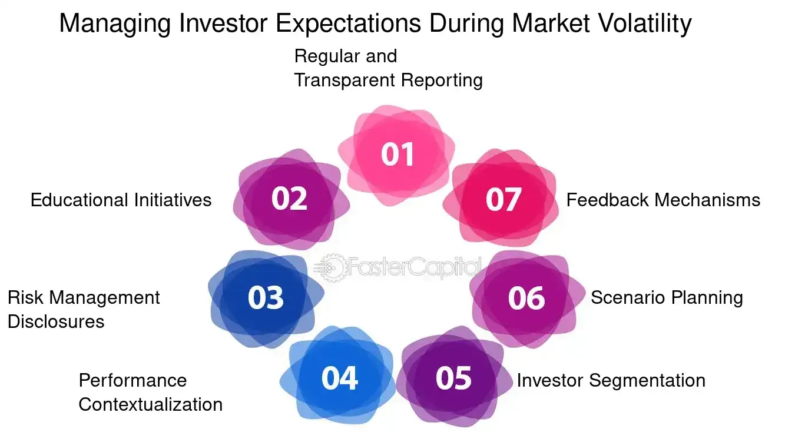

## Table of Contents

## What are the basic principles of investor relations in the context of a hedge fund?

Investor relations in a hedge fund involve communicating with investors to keep them informed about the fund's performance, strategies, and any other relevant information. The main goal is to build and maintain trust with investors, which is crucial for the fund's success. This involves being transparent about the fund's activities, providing regular updates, and being responsive to investor inquiries. By doing so, hedge funds can attract and retain investors, ensuring a stable source of capital.

Another key principle of investor relations in hedge funds is managing expectations. This means clearly explaining the fund's investment strategy, potential risks, and expected returns to investors. It's important to set realistic expectations and avoid overpromising, as this can lead to dissatisfaction and loss of trust. Regular communication helps in keeping investors aligned with the fund's goals and strategies, and it also provides an opportunity to address any concerns or questions they might have.

Overall, effective investor relations in a hedge fund require a combination of transparency, clear communication, and managing expectations. By focusing on these principles, hedge funds can foster strong relationships with their investors, which is essential for long-term success.

## How do you identify potential investors for an algorithmic hedge fund?

Identifying potential investors for an algorithmic [hedge fund](/wiki/hedge-fund-trading-strategies) starts with understanding who might be interested in this type of investment. These investors are often high-net-worth individuals, family offices, and institutional investors like pension funds or endowments. They are typically looking for sophisticated investment strategies that can offer higher returns, and they are comfortable with the risks associated with [algorithmic trading](/wiki/algorithmic-trading). To find these investors, you can attend industry conferences, use financial networks, and leverage existing relationships within the finance community.

Once you have a list of potential investors, the next step is to reach out to them. This can be done through targeted marketing campaigns, personalized emails, or direct meetings. It's important to clearly explain how your algorithmic hedge fund works, the potential benefits, and the risks involved. Providing case studies or performance data can help build trust and show the value of your fund. By focusing on the right audience and communicating effectively, you can attract investors who are a good fit for your algorithmic hedge fund.

## What information should be included in an investor relations presentation for an algorithmic hedge fund?

An investor relations presentation for an algorithmic hedge fund should start with a clear explanation of what the fund does. This means talking about how the fund uses computer algorithms to make trading decisions. It's important to explain the types of algorithms used, the markets the fund trades in, and the goals of the fund. You should also include some background information about the team behind the fund, like their experience and skills in algorithmic trading. This helps build trust with potential investors.

The presentation should also include details about the fund's performance. This means showing past returns, risk metrics, and how the fund has done compared to other investments. It's good to use charts and graphs to make this information easy to understand. Additionally, you should talk about the fees investors will pay, how often they can take their money out, and any other important rules. By covering these points clearly, you can help investors understand what they're getting into and why your algorithmic hedge fund is a good choice for them.

## How can transparency be maintained with investors in an algorithmic hedge fund?

Transparency in an algorithmic hedge fund can be maintained by regularly sharing detailed information with investors. This means giving them updates on how the fund is doing, what strategies are being used, and any changes in the way the fund operates. It's important to use clear and simple language so that everyone can understand, even if they're not experts in finance. Sending out monthly or quarterly reports, and having meetings where investors can ask questions, helps keep everyone in the loop.

Another way to keep things transparent is by being open about the risks involved. This means telling investors about any potential problems or challenges the fund might face. It's also good to explain how the algorithms work, without getting too technical, so investors feel they know what's going on behind the scenes. By being honest and open, investors will trust the fund more and feel confident in their investment.

## What are the key performance indicators (KPIs) that should be reported to investors?

When reporting to investors in an algorithmic hedge fund, it's important to focus on key performance indicators (KPIs) that show how well the fund is doing. The main KPIs to report are the fund's returns, which tell investors how much money the fund has made or lost over a certain time. Another important KPI is the risk-adjusted return, like the Sharpe Ratio, which shows how much return the fund is getting for the level of risk it's taking. It's also good to report on the fund's [volatility](/wiki/volatility-trading-strategies), which measures how much the fund's value goes up and down, and the drawdown, which shows the biggest drop in value the fund has experienced.

In addition to these financial KPIs, it's helpful to report on operational metrics like the fund's assets under management (AUM), which shows how much money investors have put into the fund. It's also important to share information about the fund's trading [volume](/wiki/volume-trading-strategy) and turnover rate, which tell investors how active the fund is in buying and selling assets. By regularly sharing these KPIs in a clear and simple way, investors can better understand the fund's performance and feel more confident in their investment.

## How do you handle investor queries and concerns effectively?

Handling investor queries and concerns effectively means listening carefully to what they're saying. When investors reach out with questions or worries, it's important to respond quickly and clearly. This shows that you value their input and are committed to keeping them informed. Whether they're asking about the fund's performance, the strategies being used, or any other topic, it's crucial to provide honest and straightforward answers. If you don't know the answer right away, it's okay to say so and promise to get back to them soon with the information they need.

It's also helpful to set up regular meetings or calls where investors can ask questions and share their concerns. This can be done through quarterly updates or special sessions where they can talk directly with the fund managers. By creating an open and welcoming environment, investors will feel more comfortable reaching out whenever they have something on their mind. Addressing their concerns promptly and thoroughly helps build trust and shows that the fund is dedicated to maintaining strong relationships with its investors.

## What role does technology play in managing investor relations for an algorithmic hedge fund?

Technology plays a big role in managing investor relations for an algorithmic hedge fund. It helps keep things organized and makes it easier to share information with investors. For example, using a special software can help send out regular reports and updates to everyone at the same time. This way, investors always know what's going on with their money. Technology also makes it easier to keep track of who the investors are and what they're interested in, so the fund can give them the right information at the right time.

Another way technology helps is by making communication better. With tools like video calls and online meetings, it's easier to talk to investors no matter where they are. This means the fund can have regular check-ins and answer questions quickly. Plus, technology can help create easy-to-understand charts and graphs that show how the fund is doing. By using technology well, the fund can keep investors happy and informed, which is really important for building trust and keeping them interested in the fund.

## How should risk management strategies be communicated to investors?

When talking to investors about risk management strategies, it's important to be clear and straightforward. Explain the different risks the fund might face, like market changes or problems with the algorithms. It's good to use simple examples to help them understand. For instance, you could say that if the stock market goes down a lot, the fund might lose money, but the strategies in place are there to help minimize those losses. Be open about how the fund plans to handle these risks, like by using stop-loss orders or diversifying investments. This way, investors will know what to expect and feel more confident in the fund's approach.

It's also important to keep investors updated on how these risk management strategies are working. Regular reports should include how well the strategies are doing in protecting the fund's value. If something changes, like a new risk comes up or a strategy needs to be adjusted, let investors know right away. This shows that the fund is always thinking about how to keep their money safe. By being honest and keeping them in the loop, investors will trust the fund more and understand that their investment is being looked after carefully.

## What are the best practices for conducting regular investor meetings and updates?

Regular investor meetings and updates are important for keeping everyone on the same page. It's best to have these meetings at set times, like every quarter, so investors know when to expect them. During these meetings, share clear and easy-to-understand information about how the fund is doing, what strategies are being used, and any changes that might affect their investment. It's also good to have a time for questions so investors can ask anything they're wondering about. By doing this regularly, investors will feel more connected to the fund and trust that their money is being looked after.

Using technology can make these meetings and updates easier and more effective. Tools like video calls and online platforms can help bring everyone together, no matter where they are. Sending out reports and updates through email or a special investor portal keeps everyone informed between meetings. It's important to keep the information simple and to the point, using charts and graphs to show the fund's performance. By staying organized and using the right tools, the fund can keep investors happy and engaged.

## How do you manage and report on the performance of algorithmic trading strategies to investors?

Managing and reporting on the performance of algorithmic trading strategies to investors starts with keeping track of key numbers. This means looking at things like how much money the fund has made or lost, how much risk it's taking, and how the strategies are working. It's important to use clear and simple charts and graphs to show these numbers so investors can easily understand them. By sending out regular reports, like every month or every three months, investors can see how their money is doing and feel more confident in the fund.

It's also helpful to explain any changes in the strategies or how the fund is doing compared to the market. This means telling investors about any new algorithms being used or if something isn't working as expected. Being honest and open about both the good and the bad helps build trust. If there's a special meeting or call, it's a good chance to go over the performance in more detail and answer any questions investors might have. By keeping the information simple and up-to-date, investors will feel more connected to the fund and know their investment is being looked after carefully.

## What compliance and regulatory considerations must be addressed in investor relations for an algorithmic hedge fund?

When running an algorithmic hedge fund, it's really important to follow all the rules and laws that apply. This means making sure the fund is registered with the right places, like the SEC in the United States, and following rules about how to talk to investors. The fund needs to be clear and honest about everything, including any risks involved and how their money is being used. If the fund doesn't follow these rules, it could get in big trouble, like getting fined or even having to close down.

Another big part of following the rules is keeping good records and being able to show that the fund is doing everything right. This means keeping track of all the trades the algorithms make and being able to explain them if someone asks. It's also important to make sure that the way the fund talks to investors, like in reports and meetings, follows all the rules about what can and can't be said. By being careful and following all the rules, the fund can keep investors happy and stay out of trouble with the people who make the rules.

## How can you leverage data analytics to improve investor relations and decision-making processes?

Using data analytics can really help make investor relations better and help with making decisions. By looking at data about how investors act and what they like, the fund can send them information that's just right for them. For example, if data shows that investors like to see certain types of charts or graphs, the fund can use those in their reports. This makes the information easier to understand and more useful for investors. Also, by looking at data about how well the fund is doing, the fund can see what's working and what's not. This helps them make better choices about how to manage the money and keep investors happy.

Data analytics can also help the fund see trends and patterns that might be hard to spot otherwise. By using special tools to look at big amounts of data, the fund can find out things like which strategies are making the most money or which investors might be thinking about taking their money out. This information can help the fund talk to investors in a way that makes them feel more confident and keeps them interested. By using data to make smart decisions and keep investors in the loop, the fund can build stronger relationships and do a better job of managing their money.

## How can we measure the success of investor relations efforts?

To evaluate the success of investor relations efforts in algorithmic hedge funds, identifying and tracking key performance indicators (KPIs) is essential. These KPIs provide measurable insights into how effectively a hedge fund communicates and engages with its investors.

### Key Performance Indicators (KPIs)

1. **Investor Retention Rate**: This measures the percentage of investors who remain with the fund over a specified period. A high retention rate suggests effective investor relations and satisfaction with fund communication and performance.

$$
\text{Investor Retention Rate} = \left( \frac{\text{Number of Retained Investors}}{\text{Total Number of Investors at the Start}} \right) \times 100
$$

2. **Net Promoter Score (NPS)**: This is a qualitative measure that assesses how likely investors are to recommend the fund to others. It gauges overall satisfaction and loyalty.

3. **Communication Frequency and Engagement**: Track the number of communications sent to investors and the engagement rate with these communications, such as the open and response rates of emails or participation in webinars and meetings.

4. **Investor Satisfaction Surveys**: Regular surveys can provide direct feedback on investors' perceptions of the fund’s communication and transparency. Scores from these surveys form an important part of the KPI set.

5. **Capital Inflows vs. Outflows**: Monitoring the flow of capital can indicate investor trust and the effectiveness of relationship-building efforts. A positive net capital inflow suggests confidence in the fund's strategies and management.

### Methods for Gathering Investor Feedback

1. **Periodic Surveys and Questionnaires**: Implement regular surveys to solicit investor opinions on specific aspects of fund management, strategy explanations, and technological advancements in communication.
   
2. **Feedback in Meetings**: Use personal meetings or virtual conferences to gather immediate feedback. This helps in creating a more personal bond and understanding investor concerns in real-time.

3. **Digital Feedback Tools**: Utilize platforms that allow investors to provide feedback at their convenience. Tools like online portals or dedicated apps can facilitate this process.

### Case Studies and Examples

A prominent example of successful investor relations in an algorithmic hedge fund is Two Sigma Investments. They have implemented a robust communication strategy that leverages data analytics to personalize interactions with investors. By providing detailed but clear insights into their algorithms' performance and risk management, they've built strong trust relationships with their investor base.

Another example is Renaissance Technologies, which excels in maintaining transparency about its quantitative strategies. This transparency, combined with consistent performance updates, has enabled them to sustain high levels of investor satisfaction and loyalty.

Incorporating these strategies and KPIs into investor relations not only enhances the investor experience but also provides actionable insights to further refine and improve communication strategies. By continuously measuring and adjusting based on feedback, algorithmic hedge funds can foster enduring trust and commitment from current and potential investors.

## References & Further Reading

[1]: Bergstra, J., Bardenet, R., Bengio, Y., & Kégl, B. (2011). ["Algorithms for Hyper-Parameter Optimization."](https://papers.nips.cc/paper_files/paper/2011/hash/86e8f7ab32cfd12577bc2619bc635690-Abstract.html) Advances in Neural Information Processing Systems 24.

[2]: ["Advances in Financial Machine Learning"](https://www.amazon.com/Advances-Financial-Machine-Learning-Marcos/dp/1119482089) by Marcos Lopez de Prado

[3]: ["Evidence-Based Technical Analysis: Applying the Scientific Method and Statistical Inference to Trading Signals"](https://www.wiley.com/en-gb/Evidence+Based+Technical+Analysis:+Applying+the+Scientific+Method+and+Statistical+Inference+to+Trading+Signals-p-9780470008744) by David Aronson

[4]: ["Machine Learning for Algorithmic Trading"](https://www.amazon.com/Machine-Learning-Algorithmic-Trading-intelligence/dp/9918608013) by Stefan Jansen

[5]: ["Quantitative Trading: How to Build Your Own Algorithmic Trading Business"](https://www.amazon.com/Quantitative-Trading-Build-Algorithmic-Business/dp/0470284889) by Ernest P. Chan