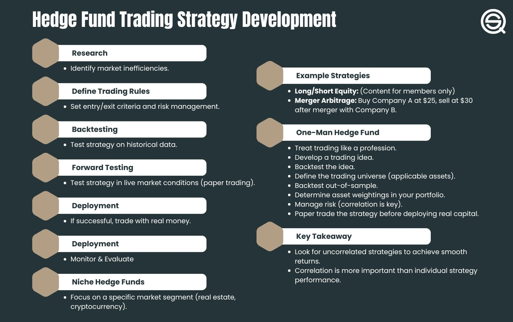

## Table of Contents

## What is a systematic trading hedge fund?

A systematic trading hedge fund is a type of investment fund that uses computer programs and mathematical models to make trading decisions. Instead of relying on human judgment, these funds use algorithms to analyze market data and execute trades automatically. This approach aims to remove emotional biases from trading and can handle large amounts of data quickly and consistently.

These funds often focus on various financial instruments like stocks, bonds, commodities, and currencies. They might use strategies like trend following, where they buy assets that are going up in value and sell those going down. The goal is to make profits by exploiting patterns and trends in the market. Systematic trading can be complex, but it's designed to be disciplined and repeatable, which can lead to more predictable results over time.

## Why is team composition important in a systematic trading hedge fund?

Team composition is very important in a systematic trading hedge fund because it brings together people with different skills and knowledge. In these funds, you need people who are good at math and programming to create and improve the trading algorithms. You also need people who understand the markets and can spot new trends or opportunities. When you have a team with a mix of these skills, they can work together to make the trading strategies better and more successful.

Having a good team also helps the fund manage risks better. People who are good at analyzing data can find problems in the trading models before they cause big losses. Team members who know a lot about finance can make sure the fund follows the rules and laws. When everyone works well together, they can keep the fund running smoothly and safely. This makes it more likely that the fund will make money for its investors.

## What are the key roles needed in a systematic trading hedge fund team?

In a systematic trading [hedge fund](/wiki/hedge-fund-trading-strategies), you need a few key roles to make sure everything runs well. First, you need quants, or quantitative analysts, who are good at math and programming. They build and improve the trading algorithms that the fund uses. These algorithms look at market data and decide when to buy or sell. Quants need to keep the algorithms working well and make them better over time.

Next, you need traders who understand the markets and can help find new trading opportunities. They work closely with the quants to make sure the trading strategies fit with what's happening in the markets. Traders also watch the trades to make sure they're going as planned. Besides traders, you also need risk managers. They look at the data to find any problems that could cause big losses. They help keep the fund safe by making sure the risks are under control.

Finally, you need people who know about finance and rules, like compliance officers. They make sure the fund follows all the laws and rules. They work to keep the fund out of trouble. Having a team with all these roles helps the fund work smoothly and make money for its investors.

## How do you identify the skills required for each role in the team?

To identify the skills needed for each role in a systematic trading hedge fund team, you start by looking at what each job needs to do. For quants, you need people who are good at math and programming. They need to know how to build and improve trading algorithms. They should be able to work with numbers and code well. They also need to understand how the markets work so they can make the algorithms better.

For traders, you need people who know a lot about the markets. They need to be able to spot new trends and opportunities. They should be good at working with the quants to make sure the trading strategies fit what's happening in the markets. They also need to be able to watch the trades and make sure everything is going as planned. 

Risk managers need to be good at looking at data to find problems that could cause big losses. They should know how to manage risks and keep the fund safe. Compliance officers need to know about finance and rules. They make sure the fund follows all the laws and stays out of trouble. By matching these skills to each role, you can build a team that works well together and helps the fund succeed.

## Where can you find potential candidates for a systematic trading hedge fund team?

Finding the right people for a systematic trading hedge fund team can be done in a few places. You can look at universities that have strong programs in math, finance, and computer science. These schools often have students and professors who are good at the skills you need. You can also go to job fairs and career events at these schools to meet potential candidates. Another place to look is on job websites and professional networking sites like LinkedIn. Many people with the right skills use these sites to find jobs and connect with employers.

Another good place to find candidates is through industry events and conferences. These events bring together people who work in finance and trading, so you can meet quants, traders, and risk managers in person. You can also look at specialized recruitment firms that focus on finding people for finance and trading jobs. These firms know a lot about the industry and can help you find the right people for your team. By using these different places, you can build a strong team for your systematic trading hedge fund.

## What qualifications should you look for in a quantitative analyst?

When looking for a quantitative analyst, or quant, for a systematic trading hedge fund, you should look for someone with a strong background in math and computer science. A degree in a field like mathematics, [statistics](/wiki/bayesian-statistics), or computer science is really important. They need to be good at programming languages like Python, R, or C++. They should also know about data analysis and [machine learning](/wiki/machine-learning), because these skills help them build and improve trading algorithms.

Besides the technical skills, a good quant should also understand how financial markets work. They don't need to be expert traders, but they should know the basics of finance and economics. This helps them make algorithms that work well in the real world. Good problem-solving skills and the ability to work in a team are also important. A quant who can explain complex ideas in a simple way will be a great fit for the team.

## How do you assess the experience of a potential portfolio manager?

To assess the experience of a potential portfolio manager, you need to look at their past work and achievements. Start by checking their resume to see how long they have been working in the field. Look for experience in managing investment portfolios, especially in systematic trading. It's important to see if they have worked in similar roles before, because that shows they know how to handle the job. Also, look for any specific successes they have had, like beating market returns or managing risk well. These details can tell you if they are good at their job.

You can also talk to them in an interview to learn more about their experience. Ask them to share examples of trades they have made and how those trades turned out. This will help you understand their decision-making process and how they handle different situations. It's also a good idea to ask for references from their past employers or colleagues. Talking to people they have worked with before can give you a clear picture of their skills and how well they work with others. By combining their resume, interview, and references, you can get a good idea of their experience and if they are the right fit for your team.

## What are the essential soft skills needed for team members in a systematic trading environment?

In a systematic trading environment, good communication is very important. Team members need to talk clearly with each other about their ideas and plans. This helps everyone understand what they are doing and why. It also helps to solve problems quickly. Being able to work well with others is also key. Team members should be able to share their thoughts and listen to others. This makes the team stronger and helps them work better together.

Another important soft skill is being able to adapt to changes. The markets can change fast, so team members need to be ready to adjust their plans. They should be open to new ideas and willing to learn new things. Being good at solving problems is also helpful. When something goes wrong, team members need to think of ways to fix it. These soft skills help the team work smoothly and succeed in a systematic trading hedge fund.

## How do you evaluate the cultural fit of a candidate within your hedge fund?

To evaluate the cultural fit of a candidate in a hedge fund, you need to see if they will work well with your team. Start by talking to them about what they value and how they like to work. Ask them about times when they worked in a team and what they learned from those experiences. This can help you understand if they share the same goals and values as your team. You can also have them meet with different team members to see how they get along. If everyone feels comfortable and excited about working with the candidate, that's a good sign they will fit in well.

Another way to check cultural fit is by looking at how the candidate handles feedback and criticism. In a hedge fund, people need to be open to new ideas and willing to change their plans. Ask the candidate about a time when they got feedback and what they did with it. If they show they can listen and learn from others, they are likely to fit well in your team. By combining these talks and meetings, you can get a good idea if the candidate will be happy and successful in your hedge fund's culture.

## What strategies can be used to assemble and integrate a diverse team?

To build a diverse team, start by looking in different places for people. Go to job fairs at colleges, use websites like LinkedIn, and work with groups that help people from different backgrounds find jobs. When you write job ads, use words that show you want people from all kinds of backgrounds. Make sure your team has people of different ages, races, genders, and experiences. This mix of people can bring new ideas and help your team do better.

Once you have a diverse team, help them work well together by making a place where everyone feels welcome. Have team meetings where people can share their thoughts and learn about each other. Set up training sessions to teach everyone about different cultures and how to work together. Make sure everyone knows that their ideas are important, no matter where they come from. By doing these things, you can make sure your diverse team works well and everyone feels happy and included.

## How do you structure the team to maximize efficiency and performance?

To make your team work well, start by giving each person a clear job that matches their skills. For example, put the quants in charge of building and improving the trading algorithms. Let the traders focus on finding new opportunities and watching the trades. Have risk managers look at data to find problems and keep the fund safe. Make sure everyone knows what they need to do and how their work helps the team. This way, everyone can do their best work without getting in each other's way.

To keep the team working smoothly, set up good ways for everyone to talk and share ideas. Have regular meetings where people can talk about what they are doing and any problems they see. Use tools like emails or chat apps to keep everyone connected. Make sure everyone feels like they can speak up and share their thoughts. When people work well together and feel like they are part of the team, they will do their best work. This helps the whole team be more efficient and perform better.

## What ongoing training and development programs should be implemented to keep the team at the cutting edge of systematic trading?

To keep the team at the cutting edge of systematic trading, it's important to have regular training sessions. These sessions should focus on new technologies and methods in trading. For example, you can bring in experts to teach the team about the latest in machine learning or data analysis. You can also send team members to conferences and workshops where they can learn from others in the field. By doing this, everyone stays up-to-date and can use new tools to make the trading strategies better.

Another key part of keeping the team sharp is to encourage them to keep learning on their own. Give them time during work to read about new ideas and try out new things. You can also set up a system where team members can share what they learn with each other. This way, everyone can benefit from what one person learns. By making learning a big part of the job, the team will always be ready to use the newest and best ways to trade.

## References & Further Reading

[1]: Bergstra, J., Bardenet, R., Bengio, Y., & Kégl, B. (2011). ["Algorithms for Hyper-Parameter Optimization."](https://papers.nips.cc/paper_files/paper/2011/hash/86e8f7ab32cfd12577bc2619bc635690-Abstract.html) Advances in Neural Information Processing Systems 24.

[2]: ["Advances in Financial Machine Learning"](https://www.amazon.com/Advances-Financial-Machine-Learning-Marcos/dp/1119482089) by Marcos Lopez de Prado

[3]: ["Evidence-Based Technical Analysis: Applying the Scientific Method and Statistical Inference to Trading Signals"](https://www.wiley.com/en-gb/Evidence+Based+Technical+Analysis:+Applying+the+Scientific+Method+and+Statistical+Inference+to+Trading+Signals-p-9780470008744) by David Aronson

[4]: ["Machine Learning for Algorithmic Trading"](https://www.amazon.com/Machine-Learning-Algorithmic-Trading-intelligence/dp/9918608013) by Stefan Jansen

[5]: ["Quantitative Trading: How to Build Your Own Algorithmic Trading Business"](https://www.amazon.com/Quantitative-Trading-Build-Algorithmic-Business/dp/0470284889) by Ernest P. Chan