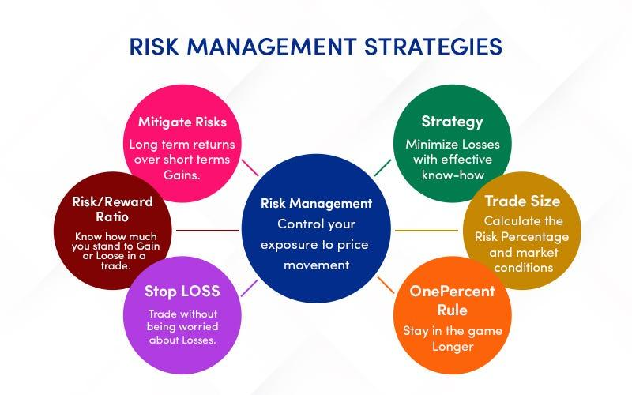

## Table of Contents

## What is risk management in the context of trading strategies?

Risk management in trading strategies is about protecting your money while trying to make more. It's like having a safety net when you're doing something risky. Traders use different ways to manage risk, like setting limits on how much they can lose on a single trade or spreading their money across different investments. This helps them avoid losing everything if one investment goes bad.

One common way to manage risk is by using stop-loss orders. This means setting a point where you'll automatically sell an investment if its price drops too much. It's like saying, "I'll sell if it goes down to this price, so I don't lose too much." Another way is diversification, which means not putting all your money into one type of investment. If you spread your money around, you're less likely to lose everything if one investment fails.

## Why is it important to manage risk when implementing a new trading strategy?

Managing risk is super important when you start using a new trading strategy because it helps protect your money. When you try something new, you don't know for sure if it will work. If you don't manage risk, you could lose a lot of money quickly. By setting rules like stop-loss orders, you can limit how much you might lose on any single trade. This way, even if the new strategy doesn't work out, you won't lose everything.

Also, managing risk helps you stay calm and make better decisions. Trading can be stressful, especially when you're trying something new. If you know you have a safety net in place, you won't panic as much if things start going wrong. This can help you stick with your plan and not make hasty decisions based on fear. In the end, good risk management can make the difference between a small setback and a big loss.

## What are the basic steps to assess risk before deploying a new trading strategy?

Before you start using a new trading strategy, it's important to figure out how much risk you're taking on. Start by looking at how much money you could lose if things go wrong. Think about the worst-case scenario and decide if you're okay with losing that much. You can do this by testing your strategy with pretend money first, which is called [backtesting](/wiki/backtesting). This helps you see how your strategy might have worked in the past and gives you an idea of what could happen in the future.

Next, think about how you'll spread your money around. Don't put all your eggs in one basket. If you're trying a new strategy, maybe only use a small part of your money for it. This way, if it doesn't work out, you won't lose everything. Also, consider using stop-loss orders to limit your losses. These are like automatic safety switches that sell your investment if it drops too much. By taking these steps, you can get a better handle on the risks and feel more confident about trying out your new trading strategy.

## How can historical data be used to evaluate the risk of a new trading strategy?

Historical data is super helpful for figuring out how risky a new trading strategy might be. You can use past information to see how your strategy would have done in different times. This is called backtesting. By looking at old data, you can spot times when your strategy would have lost money and how much it could have lost. This helps you understand the worst-case scenarios and decide if you're okay with those risks. It's like practicing with pretend money before using real money.

Another way to use historical data is to look at how often your strategy would have made money versus lost money. This can tell you how reliable your strategy might be. If it worked well in the past, it might work well in the future, but remember, past results don't guarantee future success. By studying historical data, you can also see if there are certain times or conditions when your strategy does better or worse. This can help you tweak your strategy to make it safer and more effective.

## What common risk metrics should be considered when analyzing a new trading strategy?

When you're looking at a new trading strategy, you should pay attention to a few common risk metrics. One important one is the maximum drawdown, which is the biggest loss you could have seen at any point if you used this strategy in the past. It helps you understand the worst-case scenario and see if you're okay with losing that much money. Another metric to consider is the Sharpe ratio, which tells you how much return you're getting for the risk you're taking. A higher Sharpe ratio means you're getting more reward for the risk, which is good.

Another useful metric is the Sortino ratio, which is similar to the Sharpe ratio but focuses only on the bad risk, or downside risk. This can be helpful because it shows how well your strategy handles losses. You should also look at the [volatility](/wiki/volatility-trading-strategies) of your strategy, which is how much the returns can swing up and down. High volatility means bigger swings, which can be riskier. By considering these metrics, you can get a better picture of how risky your new trading strategy might be and decide if it's right for you.

## How can you use stop-loss orders to manage risk in a new trading strategy?

Stop-loss orders are a great way to manage risk when you're trying out a new trading strategy. They work by setting a specific price at which you'll automatically sell your investment if it drops to that level. This means you can decide ahead of time how much you're willing to lose on a trade. For example, if you buy a stock at $50 and set a stop-loss at $45, the stock will be sold if it hits $45, limiting your loss to $5 per share. This helps you stick to your plan and not let emotions take over if the market goes against you.

Using stop-loss orders can also help you test your new strategy with real money without risking too much. By setting these orders, you can try different trades and see how they work out, knowing that your potential losses are capped. This way, you can learn from your trades and adjust your strategy without losing your shirt. It's like having a safety net that lets you experiment and grow as a trader without putting all your money on the line.

## What role does diversification play in managing risk for a new trading strategy?

Diversification is a key part of managing risk when you're trying out a new trading strategy. It means spreading your money across different types of investments instead of putting it all into one thing. This way, if one investment goes bad, you won't lose everything. For example, if you're testing a new strategy with stocks, you might also invest in bonds or commodities. This helps balance out your risk because different investments can react differently to market changes.

By diversifying, you're less likely to be hit hard by a single bad trade. It's like not putting all your eggs in one basket. If you're trying a new strategy, you might use only a small part of your money for it and keep the rest in safer, more stable investments. This way, even if your new strategy doesn't work out, you still have other investments that can help cushion the blow. Diversification doesn't guarantee you won't lose money, but it can help you manage risk better and give you peace of mind while you're testing something new.

## How can position sizing help in controlling risk when implementing a new trading strategy?

Position sizing is a way to control how much risk you take when you start using a new trading strategy. It means deciding how much of your money to put into each trade. If you're trying something new, you might want to use only a small part of your money for it. This way, if the trade goes wrong, you won't lose a lot. For example, instead of using all your money on one trade, you might use just 1% or 2%. This helps you keep your losses small and gives you more chances to try different trades.

By using position sizing, you can also learn from your trades without risking too much. If you keep your position sizes small, you can test your new strategy over many trades. This helps you see how it works in different situations and lets you adjust it without losing a big chunk of your money. Position sizing is like having a safety net that lets you experiment and grow as a trader without putting all your money on the line.

## What advanced techniques can be used to simulate and forecast potential risks of a new trading strategy?

One advanced technique to simulate and forecast potential risks of a new trading strategy is using Monte Carlo simulations. This method runs your strategy through many different possible future scenarios, kind of like playing out thousands of different "what if" situations. By doing this, you can see how your strategy might perform under all sorts of conditions, not just the ones you've seen in the past. It helps you understand how likely it is that you'll hit big wins or big losses, giving you a better idea of the risks involved.

Another technique is stress testing, where you put your strategy through extreme market conditions that have happened before or could happen in the future. For example, you might test how your strategy would have done during a big market crash like in 2008. This helps you see how well your strategy can handle tough times and what the worst-case scenarios might look like. By using these advanced techniques, you can get a clearer picture of the risks and make smarter decisions about whether to go ahead with your new trading strategy.

## How can real-time monitoring and adjustments be utilized to manage ongoing risks?

Real-time monitoring is like keeping an eye on your trading strategy as it happens. It lets you see how your trades are doing right now, not just in the past. By watching your trades closely, you can spot problems quickly. If you see a trade going bad, you can take action right away, like selling it before you lose too much money. This helps you manage risks as they come up, instead of waiting until it's too late.

Making adjustments on the fly is also important for managing ongoing risks. If the market changes or something unexpected happens, you might need to change your strategy. For example, if a stock you're trading suddenly drops a lot, you might decide to set a tighter stop-loss order to protect your money. By being ready to tweak your strategy as things happen, you can keep your risks under control and make the most of your trades.

## What are the regulatory and compliance considerations in risk management for trading strategies?

When you're managing risk with trading strategies, you need to think about the rules set by regulators. These rules are there to make sure trading is fair and safe for everyone. Different countries have different rules, but they usually want you to be clear about what you're doing and not take too much risk. For example, if you're trading in the U.S., the Securities and Exchange Commission (SEC) might have rules about how much you can borrow to trade or how you need to report your trades. Following these rules helps you stay out of trouble and keeps your trading safe.

Another important part of risk management is compliance. This means making sure you follow all the rules and guidelines that apply to your trading. Compliance can include things like keeping good records of your trades, making sure you're not trading with inside information, and following rules about how much risk you can take. If you don't follow these rules, you could get into big trouble, like fines or even losing the right to trade. So, it's important to always keep compliance in mind when you're managing risk with your trading strategies.

## How can machine learning and AI be integrated into risk management processes for trading strategies?

Machine learning and AI can help with risk management in trading by looking at lots of data and finding patterns that people might miss. These tools can learn from past trades and predict how a new trading strategy might work. For example, they can use past market data to guess how likely it is that a trade will go well or badly. This helps traders set better stop-loss orders and decide how much money to put into each trade. By using AI, traders can make smarter choices and manage their risks better.

AI can also keep an eye on the market all the time and make quick changes to trading strategies if needed. If something unexpected happens, like a big drop in the market, AI can spot it right away and adjust the strategy to protect the trader's money. This real-time monitoring and adjustment can help traders react faster than they could on their own. Overall, using [machine learning](/wiki/machine-learning) and AI in risk management can make trading safer and more successful by helping traders understand and control their risks better.

## References & Further Reading

[1]: Bergstra, J., Bardenet, R., Bengio, Y., & Kégl, B. (2011). ["Algorithms for Hyper-Parameter Optimization."](https://papers.nips.cc/paper_files/paper/2011/hash/86e8f7ab32cfd12577bc2619bc635690-Abstract.html) Advances in Neural Information Processing Systems 24.

[2]: ["Advances in Financial Machine Learning"](https://www.amazon.com/Advances-Financial-Machine-Learning-Marcos/dp/1119482089) by Marcos Lopez de Prado

[3]: ["Evidence-Based Technical Analysis: Applying the Scientific Method and Statistical Inference to Trading Signals"](https://www.wiley.com/en-gb/Evidence+Based+Technical+Analysis:+Applying+the+Scientific+Method+and+Statistical+Inference+to+Trading+Signals-p-9780470008744) by David Aronson

[4]: ["Machine Learning for Algorithmic Trading"](https://www.amazon.com/Machine-Learning-Algorithmic-Trading-intelligence/dp/9918608013) by Stefan Jansen

[5]: ["Quantitative Trading: How to Build Your Own Algorithmic Trading Business"](https://www.amazon.com/Quantitative-Trading-Build-Algorithmic-Business/dp/0470284889) by Ernest P. Chan