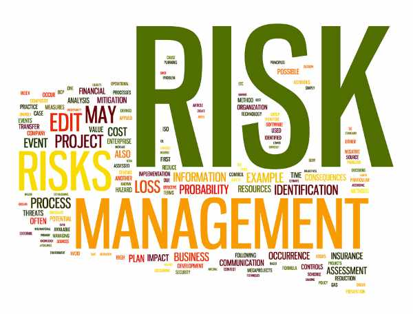

Quantitative trading is a systematic approach to trading that utilizes mathematical models and algorithms to execute trades and generate profits. By relying on quantitative analysis, traders can process vast amounts of historical and real-time data to identify patterns and forecast future price movements. This method has gained prominence in financial markets due to its ability to make data-driven decisions, reduce human biases, and operate at high speeds, which is critical in an increasingly automated trading environment.



Risk management in quantitative trading refers to the process of identifying, assessing, and mitigating financial uncertainties to minimize potential losses and enhance the consistency of returns. In the context of quantitative trading, it involves the use of statistical and mathematical models to evaluate risks associated with trading strategies. Effective risk management is crucial because even the most promising quantitative models can be adversely affected by unpredictable market conditions or model-specific risks, such as overfitting.

The importance of effective risk management cannot be overstated in quantitative trading. An efficient risk management strategy offers several benefits, including the safeguarding of capital, optimization of the risk-reward ratio, and enhancement of long-term viability of trading strategies. By quantifying risks, traders can make more informed decisions, allowing them to allocate capital more efficiently and adjust their strategies in response to evolving market conditions. As a result, incorporating robust risk management practices is indispensable for traders aiming to achieve sustainable success in the highly dynamic world of financial markets.


## Table of Contents

## Understanding Risk in Quantitative Trading

Quantitative trading operates at the intersection of data science, [statistics](/wiki/bayesian-statistics), and financial markets, leveraging mathematical models and algorithms to identify trading opportunities. However, despite its sophisticated approach, it is not immune to the multifaceted risks inherent in financial markets. Understanding these risks is crucial for the sustainability and performance of [quantitative trading](/wiki/quantitative-trading) strategies. This section explores the primary types of risks—market risk, credit risk, and operational risk—and underscores the necessity of quantifying these risks to guide informed decision-making.

Market risk is one of the most prominent risks in quantitative trading. It derives from adverse price movements in financial instruments and affects portfolios exposed to equity, [interest rate](/wiki/interest-rate-trading-strategies), commodity, or currency fluctuations. Traders can experience market risk as systematic (non-diversifiable) or unsystematic (diversifiable) risk. Quantitative strategies attempt to forecast price movements, seeking to outpace market dynamics and mitigate potential losses. However, unpredictable events such as geopolitical tensions or economic shifts can lead to significant deviations from expected outcomes, impacting performance.

Credit risk involves the possibility of a counterparty defaulting on financial obligations, compromising the settlement of trades or the repayment of borrowed amounts. In quantitative trading, this risk is especially pertinent in derivative contracts, where the failure of a counterparty can have cascading effects. Instruments like credit default swaps (CDSs) are used to hedge against such risks, but they themselves can introduce additional layers of compl[exit](/wiki/exit-strategy)y and financial exposure.

Operational risk stems from failures in internal processes, systems, or external events that disrupt trading activities. In algorithmic and quantitative trading, even minor glitches or outages in trading infrastructure can lead to substantial financial losses or missed trading opportunities. Cybersecurity threats, human errors, and regulatory compliance issues also contribute to operational risk [factor](/wiki/factor-investing)s, challenging traders to maintain robust technological and procedural defenses.

The role of risk in shaping quantitative trading strategies cannot be overstated. Effective risk management processes ensure that strategies not only aim for high returns but also maintain long-term viability. A neglected risk factor may lead to strategies that perform well in backtests but fail under real-world conditions, where market dynamics can evolve rapidly.

Quantifying risk is a fundamental step in constructing resilient trading strategies. Metrics like Value at Risk (VaR), expected shortfall, and stress testing enable traders to estimate potential losses under various market scenarios. For instance, VaR provides a probabilistic measure of the maximum expected loss over a given time horizon at a specified confidence level. Such quantification allows traders to adjust their positions, set stop-loss limits, and allocate capital more judiciously. 

Here's a simple Python snippet illustrating the calculation of a basic VaR for a portfolio using historical simulation:

```python
import numpy as np

def calculate_var(returns, confidence_level=0.95):
    # Sort the historical returns
    sorted_returns = np.sort(returns)
    
    # Determine the index for the VaR threshold
    var_index = int((1 - confidence_level) * len(sorted_returns))
    
    # VaR is the return at this index
    var = -sorted_returns[var_index]
    return var

# Example usage
historical_returns = np.array([-0.02, -0.01, 0.0, 0.01, 0.03, -0.013])
var_95 = calculate_var(historical_returns, confidence_level=0.95)
print(f"Value at Risk (95% confidence level): {var_95}")
```

This code calculates the Value at Risk at a 95% confidence level using historical return data to gauge potential losses. Such calculations are integral in aligning trading strategies with an entity's risk appetite and tolerance.

In conclusion, understanding and managing risk in quantitative trading is essential to achieve sustained success. By acknowledging market, credit, and operational risks, traders can better design, execute, and adjust their strategies to navigate the complex landscape of modern financial markets. Quantitative methods provide a robust toolkit for estimating, monitoring, and mitigating these risks, thereby supporting informed trading decisions and enhancing portfolio resilience.


## Quantitative Models for Risk Management

Quantitative models play a crucial role in identifying and assessing risk in quantitative trading by providing a structured framework to understand potential losses. These models help traders gauge the exposure to various risk factors and develop strategies to mitigate their effects. Here's a closer look at some of the most widely-used quantitative models in risk management.

### Value at Risk (VaR)
Value at Risk is a statistical technique used to quantify the level of financial risk within a portfolio. VaR estimates the maximum potential loss over a specified time frame at a given confidence level. For example, a 1-day VaR of $1 million at a 95% confidence level suggests that there is a 95% chance the portfolio will not lose more than $1 million in a single day.

Mathematically, VaR is often calculated using historical data and can be expressed as:

$$
\text{VaR}_{\alpha} = -(\mu + \sigma \cdot z_{\alpha})
$$

where $\mu$ is the mean return, $\sigma$ is the standard deviation of returns, and $z_{\alpha}$ is the z-score corresponding to the confidence level $\alpha$.

VaR is widely used by financial institutions to estimate the daily loss potential and helps in setting risk limits and capital reserves.

### Stress Testing
Stress testing assesses the resilience of a portfolio under extreme market conditions by simulating various adverse scenarios. Unlike VaR, which assumes normal market conditions, stress testing explores "what-if" scenarios, such as economic crises or market crashes, to understand their potential impact.

This method involves creating hypothetical scenarios that are relevant to the current market environment and testing how portfolios would react. Stress testing ensures that traders are prepared for worst-case scenarios and can adjust their strategies to minimize negative impacts.

### Monte Carlo Simulations
Monte Carlo simulations are used to model the probability of different outcomes in processes that are uncertain. This technique uses computational algorithms to simulate a wide range of possible outcomes for a portfolio by inputting various random variables.

The process involves:
1. Generating random variables for underlying risk factors.
2. Simulating returns based on these variables over many trials.
3. Aggregating the results to understand the distribution of potential outcomes.

Monte Carlo simulations provide a dynamic way of understanding risk by considering thousands of possible scenarios, thus allowing traders to see the range of potential future states of their portfolios.

### Predicting Losses and Mitigation Strategies
These models contribute significantly to predicting potential losses and developing mitigation strategies. By quantifying the potential risks, traders can allocate capital more efficiently, set appropriate risk limits, and decide on hedging strategies conforming to their risk tolerance. For example, VaR can be used to determine the amount of capital necessary to cover potential losses, while stress testing can guide adjustments in asset allocation during turbulent times.

In conclusion, the application of quantitative models like VaR, stress testing, and Monte Carlo simulations is critical for effective risk management in quantitative trading. These models provide insights that help traders make informed decisions to safeguard their portfolios against diverse market risks.


## Developing a Risk Management Framework

Creating a robust risk management framework for quantitative trading is essential for mitigating potential losses and ensuring the sustainability of trading strategies. Here are the key steps involved in developing such a framework:

### Step 1: Risk Identification and Assessment
The first step in developing a risk management framework is identifying all possible risks associated with the trading strategies being employed. This includes market risk, credit risk, operational risk, and [liquidity](/wiki/liquidity-risk-premium) risk, among others. Once identified, these risks need to be assessed for their potential impact. Quantitative models and historical data analysis can help in assessing these risks by providing insights into potential [volatility](/wiki/volatility-trading-strategies), drawdowns, and correlations.

### Step 2: Define Risk Appetite and Tolerance
Before deploying any trading strategy, it is crucial to define the risk appetite and risk tolerance levels. Risk appetite refers to the amount of risk an institution is willing to take, whereas risk tolerance defines the allowable deviation in performance. Establishing these parameters helps in aligning the trading strategies with the institution's broader financial goals.

### Step 3: Develop Risk Mitigation Strategies
Develop risk mitigation strategies that are aligned with the identified risks and defined risk appetite. This might include diversification of the asset portfolio, implementing hedging strategies, or setting stop-loss limits. For instance, using a correlation matrix can help in selecting uncorrelated assets to diversify portfolio risk.

### Step 4: Integration with Trading Platforms and Strategies
Integrate the risk management framework with existing trading platforms and strategies. This involves embedding risk management protocols into the [algorithmic trading](/wiki/algorithmic-trading) systems. Real-time data feeds and automated trading systems can be utilized to enhance this integration, ensuring immediate response to market changes.

### Step 5: Continuous Monitoring and Reporting
Continuous monitoring is essential to identify changes in risk factors and ensure that the deployed strategies remain within the predefined risk parameters. This involves regular updates to risk models and frequent [backtesting](/wiki/backtesting) of strategies against historical and simulated data. Advanced tools and software solutions that offer real-time monitoring and reporting capabilities are increasingly vital.

### Step 6: Update and Improve Framework
A risk management framework should not be static. Regular updates and improvements are imperative as market conditions evolve and new risks emerge. Using machine l[earning](/wiki/earning-announcement) models can provide ongoing insights by detecting patterns and predicting potential adverse movements, thus allowing for timely adjustments to strategies.

To illustrate the integration of this framework, consider the use of Python for backtesting and stress testing trading strategies. Libraries such as pandas and NumPy can be utilized for data manipulation and computation. Here is a simple example in Python to calculate the Value at Risk (VaR):

```python
import numpy as np

# Assuming returns is a numpy array of historical returns
def calculate_var(returns, confidence_level=0.95):
    var = np.percentile(returns, (1 - confidence_level) * 100)
    return var

# Example usage
historical_returns = np.random.normal(0, 0.1, 1000)  # Simulated returns
var_95 = calculate_var(historical_returns, 0.95)
print(f'95% Value at Risk: {var_95}')
```

By following these steps, quantitative traders can ensure that their risk management framework not only protects against potential losses but also adapts to changing market conditions, thereby supporting long-term trading success.


## Risk Management Strategies

Quantitative trading relies on sophisticated algorithms and large datasets to make investment decisions. However, inherent risks necessitate the implementation of various risk management strategies to protect investments and ensure sustainable returns. Here, we discuss several key strategies: diversification, hedging, and stop-loss orders.

### Diversification

Diversification is a fundamental risk management strategy that involves spreading investments across different assets, sectors, or even geographical regions to reduce exposure to any single risk factor. The idea is that by owning a diverse portfolio, poor performance in one area will be offset by better performance in another, thereby minimizing the overall risk.

**Effectiveness**: Diversification can significantly reduce unsystematic risk (the risk associated with individual assets). It has been mathematically demonstrated through the Capital Asset Pricing Model (CAPM) that a well-diversified portfolio has lower volatility.

**Limitations**: While diversification mitigates unsystematic risk, it does not eliminate systematic risk, which is inherent to the entire market. It might also dilute potential gains, as highly profitable positions might be moderated by this approach.

### Hedging

Hedging involves taking an offsetting position in a related security to reduce potential losses. Common hedging instruments include options and futures. For example, a trader might buy put options to guard against potential declines in the stock market.

**Effectiveness**: Hedging can effectively reduce or eliminate the risk associated with price movements. For quantitative traders, the precise use of financial derivatives allows for targeted risk mitigation.

**Limitations**: Hedging can be costly. Transaction fees and bid-ask spreads can erode profits, and the strategy requires a certain level of expertise. Moreover, if the hedge is not perfectly aligned with the asset, it may not fully protect against adverse price movements.

### Stop-Loss Orders

Stop-loss orders are designed to limit potential losses in a trading position. By setting a predetermined price at which a security will be sold, traders can exit a position before further losses occur.

**Effectiveness**: Stop-loss orders help in automating exit strategies, thus preventing emotional decision-making and ensuring that losses do not accumulate beyond an acceptable level.

**Limitations**: Market volatility may cause temporary price swings that trigger stop-loss orders, potentially locking in losses even when the market subsequently recovers. Furthermore, stop-loss orders do not protect against overnight risks if a stock gaps down at the open.

### Tailoring Strategies to Goals and Tolerance

Risk management strategies must be aligned with specific trading goals and the risk tolerance of the trader or institution. A strategy that works well for one portfolio may not be suitable for another, depending on various factors like investment horizon, capital size, and market conditions. For instance, a high-frequency trading firm might prioritize real-time risk controls, while a long-term investor may focus more on strategic diversification.

In sum, effective risk management in quantitative trading requires a tailored approach. By understanding the strengths and limitations of diversified portfolios, hedging practices, and stop-loss mechanisms, traders can better align their risk management strategies with their trading objectives and risk tolerance levels, ultimately enhancing the sustainability of their trading endeavors.


## Automation and Technology in Risk Management

Automation and technology have significantly transformed risk management practices in quantitative trading, enhancing speed, accuracy, and predictive capabilities. These advancements have ushered in an era where real-time risk monitoring and decision-making are not only possible but increasingly sophisticated.

Modern tools and software now enable traders to monitor risks in real-time, significantly reducing the lag between risk identification and response. Platforms equipped with advanced analytics and visualization capabilities allow for comprehensive assessments of potential risk factors as they evolve. For instance, risk management systems integrated with trading platforms can automatically adjust trading strategies based on shifting market conditions. This seamless integration is crucial for mitigating potential losses in volatile markets.

The advent of big data has further revolutionized risk management by offering a wealth of information that can be leveraged to predict and manage risk more effectively. By analyzing large datasets, traders can identify patterns and correlations that were previously undetectable, leading to more informed decision-making. Machine learning algorithms play a pivotal role in this process by analyzing historical data to forecast future risks. These algorithms can continuously learn and adapt to new data, making them ideal for handling the dynamic nature of financial markets.

For example, consider a [machine learning](/wiki/machine-learning) model that predicts market volatility. By training on historical market data, the model can learn complex relationships and patterns, which can then be used to predict future volatility levels. This allows traders to adjust their strategies proactively, potentially mitigating losses and optimizing returns.

In practice, a simple Python implementation using libraries like `pandas` and `scikit-learn` may look like this:

```python
import pandas as pd
from sklearn.model_selection import train_test_split
from sklearn.ensemble import RandomForestRegressor

# Load your market data
data = pd.read_csv('market_data.csv')

# Feature selection
features = data[['feature1', 'feature2', 'feature3']]
target = data['volatility']

# Splitting the data
X_train, X_test, y_train, y_test = train_test_split(features, target, test_size=0.2, random_state=42)

# Fit the model
model = RandomForestRegressor()
model.fit(X_train, y_train)

# Predict
predictions = model.predict(X_test)
```

Such models, particularly those using sophisticated algorithms like [neural network](/wiki/neural-network)s and ensemble methods, can handle vast amounts of data and provide predictions with remarkable accuracy.

Furthermore, automation tools allow for the implementation of predefined risk management strategies across an entire trading portfolio. This capability ensures consistency in response and frees analysts from routine monitoring tasks, allowing them to focus on strategic decisions.

In conclusion, the integration of automation, big data, and machine learning has fundamentally strengthened risk management in quantitative trading. By providing tools that predict, assess, and manage risks proactively and accurately, these technologies enable traders to navigate complex markets with improved confidence and efficiency.


## Challenges and Best Practices in Risk Management

Quantitative traders often face multiple challenges when managing risk, which can significantly impact the effectiveness of their trading strategies. One common challenge is the dynamic nature of financial markets, where price movements and volatility can change rapidly, making it difficult to predict outcomes accurately. Market conditions can evolve unpredictably, influenced by geopolitical events, policy changes, or economic data releases, leading to sudden shifts in asset prices. This unpredictability necessitates a robust and flexible risk management system that can adapt to changing conditions swiftly.

Another challenge is the inadvertent correlation between various assets or strategies. In periods of market stress, correlations between different asset classes often increase, which can lead to simultaneous losses across what were considered diversified portfolios. Quantitative traders must contend with the difficulty of accurately modeling and anticipating these correlations, especially during market downturns. 

Operational risk is also a significant challenge, encompassing risks from system failures, human errors, or mismanagement of trading algorithms. Since quantitative trading is heavily reliant on technology and automated systems, any disruption can lead to significant financial losses. Effective risk management must therefore include contingency plans for operational failures, ensuring systems are resilient and can recover swiftly from any disruptions.

To overcome these challenges, traders can adopt several best practices. Diversification remains a fundamental strategy, spreading investments across various assets to reduce unsystematic risk. Additionally, implementing rigorous backtesting and stress testing can help identify potential weaknesses in trading strategies before they are deployed in live markets. These tests should be comprehensive, considering extreme but plausible scenarios to evaluate how strategies perform under different market conditions.

Continuous monitoring and updating of models and data inputs are crucial for effective risk management. Traders should employ real-time data analytics to gain insights into market conditions as they evolve, helping them adjust their strategies accordingly. This practice is enhanced by integrating big data analytics and machine learning, which can uncover patterns and correlations that human analysts might miss, offering a more nuanced understanding of market dynamics.

Regulatory compliance and ethical considerations are critical in managing risk. Quantitative traders must adhere to financial regulations designed to protect market integrity and investor interests. Compliance ensures that trading activities are transparent and fair, reducing the risk of legal repercussions. Ethical considerations also play a role, as traders should avoid strategies that could manipulate or distort market prices.

In conclusion, while managing risk in quantitative trading poses several challenges, adopting best practices such as diversification, continuous monitoring, and rigorous testing can significantly enhance risk management efforts. Moreover, ensuring regulatory compliance and ethical behavior supports sustainable and responsible trading practices. As financial markets continue to evolve, adapting risk management strategies remains essential for maintaining long-term viability and success in quantitative trading.


## Conclusion

Quantitative trading relies heavily on effective risk management to secure trading success and sustainability. The multifaceted nature of risks—ranging from market to operational—necessitates robust risk modeling and management strategies that are continually refined and adapted. Quantitative models stand as foundational tools in this domain, enabling traders to identify, assess, and predict potential losses. Models such as Value at Risk (VaR), stress testing, and Monte Carlo simulations provide a framework for understanding both the current risk landscape and future uncertainties, supporting traders in formulating sound mitigation strategies.

Automation and technological advancements play a crucial role in modernizing risk management practices by offering real-time monitoring capabilities and enhanced decision-making tools. Leveraging big data and machine learning algorithms further augments the ability to anticipate and manage risks swiftly and accurately.

The fast-evolving financial markets underscore the necessity for traders and financial institutions to perpetually evolve their risk management frameworks. Addressing challenges such as regulatory compliance and integrating ethical considerations reinforces the integrity and resilience of trading strategies.

In conclusion, effective risk management is non-negotiable for achieving long-term trading viability. It protects assets, regulates exposure to potential losses, and ultimately fosters a stable trading environment. Traders and financial institutions are encouraged to remain proactive, continuously adapting their risk management strategies to maintain a competitive edge and ensure enduring success in the financial markets.


## References & Further Reading

[1]: Bergstra, J., Bardenet, R., Bengio, Y., & Kégl, B. (2011). ["Algorithms for Hyper-Parameter Optimization."](https://papers.nips.cc/paper_files/paper/2011/hash/86e8f7ab32cfd12577bc2619bc635690-Abstract.html) Advances in Neural Information Processing Systems 24.

[2]: ["Advances in Financial Machine Learning"](https://www.amazon.com/Advances-Financial-Machine-Learning-Marcos/dp/1119482089) by Marcos Lopez de Prado

[3]: ["Evidence-Based Technical Analysis: Applying the Scientific Method and Statistical Inference to Trading Signals"](https://www.wiley.com/en-gb/Evidence+Based+Technical+Analysis:+Applying+the+Scientific+Method+and+Statistical+Inference+to+Trading+Signals-p-9780470008744) by David Aronson

[4]: ["Machine Learning for Algorithmic Trading"](https://www.amazon.com/Machine-Learning-Algorithmic-Trading-intelligence/dp/9918608013) by Stefan Jansen

[5]: ["Quantitative Trading: How to Build Your Own Algorithmic Trading Business"](https://www.amazon.com/Quantitative-Trading-Build-Algorithmic-Business/dp/0470284889) by Ernest P. Chan