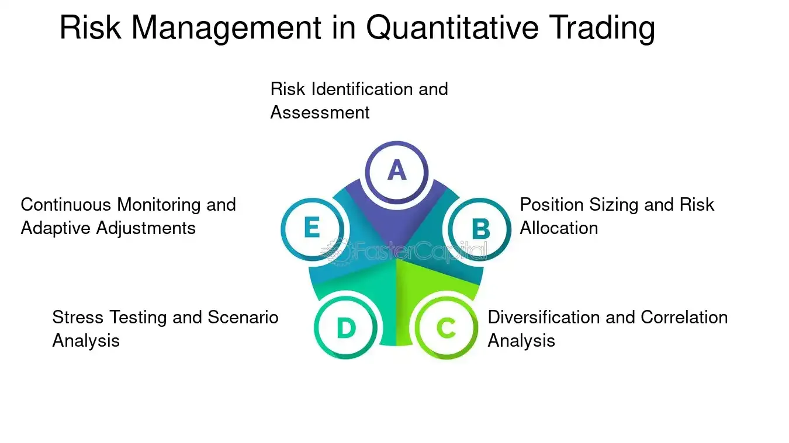

## Table of Contents

## What is risk in the context of quantitative trading?

In quantitative trading, risk refers to the possibility of losing money or not achieving the expected returns from trading strategies that use mathematical models and algorithms. These strategies often involve complex calculations and predictions about how markets will move, but there's always a chance that the market will behave differently than expected. This unpredictability can lead to financial losses, and managing this risk is a crucial part of quantitative trading.

To manage risk, quantitative traders use various methods like setting limits on how much they can lose on a single trade or over a period of time. They also diversify their investments across different assets to spread out the risk. By understanding and controlling risk, traders aim to protect their capital and improve their chances of making profits over the long term.

## Why is risk management important in quantitative trading?

Risk management is important in quantitative trading because it helps traders protect their money. When you use math and computers to trade, there's always a chance that the market won't do what you expect. If you don't manage risk, you could lose a lot of money quickly. By setting rules on how much you can lose, you make sure that one bad trade doesn't wipe out all your money.

Also, good risk management helps traders keep trading over the long term. If you lose too much money on one trade, you might not have enough left to keep going. By spreading out your investments and setting limits, you can keep trading even if some trades don't go well. This way, you have a better chance of making money over time, even if the market is unpredictable.

## What are the basic types of risks encountered in quantitative trading?

In [quantitative trading](/wiki/quantitative-trading), there are several basic types of risks that traders need to be aware of. One major type is market risk, which is the risk that the whole market will go down and affect the value of your investments. This can happen because of big events like economic crises or changes in interest rates. Another type is model risk, which comes from using mathematical models to predict how the market will move. If the model is wrong or based on bad data, it can lead to losses.

Another important risk is [liquidity](/wiki/liquidity-risk-premium) risk, which is the risk that you won't be able to buy or sell an asset quickly enough without affecting its price. This can be a problem if you need to get out of a trade fast. There's also operational risk, which includes things like computer failures or mistakes made by people working on the trading systems. These can cause trades to go wrong even if the market is doing well.

Finally, there's leverage risk, which comes from borrowing money to make bigger trades. While this can increase your profits, it can also increase your losses if the market moves against you. Understanding these risks and how to manage them is key to being successful in quantitative trading.

## How do you quantify risk in trading?

To quantify risk in trading, traders use numbers to figure out how much they might lose. One common way to do this is by using something called Value at Risk (VaR). VaR helps traders understand the most they could lose over a certain time, like a day or a week, with a certain level of confidence, usually 95% or 99%. For example, if a trader's VaR is $10,000 at a 95% confidence level over one day, it means there's a 5% chance they could lose more than $10,000 in a single day. This helps traders set limits on how much they're willing to risk.

Another way to quantify risk is by looking at the standard deviation of returns, which shows how much the price of an asset can swing up or down. A higher standard deviation means the asset's price is more unpredictable, which means more risk. Traders also use something called beta to measure how much an asset's price moves compared to the overall market. If an asset has a high beta, it means it's more sensitive to market changes and therefore riskier. By using these measures, traders can better understand and manage the risks they face in trading.

## What are common risk management techniques used in quantitative trading?

In quantitative trading, one common way to manage risk is by setting stop-loss orders. This means deciding ahead of time how much money you're willing to lose on a trade, and if the trade goes that far against you, it automatically closes. This helps prevent big losses. Another technique is diversification, which means not putting all your money into one type of investment. By spreading your money across different assets, you reduce the risk that one bad trade will hurt you too much.

Traders also use something called position sizing to manage risk. This means figuring out how much of your money to put into each trade based on how risky it is. If a trade seems very risky, you might decide to only use a small part of your money on it. Another important technique is stress testing, where traders use computer simulations to see how their trading strategy would do in really bad market conditions. This helps them understand if their strategy can handle big swings in the market, and they can make changes if needed to protect their money.

## How does Value at Risk (VaR) work in managing trading risks?

Value at Risk (VaR) is a tool that helps traders figure out how much money they might lose over a certain time, like a day or a week, with a certain level of confidence. For example, if a trader's VaR is $10,000 at a 95% confidence level over one day, it means there's a 5% chance they could lose more than $10,000 in a single day. By knowing this, traders can set limits on how much they're willing to risk. This helps them make smarter decisions about how much money to put into each trade, so they don't lose too much if the market goes against them.

Using VaR helps traders manage their risk by giving them a clear number to work with. It's like a safety net that tells them the worst-case scenario they're likely to face. Traders can use this information to adjust their trading strategies, maybe by reducing the size of their trades or by choosing different investments that are less risky. By understanding their VaR, traders can protect their money and keep trading even when the market gets unpredictable.

## What role does stress testing play in risk management for quantitative trading?

Stress testing is really important in managing risks for people who do quantitative trading. It's like a practice run where traders use computer programs to see how their trading plans would work if the market got really crazy or bad. They can pretend that the market drops a lot or that there's a big event that changes everything. By doing this, traders can see if their strategies will still make money or if they'll lose a lot. It helps them find weak spots in their plans so they can fix them before they lose real money.

When traders do stress tests, they get a better idea of how much risk they're really taking. It's not just about what might happen on a normal day, but what could happen on the worst days. This helps them decide if they need to change how much money they put into each trade or if they should use different ways to protect their money. By understanding how their strategies hold up under pressure, traders can make smarter choices and feel more confident that they can handle whatever the market throws at them.

## How can you use historical data to model risk in quantitative trading?

Historical data is super useful for figuring out risk in quantitative trading. Traders look at what happened in the past to guess what might happen in the future. They use old prices and market moves to see how risky things were back then. This helps them make a model that shows how much they might lose in the future. By looking at past ups and downs, traders can set up their trading plans to handle similar risks.

For example, if a trader sees that a certain stock went up and down a lot in the past, they might think it will do the same in the future. They can use this info to decide how much money to put into that stock. By studying past data, traders can also find patterns that show when the market might be risky. This helps them be ready for bad times and protect their money better.

## What are advanced statistical models used for risk assessment in quantitative trading?

Advanced statistical models are really helpful for figuring out risk in quantitative trading. One common model is the Monte Carlo simulation, which is like playing out many different scenarios on a computer to see how a trading strategy might do. It helps traders understand all the different ways the market could move and how much they might lose or win. Another model is GARCH (Generalized Autoregressive Conditional Heteroskedasticity), which looks at how the ups and downs of an asset's price change over time. This can help traders predict when the market might get really risky.

Another useful model is the Black-Scholes model, which is often used for figuring out the risk of options trading. It helps traders understand how much an option's price might change based on things like the stock's price, how long until the option expires, and how much the stock's price moves around. By using these models, traders can get a better idea of the risks they're taking and make smarter decisions about how to protect their money.

## How do you integrate risk management into trading algorithms?

To integrate risk management into trading algorithms, traders need to build rules right into their computer programs that help them keep their money safe. One way to do this is by setting up stop-loss orders in the algorithm. This means the program will automatically sell an asset if its price drops too much, so the trader doesn't lose more than they're okay with. Another way is by using position sizing, where the algorithm decides how much money to put into each trade based on how risky it is. If a trade looks really risky, the algorithm might only use a small part of the trader's money on it.

Traders also use Value at Risk (VaR) in their algorithms to figure out the most they could lose over a certain time. The algorithm can then adjust the trading strategy to stay within these risk limits. For example, if the VaR shows a high risk of big losses, the algorithm might reduce the size of trades or choose less risky investments. By including these risk management rules in the trading algorithms, traders can make sure their strategies are always working to protect their money, even when the market gets unpredictable.

## What are the challenges of managing risk in high-frequency trading?

Managing risk in high-frequency trading is really tough because everything happens so fast. High-frequency trading uses computers to buy and sell things in the market very quickly, sometimes in just a few seconds. This speed makes it hard to keep an eye on everything and react fast enough to stop big losses. Traders have to use special computer programs that can make decisions in a split second. If these programs make a mistake, it can lead to big losses before anyone can do anything about it.

Another challenge is that high-frequency trading often uses a lot of borrowed money, which can make the risks even bigger. When you borrow money to trade, you can make more money if things go well, but you can also lose a lot more if things go bad. This means that even small mistakes or unexpected market moves can cause big problems. Traders have to be really careful and use smart ways to manage their risk, like setting very tight limits on how much they can lose and using special tools to watch the market all the time.

## How do you continuously monitor and adjust risk models in a dynamic market environment?

In a fast-changing market, keeping an eye on risk models all the time is really important. Traders use computers to watch the market and their trading plans every second. If the market starts acting differently, like if prices start going up and down a lot more than usual, the computer can spot it right away. This helps traders see if their risk models are still working well or if they need to make changes. By watching things closely, traders can make sure they're not taking too much risk and can adjust their plans to stay safe.

Adjusting risk models means making changes based on what the market is doing. If the computer sees that the market is getting riskier, it can tell the trader to use less money on each trade or to stop trading certain things that are too risky. Sometimes, traders might need to update their risk models to use new data or to try out new ways of figuring out risk. By keeping their models up to date and making quick changes when needed, traders can better handle the ups and downs of the market and protect their money.

## What are Quantitative Models for Risk Management?

Quantitative models play a crucial role in identifying and assessing risk in quantitative trading by providing a structured framework to understand potential losses. These models help traders gauge the exposure to various risk factors and develop strategies to mitigate their effects. Here's a closer look at some of the most widely-used quantitative models in risk management.

### Value at Risk (VaR)
Value at Risk is a statistical technique used to quantify the level of financial risk within a portfolio. VaR estimates the maximum potential loss over a specified time frame at a given confidence level. For example, a 1-day VaR of $1 million at a 95% confidence level suggests that there is a 95% chance the portfolio will not lose more than $1 million in a single day.

Mathematically, VaR is often calculated using historical data and can be expressed as:

$$
\text{VaR}_{\alpha} = -(\mu + \sigma \cdot z_{\alpha})
$$

where $\mu$ is the mean return, $\sigma$ is the standard deviation of returns, and $z_{\alpha}$ is the z-score corresponding to the confidence level $\alpha$.

VaR is widely used by financial institutions to estimate the daily loss potential and helps in setting risk limits and capital reserves.

### Stress Testing
Stress testing assesses the resilience of a portfolio under extreme market conditions by simulating various adverse scenarios. Unlike VaR, which assumes normal market conditions, stress testing explores "what-if" scenarios, such as economic crises or market crashes, to understand their potential impact.

This method involves creating hypothetical scenarios that are relevant to the current market environment and testing how portfolios would react. Stress testing ensures that traders are prepared for worst-case scenarios and can adjust their strategies to minimize negative impacts.

### Monte Carlo Simulations
Monte Carlo simulations are used to model the probability of different outcomes in processes that are uncertain. This technique uses computational algorithms to simulate a wide range of possible outcomes for a portfolio by inputting various random variables.

The process involves:
1. Generating random variables for underlying risk factors.
2. Simulating returns based on these variables over many trials.
3. Aggregating the results to understand the distribution of potential outcomes.

Monte Carlo simulations provide a dynamic way of understanding risk by considering thousands of possible scenarios, thus allowing traders to see the range of potential future states of their portfolios.

### Predicting Losses and Mitigation Strategies
These models contribute significantly to predicting potential losses and developing mitigation strategies. By quantifying the potential risks, traders can allocate capital more efficiently, set appropriate risk limits, and decide on hedging strategies conforming to their risk tolerance. For example, VaR can be used to determine the amount of capital necessary to cover potential losses, while stress testing can guide adjustments in asset allocation during turbulent times.

In conclusion, the application of quantitative models like VaR, stress testing, and Monte Carlo simulations is critical for effective risk management in quantitative trading. These models provide insights that help traders make informed decisions to safeguard their portfolios against diverse market risks.

## References & Further Reading

[1]: Bergstra, J., Bardenet, R., Bengio, Y., & Kégl, B. (2011). ["Algorithms for Hyper-Parameter Optimization."](https://papers.nips.cc/paper_files/paper/2011/hash/86e8f7ab32cfd12577bc2619bc635690-Abstract.html) Advances in Neural Information Processing Systems 24.

[2]: ["Advances in Financial Machine Learning"](https://www.amazon.com/Advances-Financial-Machine-Learning-Marcos/dp/1119482089) by Marcos Lopez de Prado

[3]: ["Evidence-Based Technical Analysis: Applying the Scientific Method and Statistical Inference to Trading Signals"](https://www.wiley.com/en-gb/Evidence+Based+Technical+Analysis:+Applying+the+Scientific+Method+and+Statistical+Inference+to+Trading+Signals-p-9780470008744) by David Aronson

[4]: ["Machine Learning for Algorithmic Trading"](https://www.amazon.com/Machine-Learning-Algorithmic-Trading-intelligence/dp/9918608013) by Stefan Jansen

[5]: ["Quantitative Trading: How to Build Your Own Algorithmic Trading Business"](https://www.amazon.com/Quantitative-Trading-Build-Algorithmic-Business/dp/0470284889) by Ernest P. Chan