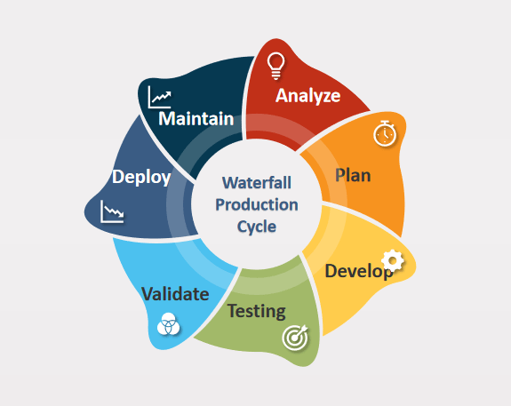

Algorithmic trading, often termed algo-trading, utilizes mathematical models and automated systems to execute trades in financial markets. This method leverages the power of computer algorithms to make buying or selling decisions, which can include a variety of factors such as price, timing, or quantity. The significance of algorithmic trading in modern finance cannot be understated, as it accounts for a substantial portion of transactions in stock exchanges around the world. By automating trading decisions, algo-trading can process information and act upon it at speeds that are impossible for human traders, providing an edge in markets where timing is crucial.



One of the primary reasons for the growing interest in algorithmic trading strategies among both retail and institutional investors is the potential to enhance trading efficiency and accuracy. Institutional investors, such as hedge funds and banks, have long harnessed the powers of algorithmic trading to exploit market inefficiencies and maximize returns. However, advancements in technology and the availability of trading platforms have also democratized access, enabling retail investors to participate in algo-trading. According to market research, the global algorithmic trading market is expected to grow significantly as more investors recognize its benefits of speed, precision, and the ability to backtest trading strategies on historical data.

Despite the advantages, transitioning an algorithm from the development stage to live trading presents considerable challenges. This process requires a robust framework to ensure that algorithms perform as expected when exposed to real-world market conditions. A primary concern is the difference between backtesting results and live trading outcomes, a gap often caused by discrepancies in data quality, operational errors, or unanticipated market behaviors. Furthermore, algorithms must be thoroughly tested under a variety of market scenarios to ensure resilience, continuity, and compliance with regulatory standards. Hence, moving from theoretical models to live market application involves both technical and operational hurdles that must be meticulously managed to achieve success in algorithmic trading.


## Table of Contents

## Understanding the Lifecycle of an Algorithmic Trading Strategy

The lifecycle of an algorithmic trading strategy involves several critical stages, each contributing to the refinement and success of the strategy in a live trading environment. These stages are research, development, backtesting, and optimization. Understanding these steps is vital for any aspiring or professional trader aiming to implement algorithmic strategies effectively.

**Research Stage**: The process begins with comprehensive research. During this stage, traders and developers explore various strategies, market conditions, and asset classes to identify promising opportunities. This initial phase often involves statistical analysis and the examination of historical price data to formulate hypotheses and trading rules.

**Development Stage**: Once a potential strategy is identified, it is translated into a comprehensive algorithm. This involves coding the logic and rules defined during the research stage into a programming language or trading platform. The development stage requires a solid understanding of both programming and financial markets, ensuring the algorithm functions as intended under various market scenarios.

**Backtesting Stage**: Backtesting involves running the developed algorithm on historical data to assess its performance. This stage is crucial in validating the strategy's potential profitability and risk profile. Metrics such as Sharpe ratio, drawdowns, and win/loss ratios are often used to evaluate performance. If the backtest results are unsatisfactory, the strategy may require adjustments or re-development.

Python code snippet for backtesting:

```python
import pandas as pd
import numpy as np

def backtest_strategy(data, strategy):
    # Example: Calculate returns and strategy performance
    data['returns'] = data['price'].pct_change()
    data['strategy'] = data['returns'] * strategy

    # Calculate cumulative returns
    data['cumulative_returns'] = (1 + data['strategy']).cumprod()

    return data

# Example data
data = pd.DataFrame({'price': [100, 102, 101, 105, 107]})
strategy_signals = np.array([1, -1, 0, 1, -1]) # Simplified example
backtest_results = backtest_strategy(data, strategy_signals)
print(backtest_results)
```

**Optimization Stage**: After achieving promising results in backtesting, the strategy moves to the optimization phase. Here, parameters within the algorithm are fine-tuned to maximize performance, typically using techniques like grid search or genetic algorithms. It is essential to avoid over-optimizing, also known as overfitting, which can lead to poor performance in live trading environments.

**Transition to Live Production**: Moving from backtesting to a live production environment involves several critical considerations. At this point, the strategy must be adapted to handle live data feeds, accommodate real-time decision-making, and manage the execution of trades seamlessly. Ensuring minimal latency and establishing a robust failover mechanism is crucial in this transition to mitigate risks and maintain efficiency.

Each stage of this lifecycle—research, development, backtesting, and optimization—plays a crucial role in shaping a robust and successful algorithmic trading strategy. The comprehensive understanding and meticulous execution of each phase ensure that the strategy can withstand the complexities and uncertainties of real-market trading.


## Prerequisites for Putting an Algorithmic Trading Strategy into Production

To successfully deploy an algorithmic trading strategy in live markets, several prerequisites must be addressed. These prerequisites ensure that the strategy operates effectively, reliably, and in compliance with regulatory standards.

**1. Key Components and Resources**

**Robust Infrastructure**: A strong infrastructure is the backbone of any algorithmic trading system. This includes high-speed internet connectivity, powerful computing resources, and reliable servers. For institutional traders, colocating servers near the exchange can reduce latency, thus improving trade execution time.

**Reliable Data Feeds**: Access to fast and accurate market data is crucial. Ensure that your data provider offers real-time updates and has a strong track record of data integrity and minimal downtime. Historical data is also necessary for backtesting purposes, allowing for the simulation of strategies against past market conditions.

**Trading Platform**: Choose a versatile and reliable trading platform that can seamlessly integrate with your strategy. Popular choices include MetaTrader, Interactive Brokers, and custom platforms built using programming languages like Python and C++. The platform should support various order types, provide detailed analytics, and offer a user-friendly interface.

**2. Importance of Thorough Testing Setup**

Before deploying an algorithmic trading strategy, it is vital to have a comprehensive testing setup. This involves:

- **Simulation Environments**: Utilize sandbox environments to mimic real trading conditions without the financial risks. This helps in identifying bugs and behavioral anomalies in the algorithm.

- **Stress Testing**: Test the strategy under extreme market conditions, such as high volatility or low liquidity scenarios. This ensures that the algorithm can handle unexpected market events.

- **Walk-Forward Testing**: Beyond backtesting, implement walk-forward testing to validate the strategy's effectiveness in evolving market conditions. This iterative approach helps in fine-tuning parameters for live deployment.

**3. Risk Management Protocols and Compliance Considerations**

**Risk Management**: Integrate risk management tools to safeguard against significant losses. Employ strategies such as stop-loss orders, position size limits, and portfolio diversification. Algorithms should be capable of adjusting positions according to defined risk thresholds, ensuring alignment with the trader's risk appetite.

$$
\text{Risk\ per\ Trade} = \frac{\text{Account\ Balance} \times \text{Risk\ Percentage}}{\text{Stop\ Loss\ Distance}}
$$

**Compliance Considerations**: Adhere to the applicable regulatory requirements of the exchanges and jurisdictions where you operate. This includes implementing anti-money laundering (AML) measures, maintaining records for audits, and obtaining necessary licenses. Regular compliance checks ensure that the algorithm's operations do not breach regulatory standards.

By implementing these prerequisites, traders can transition an algorithmic trading strategy from concept to execution in live markets, thereby enhancing its chances of success while mitigating potential risks.


## Building a Robust Infrastructure for Production

To successfully transition an algorithmic trading strategy from development to production, you need a robust infrastructure that supports live trading operations. This infrastructure requires specific hardware and software components, the strategic use of cloud services and on-premises solutions, and mechanisms for ensuring failover and data redundancy.

### Hardware and Software Requirements

Building a robust infrastructure begins with identifying the essential hardware components. At the core, you need high-performance computing servers capable of processing real-time data and executing trades with minimal latency. These servers should be equipped with fast CPUs, ample RAM, and reliable storage options like SSDs to handle the vast amount of data involved in trading efficiently.

On the software side, your setup should include a reliable operating system, typically Linux or Windows, that can support trading applications and APIs used for market data feeds and trade execution. Trading platforms or custom-built software solutions should be implemented to facilitate the actual trading process. Additionally, network management software is crucial to ensure that data packets are transmitted with minimal delay.

### Cloud Services vs. On-Premises Solutions

Deciding between cloud services and on-premises solutions affects both the computational power and reliability of your trading infrastructure. Cloud services like AWS, Google Cloud, or Microsoft Azure provide scalable resources that can be dynamically adjusted according to trading demands. These services offer flexibility and potentially lower upfront costs, along with built-in redundancies that enhance system reliability.

In contrast, on-premises solutions offer more control over data security and system customization. However, they require a significant initial investment and ongoing maintenance to ensure system reliability. A hybrid approach, utilizing both cloud services and on-premises hardware, often provides a balanced solution by leveraging the strengths of both.

### Failover Mechanism and Data Redundancy

Implementing a failover mechanism is critical for uninterrupted trading operations in case of system failures. A failover system ensures that a secondary system or backup takes over instantaneously if the primary system fails, minimizing downtime and potential losses. This setup generally involves redundant hardware, software, and network paths to ensure reliability.

Data redundancy is equally important. It involves storing copies of data in multiple locations to prevent data loss in case of hardware failures. Techniques such as RAID (Redundant Array of Independent Disks) are common for achieving redundancy. Additionally, regular backups, both on-site and off-site, ensure that trading data and algorithms are safeguarded against unexpected incidents.

In summary, constructing a robust infrastructure for live trading operations necessitates strategic decisions regarding hardware, software, and deployment methodologies. By carefully choosing between cloud and on-premises solutions and implementing redundancy at various levels, you can ensure the reliability and efficiency needed for successful algorithmic trading in a live environment.


## Automating Data Collection and Trade Execution

To successfully automate data collection and trade execution in algorithmic trading, it's essential to establish a robust real-time data acquisition system. Such a system should efficiently gather market data, which is critical for making timely trading decisions. A common approach is to use data feeds provided by financial data vendors or exchanges, which can supply information such as bid-ask prices, volumes, and other relevant market metrics.

Here’s how to set up a real-time data acquisition system:

1. **Choose a Data Provider:** Select reliable data providers like Bloomberg, Reuters, or other financial data services that offer comprehensive data coverage and low latency.

2. **Set Up Data Feeds:** Implement data feeds using libraries and SDKs offered by data providers. This can typically be done through APIs, which allow for seamless integration into your trading system. For example, you can use RESTful APIs or WebSocket connections for continuous data streams.

3. **Data Preprocessing:** Implement real-time data preprocessing to clean, normalize, and store data as it arrives. This ensures that the data is immediately ready for use in decision-making algorithms.

Concurrently, APIs play a crucial role in executing trades and monitoring the market environment. They bridge the gap between your trading algorithms and the trading platform or brokerage, enabling automated trade executions based on your algorithm’s signals.

Here’s an overview of how APIs facilitate trade execution:

1. **Connecting with Trading Platforms:** Use APIs provided by trading platforms or brokerages, such as Interactive Brokers, Alpaca, or TD Ameritrade, which support automated trading.

    ```python
    import alpaca_trade_api as tradeapi

    api = tradeapi.REST('APCA-API-KEY-ID', 'APCA-API-SECRET-KEY', base_url='https://paper-api.alpaca.markets')
    order = api.submit_order(
        symbol='AAPL',
        qty=100,
        side='buy',
        type='market',
        time_in_force='gtc'
    )
    ```

2. **Monitoring Capabilities:** APIs help monitor open positions, account balances, and risk metrics, enabling you to make informed trading decisions.

3. **Order Management:** They facilitate functions like submitting orders, checking order status, and modifying or canceling orders, all of which are vital for maintaining control over trading activities.

Minimizing latency is a critical consideration in trade execution to ensure that trades occur as close to real-time as possible, thereby reducing slippage which can negatively impact trading performance. Key strategies include:

- **Optimizing Network Infrastructure:** Place servers close to the exchange data centers to lower latency. This practice, often referred to as co-location, is used to gain a significant speed advantage in trading.

- **Efficient Code Execution:** Implement highly optimized code, focusing on reducing computational overhead and streamlining processing tasks. Techniques like code profiling, parallel processing, and using compiled languages can greatly enhance performance.

- **Monitoring and Testing:** Regularly monitor system performance and conduct stress tests to identify and address bottlenecks.

By diligently setting up efficient data collection and trade execution systems, traders can significantly enhance their algorithmic strategies’ responsiveness and effectiveness in the market.


## Implementing Risk Management and Monitoring Systems

Integrating risk management tools is a crucial step in deploying algorithmic trading strategies to manage exposure effectively and mitigate potential losses. These tools are designed to control various types of risks, such as market risk, credit risk, and operational risk, using models and algorithms to assess and limit exposure. Key components include stop-loss limits, value-at-risk (VaR) models, and stress testing protocols. Stop-loss limits automatically exit positions at predetermined loss points to minimize downside risk. Here’s a simple Python code snippet illustrating a stop-loss function:

```python
def apply_stop_loss(entry_price, current_price, stop_loss_percentage):
    stop_loss_level = entry_price * (1 - stop_loss_percentage / 100)
    if current_price <= stop_loss_level:
        return "Sell"
    else:
        return "Hold"
```

Performance and operational monitoring systems are essential for ensuring the ongoing soundness of a trading strategy. These systems continuously track key performance indicators (KPIs), such as portfolio returns, Sharpe ratio, and alpha, to provide real-time insights into the strategy's effectiveness. Additionally, operational monitoring focuses on system uptime, latency in trade execution, and data feed accuracy, ensuring that any operational issues are identified and addressed promptly.

Regular reviews and updates based on performance data are vital to maintaining a strategy’s competitiveness and effectiveness in changing market conditions. Analysis of historical and real-time data helps in identifying patterns or anomalies that may indicate strategy flaws or new opportunities. This process involves backtesting strategy modifications on updated datasets and simulating various market scenarios to validate improvements.

By integrating robust risk management tools, deploying comprehensive performance and operational monitoring systems, and conducting regular strategy reviews, algorithmic trading strategies can be effectively managed to ensure they operate within acceptable risk parameters, remain profitable, and adapt to market changes.


## Ensuring Compliance and Security

When deploying an algorithmic trading strategy, adhering to regulatory requirements is paramount to ensure legal compliance and maintain market integrity. Regulations such as the Markets in Financial Instruments Directive II (MiFID II) in Europe, the Dodd-Frank Act in the United States, and other local guidelines might impact various aspects of algorithmic trading. These regulations often set standards for transparency, data reporting, and trade execution, requiring firms to maintain detailed records of their algorithmic strategies. Additionally, firms must ensure their trading activities do not contribute to market abuse or financial instability, often mandating the implementation of real-time monitoring and control mechanisms.

Securing sensitive financial data and trading algorithms is critical in protecting intellectual property and maintaining the confidentiality of proprietary strategies. Encryption methods, both at rest and in transit, are essential to safeguard data against unauthorized access. Implementing robust access controls, using multi-factor authentication (MFA), and ensuring that only authorized personnel have access to specific datasets and systems can mitigate potential breaches. Furthermore, regular audits and penetration testing can help identify vulnerabilities in the system, allowing for timely remediation before they can be exploited.

Common security threats in algorithmic trading include unauthorized access, data breaches, and Denial-of-Service (DoS) attacks. Mitigation strategies for these threats often involve a combination of technological solutions and best practice policies. For instance, the deployment of firewalls, intrusion detection systems, and anti-virus software can provide an essential layer of defense against known and unknown threats. Adopting a zero-trust architecture, where each request for access is verified continuously, can further reduce the risk of unauthorized access.

Finally, regular employee training on cybersecurity awareness plays a crucial role in preventing security incidents. Human error is often a significant risk factor, and educating staff about phishing attacks, social engineering tactics, and proper data handling can greatly enhance an organization's overall security posture. By staying informed about emerging threats and regulatory changes, firms can adapt their security and compliance strategies effectively, ensuring the safe and legal operation of their algorithmic trading activities.


## Case Studies and Examples

## Case Studies and Examples

Algorithmic trading strategies have transformed the financial landscape by offering precision, speed, and the potential for significant profitability. Let's explore some notable case studies that highlight both the triumphs and pitfalls within this domain. These examples illuminate key lessons in the successful deployment of algorithmic trading strategies.

### Successful Deployments

1. **Renaissance Technologies**
   One of the most celebrated success stories is that of Renaissance Technologies, founded by Jim Simons. The firm's Medallion Fund is renowned for its astronomical returns, often attributed to its algorithmic trading strategies. Renaissance employs sophisticated mathematical models and vast data sets to execute trades, emphasizing the critical role of rigorous backtesting and continuous optimization throughout production. Their success underlines the importance of investing in a skilled team of quantitative analysts and the strategic use of large datasets in refining algorithms to adapt to ever-changing market conditions.

2. **Two Sigma Investments**
   Another exemplar is Two Sigma, which successfully leverages artificial intelligence and machine learning to inform its trading strategies. The firm emphasizes continuous research and development, ensuring its algorithms are robust and flexible enough to handle market volatility. Two Sigma's deployment process includes extensive simulations and stress-testing, highlighting the necessity of exhaustive testing environments before going live—thereby minimizing potential losses due to unforeseen market shifts.

### Lessons from Unsuccessful Case Studies

1. **Knight Capital Group**
   Knight Capital's trading disaster in 2012 serves as a cautionary tale. An error in their trading algorithm resulted in a loss of approximately $440 million in less than an hour. The primary lesson from this incident is the vital importance of implementing fail-safes and rigorous deployment protocols. A well-thought-out risk management framework and comprehensive testing could have prevented this catastrophe by identifying the glitch before it went live.

2. **Crimson Assurance**
   In an attempt to emulate industry giants, Crimson Assurance's foray into algorithmic trading was hampered by underinvestment in technology and expertise. Their algorithms frequently underperformed due to inadequate market data inputs and failure to optimize for execution speed and efficiency. This case highlights the necessity of having a solid technical foundation and skilled personnel to maintain an edge in algorithmic trading.

### Navigating the Production Process

Different industry players have demonstrated unique approaches to transitioning from development to live trading:

- **Quantitative Hedge Funds**: Firms like Renaissance and Two Sigma stress the importance of a robust infrastructure, combining high-performance computing systems with cloud-based solutions to ensure scalability and speed. They employ a team of experts to continuously refine and optimize algorithms, stressing the critical nature of a dynamic approach in maintaining competitive algorithms.

- **Retail Traders**: With the advancing availability of trading platforms offering algorithmic capabilities, retail traders have gradually entered the space. Successful retail examples often mirror institutional standards by utilizing reliable data feeds, backtesting diligently, and employing straightforward strategies that capitalize on market inefficiencies rather than complex models that require vast resources.

- **Technology Firms**: Companies that develop trading platforms and tools underscore the necessity of APIs for seamless trade execution. They prioritize minimizing latency through infrastructure choices that facilitate rapid data processing and trade execution, reinforcing the significance of technological investment in gaining an edge.

These case studies illustrate that success in algorithmic trading is contingent upon thorough preparation, informed resource allocation, and ongoing management. Emphasizing the need for continuous learning, adaptation, and innovation, as epitomized by industry leaders, is crucial as the landscape of algorithmic trading evolves.


## Conclusion

Deploying an algorithmic trading strategy involves several critical steps that collectively contribute to achieving successful and efficient operations in live financial markets. The process begins with comprehensive research and development, ensuring that the strategies are well-designed and optimal for the targeted market conditions. Moving beyond backtesting, establishing a robust production environment becomes crucial. This includes setting up necessary hardware and software, ensuring reliable data feeds, and implementing effective risk management protocols.

Thorough preparation cannot be overstated. It lays the groundwork for transitioning smoothly from a theoretical model to a fully functioning live trading setup. Initial testing and verification are crucial to confirm the strategy's readiness to handle real market dynamics. Moreover, an integrated approach to risk management and monitoring systems helps mitigate potential losses and ensures operational efficiency.

Once in production, ongoing management and adaptation are essential. The financial markets are dynamic, and strategies must evolve to stay relevant. Regularly reviewing performance data, updating algorithms based on new insights, and adhering to compliance standards are necessary to maintain an edge in the trading landscape. Additionally, the importance of staying informed about the latest advancements in technology and trading strategies cannot be ignored. Innovations in machine learning, data analysis, and trading infrastructure are continuously reshaping the algorithmic trading space.

By addressing these key considerations, traders can enhance their chances of success. The journey from development to live trading is complex but rewarding, offering opportunities for significant gains and growth in the financial markets.


