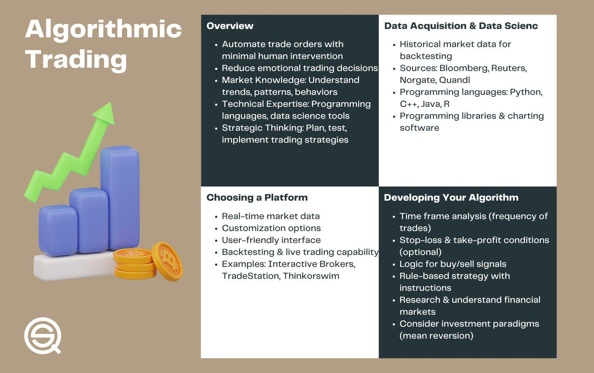

## Table of Contents

## What is algorithmic trading and why is it important?

Algorithmic trading is when computers use math formulas and rules to buy and sell things like stocks or currencies automatically. Instead of people making decisions, the computer follows a set of instructions to trade. This can happen very quickly, sometimes in just a few seconds, and can handle a lot of trades at the same time.

It's important because it can make trading faster and more efficient. It can also help remove human emotions from trading, which can sometimes lead to bad decisions. By using algorithms, traders can take advantage of small price differences in the market and make profits from them. This can be good for the overall market because it helps keep prices more accurate and fair.

## What are the basic components of an algorithmic trading strategy?

The first part of an algorithmic trading strategy is the data. Traders need information about prices, how much things are being bought and sold, and other details about the market. This data helps the computer know when to buy or sell. The second part is the algorithm itself. This is like a recipe that tells the computer what to do with the data. It uses math to decide when and how much to trade.

The third part is the execution system. This is what actually makes the trades happen. It needs to be fast and reliable so that the computer can buy or sell at the right time. The last part is risk management. This is important to make sure the strategy doesn't lose too much money. It sets limits on how much can be traded and how much can be lost. Together, these parts help make sure the trading strategy works well and safely.

## How do you choose a programming language for algorithmic trading?

When choosing a programming language for [algorithmic trading](/wiki/algorithmic-trading), you need to think about a few things. First, think about how fast the language can run your code. In trading, every second counts, so languages like C++ or Java, which are fast, might be good choices. But, they can be harder to learn and use. On the other hand, languages like Python are easier to learn and have a lot of tools that are already made for trading. They might not be as fast, but they can still work well for many trading strategies.

Another thing to consider is the support and community around the language. Python, for example, has a big community of people who trade and share their code and ideas. This can be really helpful if you run into problems or want to learn new things. Also, think about what tools and libraries you need. Some languages have special tools that can help with things like getting data or making charts. In the end, the best language for you will depend on what you need and what you're comfortable with.

## What data sources are needed for an algorithmic trading strategy?

For an algorithmic trading strategy, you need different types of data. The main data you need is price data. This tells you the current price of stocks, currencies, or whatever you are trading. You also need [volume](/wiki/volume-trading-strategy) data, which shows how many of these things are being bought and sold. Other important data includes news and events that can affect prices, like company earnings reports or economic announcements. Historical data is also crucial because it helps you test your trading strategy to see if it would have worked in the past.

Another important data source is market data feeds. These are services that give you real-time information about what's happening in the market. They can be expensive, but they're important if you want your trades to happen at the right time. Some traders also use [alternative data](/wiki/best-alternative-data), like social media sentiment or weather data, to get an edge. The key is to make sure your data is accurate and up-to-date, because even small mistakes can lead to big losses in trading.

## How do you backtest an algorithmic trading strategy?

Backtesting an algorithmic trading strategy means testing it with old data to see how it would have done in the past. You take your trading rules and apply them to historical price and volume data. This helps you see if your strategy would have made money or lost money if you had used it before. You need to be careful to use good data that is clean and correct, because mistakes can make your backtest results wrong.

Once you have your data ready, you run your strategy through it. This means your computer goes through the data day by day or even second by second, making trades based on your rules. After it's done, you look at the results to see how much money you would have made or lost. It's important to check different time periods and market conditions to make sure your strategy works well in different situations. Backtesting helps you find problems and improve your strategy before you use real money.

## What are the key considerations for risk management in algorithmic trading?

Risk management in algorithmic trading is very important to keep your money safe. One key thing to think about is setting limits on how much you can lose on each trade. This is called a stop-loss. If the price goes against you, the stop-loss will automatically sell your position to stop you from losing too much money. Another thing is to not put all your money into one trade. You should spread your money out over different trades, which is called diversification. This way, if one trade goes bad, you won't lose everything.

Another important part of risk management is watching how much you are trading. You need to make sure you are not trading too much, which is called overtrading. Overtrading can lead to big losses because you are taking too many risks. It's also good to keep an eye on how well your strategy is doing and be ready to change it if it starts to lose money. This means always checking your trades and making sure your strategy still works well with the current market conditions.

## How do you select a broker and set up a trading account for algorithmic trading?

When [picking](/wiki/asset-class-picking) a broker for algorithmic trading, you need to think about a few things. First, make sure the broker lets you use the programming language you want to trade with. Some brokers only work with certain languages, so you need to check that. Second, look at the fees. Brokers charge money for trading, and these fees can be different from one broker to another. You want to find a broker with low fees so you keep more of your profits. Also, think about how fast the broker's trading system is. In algorithmic trading, speed is important, so you need a broker that can make trades quickly. Finally, check if the broker is reliable and has a good reputation. You can read reviews and see what other traders say about them.

To set up a trading account, start by going to the broker's website and filling out the application form. You will need to give them some personal information like your name, address, and maybe some documents to prove who you are. After you fill out the form, the broker will check your information to make sure everything is okay. This might take a few days. Once your account is approved, you will need to put money into it. This is called funding your account. You can usually do this with a bank transfer or a credit card. After your account is funded, you can start setting up your trading software and begin trading. Make sure you understand all the rules and fees before you start, so you don't have any surprises later.

## What infrastructure is required to deploy an algorithmic trading strategy?

To deploy an algorithmic trading strategy, you need a good computer setup. This setup should be fast and reliable because trading happens quickly. You need a computer with a strong processor and lots of memory to run your trading algorithms smoothly. You also need a good internet connection to make sure your trades go through without delays. Some traders use special servers that are close to the stock exchange to make their trades even faster. This is called co-location, and it can give you a small but important advantage in trading.

Another important part of the infrastructure is the software you use. You need trading software that can connect to your broker and execute your trades automatically. This software should be able to handle a lot of data and make decisions quickly. You also need a way to monitor your trades and make sure everything is working right. This might mean setting up alerts or dashboards to keep an eye on your strategy. Finally, you need a backup plan in case something goes wrong. This could be another computer or a different internet connection, so you can keep trading even if your main setup has a problem.

## How do you ensure the reliability and uptime of your trading system?

To make sure your trading system is reliable and always working, you need to have a good setup. Start with a strong computer that can handle a lot of work without slowing down. Make sure you have a fast and stable internet connection because even a small delay can mess up your trades. Some traders use special servers that are very close to where the trading happens, which can help make trades go through faster. It's also a good idea to have a backup plan, like another computer or a different internet connection, so you can keep trading if something goes wrong with your main setup.

Another important thing is to keep an eye on your system all the time. You can set up alerts or use special software to watch your trades and make sure everything is running smoothly. If something goes wrong, you want to know about it right away so you can fix it before it causes big problems. Regularly checking and updating your software and hardware can also help prevent issues. By taking these steps, you can make your trading system more reliable and keep it running without interruptions.

## What compliance and regulatory issues should be considered when deploying an algorithmic trading strategy?

When you start using an algorithmic trading strategy, you need to think about the rules and laws that apply to trading. Different countries have their own rules about trading, and you need to make sure you follow them. For example, in the United States, the Securities and Exchange Commission (SEC) has rules about how you can trade and what information you need to keep. You might need to register your trading system with them and follow their guidelines. It's also important to check if there are any special rules for the type of trading you want to do, like high-frequency trading, which has its own set of regulations.

Another thing to consider is how you handle data and privacy. You need to make sure you are following laws about keeping data safe and private, like the General Data Protection Regulation (GDPR) in Europe. This means being careful with any personal information you use in your trading. Also, you should keep good records of your trades and be ready to show them to regulators if they ask. This helps make sure you are trading fairly and not breaking any rules. Always talking to a lawyer who knows about trading laws can help you stay compliant and avoid problems.

## How do you monitor and optimize a live algorithmic trading strategy?

To keep an eye on your live algorithmic trading strategy, you need to watch it closely all the time. You can use special software that shows you how your trades are doing and sends you alerts if something goes wrong. This way, you can see if your strategy is making money or losing money. It's also good to check your trades every day to make sure everything is working right. If you see something strange, you can fix it quickly before it causes big problems. Keeping an eye on things like how much you're trading and how much risk you're taking is also important to make sure your strategy stays safe.

To make your trading strategy better, you need to keep learning and changing it. You can use the data from your trades to see what's working and what's not. Maybe you find that your strategy does well in some markets but not in others. You can then change your rules to make it work better. It's also good to test new ideas in a safe way, like using a practice account, before you use them with real money. By always trying to make your strategy better, you can keep making money even as the market changes.

## What advanced techniques can enhance the performance of an algorithmic trading strategy?

One way to make your algorithmic trading strategy better is by using [machine learning](/wiki/machine-learning). Machine learning is when computers learn from data and get better at making decisions over time. You can use it to find patterns in the market that are hard for people to see. For example, machine learning can look at a lot of different things like prices, news, and even social media to decide when to buy or sell. This can help your strategy adapt to new market conditions and make more money.

Another advanced technique is called high-frequency trading. This is when you trade a lot of times in a very short time, like in seconds or even less. High-frequency trading uses very fast computers and special connections to the stock exchange to make trades before other people. It can take advantage of tiny price changes that happen very quickly. To do this well, you need to have a good setup with fast computers and internet, and you need to be careful about the rules and risks that come with trading so fast.

## What are the prerequisites for putting an algorithmic trading strategy into production?

To successfully deploy an algorithmic trading strategy in live markets, several prerequisites must be addressed. These prerequisites ensure that the strategy operates effectively, reliably, and in compliance with regulatory standards.

**1. Key Components and Resources**

**Robust Infrastructure**: A strong infrastructure is the backbone of any algorithmic trading system. This includes high-speed internet connectivity, powerful computing resources, and reliable servers. For institutional traders, colocating servers near the exchange can reduce latency, thus improving trade execution time.

**Reliable Data Feeds**: Access to fast and accurate market data is crucial. Ensure that your data provider offers real-time updates and has a strong track record of data integrity and minimal downtime. Historical data is also necessary for backtesting purposes, allowing for the simulation of strategies against past market conditions.

**Trading Platform**: Choose a versatile and reliable trading platform that can seamlessly integrate with your strategy. Popular choices include MetaTrader, Interactive Brokers, and custom platforms built using programming languages like Python and C++. The platform should support various order types, provide detailed analytics, and offer a user-friendly interface.

**2. Importance of Thorough Testing Setup**

Before deploying an algorithmic trading strategy, it is vital to have a comprehensive testing setup. This involves:

- **Simulation Environments**: Utilize sandbox environments to mimic real trading conditions without the financial risks. This helps in identifying bugs and behavioral anomalies in the algorithm.

- **Stress Testing**: Test the strategy under extreme market conditions, such as high volatility or low liquidity scenarios. This ensures that the algorithm can handle unexpected market events.

- **Walk-Forward Testing**: Beyond backtesting, implement walk-forward testing to validate the strategy's effectiveness in evolving market conditions. This iterative approach helps in fine-tuning parameters for live deployment.

**3. Risk Management Protocols and Compliance Considerations**

**Risk Management**: Integrate risk management tools to safeguard against significant losses. Employ strategies such as stop-loss orders, position size limits, and portfolio diversification. Algorithms should be capable of adjusting positions according to defined risk thresholds, ensuring alignment with the trader's risk appetite.

$$
\text{Risk\ per\ Trade} = \frac{\text{Account\ Balance} \times \text{Risk\ Percentage}}{\text{Stop\ Loss\ Distance}}
$$

**Compliance Considerations**: Adhere to the applicable regulatory requirements of the exchanges and jurisdictions where you operate. This includes implementing anti-money laundering (AML) measures, maintaining records for audits, and obtaining necessary licenses. Regular compliance checks ensure that the algorithm's operations do not breach regulatory standards.

By implementing these prerequisites, traders can transition an algorithmic trading strategy from concept to execution in live markets, thereby enhancing its chances of success while mitigating potential risks.

## References & Further Reading

[1]: Bergstra, J., Bardenet, R., Bengio, Y., & Kégl, B. (2011). ["Algorithms for Hyper-Parameter Optimization."](https://papers.nips.cc/paper_files/paper/2011/hash/86e8f7ab32cfd12577bc2619bc635690-Abstract.html) Advances in Neural Information Processing Systems 24.

[2]: ["Advances in Financial Machine Learning"](https://www.amazon.com/Advances-Financial-Machine-Learning-Marcos/dp/1119482089) by Marcos Lopez de Prado

[3]: ["Evidence-Based Technical Analysis: Applying the Scientific Method and Statistical Inference to Trading Signals"](https://www.wiley.com/en-gb/Evidence+Based+Technical+Analysis:+Applying+the+Scientific+Method+and+Statistical+Inference+to+Trading+Signals-p-9780470008744) by David Aronson

[4]: ["Machine Learning for Algorithmic Trading"](https://www.amazon.com/Machine-Learning-Algorithmic-Trading-intelligence/dp/9918608013) by Stefan Jansen

[5]: ["Quantitative Trading: How to Build Your Own Algorithmic Trading Business"](https://www.amazon.com/Quantitative-Trading-Build-Algorithmic-Business/dp/0470284889) by Ernest P. Chan