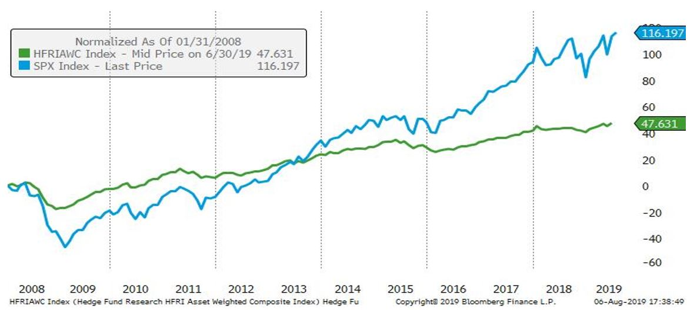

In today's competitive financial environment, presenting hedge fund performance effectively is crucial. Investors seek to allocate their resources to funds that not only promise high returns but also demonstrate consistent performance and transparent communication. Hedge funds have traditionally been perceived as opaque investment vehicles, and demystifying their performance is essential to building trust and fostering investor confidence.

Key metrics play a critical role in evaluating hedge fund performance. Among these, Net Asset Value (NAV), Assets Under Management (AUM), and track record are vital indicators. NAV represents the fund's per-share value, calculated as the total value of all assets minus liabilities. It is a primary measure used to assess the fund's performance over time. AUM, on the other hand, measures the total market value of the assets the fund manages. It serves as an indicator of the fund's growth and its capability to attract investors. The track record provides a historical performance history, allowing investors to analyze past performances as a predictor of future success.



Clarity and transparency in communication are paramount when interacting with current and potential investors. Investors need to comprehend complex financial data quickly and easily. This makes straightforward communication of performance metrics crucial. By presenting clear, concise, and relevant financial information, hedge fund managers can effectively illustrate their fund's value proposition and strategic advantages.

In essence, the ability to present hedge fund performance with explanatory precision not only aids in attracting investors but also helps in retaining them. A well-articulated performance presentation ensures that investors can make informed decisions, confident in the knowledge that they are partnering with a fund that prioritizes clarity and transparency.


## Table of Contents

## Understanding the Basics of Hedge Fund Performance Metrics

Hedge fund performance metrics serve as essential tools for evaluating fund efficiency and guiding investor decision-making. Understanding these metrics starts with familiarizing oneself with common industry terms such as Net Asset Value (NAV), Assets Under Management (AUM), and the track record of the fund. 

NAV represents the per-share value of a fund, calculated by subtracting the fund's liabilities from its assets and dividing by the total number of outstanding shares. It's a vital indicator of a fund’s health and performance over time, showing potential investors the intrinsic value of their investments. AUM, on the other hand, denotes the total market value of all the assets managed by the [hedge fund](/wiki/hedge-fund-trading-strategies). This figure not only reflects the fund’s growth and appeal but also impacts management fees, which are typically a percentage of the AUM.

A track record encapsulates a fund’s historical performance and is instrumental for investors assessing potential returns and risks associated with past behavior. A strong track record can indicate sound management and strategy execution, making it an essential component when evaluating hedge fund performance.

Absolute performance measures focus on the standalone returns achieved by a hedge fund, commonly expressed as the fund's net gain or loss over a specified period. A common absolute measure is the simple return, which is computed as:

$$
\text{Simple Return} = \frac{\text{Ending NAV} - \text{Beginning NAV}}{\text{Beginning NAV}} \times 100
$$

Relative performance measures, however, assess the fund’s returns against a benchmark index. This approach provides context around the fund's performance against market conditions or specific sectors. For instance, a hedge fund might generate a 10% return, but if the relevant market index returns 15%, the hedge fund has underperformed. Relative measures give investors insights into how well a fund manager navigates market dynamics.

Benchmarking is crucial as it sets a frame of reference against which a hedge fund's performance can be evaluated. Relevant indices might include stock indices, bond indices, or composite indices that match the fund’s investment style. Without benchmarks, investors could not accurately gauge whether a fund's returns should be considered successful relative to prevailing market conditions.

In summary, understanding and accurately utilizing these key performance metrics and benchmarks is fundamental to meaningful hedge fund analysis. They empower investors to make informed decisions based on both historical insight and current market comparisons, ensuring a comprehensive evaluation of the hedge fund's potential.


## Key Performance Metrics to Present

When evaluating hedge fund performance, certain metrics provide critical insight into the fund's efficacy and are essential for investor assessment. 

**Return on Investment (ROI)** is a straightforward measure that calculates the percentage return on a particular investment relative to its cost. It is computed as:

$$
\text{ROI} = \left(\frac{\text{Current Value of Investment} - \text{Cost of Investment}}{\text{Cost of Investment}}\right) \times 100
$$

While ROI provides a snapshot of profitability, it does not account for the time element. This is where **Compound Annual Growth Rate (CAGR)** is valuable. CAGR represents the mean annual growth rate of an investment over a specified period longer than one year, assuming the profits are reinvested. It is calculated as:

$$
\text{CAGR} = \left(\frac{\text{Ending Value}}{\text{Beginning Value}}\right)^{\frac{1}{n}} - 1
$$

where $ n $ is the number of years.

For a complete evaluation, understanding risk-adjusted metrics is vital. The **Sharpe Ratio** measures the performance of an investment by adjusting for its risk. It is calculated by subtracting the risk-free rate from the return of the investment, then dividing by the investment's standard deviation of returns:

$$
\text{Sharpe Ratio} = \frac{R_p - R_f}{\sigma_p}
$$

where $ R_p $ is the return of the portfolio, $ R_f $ is the risk-free rate, and $ \sigma_p $ is the standard deviation of the portfolio's excess return.

The **Sortino Ratio** refines this further by differentiating between harmful [volatility](/wiki/volatility-trading-strategies) and total volatility by using downside deviation in place of standard deviation:

$$
\text{Sortino Ratio} = \frac{R_p - R_f}{\sigma_d}
$$

where $ \sigma_d $ is the standard deviation of negative asset returns.

**Alpha** measures the active return on an investment compared to a market index or benchmark, essentially evaluating a portfolio manager's ability to generate excess returns:

$$
\alpha = R_p - \left(R_f + \beta \times (R_m - R_f)\right)
$$

where $ \beta $ is the beta of the investment, indicating its level of systematic risk.

Evaluating **drawdown**, specifically the maximum drawdown, is integral as it gauges the decline from the peak to the trough of an investment, signifying worst-case scenarios. This metric is crucial for understanding the resilience of the fund under adverse market conditions. It highlights the potential risks of significant capital loss, providing a perspective on the volatility and risk management effectiveness of a hedge fund.

These metrics collectively help present a well-rounded view of hedge fund performance, aiding stakeholders in making informed investment decisions grounded in both potential returns and associated risks.


## Visualizing Performance Data

Graphs and charts play a crucial role in simplifying complex data, making it more digestible for investors. By transforming raw numbers into visual formats, these tools help highlight trends, compare performance, and present insights in an accessible way. Investors are often presented with [volume](/wiki/volume-trading-strategy)s of data, and effective visualization can significantly enhance their understanding and decision-making process.

One of the primary tools utilized for data visualization is Microsoft Excel, which offers a wide range of chart options such as line graphs, bar charts, and pie charts. These are easy to create and modify, providing a straightforward way to visualize data. For more dynamic and interactive visualizations, tools like Tableau and Power BI offer a comprehensive platform where users can create complex dashboards that allow investors to drill down into specifics.

Python, with its libraries such as Matplotlib and Seaborn, offers powerful scripting capabilities for bespoke data visualization. For example, Matplotlib can be used to craft customized plots:

```python
import matplotlib.pyplot as plt

# Example data
months = ['Jan', 'Feb', 'Mar', 'Apr', 'May']
performance = [1.5, 2.3, 3.1, 2.8, 3.6]

plt.plot(months, performance)
plt.title('Monthly Performance')
plt.xlabel('Month')
plt.ylabel('Performance (%)')
plt.show()
```

This code snippet creates a simple line graph illustrating monthly performance, offering a clear visual progression over time.

When it comes to creating investor-friendly presentations, simplicity is key. Avoid cluttered graphs that can overwhelm the viewer. Focus on the main message or trend you wish to convey and use annotations to highlight critical data points. Consistent color schemes that align with the brand's identity can aid in creating a professional look.

Moreover, integrating storytelling with data can be an effective strategy. Using visualizations as a narrative tool helps investors understand the 'why' behind the numbers, linking performance metrics with strategic decisions and market conditions. This approach not only informs but engages the audience, building a compelling case for potential investment.

Ultimately, the goal of visualizing performance data is to present complex information in a manner that is not only accurate but also captivating and meaningful to investors.


## Contextualizing Performance with Market Conditions

External [factor](/wiki/factor-investing)s are crucial in influencing hedge fund performance. Various macroeconomic and geopolitical dynamics, such as [interest rate](/wiki/interest-rate-trading-strategies)s, inflation, and political stability, directly impact the investment landscape, altering asset prices and market volatility. For example, an increase in interest rates might lead to a decline in bond prices, affecting hedge funds with significant fixed-income exposure. Similarly, geopolitical tensions can lead to market uncertainties, impacting equities and commodities.

Providing context about economic conditions and market trends is essential for presenting a comprehensive picture of hedge fund performance. Investors need to understand the broader economic scenarios in which funds operate to evaluate performance concerning market conditions accurately. For instance, during a recession, a hedge fund achieving modest positive returns could be seen as outperforming the market, whereas the same performance might be underwhelming in a bull market.

Successful hedge fund managers often frame their performance concerning market environments to help investors gauge relative success and strategic insight. For example, a manager might highlight how defensive strategies helped mitigate losses during a market downturn or explain how tactical asset allocation led to outperformance during a sector rally. This perspective aligns the fund's performance with the external market landscape, offering investors a narrative that justifies results in the context of prevailing economic conditions.

Moreover, incorporating tools like regression analysis can help quantify the impact of market factors on performance. For example, a manager may use a simple linear regression to illustrate how changes in a relevant index affect the fund's returns:

```python
import numpy as np
import statsmodels.api as sm

# Example returns data
fund_returns = np.array([0.05, 0.02, -0.01, 0.03, 0.04])
market_returns = np.array([0.03, 0.01, 0.00, 0.02, 0.03])

# Add constant to model intercept
market_returns = sm.add_constant(market_returns)

# Regression analysis
model = sm.OLS(fund_returns, market_returns)
results = model.fit()

print('R-squared:', results.rsquared)
print('Beta:', results.params[1])
```

In this example, the `R-squared` value and `Beta` coefficient help indicate the sensitivity of the fund's performance to market movements, providing quantitative context that can be reassuring to investors. Overall, aligning hedge fund performance with market conditions is not only about transparency but about storytelling—helping investors contextualize and interpret results in a manner that communicates competence and strategic acumen.


## The Importance of Consistency and Long-Term Track Record

Consistency and a long-term track record are fundamental pillars in evaluating a hedge fund's performance. Demonstrating these attributes is often more beneficial than achieving short-term gains for several reasons. A hedge fund that shows consistent returns over an extended period exhibits reliability and stability, appealing qualities for potential investors. This consistency reassures investors that the fund manager's strategies are resilient to varying market conditions, thereby mitigating the perception of risk associated with market volatility.

A long-term track record serves as a testament to a fund manager's ability to navigate through different phases of the economic cycle. It provides investors with a comprehensive view of how well the fund has performed relative to benchmark indices, such as the S&P 500, across various market environments. The Sharpe Ratio can further enhance this understanding by showing the fund's risk-adjusted returns over time. Higher consistent Sharpe Ratios suggest that the fund is more likely to achieve desirable returns without taking on excessive risk.

For example, a hedge fund with a 10-year annualized return of 8% with lower volatility might be more attractive than a fund with 15% annualized returns over the same period but significantly higher volatility and a lower overall Sharpe Ratio. The formula for the annualized return, or Compound Annual Growth Rate (CAGR), demonstrates this principle mathematically:

$$
\text{CAGR} = \left( \frac{\text{Ending Value}}{\text{Beginning Value}} \right)^{\frac{1}{n}} - 1
$$

where $n$ is the number of years.

Several case studies underline the importance of a long-term performance record in attracting investments. Take the example of Renaissance Technologies, known for its Medallion Fund, which has consistently outperformed the market for decades. The fund's ability to deliver extraordinary returns year after year, regardless of market conditions, has solidified its reputation and appeal to investors.

The significance of consistency and a long-term track record can also be demonstrated through the success of the Bridgewater Associates. The firm has managed to sustain impressive growth over the years, helping to build investor trust and confidence by showcasing its ability to adapt to shifting economic landscapes while maintaining a steady performance trajectory.

In conclusion, emphasizing consistency over mere short-term gains and presenting a compelling long-term track record are invaluable for hedge funds looking to attract and retain investors. They present a narrative of stability, robust strategies, and an enduring capability to generate growth, which collectively instill confidence among investors.


## Communicating Strategy and Risk Management

Communicating how hedge fund strategies align with their performance metrics is crucial for building investor trust. Investors need to understand that the returns they see are not merely numbers, but the result of deliberate and strategic decision-making processes. This alignment can be demonstrated through a clear articulation of investment objectives and how specific strategies are employed to achieve these goals.

Risk management is a cornerstone of hedge fund performance. Effective risk management can significantly influence a fund's success, as it ensures that the capital is protected while seeking optimal returns. Various approaches are utilized to manage risk, including diversification, hedging, and the use of derivatives. Each method has its implications for performance, often balancing potential returns against the associated risks.

For example, diversification—spreading investments across various asset classes—helps reduce the impact of any single asset's poor performance on the overall portfolio. Hedging, on the other hand, involves making investments that offset potential losses in the main portfolio, thereby securing the fund against market volatility. Another method involves derivatives, which can be used to gain anytime adjustments in exposure levels.

Assuring investors of proactive and adaptive risk management requires transparency and robust communication strategies. One effective way to achieve this is by establishing a clear narrative of how risks are identified, assessed, and mitigated over time. Regular updates on the fund’s exposure to different risk factors and the steps taken to address them can provide additional reassurance.

Moreover, quantitative metrics such as Value at Risk (VaR) and stress testing scenarios can be shared to demonstrate the potential impact of risk on the portfolio and the fund's capacity to withstand adverse market conditions. This quantitative data can be effectively communicated using clear visual tools or dashboards, which simplify complex data into investor-friendly formats.

Integrating adaptive risk management practices aligns with the dynamic nature of market environments. Hedge funds that continuously assess and adjust their risk profiles in response to changing market conditions position themselves not only to protect investor capital but also to capitalize on new opportunities. By doing so, they provide investors with a clear understanding of both the potential and the protections involved in their investments.


## Engaging with Potential Investors

Engaging with potential investors is a crucial phase in the lifecycle of a hedge fund, as it sets the stage for future collaboration and investment. Effective communication strategies tailored to individual investor needs and preferences can significantly enhance engagement and foster long-term relationships.

### Best Practices for Initial Communications with Potential Investors

Successfully engaging with potential investors begins with a nuanced understanding of their goals, risk appetite, and investment horizons. Financial professionals should focus on developing bespoke communication strategies that address the unique concerns and objectives of different investor types. Institutional investors, for instance, may prioritize detailed performance metrics and risk management strategies, whereas individual investors might appreciate a more holistic overview of fund performance and strategic goals.

Customizing communication not only demonstrates an understanding of investor needs but also establishes a foundation of trust and transparency. At the outset, clearly explaining the fund's objectives, strategies, and governance structures can go a long way in building investor confidence. Providing comprehensive data, supported by historical performance records and economic forecasts, helps reinforce the fund’s credibility.

### The Importance of a Tailored Approach

Different investors have varying levels of financial literacy and interests. Therefore, tailoring communication ensures that information is both accessible and relevant. For example, while high-net-worth individuals might be interested in projections of potential returns alongside tax implications, family offices may focus more on long-term stability and succession planning.

Engagement can be further personalized by creating direct communication channels with investors. This could involve regular one-on-one meetings, investor webinars, or personalized newsletters that focus on specific areas of interest to the investor. By segmenting investors and adjusting the complexity and depth of information shared, fund managers can significantly improve investor satisfaction and loyalty.

### Regular Updates and Transparency

Investors value transparency and appreciate regular updates on fund performance, particularly during volatile market conditions. Regular communication can take the form of quarterly reports, monthly newsletters, and annual investor meetings, where fund managers offer insights into performance outcomes, market conditions, and any strategic adjustments made to the portfolio.

Transparent and consistent communication creates an environment of trust, enabling investors to feel more secure about their investment choices. Trust is further reinforced when fund managers proactively disclose both positive outcomes and challenges faced by the hedge fund, as this honesty in communication demonstrates integrity and a commitment to ethical standards.

In conclusion, the key to engaging potential investors lies in a well-crafted communication strategy that is both personalized and transparent. By focusing on these best practices, hedge fund managers can not only attract investment but also build a loyal investor base that supports long-term fund growth and success.


## Conclusion

In conclusion, presenting hedge fund performance data clearly and transparently is vital for gaining and maintaining investor trust. A good presentation combines both quantitative metrics and qualitative explanations. By showcasing performance through key metrics such as ROI, CAGR, and risk-adjusted returns, hedge funds can offer a comprehensive view of their performance, highlighting both achievements and the context behind the numbers. Transparency in sharing strategies, risk management, and the economic conditions that impact performance helps build a framework investors can rely on.

Moreover, a consistent, long-term track record is a strong testament to a hedge fund's reliability, showcasing not only growth but stability over time. A strategically communicated performance story aligns the hedge fund's objectives with investor expectations, ensuring clarity. This approach should also include an emphasis on adaptive strategies and consistent communication, which are crucial for building and sustaining lasting relationships with stakeholders.

Ultimately, clear performance presentation is not just about numbers; it's about fostering confidence and understanding. By committing to open and ongoing communication, hedge funds can strengthen investor relationships, ensuring longevity and mutual success in the dynamic financial landscape.


## References & Further Reading

[1]: "Investment Performance Measurement" by Bruce J. Feibel. This book provides extensive insights into performance metrics like NAV, AUM, and others used in evaluating investment performance.

[2]: "The New Fund Order: A Digital Death for Fund Selection?" discusses transparency and communication in fund management, relevant to investor engagement and performance presentation.

[3]: "Hedge Funds For Dummies" by Ann C. Logue, which offers a clear overview of how hedge funds operate, including performance evaluation and risk management strategies.

[4]: CFA Institute. (2021). ["Global Investment Performance Standards (GIPS)."](https://www.cfainstitute.org/en/ethics-standards/codes/gips-standards) This provides guidelines on performance presentation and reporting, crucial for ensuring compliance in hedge funds.

[5]: Lo, Andrew W. (2008). "Hedge Funds: An Analytic Perspective." Provides analysis and context concerning the evaluation of hedge fund performance in varying market conditions.