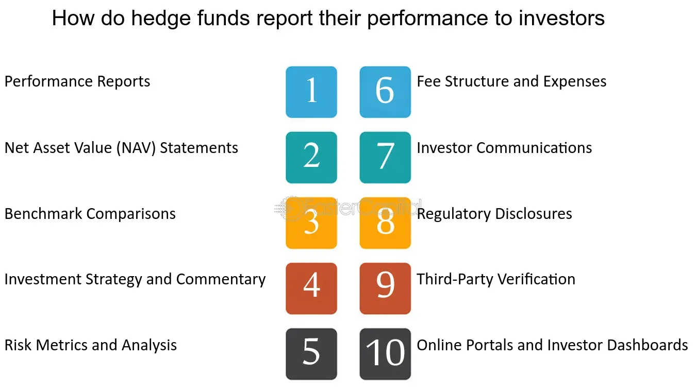

## Table of Contents

## What are the basic metrics used to measure hedge fund performance?

Hedge fund performance is typically measured using several key metrics that help investors understand how well the fund is doing. The most common metric is the return on investment, which shows how much the fund's value has increased or decreased over a specific period. This can be expressed as a percentage and is often compared to a benchmark, like a stock market index, to see if the fund is outperforming or underperforming the market.

Another important metric is the risk-adjusted return, which considers not just the returns but also the level of risk taken to achieve those returns. A popular measure of risk-adjusted return is the Sharpe ratio, which compares the fund's excess return over the risk-free rate to its standard deviation. A higher Sharpe ratio indicates a better risk-adjusted performance. This helps investors see if the fund is taking on too much risk for the returns it is generating.

Lastly, volatility is another key metric, often measured by the standard deviation of the fund's returns. High volatility means the fund's returns can swing widely, indicating higher risk. Low volatility suggests more stable returns, which might be preferable for risk-averse investors. Together, these metrics give a comprehensive view of a hedge fund's performance, helping investors make informed decisions.

## How do you calculate the annualized return of a hedge fund?

To calculate the annualized return of a hedge fund, you need to know the total return over a period and the length of that period. If the fund's return is given for a period that is not a year, you can convert it to an annualized return. For example, if you know the return over three months, you can use a formula to figure out what the return would be if it continued at the same rate for a whole year. The basic formula is: (1 + total return)^(1/number of periods) - 1, where the number of periods is how many times that period fits into a year. For a three-month return, you would use 4 as the number of periods because there are four quarters in a year.

Let's say a hedge fund made a 3% return over three months. To find the annualized return, you would calculate (1 + 0.03)^(1/0.25) - 1. This equals about 12.55%. This means if the fund kept earning at the same rate every three months, it would have a 12.55% return over a year. This helps investors compare the performance of different funds over different time periods on an equal basis.

## What is the Sharpe Ratio and how is it used to evaluate hedge fund performance?

The Sharpe Ratio is a way to measure how well a hedge fund is doing when you think about the risk it takes. It was made by a man named William F. Sharpe. The ratio looks at how much extra money the fund makes compared to a safe investment like a U.S. Treasury bond, and then it divides that by how much the fund's returns go up and down. If the Sharpe Ratio is high, it means the fund is doing a good job of making money without taking too much risk.

People use the Sharpe Ratio to see if a hedge fund is worth the risk. A higher Sharpe Ratio means the fund is doing better at turning risk into reward. For example, if one fund has a Sharpe Ratio of 1.5 and another has a Sharpe Ratio of 0.5, the first fund is probably a better choice because it's getting more return for each bit of risk it takes. This helps investors pick funds that are not just making money, but making money in a smart way by managing risk well.

## How can the Sortino Ratio provide a more nuanced view of risk-adjusted returns?

The Sortino Ratio is another way to look at how well a hedge fund is doing, but it's different from the Sharpe Ratio because it only cares about bad risk. The Sharpe Ratio looks at all kinds of ups and downs in a fund's returns, but the Sortino Ratio only looks at the downs, or the times when the fund loses money. This is important because investors usually worry more about losing money than about big gains. So, the Sortino Ratio helps you see if a fund is good at avoiding losses, which can be really helpful when you're trying to decide if a fund is right for you.

Using the Sortino Ratio can give you a better idea of a fund's performance because it focuses on the risk that really matters to most people. If a fund has a high Sortino Ratio, it means it's doing a good job of making money without having too many big losses. This can be more useful than the Sharpe Ratio for someone who wants to protect their money from going down. By looking at the Sortino Ratio, you can pick a fund that not only makes money but also keeps your money safer from big drops.

## What role does the alpha play in showcasing a hedge fund's performance?

Alpha is a way to see how well a hedge fund is doing compared to what you would expect it to do. It shows if the fund is beating the market or not. If a fund has a positive alpha, it means it's doing better than you would expect just by following the market. For example, if the market goes up by 10% and the fund goes up by 12%, the extra 2% is the alpha. This is important because it tells investors if the fund managers are good at picking investments or if they're just riding the market's wave.

Investors use alpha to decide if they should put their money in a hedge fund. A high alpha means the fund is doing something special to make more money than the market. This can make the fund more attractive because it shows the managers have skill. But if the alpha is zero or negative, it might mean the fund isn't doing anything special and is just following the market, or even doing worse. So, alpha helps investors see if a hedge fund is worth the fees they charge.

## How do you use beta to compare a hedge fund's volatility to the market?

Beta is a number that tells you how much a hedge fund's returns move compared to the market. If a fund has a beta of 1, it means it moves the same way as the market. If the market goes up by 10%, the fund should go up by about 10% too. But if the fund has a beta of 2, it's twice as sensitive to the market's moves. So if the market goes up by 10%, the fund might go up by 20%. This helps investors see how much risk they're taking compared to just investing in the market.

Using beta, investors can compare how much a hedge fund moves around compared to the whole market. A beta less than 1 means the fund is less risky than the market, and a beta more than 1 means it's riskier. For example, if a fund has a beta of 0.5, it's only half as sensitive to the market's ups and downs. This can be good if you want less risk. But if you're okay with more risk and want bigger returns, a fund with a higher beta might be what you're looking for.

## What are drawdowns and how should they be presented to investors?

Drawdowns are how much a hedge fund loses from its highest point to its lowest point before it starts going up again. It's like a dip in the fund's value. Investors care about drawdowns because they show how much money they could lose at the worst time. A big drawdown means the fund lost a lot of value before it got better, which can be scary for investors.

When presenting drawdowns to investors, it's important to be clear and honest. You should show them a chart or a graph that makes it easy to see when the drawdowns happened and how big they were. Also, explain what caused the drawdowns, like a bad market or a specific investment that didn't work out. This helps investors understand the risks and decide if they're okay with them.

## How can you use the Information Ratio to demonstrate a fund's ability to generate excess returns?

The Information Ratio is a way to show how well a hedge fund does at making more money than a benchmark, like a stock market index, while also thinking about the risk it takes. It's like a score that tells you if the fund is good at picking investments that do better than the market. The Information Ratio is calculated by taking the extra return the fund makes over the benchmark and dividing it by how much those extra returns go up and down. A higher Information Ratio means the fund is doing a great job at beating the market without taking too much risk.

This ratio is helpful for investors because it shows if the fund managers are skilled at choosing investments that do better than the market. If a fund has a high Information Ratio, it means it's consistently making more money than the market and doing it in a way that's not too risky. This can make the fund more attractive to investors who want to see if the fund is worth the fees they have to pay. By looking at the Information Ratio, investors can decide if the fund is good at generating extra returns in a smart way.

## What are the best practices for presenting performance data in a hedge fund pitch?

When presenting performance data in a hedge fund pitch, it's important to keep things clear and easy to understand. Start by showing the main numbers like returns, risk, and how the fund did compared to the market. Use charts and graphs to make it easy for people to see the ups and downs of the fund's value over time. Make sure to explain what the numbers mean in simple terms, so everyone can understand if the fund did well or not. It's also good to talk about any big drops in value, or drawdowns, and what caused them. This helps investors see the risks they might face.

Next, use key measures like the Sharpe Ratio, Sortino Ratio, alpha, beta, and Information Ratio to show how the fund handles risk and makes extra money. Explain these in simple language, so investors can see if the fund is good at turning risk into reward. For example, a high Sharpe Ratio means the fund did well for the risk it took. Also, be honest about the fund's performance. Don't hide the bad parts, because investors need to know everything to make a good decision. By being clear and open, you help investors trust the fund and see if it's right for them.

## How do you address the impact of fees on reported performance figures?

When you look at how well a hedge fund is doing, you need to think about the fees they charge. Fees can make the fund's performance look worse than it really is. For example, if a fund makes 10% before fees but charges a 2% management fee and a 20% performance fee, the returns you actually get could be much lower. It's important to show investors both the returns before fees and after fees, so they can see the real impact of those costs.

To make this clear, you can use a simple table or chart to compare the returns before and after fees. This helps investors understand how much of their money is going to the fund managers and how much they're keeping. Being honest about fees builds trust and helps investors make better choices about whether the fund is worth the cost.

## What advanced statistical models can be used to predict future hedge fund performance?

One advanced statistical model that can be used to predict future hedge fund performance is the Autoregressive Integrated Moving Average (ARIMA) model. This model looks at past data to find patterns and uses those patterns to guess what might happen next. It's like looking at how the fund did in the past few months or years and then using that information to predict how it will do in the next few months or years. ARIMA is good at handling data that changes over time, which is perfect for hedge funds because their performance can go up and down a lot.

Another model is the GARCH (Generalized Autoregressive Conditional Heteroskedasticity) model, which focuses on how much the fund's returns can swing around. It helps predict not just the returns but also how much risk there might be in the future. GARCH is useful because it can tell you if the fund's performance might be more stable or if it could have big ups and downs. By using these models, investors can get a better idea of what to expect from a hedge fund, helping them make smarter decisions about where to put their money.

## How do you incorporate qualitative factors into the performance presentation to potential investors?

When you talk about a hedge fund's performance to potential investors, it's not just about numbers. You also need to talk about qualitative factors, like the team behind the fund. This means telling investors about the experience and skills of the people managing the fund. For example, if the managers have a good track record or special knowledge about certain markets, that can make investors feel more confident. You can also mention the fund's strategy and how it's different from others. This helps investors see if the fund's way of making money fits with what they want.

Another important qualitative factor is the fund's risk management practices. Investors want to know how the fund handles risks and what steps it takes to protect their money. You can explain the processes the fund uses to watch and control risks, like regular checks or using different types of investments to spread out risk. Also, talking about the fund's reputation and any awards or recognition it has received can make it more appealing. By including these qualitative factors in your presentation, you give investors a fuller picture of the fund, helping them decide if it's the right choice for them.

## What are the Basics of Hedge Fund Performance Metrics?

Hedge fund performance metrics serve as essential tools for evaluating fund efficiency and guiding investor decision-making. Understanding these metrics starts with familiarizing oneself with common industry terms such as Net Asset Value (NAV), Assets Under Management (AUM), and the track record of the fund. 

NAV represents the per-share value of a fund, calculated by subtracting the fund's liabilities from its assets and dividing by the total number of outstanding shares. It's a vital indicator of a fund’s health and performance over time, showing potential investors the intrinsic value of their investments. AUM, on the other hand, denotes the total market value of all the assets managed by the [hedge fund](/wiki/hedge-fund-trading-strategies). This figure not only reflects the fund’s growth and appeal but also impacts management fees, which are typically a percentage of the AUM.

A track record encapsulates a fund’s historical performance and is instrumental for investors assessing potential returns and risks associated with past behavior. A strong track record can indicate sound management and strategy execution, making it an essential component when evaluating hedge fund performance.

Absolute performance measures focus on the standalone returns achieved by a hedge fund, commonly expressed as the fund's net gain or loss over a specified period. A common absolute measure is the simple return, which is computed as:

$$
\text{Simple Return} = \frac{\text{Ending NAV} - \text{Beginning NAV}}{\text{Beginning NAV}} \times 100
$$

Relative performance measures, however, assess the fund’s returns against a benchmark index. This approach provides context around the fund's performance against market conditions or specific sectors. For instance, a hedge fund might generate a 10% return, but if the relevant market index returns 15%, the hedge fund has underperformed. Relative measures give investors insights into how well a fund manager navigates market dynamics.

Benchmarking is crucial as it sets a frame of reference against which a hedge fund's performance can be evaluated. Relevant indices might include stock indices, bond indices, or composite indices that match the fund’s investment style. Without benchmarks, investors could not accurately gauge whether a fund's returns should be considered successful relative to prevailing market conditions.

In summary, understanding and accurately utilizing these key performance metrics and benchmarks is fundamental to meaningful hedge fund analysis. They empower investors to make informed decisions based on both historical insight and current market comparisons, ensuring a comprehensive evaluation of the hedge fund's potential.

## What are the Key Performance Metrics to Present?

When evaluating hedge fund performance, certain metrics provide critical insight into the fund's efficacy and are essential for investor assessment. 

**Return on Investment (ROI)** is a straightforward measure that calculates the percentage return on a particular investment relative to its cost. It is computed as:

$$
\text{ROI} = \left(\frac{\text{Current Value of Investment} - \text{Cost of Investment}}{\text{Cost of Investment}}\right) \times 100
$$

While ROI provides a snapshot of profitability, it does not account for the time element. This is where **Compound Annual Growth Rate (CAGR)** is valuable. CAGR represents the mean annual growth rate of an investment over a specified period longer than one year, assuming the profits are reinvested. It is calculated as:

$$
\text{CAGR} = \left(\frac{\text{Ending Value}}{\text{Beginning Value}}\right)^{\frac{1}{n}} - 1
$$

where $ n $ is the number of years.

For a complete evaluation, understanding risk-adjusted metrics is vital. The **Sharpe Ratio** measures the performance of an investment by adjusting for its risk. It is calculated by subtracting the risk-free rate from the return of the investment, then dividing by the investment's standard deviation of returns:

$$
\text{Sharpe Ratio} = \frac{R_p - R_f}{\sigma_p}
$$

where $ R_p $ is the return of the portfolio, $ R_f $ is the risk-free rate, and $ \sigma_p $ is the standard deviation of the portfolio's excess return.

The **Sortino Ratio** refines this further by differentiating between harmful [volatility](/wiki/volatility-trading-strategies) and total volatility by using downside deviation in place of standard deviation:

$$
\text{Sortino Ratio} = \frac{R_p - R_f}{\sigma_d}
$$

where $ \sigma_d $ is the standard deviation of negative asset returns.

**Alpha** measures the active return on an investment compared to a market index or benchmark, essentially evaluating a portfolio manager's ability to generate excess returns:

$$
\alpha = R_p - \left(R_f + \beta \times (R_m - R_f)\right)
$$

where $ \beta $ is the beta of the investment, indicating its level of systematic risk.

Evaluating **drawdown**, specifically the maximum drawdown, is integral as it gauges the decline from the peak to the trough of an investment, signifying worst-case scenarios. This metric is crucial for understanding the resilience of the fund under adverse market conditions. It highlights the potential risks of significant capital loss, providing a perspective on the volatility and risk management effectiveness of a hedge fund.

These metrics collectively help present a well-rounded view of hedge fund performance, aiding stakeholders in making informed investment decisions grounded in both potential returns and associated risks.

## What is the Importance of Consistency and Long-Term Track Record?

Consistency and a long-term track record are fundamental pillars in evaluating a hedge fund's performance. Demonstrating these attributes is often more beneficial than achieving short-term gains for several reasons. A hedge fund that shows consistent returns over an extended period exhibits reliability and stability, appealing qualities for potential investors. This consistency reassures investors that the fund manager's strategies are resilient to varying market conditions, thereby mitigating the perception of risk associated with market volatility.

A long-term track record serves as a testament to a fund manager's ability to navigate through different phases of the economic cycle. It provides investors with a comprehensive view of how well the fund has performed relative to benchmark indices, such as the S&P 500, across various market environments. The Sharpe Ratio can further enhance this understanding by showing the fund's risk-adjusted returns over time. Higher consistent Sharpe Ratios suggest that the fund is more likely to achieve desirable returns without taking on excessive risk.

For example, a hedge fund with a 10-year annualized return of 8% with lower volatility might be more attractive than a fund with 15% annualized returns over the same period but significantly higher volatility and a lower overall Sharpe Ratio. The formula for the annualized return, or Compound Annual Growth Rate (CAGR), demonstrates this principle mathematically:

$$
\text{CAGR} = \left( \frac{\text{Ending Value}}{\text{Beginning Value}} \right)^{\frac{1}{n}} - 1
$$

where $n$ is the number of years.

Several case studies underline the importance of a long-term performance record in attracting investments. Take the example of Renaissance Technologies, known for its Medallion Fund, which has consistently outperformed the market for decades. The fund's ability to deliver extraordinary returns year after year, regardless of market conditions, has solidified its reputation and appeal to investors.

The significance of consistency and a long-term track record can also be demonstrated through the success of the Bridgewater Associates. The firm has managed to sustain impressive growth over the years, helping to build investor trust and confidence by showcasing its ability to adapt to shifting economic landscapes while maintaining a steady performance trajectory.

In conclusion, emphasizing consistency over mere short-term gains and presenting a compelling long-term track record are invaluable for hedge funds looking to attract and retain investors. They present a narrative of stability, robust strategies, and an enduring capability to generate growth, which collectively instill confidence among investors.

## References & Further Reading

[1]: "Investment Performance Measurement" by Bruce J. Feibel. This book provides extensive insights into performance metrics like NAV, AUM, and others used in evaluating investment performance.

[2]: "The New Fund Order: A Digital Death for Fund Selection?" discusses transparency and communication in fund management, relevant to investor engagement and performance presentation.

[3]: "Hedge Funds For Dummies" by Ann C. Logue, which offers a clear overview of how hedge funds operate, including performance evaluation and risk management strategies.

[4]: CFA Institute. (2021). ["Global Investment Performance Standards (GIPS)."](https://www.cfainstitute.org/en/ethics-standards/codes/gips-standards) This provides guidelines on performance presentation and reporting, crucial for ensuring compliance in hedge funds.

[5]: Lo, Andrew W. (2008). "Hedge Funds: An Analytic Perspective." Provides analysis and context concerning the evaluation of hedge fund performance in varying market conditions.