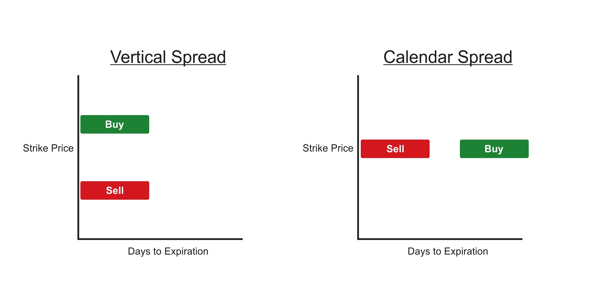

Quantitative trading represents a significant evolution in the landscape of modern finance. It leverages mathematical models and algorithms to exploit market efficiencies and execute trades at high speed and volume. This method has fundamentally transformed how investment strategies are conceived and executed, offering a scientific approach to decision-making in the financial markets.

Within this framework lies spread trading, a sophisticated strategy integral to quantitative trading ventures. Spread trading involves simultaneously buying and selling related securities. These securities could be the same underlying asset with different contract months in the case of calendar spreads, or different assets with a historical correlation in the case of inter-market spreads. The primary aim is not to speculate on the direction of individual prices but to profit from the price difference, or "spread," between them. This approach is inherently designed to minimize exposure to market volatility—all while exploiting discrepancies and inefficiencies in market pricing.



This article will explain the workings of spread trading as a key component of quantitative trading. We'll explore the mechanics of executing spread trades, the quantitative models employed to reveal potential opportunities, and how risk is managed. By understanding how these elements intersect, traders can better harness the power inherent in quantitative trading strategies, achieving a balance between risk and reward that is pivotal to modern finance. Our exploration will also cover the challenges and advantages spread trading brings to the quantitative trading arsenal, setting the stage for future developments and innovations in the field.


## Table of Contents

## Understanding Spread Trading

Spread trading is a trading strategy that involves the simultaneous purchase and sale of two related securities. The aim is to profit from the difference, or spread, between their prices. This approach allows traders to minimize market exposure and focus on relative performance between two assets rather than their absolute price movements.

### Types of Spread Trading

1. **Intraday Spreads**: These are trades that are opened and closed within the same trading day. Intraday spreads are popular in highly liquid markets like forex or stock indices, where traders take advantage of short-term price discrepancies. The primary goal is to exploit temporary inefficiencies within a single trading session, thus minimizing overnight risk.

2. **Inter-market Spreads**: This type involves positions in related markets, such as trading a spread between commodities like crude oil and natural gas. Inter-market spreads rely on the historical or economic relationship between commodities, indices, or financial instruments, targeting the price differentials that might occur due to varying demand and supply factors.

3. **Calendar Spreads**: Calendar spreads are executed with contracts of the same underlying asset but different expiration dates. For instance, in futures markets, a trader might sell a nearer-term contract and buy a longer-term contract if they anticipate a particular price movement over time. This type of spread is primarily used to capture the effect of time decay or shifts in expectations over different time horizons.

### Rationale for Spread Trading

The rationale behind spread trading is grounded in risk management and the potential to exploit market inefficiencies. By engaging in spread trades, traders can mitigate directional risk, which is the risk of price movement in any one direction, since they are simultaneously buying one asset and selling another. This creates a hedged position, reducing the impact of adverse market movements.

Moreover, spread trading provides an opportunity to capitalize on price inefficiencies between two related instruments. Through quantitative analysis and historical data, traders identify spreads that become mispriced due to market events, economic developments, or temporary [liquidity](/wiki/liquidity-risk-premium) constraints. This strategy is particularly attractive in scenarios where the relationship between the two assets is expected to normalize, thus allowing traders to lock in profits when the expected convergence occurs.

In summary, spread trading offers a strategically balanced approach to capturing relative value changes, lending itself well to [quantitative trading](/wiki/quantitative-trading) methodologies that emphasize systematic risk control and efficient market exploitation.


## Mechanics of Spread Trading

Spread trading involves executing trades by simultaneously buying and selling different securities. This approach aims to capitalize on the relative price movement between the chosen instruments rather than their absolute price movements. A spread trade often involves two related securities, such as futures contracts, options, or stocks, allowing traders to gain from price discrepancies between them.

Executing a spread trade requires precise timing and access to reliable trading platforms. Popular trading platforms for executing spread trades include [Interactive Brokers](/wiki/interactive-brokers-api), Thinkorswim by TD Ameritrade, and proprietary trading systems used by quantitative trading firms. These platforms provide necessary features such as [algorithmic trading](/wiki/algorithmic-trading) capabilities, real-time data feeds, and risk management tools that facilitate the efficient execution of spread trades.

Several key metrics and indicators help assess the viability of a spread trade. The spread ratio, which is the price ratio between two traded instruments, is fundamental. Traders often construct the spread with a specific ratio to maintain balance in the trade, aiming to profit from changes in this ratio.

Another important metric is the correlation coefficient between the securities involved in the spread. A high correlation suggests that the securities move in tandem, promising a more predictable spread movement. However, spread traders often look for pairs where temporary deviations from expected correlation occur, as these might signal trading opportunities.

Technical indicators such as Bollinger Bands and moving averages can also be applied to spread trading strategies. For instance, a moving average crossover might indicate an entry or [exit](/wiki/exit-strategy) point for a spread trade, while Bollinger Bands can help identify overbought or oversold conditions.

Here’s a simple Python example using historical price data to visualize a spread ratio between two assets:

```python
import pandas as pd
import numpy as np
import matplotlib.pyplot as plt

# Example prices
asset1_prices = np.random.normal(loc=100, scale=10, size=100)
asset2_prices = np.random.normal(loc=95, scale=9, size=100)

# Create a DataFrame
data = pd.DataFrame({'Asset1': asset1_prices, 'Asset2': asset2_prices})

# Calculate the spread ratio
data['SpreadRatio'] = data['Asset1'] / data['Asset2']

# Plot the spread ratio
plt.figure(figsize=(12, 6))
plt.plot(data['SpreadRatio'], label='Spread Ratio', color='blue')
plt.title('Spread Ratio over Time')
plt.xlabel('Time')
plt.ylabel('Spread Ratio')
plt.legend()
plt.show()
```

This code simulates the price data of two assets and calculates their spread ratio. While simplistic, this visualization can help traders understand how the spread ratio evolves over time and identify potential points of entry and exit based on their chosen strategy.

Finally, it's essential to use risk management techniques. These include setting stop-loss orders and monitoring the spread for sudden changes that could indicate unfavorable market conditions. By effectively managing the mechanics of execution and risk, traders enhance their ability to profit from spread trading strategies.


## Role of Quantitative Models in Spread Trading

Quantitative models play a crucial role in identifying and capitalizing on spread trading opportunities by analyzing vast datasets and applying advanced statistical and mathematical techniques. These models are designed to detect price discrepancies between related financial instruments or markets, helping traders execute spread trades with greater precision and efficiency. One common approach is the use of mean-reversion strategies, which rely on the assumption that the price relationship between two securities will converge to its historical mean over time. By identifying when a spread deviates from this mean, quantitative models can signal potential trades.

Popular quantitative models and algorithms employed in spread trading include statistical [arbitrage](/wiki/arbitrage), pairs trading, and cointegration models. Statistical arbitrage uses statistical techniques to exploit price discrepancies, while pairs trading involves matching two correlated securities and capitalizing on the divergence in their price movements. Cointegration models, on the other hand, identify pairs of securities that have a stable, long-term equilibrium relationship, allowing traders to take positions when the spread deviates from this equilibrium.

The benefits of employing quantitative approaches in spread trading are manifold. First, these models enhance the speed and accuracy of trade execution, as they can process and analyze large amounts of data rapidly to identify trading signals. Moreover, quantitative models reduce human biases and errors, providing a more systematic and disciplined approach to trading. In addition, they can be backtested using historical data to validate their efficacy and improve predictive accuracy.

By leveraging sophisticated algorithms and computational power, quantitative models enable traders to optimize their strategies and make informed decisions. These approaches not only enhance the profitability of spread trading but also ensure that risks are managed effectively, making them invaluable tools in the toolkit of modern quantitative traders.


## Risk Management in Spread Trading

Spread trading, while offering potential advantages in terms of reduced risk and market neutrality, is not devoid of challenges. Effective risk management is crucial to safeguard against common risks encountered in this trading strategy, namely market and execution risks.

### Common Risks in Spread Trading

**Market Risk:** This risk arises from adverse price movements in the security pair being traded. Although spread trading involves betting on the relative movement between two securities (rather than their absolute price changes), significant market shifts can impact both legs of a trade unevenly, leading to unexpected losses.

**Execution Risk:** This occurs when there is a delay or failure in executing one or both legs of a spread trade. Timely execution is critical in spread trading, as even minor delays can result in price slippage, diminishing the potential for profit or increasing losses.

### Strategies for Risk Mitigation

**Diversification and Hedging:** Diversification within spread trades can be achieved by engaging in multiple spreads across different markets or sectors simultaneously. This approach can help mitigate risks associated with market-specific events. Hedging involves offsetting potential losses in one leg of the spread by gains in another, effectively reducing the net exposure to price movements.

For example, if a trader is simultaneously long on Security A and short on Security B, a hedge could involve taking an additional position that benefits if B's price rises unexpectedly, ensuring that the overall portfolio impact is minimized.

### Role of Back-testing and Stress-testing

**Back-testing:** This technique involves simulating spread trading strategies using historical data to assess their viability and potential profitability. By examining past performance, traders can identify weaknesses in their strategy and make necessary adjustments to improve future outcomes. Python libraries like `pandas` and `numpy` can be used to efficiently back-test strategies:

```python
import pandas as pd
import numpy as np

# Example data
prices_a = pd.Series([10, 10.5, 11, 10.8])
prices_b = pd.Series([5, 5.2, 5.1, 5])

# Calculate spread
spread = prices_a - prices_b

# Back-test logic
profit = np.sum(spread.shift(-1) - spread)

print(f"Total Profit from Spread Trading: {profit}")
```

**Stress-testing:** This involves evaluating the performance of spread trading strategies under extreme market conditions. Stress-testing helps in understanding how a strategy might fare during scenarios of high volatility or liquidity crunches, allowing traders to prepare for adverse situations. For example, a stress test might simulate market scenarios like the 2008 financial crisis or a rapid interest rate hike, helping to identify potential vulnerabilities.

Incorporating these risk management techniques ensures that traders can better withstand the inherent uncertainties in spread trading, maintaining a robust and resilient trading strategy.


## Advantages and Challenges of Spread Trading in Quantitative Trading

Spread trading offers several advantages that make it an attractive strategy for quantitative traders. One of the primary benefits is reduced risk. This is achieved by taking offsetting positions in related securities, which helps balance gains and losses. For instance, if a trader buys one asset and sells another to exploit the price difference, losses in one position can potentially be offset by gains in the other. This technique minimizes the exposure to directional market movements, thereby reducing overall market risk.

Another advantage is market neutrality. Spread trading does not depend on the market moving in a specific direction to realize a profit. Instead, it capitalizes on the relative price movements between the spread components. This quality is particularly important for quantitative traders who aim to generate alpha irrespective of market conditions. This neutral approach allows traders to potentially profit in both bullish and bearish markets by focusing on price discrepancies rather than overall market trends.

Diversification is also a key draw of spread trading. By engaging with different asset classes or markets, traders can distribute their risk across a broader range of securities. This diversification can be instrumental in safeguarding against [volatility](/wiki/volatility-trading-strategies) in any single market. For example, a trader might engage in an inter-market spread, involving both commodities and equities, thus spreading exposure across different financial sectors.

Despite these advantages, spread trading comes with its own set of challenges. A significant concern is model risk, which stems from the reliance on quantitative models to identify trading opportunities. These models may sometimes fail to accurately predict market movements, resulting in potential losses. As market conditions change, models must be continuously validated and updated, which requires substantial computational resources and expertise.

Transaction costs present another challenge. Spread trading often involves frequent buying and selling, which can add up in terms of commissions and fees. High transaction costs can erode the narrow profit margins that spread traders typically operate with, making cost-effective execution critical.

Real-world examples provide valuable insights into how spread trading strategies are successfully implemented. Renaissance Technologies, a prominent quantitative trading firm, is known for its effective use of [statistical arbitrage](/wiki/statistical-arbitrage), a type of spread trading. By harnessing sophisticated algorithms and high-frequency trading platforms, they exploit small price discrepancies across various securities, often in a matter of milliseconds.

In conclusion, while spread trading offers the allure of reduced risk, market neutrality, and diversification, it requires careful management of model accuracy and transaction expenses. As the landscape of quantitative trading continues to evolve, the adaptability and sophistication of spread trading strategies remain crucial to their success.


## Conclusion

In this article, we explored the fundamental aspects of spread trading as an essential component of quantitative trading strategies. Spread trading was highlighted as a technique that involves the simultaneous purchase and sale of two related securities, allowing traders to capitalize on price discrepancies while maintaining a level of risk management. The various types of spread trading, such as intraday, inter-market, and calendar spreads, each offer distinct opportunities for minimizing risk and exploiting market inefficiencies.

Quantitative models play a crucial role in identifying and executing spread trades. These models enhance the accuracy and speed necessary in today's fast-paced financial environments, allowing traders to make informed decisions based on robust data analysis. With advancements in technology and the growing availability of sophisticated trading platforms, spread trading has become more accessible and efficient.

However, spread trading does not come without challenges. Risks such as market volatility and execution discrepancies must be carefully managed through diversification and hedging techniques. Tools like back-testing and stress-testing help traders prepare for unforeseen market conditions, pulling from past data to simulate various scenarios.

Looking ahead, spread trading will likely continue to evolve, driven by the development of more advanced quantitative models and algorithms. As computational power increases and data analytics techniques become more refined, traders will have even greater tools at their disposal to identify profitable spread opportunities. Moreover, as global markets become more interconnected, the potential for spread trading across different asset classes and regions could open new avenues for diversification and reduced transaction costs.

In conclusion, spread trading remains a vital strategy within quantitative trading, offering notable advantages such as reduced risk and enhanced market neutrality. As technology and trading methodologies advance, the landscape of spread trading will undoubtedly continue to transform, offering both challenges and opportunities for traders eager to harness its potential.


## References & Further Reading

[1]: Avellaneda, M., & Lee, J. H. (2010). ["Statistical Arbitrage in the U.S. Equities Market."](https://math.nyu.edu/~avellane/AvellanedaLeeStatArb071108.pdf) Quantitative Finance, 10(7).

[2]: Aldridge, I. (2013). ["High-Frequency Trading: A Practical Guide to Algorithmic Strategies and Trading Systems."](https://www.amazon.com/High-Frequency-Trading-Practical-Algorithmic-Strategies/dp/1118343506) Wiley.

[3]: Pardo, R. (2008). ["The Evaluation and Optimization of Trading Strategies,"](https://www.amazon.com/Evaluation-Optimization-Trading-Strategies/dp/0470128011) Wiley.

[4]: Cartea, A., Jaimungal, S., & Penalva, J. (2015). ["Algorithmic and High-Frequency Trading,"]https://www.amazon.com/Algorithmic-High-Frequency-Trading-Mathematics-Finance/dp/1107091144) Cambridge University Press.

[5]: Gatev, E., Goetzmann, W. N., & Rouwenhorst, K. G. (2006). ["Pairs Trading: Performance of a Relative-Value Arbitrage Rule,"](https://papers.ssrn.com/sol3/papers.cfm?abstract_id=141615) The Review of Financial Studies, 19(3), 797-827.

[6]: Chan, E. P. (2009). ["Quantitative Trading: How to Build Your Own Algorithmic Trading Business."](https://www.amazon.com/Quantitative-Trading-Build-Algorithmic-Business/dp/0470284889) Wiley.

[7]: Jansen, S. (2018). ["Machine Learning for Algorithmic Trading: Predictive Models to Extract Signals from Market and Alternative Data for Systematic Trading Strategies with Python."](https://www.amazon.com/Machine-Learning-Algorithmic-Trading-alternative/dp/1839217715) Packt Publishing.