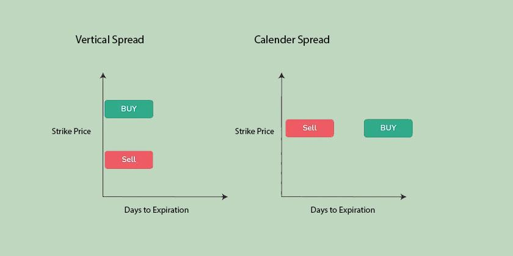

## Table of Contents

## What is spread trading in the context of quantitative trading?

Spread trading in the context of quantitative trading involves taking advantage of price differences between related financial instruments. Traders look for situations where they can buy one asset and sell another, expecting the price difference between them to change in their favor. This strategy is often used in markets like futures, where a trader might buy a contract for one month and sell a contract for another month, betting on the change in the spread between these two contracts.

Quantitative traders use mathematical models and algorithms to identify these spread opportunities. They analyze historical data to find patterns and predict future price movements. By using these models, they can automate their trading strategies, making it easier to execute trades quickly and efficiently. This approach helps them manage risk and potentially increase their returns by exploiting small price discrepancies that might be hard to spot without advanced technology.

## How does spread trading differ from traditional trading strategies?

Spread trading is different from traditional trading because it focuses on the price difference between two related assets instead of betting on the price of just one asset going up or down. In traditional trading, a trader might buy a stock hoping its price will increase, or sell it short hoping the price will drop. But in spread trading, the trader is more interested in how the prices of two assets move relative to each other. For example, they might buy one futures contract and sell another, aiming to profit from the change in the spread between them.

Another key difference is that spread trading often uses advanced math and computer models to find and exploit these price differences. Traditional trading might rely more on market analysis, news, and gut feelings. Quantitative traders use algorithms to quickly spot and act on small price discrepancies that might be hard to see without technology. This can help manage risk better and potentially make more consistent profits, but it also requires a good understanding of math and programming.

## What are the common types of spreads used in quantitative trading?

In [quantitative trading](/wiki/quantitative-trading), one common type of spread is the calendar spread. This is when a trader buys and sells futures contracts for the same asset but for different delivery months. For example, they might buy a contract for corn to be delivered in March and sell a contract for corn to be delivered in June. The trader is betting that the price difference between these two contracts will change in a way that makes them money.

Another type is the intermarket spread, which involves trading contracts for similar but different assets. For instance, a trader might buy a contract for heating oil and sell a contract for [crude oil](/wiki/crude-oil). They're hoping the price difference between heating oil and crude oil will shift in their favor. Both types of spreads rely on the trader's ability to predict how the prices of related assets will move relative to each other, using math and computer models to find the best opportunities.

## How do you identify profitable spread trading opportunities?

To identify profitable spread trading opportunities, you need to look at how the prices of two related assets move compared to each other. You can do this by studying past price data to see if there are patterns that repeat over time. For example, if you're looking at calendar spreads, you might check how the price difference between futures contracts for the same asset but different delivery months has changed in the past. By using math and computer programs, you can spot these patterns more easily and predict when the spread might be a good bet.

Once you have a good idea of these patterns, you can set up your trading strategy. This involves deciding when to buy one asset and sell the other based on your predictions about how the spread will change. It's important to keep an eye on market conditions and any news that might affect the prices of the assets you're trading. By using algorithms to monitor these factors and execute trades quickly, you can take advantage of small price differences that might not last long. This way, you can manage your risks and aim for steady profits over time.

## What are the key statistical measures used in spread trading analysis?

In spread trading, one important statistical measure is the mean of the spread. This tells you the average price difference between the two assets you're looking at. By knowing the mean, you can see if the current spread is higher or lower than usual, which can help you decide if it's a good time to trade. Another key measure is the standard deviation of the spread. This shows how much the spread tends to move around its average. A high standard deviation means the spread can change a lot, which might mean more risk but also more chance for profit.

Another useful measure is the correlation between the two assets. This tells you how closely their prices move together. If the correlation is high, the spread might be more stable, but if it's low, the spread could be more unpredictable. You can also look at the z-score of the spread, which shows how far the current spread is from its average in terms of standard deviations. A high z-score might mean the spread is unusually wide or narrow, suggesting a possible trading opportunity. By using these statistical measures, you can make better predictions about how the spread might change and find the best times to trade.

## How can one backtest a spread trading strategy?

To backtest a spread trading strategy, you start by gathering historical price data for the two assets you want to trade. This data should include the prices over a long period, like several years, so you can see how the spread has changed in the past. Next, you use this data to run your trading strategy through a computer program. You tell the program what rules to follow, like when to buy and sell based on the spread, and it will show you how your strategy would have worked in the past. This helps you see if your strategy could make money and how risky it might be.

After running the backtest, you look at the results to see how well your strategy did. You check things like how much money you would have made or lost, and how often you would have made trades. If the results are good, you might feel more confident about using the strategy in real trading. But if the results are not so good, you can change your rules and try the backtest again. This way, you can keep improving your strategy until you find one that works well.

## What are the risks associated with spread trading in quantitative trading?

Spread trading in quantitative trading has some risks. One big risk is that the spread might not move the way you expect. Even if you use math and computer models to predict how the spread will change, the market can be unpredictable. If the spread moves against you, you could lose money. Another risk is that the assets you're trading might not be as related as you thought. If their prices start moving in different ways, the spread can become very volatile, making it hard to make a profit.

Another risk is the cost of trading. Every time you buy or sell an asset, you have to pay fees and other costs. These can add up, especially if you're making a lot of trades. If the spread doesn't move enough to cover these costs, you might end up losing money even if your predictions are right. Also, using complex models and algorithms can be risky if there are mistakes in the code or if the models don't work well in all market conditions. It's important to always keep an eye on your strategy and be ready to change it if things aren't going as planned.

## How do market conditions affect spread trading strategies?

Market conditions can really change how well spread trading strategies work. When the market is calm and stable, the spreads between assets might not change much. This can make it harder to make money because the price differences you're betting on might stay the same for a long time. But if the market is moving a lot, with big ups and downs, the spreads can change more quickly. This can be good for spread traders because they can take advantage of these changes to make profits. But it also means more risk because the market can be harder to predict.

Another thing to think about is how news and events can shake up the market. If there's big news, like a change in interest rates or a new law, it can make the prices of assets move in ways you might not expect. This can mess up the patterns you're using in your spread trading strategy. So, it's important to keep an eye on the news and be ready to change your strategy if the market starts acting differently. By staying flexible and watching the market closely, you can better handle the risks and find new opportunities to trade.

## What role does technology play in executing spread trading strategies?

Technology is really important for spread trading because it helps traders find and use trading opportunities quickly. With computers and special software, traders can look at a lot of data from the past to see how the prices of different assets have moved. They use math and computer programs to spot patterns and predict how the spread between two assets might change. This helps them decide when to buy one asset and sell another to make a profit. Without technology, it would be much harder to see these small price differences and act on them fast enough.

Also, technology makes it easier to keep an eye on the market all the time and make trades automatically. Once a trader sets up their strategy in a computer program, the program can watch the market and make trades without the trader having to do it by hand. This is good because the market can change quickly, and being able to trade right away can make a big difference. Plus, technology helps traders manage their risks better by keeping track of how their trades are doing and making changes if needed. So, technology is a big help in making spread trading work well.

## How can one optimize a spread trading strategy for better performance?

To make a spread trading strategy work better, you need to keep looking at how it's doing and make changes based on what you see. Start by checking the results of your backtests to see if your strategy is making money and how risky it is. If you find that your strategy isn't doing well, you can try changing the rules for when to buy and sell. For example, you might adjust the times when you enter and [exit](/wiki/exit-strategy) trades or change how much you bet on each trade. By testing different versions of your strategy, you can find the one that works the best.

Another way to improve your spread trading strategy is by using more data and better technology. The more historical data you have, the better you can understand how the spreads between assets have moved in the past. This can help you make more accurate predictions. Also, using faster computers and more advanced software can help you spot trading opportunities quicker and make trades without delay. Keeping an eye on market conditions and news can also help you adjust your strategy to fit what's happening in the market right now. By staying flexible and using the best tools available, you can keep your spread trading strategy performing well over time.

## What advanced techniques can be used to enhance spread trading models?

One advanced way to make spread trading models better is by using [machine learning](/wiki/machine-learning). Machine learning is like teaching a computer to learn from data on its own. You can give the computer lots of information about how the prices of assets have moved in the past, and it can find patterns that might be hard for people to see. By using these patterns, the computer can predict how the spread between two assets might change in the future. This can help traders make smarter decisions about when to buy and sell, making their strategies more accurate and profitable.

Another technique is to use something called high-frequency trading. This means making a lot of trades very quickly, sometimes in just a few seconds. With high-frequency trading, you need very fast computers and special software to watch the market all the time and act on small price changes right away. This can be really helpful in spread trading because the spreads can move fast, and being able to trade quickly can make a big difference. By combining high-frequency trading with machine learning, traders can keep their strategies up to date with what's happening in the market and catch more trading opportunities.

## How do regulatory environments impact spread trading practices?

Regulatory environments can change how spread trading works. Different countries have different rules about trading, and these rules can affect what traders are allowed to do. For example, some places might have strict rules about how much money you can borrow to trade, or they might limit the kinds of assets you can trade. These rules are there to keep the market fair and safe, but they can also make it harder for traders to use certain spread trading strategies. If the rules change, traders might need to change their strategies to follow the new laws.

Also, regulators keep an eye on the market to stop people from doing things that are not fair, like insider trading or manipulating prices. This can be good for spread traders because it helps keep the market honest. But it can also mean more work for traders, who have to keep good records and report their trades. If a trader doesn't follow the rules, they could get in trouble, which might make them more careful about how they trade. So, understanding the regulatory environment is important for anyone doing spread trading.

## References & Further Reading

[1]: Avellaneda, M., & Lee, J. H. (2010). ["Statistical Arbitrage in the U.S. Equities Market."](https://math.nyu.edu/~avellane/AvellanedaLeeStatArb071108.pdf) Quantitative Finance, 10(7).

[2]: Aldridge, I. (2013). ["High-Frequency Trading: A Practical Guide to Algorithmic Strategies and Trading Systems."](https://www.amazon.com/High-Frequency-Trading-Practical-Algorithmic-Strategies/dp/1118343506) Wiley.

[3]: Pardo, R. (2008). ["The Evaluation and Optimization of Trading Strategies,"](https://www.amazon.com/Evaluation-Optimization-Trading-Strategies/dp/0470128011) Wiley.

[4]: Cartea, A., Jaimungal, S., & Penalva, J. (2015). ["Algorithmic and High-Frequency Trading,"]https://www.amazon.com/Algorithmic-High-Frequency-Trading-Mathematics-Finance/dp/1107091144) Cambridge University Press.

[5]: Gatev, E., Goetzmann, W. N., & Rouwenhorst, K. G. (2006). ["Pairs Trading: Performance of a Relative-Value Arbitrage Rule,"](https://papers.ssrn.com/sol3/papers.cfm?abstract_id=141615) The Review of Financial Studies, 19(3), 797-827.

[6]: Chan, E. P. (2009). ["Quantitative Trading: How to Build Your Own Algorithmic Trading Business."](https://www.amazon.com/Quantitative-Trading-Build-Algorithmic-Business/dp/0470284889) Wiley.

[7]: Jansen, S. (2018). ["Machine Learning for Algorithmic Trading: Predictive Models to Extract Signals from Market and Alternative Data for Systematic Trading Strategies with Python."](https://www.amazon.com/Machine-Learning-Algorithmic-Trading-alternative/dp/1839217715) Packt Publishing.