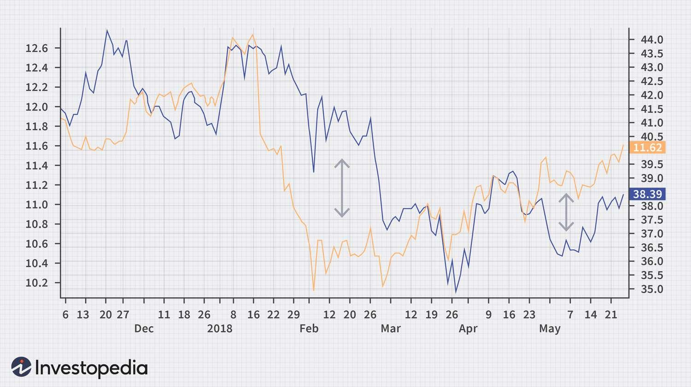

## Table of Contents

## What is statistical arbitrage?

Statistical arbitrage, often called stat arb, is a type of trading strategy that uses math and statistics to find small differences in the prices of related financial assets. Traders using this method look for patterns and relationships between stocks, currencies, or other financial instruments. When they spot a temporary difference in price that they think will soon correct itself, they buy the undervalued asset and sell the overvalued one. The goal is to make a profit from the price correction.

This strategy relies heavily on complex algorithms and high-speed computers to analyze lots of data quickly. Traders need to be fast because these price differences usually don't last long. Stat arb is popular among hedge funds and other big investors because it can be done on a large scale and often involves many trades at once. While it can be profitable, it also comes with risks, as the expected price corrections don't always happen as predicted.

## How does statistical arbitrage differ from traditional arbitrage?

Statistical arbitrage and traditional arbitrage are both ways to make money from price differences, but they work differently. Traditional arbitrage is simpler and more straightforward. It happens when the same asset, like a stock or currency, has different prices in different places or markets. A trader can buy the asset where it's cheaper and sell it where it's more expensive, making a profit from the difference. This kind of arbitrage doesn't need fancy math or computers because the opportunity is clear and doesn't rely on predictions.

On the other hand, statistical [arbitrage](/wiki/arbitrage) uses math and [statistics](/wiki/bayesian-statistics) to find more hidden opportunities. It looks at how different assets, like related stocks, move together over time. When these assets temporarily move out of their usual pattern, a stat arb trader will buy the one that seems undervalued and sell the one that seems overvalued, expecting them to return to their normal relationship. This method needs complex algorithms and fast computers because the price differences are small and don't last long. It's riskier because the expected correction might not happen, but it can be done on a larger scale with many trades at once.

## What are the basic principles behind statistical arbitrage?

Statistical arbitrage is all about using math and stats to find small price differences between related financial assets. It looks at how these assets usually move together and tries to spot when they temporarily move out of their normal pattern. When this happens, a trader using [statistical arbitrage](/wiki/statistical-arbitrage) will buy the asset that seems to be undervalued and sell the one that seems to be overvalued. The idea is that these assets will eventually go back to their normal relationship, and the trader will make a profit from the price correction.

This strategy relies a lot on computers and complex math formulas to quickly analyze lots of data. Traders need to be fast because these price differences usually don't last long. While statistical arbitrage can be profitable, it also comes with risks. The expected price corrections might not happen, and the strategy requires a lot of trades to be successful. It's popular among big investors like hedge funds because it can be done on a large scale.

## What types of data are used in statistical arbitrage?

In statistical arbitrage, traders use all sorts of data to find those small price differences. They look at things like stock prices, trading volumes, and how different stocks move together over time. They also pay attention to financial news, economic reports, and even social media to get a sense of what's happening in the market. All this data helps them figure out when a stock might be a bit cheaper or more expensive than it should be compared to others.

The key is to use computers to quickly analyze all this information. Traders use math formulas to spot patterns and relationships between different assets. This helps them see when the usual balance between stocks gets out of whack, even if it's just for a short time. By understanding these patterns, they can make quick trades to take advantage of the price differences before they disappear.

## How do you identify pairs or portfolios for statistical arbitrage?

To identify pairs or portfolios for statistical arbitrage, traders look at how different stocks or assets move together over time. They use something called a correlation coefficient to see how closely two stocks follow each other. If two stocks usually move in a similar way, they might be good candidates for a pair. Traders also look at how far the prices of these stocks can move away from each other before they come back together. This is called the cointegration relationship. By studying these patterns, traders can find pairs that are likely to return to their normal balance after a temporary difference.

Once potential pairs are identified, traders use lots of data to check if the pair is reliable. They look at historical price data, trading volumes, and even news and events that might affect the stocks. Computers help them analyze all this information quickly to spot any small changes in the relationship between the stocks. If the data shows that the pair often goes back to its usual pattern after moving apart, it's a good sign for statistical arbitrage. Traders can then watch these pairs closely and make trades when they see a chance to profit from the price difference.

## What statistical methods are commonly used in statistical arbitrage?

In statistical arbitrage, traders use a bunch of math and stats to find good trading opportunities. One common method is called cointegration. This helps traders see if two stocks move together over time, even if they temporarily move apart. If two stocks are cointegrated, it means they'll likely go back to their normal relationship after a while. Traders also use something called the correlation coefficient to check how closely two stocks follow each other. If the correlation is high, it means the stocks usually move in the same direction, which can be useful for finding pairs to trade.

Another important method is mean reversion. This idea says that if a stock's price moves away from its average, it will eventually come back to that average. Traders use this to spot when a stock is temporarily overvalued or undervalued compared to another stock in the pair. They also use regression analysis to predict how one stock's price might change based on another stock's price. All these methods help traders make quick decisions and find small price differences they can profit from.

## How do you measure the performance of a statistical arbitrage strategy?

To measure how well a statistical arbitrage strategy is doing, traders look at a few key numbers. One important number is the Sharpe Ratio, which shows how much return you get for the risk you take. A higher Sharpe Ratio means the strategy is doing a good job of making money without taking too much risk. Another number they look at is the profit and loss (P&L) statement, which tells them how much money they made or lost over a certain time. They also check the hit rate, which is the percentage of trades that made money. A high hit rate means the strategy is [picking](/wiki/asset-class-picking) good trades more often than not.

Another way to measure performance is by looking at the drawdown, which is the biggest drop in the value of the portfolio. A smaller drawdown means the strategy is more stable and less risky. Traders also use something called the Sortino Ratio, which is like the Sharpe Ratio but focuses only on the bad risk, or downside risk. This can be helpful because it shows how well the strategy handles losses. By keeping an eye on all these numbers, traders can see if their statistical arbitrage strategy is working well and making money in a smart way.

## What are the risks involved in statistical arbitrage?

Statistical arbitrage can be risky because it relies on predictions about how prices will move. If the expected price corrections don't happen, traders can lose money. For example, if two stocks usually move together but suddenly don't, a trader might buy one and sell the other, expecting them to go back to normal. But if they don't, the trader ends up with losses. Also, the strategy needs a lot of trades to be successful, so even small mistakes can add up and lead to big losses.

Another risk is that statistical arbitrage uses a lot of computers and complex math. If there's a problem with the technology or if the math models are wrong, it can cause big problems. For example, if the computer system crashes or if the data used to make predictions is bad, the strategy might not work as expected. Plus, other traders might be using similar strategies, which can make the price differences smaller and harder to profit from. All these things mean that even though statistical arbitrage can be profitable, it's not without its risks.

## How does market efficiency affect statistical arbitrage?

Market efficiency is all about how well prices in the market reflect all the information available. If a market is very efficient, it means that prices are always close to their true value because everyone has the same information and acts on it quickly. This makes it harder for statistical arbitrage to work because the small price differences that traders look for don't last long. In an efficient market, the opportunities for making money from these differences are fewer and smaller.

But even in efficient markets, there can still be some chances for statistical arbitrage. Traders use very fast computers and complex math to spot these opportunities before they disappear. They look for tiny differences in how related stocks move together and try to make quick trades to take advantage of them. So while market efficiency makes statistical arbitrage more challenging, it doesn't make it impossible. It just means traders have to be even quicker and smarter to find and use these small opportunities.

## Can you explain the role of high-frequency trading in statistical arbitrage?

High-frequency trading ([HFT](/wiki/high-frequency-trading-strategies)) plays a big role in statistical arbitrage because it helps traders make quick decisions and trades. In statistical arbitrage, traders look for small price differences between related stocks or assets. These differences usually don't last long, so traders need to act fast. High-frequency trading uses powerful computers and fast internet connections to analyze lots of data and spot these opportunities in just milliseconds. This means traders can buy and sell stocks very quickly, trying to make a profit before the prices change back.

HFT also helps statistical arbitrage traders handle a lot of trades at once. Because the price differences are small, traders need to make many trades to make enough money. High-frequency trading systems can manage these trades automatically, making sure they happen at the right time and in the right amount. This makes the whole process smoother and more efficient. But it's also important to remember that high-frequency trading can add more risk because everything happens so fast, and even small mistakes can lead to big losses.

## What are some advanced techniques used in statistical arbitrage?

In statistical arbitrage, traders often use something called machine learning to find even better trading opportunities. Machine learning is a type of computer program that can learn from data and make predictions. Traders feed these programs lots of information about stocks, like their prices and how they move together. The program then finds patterns that might be hard for people to see. This can help traders spot small price differences more accurately and make better decisions about when to buy and sell.

Another advanced technique is called [factor](/wiki/factor-investing)-based models. These models look at different things, or "factors," that can affect stock prices, like how big a company is or how much it's growing. Traders use these factors to group stocks together and find pairs that might be good for statistical arbitrage. By understanding how these factors influence stock prices, traders can make smarter trades and try to make more money. Both machine learning and factor-based models help traders be more precise and find more opportunities in the fast-moving world of statistical arbitrage.

## How has statistical arbitrage evolved with advancements in technology and data analysis?

Statistical arbitrage has changed a lot because of new technology and better ways to analyze data. In the past, traders had to do a lot of math by hand and look at data slowly. Now, they use powerful computers and fast internet to look at lots of information quickly. This means they can spot small price differences between stocks much faster than before. High-frequency trading, which is a big part of statistical arbitrage now, uses these fast computers to make many trades in just a few seconds. This helps traders take advantage of tiny price changes before they disappear.

Also, new ways of analyzing data, like machine learning, have made statistical arbitrage even better. Machine learning is like a smart computer program that can learn from data and find patterns that people might miss. Traders use these programs to predict how stocks will move and find good trading opportunities. Another new technique is called factor-based models, which look at different things that can affect stock prices, like how big a company is or how fast it's growing. These models help traders group stocks together and find pairs that might be good for trading. All these new tools and techniques have made statistical arbitrage more accurate and efficient.

## What are the Key Components of Statistical Arbitrage?

Statistical arbitrage is a sophisticated trading strategy that relies heavily on various quantitative elements. Understanding its key components is crucial for successfully implementing these strategies.

### Mathematical Models

At the core of statistical arbitrage are complex mathematical models designed to identify pricing inefficiencies within financial markets. These models are typically based on statistical methods such as time-series analysis, correlation, and regression techniques. For instance, a common model used is the **pairs trading model**, which involves identifying two stocks with historically high correlations. When the spread between these stocks diverges beyond a defined threshold, it signals a potential trading opportunity. This spread can be mathematically formulated as:

$$
S(t) = P_1(t) - \beta P_2(t)
$$

where $ S(t) $ is the spread, $ P_1(t) $ and $ P_2(t) $ are the prices of the two stocks, and $ \beta $ is the hedge ratio calculated using statistical methods like linear regression.

### Data Analysis

Data is the backbone of statistical arbitrage strategies. Comprehensive data analysis is employed to process historical and real-time financial data to spot patterns and correlations that indicate potential trades. Advanced statistical techniques such as Markov chains, principal component analysis (PCA), and machine learning algorithms are often used to enhance the accuracy of predictions. Here's a simple Python snippet using pandas for a basic correlation check:

```python
import pandas as pd

# Load historical price data
data = pd.read_csv('historical_prices.csv')
# Calculate rolling correlation
corr_matrix = data['Stock1'].rolling(window=60).corr(data['Stock2'])
```

### Execution Algorithms

Execution algorithms are essential for efficiently placing and managing trades identified by statistical models. These algorithms ensure that trades are executed at the best possible prices while minimizing market impact and transaction costs. Sophisticated execution strategies like VWAP (Volume Weighted Average Price) and TWAP (Time Weighted Average Price) are commonly used to optimize the timing and size of trades.

### Statistical Methods

To consistently identify trading opportunities and predict asset price movements, statistical methods play a pivotal role. Techniques such as mean reversion, where statistical tests are used to determine if an asset's price will revert to its historical mean, are fundamental. Furthermore, predictive models might incorporate elements of [machine learning](/wiki/machine-learning) to enhance their forecasting capabilities, learning from vast datasets to refine their accuracy over time.

### Market Microstructure and Liquidity Management

Understanding market microstructure—the intricate ways in which securities are traded—is crucial for statistical arbitrage. It informs traders about the behavior of price movements, the impact of trades on market prices, and the depth and [liquidity](/wiki/liquidity-risk-premium) of different markets. Effective liquidity management ensures that trades are executed without substantial market impact, maintaining the profitability of the strategy. Awareness of bid-ask spreads, [order book](/wiki/order-book-trading-strategies) dynamics, and other microstructure elements is vital for minimizing costs associated with trading activities.

In summary, the key components of statistical arbitrage involve a combination of robust mathematical modeling, rigorous data analysis, sophisticated execution algorithms, and a detailed understanding of market microstructure. Together, these elements form the foundation for successful statistical arbitrage strategies that aim to exploit market inefficiencies while mitigating risks.

## How does Statistical Arbitrage work in practice?

Statistical arbitrage is a sophisticated quantitative approach to trading that hinges on statistical and mathematical models to identify and exploit price inefficiencies between different financial instruments. 

**Model Creation**: The process begins with constructing a model that can predict asset price movements. This typically involves selecting a theoretical framework and identifying variables that capture the assets' intrinsic and market-derived characteristics. Common methodologies include cointegration, pair trading, and mean reversion models. The aim is to create a strategy that remains market-neutral, balancing long and short positions to reduce exposure to systemic market risks.

For instance, in a pairs trading strategy, two historically correlated stocks are chosen. When the price deviation from their average spread exceeds a threshold, a trade is initiated. The deviation is often captured using a simple z-score formula: 

$$
z = \frac{(S1 - S2) - \mu}{\sigma}
$$

where $S1$ and $S2$ represent the prices of the two stocks, $\mu$ is the historical mean spread, and $\sigma$ is the standard deviation of the spread.

**Signal Generation**: Signal generation is the crucial next step. Once the model is established, it processes real-time data to generate buy or sell signals based on detected mispricings or anomalies relative to historical norms or predictive analytics. This is achieved by calculating metrics derived from historical and live data feeds, assessing variables such as volatility, momentum, and volume.

Take for example a [momentum](/wiki/momentum) indicator: if an asset's momentum crosses a threshold predictive of future movement (up or down), a signal is triggered to place trades.

**Trade Execution**: Once signals are generated, the execution phase begins. This involves the application of execution algorithms designed to minimize market impact and slippage. Algorithms like VWAP (Volume Weighted Average Price) and TWAP (Time Weighted Average Price) are commonly deployed to execute large orders without significantly affecting the market price.

Python code is frequently used to automate this process:

```python
import numpy as np

# Sample signals (1 for buy, -1 for sell, 0 for hold)
signals = np.array([1, 0, -1, 1, 0])

# Execute trades based on signals
for signal in signals:
    if signal == 1:
        # Buy logic
        pass
    elif signal == -1:
        # Sell logic
        pass
```

**Risk Management**: Effective risk management is a cornerstone of statistical arbitrage strategies. It involves continuously assessing portfolio exposure and diversifying risks. This includes setting stop-loss limits and defining position size according to pre-determined risk/reward ratios to protect capital against unforeseen events or model inaccuracies.

For real-world application, consider hedge funds like Renaissance Technologies, which rely heavily on statistical arbitrage. They exploit inefficiencies across various markets including equities, commodities, and currencies by leveraging high-frequency trading and complex algorithms to execute trades with millisecond precision.

Statistical arbitrage strategies are widely used across diverse financial markets. In equity markets, they are employed to exploit relative pricing advantages between stocks. In the foreign exchange market, these strategies can capitalize on disparities between currency pairs, while in commodities, statistical arbitrage identifies pricing inefficiencies between correlated assets like [crude oil](/wiki/crude-oil) and natural gas.

In summary, statistical arbitrage involves a structured approach starting from model creation to identifying statistical earn opportunities, executing informed trades, and managing associated risks. By leveraging quantitative models and technological advancements, traders can systematically exploit market inefficiencies across various financial segments.

## References & Further Reading

[1]: Avellaneda, M., & Lee, J. (2010). ["Statistical Arbitrage in the US Equities Market."](https://math.nyu.edu/~avellane/AvellanedaLeeStatArb071108.pdf) Quantitative Finance, 10(7), 761-782.

[2]: Pole, A. (2007). ["Statistical Arbitrage: Algorithmic Trading Insights and Techniques."](https://www.amazon.com/Statistical-Arbitrage-Algorithmic-Trading-Techniques/dp/0470181693) Wiley Finance.

[3]: Chan, E. P. (2009). ["Quantitative Trading: How to Build Your Own Algorithmic Trading Business."](https://www.amazon.com/Statistical-Arbitrage-Algorithmic-Insights-Techniques/dp/0470138440) Wiley.

[4]: Lopez de Prado, M. (2018). ["Advances in Financial Machine Learning."](https://www.amazon.com/Advances-Financial-Machine-Learning-Marcos/dp/1119482089) Wiley.

[5]: Jansen, S. (2018). ["Machine Learning for Algorithmic Trading."](https://www.amazon.com/Machine-Learning-Algorithmic-Trading-intelligence/dp/9918608013) Packt Publishing.