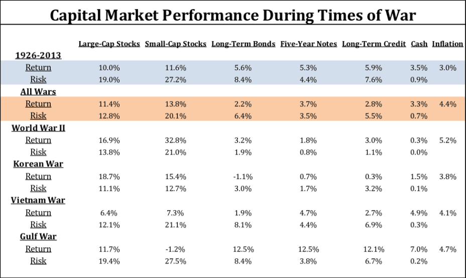

War has always been a critical factor influencing global financial markets. The interconnected nature of modern economies means that geopolitical events, such as war, can lead to immediate and significant disruptions across global stock exchanges. These disruptions manifest through changes in investor sentiment, shifts in capital flows, and alterations in risk perceptions, which can result in heightened market volatility and unpredictable price movements.

In recent decades, the emergence of algorithmic trading has added another layer of complexity to understanding the stock market's reactions to such geopolitical events. Algorithmic trading, or algo trading, utilizes automated systems to execute trades based on predefined criteria at high speeds and with high efficiency. These systems can process vast amounts of data in real-time, making rapid decisions that human traders could not achieve. This capability becomes especially relevant during periods of geopolitical tension, where swift market reactions can create both opportunities and risks.



One subset of algorithmic trading, high-frequency trading (HFT), plays a significant role in this context. HFT strategies focus on executing a large number of trades in very short timeframes, often profiting from small price discrepancies. During times of war, the high-speed decision-making and execution of HFT can lead to pronounced impacts on market dynamics. It can influence liquidity by providing or withdrawing it rapidly and can contribute to both stabilizing and destabilizing price swings, depending on the strategies employed.

Overall, the confluence of war and the advancements in trading technology presents unique challenges and opportunities in financial markets. Understanding how these forces interact is crucial for investors and policymakers aiming to mitigate risks and capitalize on potential gains. This article explores the historical performance of stock markets during wars, focusing on the roles of algorithmic and high-frequency trading in shaping market dynamics amid geopolitical conflicts.

## Table of Contents

## Historical Performance of Stock Markets During Wars

Historical data indicates that stock markets tend to stabilize and even prosper over the long term after initial shocks caused by geopolitical conflicts. This is often contrary to investors' expectations, who might predict prolonged negative market sentiments during times of war. The adage 'buy to the sound of cannons, sell to the sound of trumpets' illustrates the peculiar pattern observed: markets frequently rebound once the initial panic has settled.

During the outbreak of a conflict, market participants typically react with immediate caution due to uncertainty and fear, leading to increased volatility and price drops. However, as the geopolitical situation becomes clearer and more predictable, markets often show signs of recovery. This recovery is attributed to several factors, including increased government spending, particularly in defense sectors, which injects liquidity and stimulates economic activity.

US stocks, for example, have repeatedly demonstrated resilience during international conflicts. Historical performance analyses reveal that after an initial downturn, US equity markets have the capacity to recuperate and perform well over time. In some notable instances, the prolonged economic adjustments required for wartime can stimulate technological innovation and infrastructure investments, which contribute positively to economic growth and, consequently, to stock market performance.

This phenomenon is not restricted to the United States. Global markets often mirror this pattern, although the degree of impact and recovery can vary depending on the geographical and economic proximity to the conflict. For instance, European markets during both World Wars suffered significant losses but eventually recovered as post-war rebuilding efforts provided long-term economic boosts.

The post-war economic recovery is further supported by the structural shifts in industries towards war-related production and the subsequent peacetime economic restructuring. These shifts often lead to enhanced productivity and the development of new industries, which can positively impact stock markets in post-conflict years.

Therefore, when assessing historical market performance during wars, it is critical to consider the broader economic context and differentiate between short-term reactions and long-term trends. This understanding can provide insights into potential market behaviors during future geopolitical events and highlight investment opportunities that arise from temporary market inefficiencies.

## The Impact of Algorithmic Trading in War Times

Algorithmic trading systems are engineered to minimize human error and capitalize on market inefficiencies. Such attributes become increasingly relevant during volatile war times, where rapid changes in market conditions require prompt and accurate responses. These systems use pre-defined algorithms to execute trades, which enables them to react swiftly to geopolitical news and events, significantly impacting market [liquidity](/wiki/liquidity-risk-premium) and [volatility](/wiki/volatility-trading-strategies).

Automatically executing trades based on predefined conditions enhances the ability of [algorithmic trading](/wiki/algorithmic-trading) to respond to news-driven events. This capability becomes crucial when geopolitical tensions escalate, as markets generally experience abrupt movements. Algorithms are programmed to scan, analyze, and react to a flow of data, enabling them to rapidly execute buy or sell orders when certain market conditions, such as price thresholds, are met. This immediate reaction helps maintain market liquidity by ensuring active participation even when human traders might hesitate or overcrowded transactions might lead to delays.

High-frequency trading ([HFT](/wiki/high-frequency-trading-strategies)), a subset of algorithmic trading, can amplify these rapid market movements. It involves executing a vast number of orders within extremely short timeframes, often in milliseconds. HFT systems can analyze multiple markets and execute trades at unparalleled speed, allowing them to exploit even the smallest price discrepancies. During war times, the high speed and [volume](/wiki/volume-trading-strategy) of HFT transactions can contribute to increased market liquidity. However, the same attributes that make HFT advantageous also pose risks. The concentration of rapid trades could potentially lead to increased volatility, as the sheer volume of transactions can react to market changes unpredictably.

In conclusion, while algorithmic trading and its high-frequency trading subset provide significant advantages in terms of speed and efficiency during market volatility brought on by conflicts, they also [carry](/wiki/carry-trading) potential risks. The ability to execute large volumes of trades swiftly can help stabilize the market through enhanced liquidity; however, this same capability may also lead to unanticipated market fluctuations. Hence, regulators often keep a close watch on algorithmic trading activities during such critical periods to mitigate systemic risks.

## Volatility and Market Dynamics During Conflicts

Wars are traditionally expected to induce heightened volatility in the stock market due to the uncertainty and complexity they introduce. However, extensive historical analysis reveals that increased government spending on defense often counters this initial assumption. As defense expenditures rise, they inject stability into the market through increased industrial activity and government contracts, which offset potential panic among investors.

The inverse relationship between defense spending and stock market volatility is supported by numerous studies. Specifically, periods of elevated military activity often coincide with decreased market fluctuations. This is because significant investments in defense can spur economic growth and provide a buffer against market uncertainties. These expenditures often lead to increased production, innovation, and employment, all of which contribute to a more stable economic environment.

For instance, an examination of market dynamics from 1890 to 2017 indicates that during times of heightened military engagement, such as the World Wars and other conflicts, markets tend to stabilize following initial disruptions. The defense sector typically experiences an upswing in activity due to government contracts, leading to improved business confidence and reduced volatility.

In contrast, the absence of military expenditure might result in prolonged market unrest during conflicts, as uncertainty prevails without a compensating rise in economic activity. Overall, while geopolitical tensions introduce immediate concerns for investors, the structured and substantial nature of defense spending often serves as a critical stabilizer for financial markets, thereby attenuating potential volatility during conflicts.

## Specific Historical Examples: WW2 and Other Conflicts

During World War II, the stock market underwent significant fluctuations in response to the geopolitical upheaval. Initially, the market experienced a sharp decline as the United States and other nations were drawn into a large-scale conflict. However, as the U.S. economy transitioned to meet the demands of the war, bolstered by increased government spending and industrial production, the market began to recover. Historical data showcase that by 1943, the Dow Jones Industrial Average had recuperated and even surpassed its pre-war levels, illustrating the market's resilience once economic adjustments took hold.[^1]

In post-World War II history, similar patterns are observable in conflicts such as the Iraq-Kuwait conflict of 1990-1991. The initial invasion by Iraq led to immediate market disturbances, marked by increased volatility and a temporary downturn. Nonetheless, once coalition forces intervened and geopolitical uncertainties began to resolve, the markets quickly stabilized and regained ground. This swift adjustment can be attributed to the rapid information dissemination and adaptive market strategies employed during the period, reflecting the market's capacity to [factor](/wiki/factor-investing) in geopolitical events.[^2]

With technological advancements, algorithmic trading strategies have adapted to incorporate geopolitical risks into their models. Algorithms can swiftly analyze vast data sets, including news events, political developments, and financial indicators, to predict market movements and adjust trading strategies accordingly. For example, algorithms might include variables representing risk factors such as a geopolitical tension index or defense spending forecasts. This enables traders to respond more effectively to market conditions influenced by conflicts.

Algorithmic trading models typically follow predefined rules, which can be represented through logic-based algorithms and statistical models. A simple example in Python could be:

```python
def trading_strategy(geopolitical_risk_index, defense_spending_change):
    risk_threshold = 0.7
    spending_threshold = 0.05

    if geopolitical_risk_index > risk_threshold and defense_spending_change > spending_threshold:
        return "Buy"
    elif geopolitical_risk_index < risk_threshold and defense_spending_change < spending_threshold:
        return "Sell"
    else:
        return "Hold"
```

This basic strategy suggests buying stocks when both geopolitical risk and defense spending are high, implying potential market recovery, whereas selling is recommended when these indicators are low.

In summary, historical episodes like World War II and the Iraq-Kuwait conflict illustrate the stock market's capacity to adjust rapidly to geopolitical events. Modern algorithmic trading further enhances this adaptability by incorporating sophisticated risk assessment methods, which consider geopolitical factors, thus allowing traders to better navigate uncertainties posed by conflicts.

[^1]: Schwert, G. W. (1990). "Stock Market Volatility". Financial Analysts Journal.
[^2]: Fama, E. F. and French, K. R. (1993). "Common risk factors in the returns on stocks and bonds". Journal of Financial Economics.

## Algorithmic Trading: Advantages and Risks in War

Algorithmic trading offers numerous advantages during wartime market conditions, primarily through increased liquidity and market efficiency. Higher liquidity ensures that traders can buy and sell securities more easily, which helps stabilize prices even during volatile periods. This efficiency often leads to potential price improvements as algorithms capture short-term opportunities created by imbalances in supply and demand. 

On the downside, the rapid execution and significant volume of trades inherent to algorithmic trading can introduce instability. This is particularly true when algorithms respond to similar market signals. A triggering event, such as geopolitical news, might cause many algorithms to execute simultaneous trades, intensifying price swings. Additionally, if algorithms malfunction or operate on erroneous data, they can exacerbate market disruptions. The so-called "flash crash" phenomenon, where markets rapidly plummet and recover, exemplifies such risks.

Regulatory bodies are acutely aware of the challenges posed by algorithmic trading during heightened market volatility. Efforts are underway to implement safeguards aimed at mitigating systemic risks. This includes closer scrutiny of algorithmic strategies and enhanced reporting requirements to ensure transparency. Measures such as these aim to balance the benefits of automated trading with the need to maintain market integrity and protect against unforeseen systemic threats.

## Conclusion: Navigating the Stock Market in Times of War

Investors often find it counterintuitive that stock markets may respond positively to the outbreak of war, but historical patterns support this behavior. When a conflict begins, the initial market reaction tends to be negative due to uncertainty and fear. However, as governments increase spending, particularly in defense, and economies adjust to new conditions, markets frequently stabilize or even rally. This pattern is often encapsulated by the adage "buy to the sound of cannons, sell to the sound of trumpets," indicating a tendency for markets to recover after the initial shock of conflict.

Understanding the influence of algorithmic trading provides insights into how modern markets operate during crises and the potential for both stability and disruption. Algorithmic trading systems, designed to exploit market inefficiencies and minimize human intervention, become particularly relevant during volatile periods such as wars. These systems can process vast amounts of information quickly, executing trades based on pre-set rules or real-time market conditions. The rapid reaction to news and events can provide liquidity and efficiency, yet also heighten instability if many algorithms trigger similar trades simultaneously.

Despite the inherent complexities, algorithmic systems offer a disciplined, rule-based approach to trading that can be advantageous in turbulent times. By predefining conditions for trading decisions, these systems help investors exploit opportunities that may arise. While forecasting market movements during wars remains challenging due to the fluid nature of geopolitical events, algorithms can assist by managing execution speed and optimizing trade strategies to mitigate risks.

In conclusion, while the instinctive reaction to geopolitical conflict might be to pull back from financial markets, historical evidence and the sophistication of algorithmic trading suggest otherwise. Investors equipped with an understanding of algorithm-driven market dynamics can navigate—if not leverage—the complexities and opportunities presented by wartime economies.

## References & Further Reading

[1]: Schwert, G. W. (1990). ["Stock Market Volatility"](https://www.jstor.org/stable/4479327). Financial Analysts Journal.

[2]: Fama, E. F. and French, K. R. (1993). ["Common Risk Factors in the Returns on Stocks and Bonds"](https://people.hec.edu/rosu/wp-content/uploads/sites/43/2023/09/Fama-French-Common-risk-factors-1993.pdf)90023-5). Journal of Financial Economics.

[3]: Mandelbrot, B. B., & Hudson, R. L. (2004). ["The (Mis)Behavior of Markets: A Fractal View of Risk, Ruin, and Reward"](https://searchworks.stanford.edu/view/9081909). Basic Books.

[4]: Lopez de Prado, M. (2018). ["Advances in Financial Machine Learning"](https://books.google.com/books/about/Advances_in_Financial_Machine_Learning.html?id=oU9KDwAAQBAJ). Wiley.

[5]: Pardo, R. (2008). ["The Evaluation and Optimization of Trading Strategies"](https://onlinelibrary.wiley.com/doi/book/10.1002/9781119196969). Wiley.

[6]: Jansen, S. (2020). ["Machine Learning for Algorithmic Trading"](https://github.com/stefan-jansen/machine-learning-for-trading). Packt Publishing.

[7]: Chan, E. P. (2009). ["Quantitative Trading: How to Build Your Own Algorithmic Trading Business"](https://github.com/ftvision/quant_trading_echan_book). Wiley.