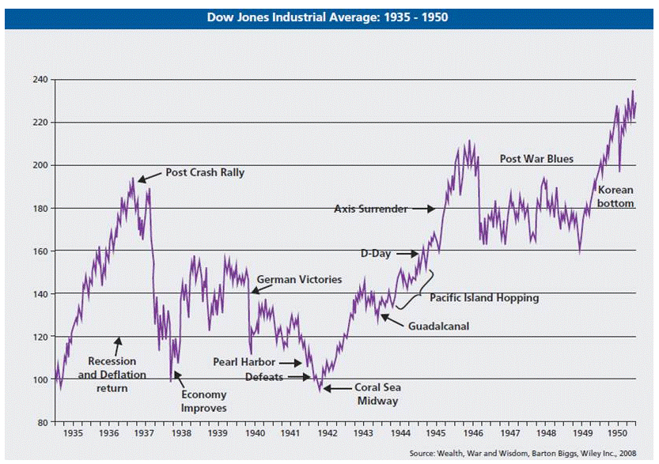

## Table of Contents

## What is the stock market and how does it function?

The stock market is a place where people buy and sell pieces of companies, called stocks or shares. When you buy a stock, you own a small part of that company. The stock market is like a big store where these pieces are traded every day. The price of a stock goes up and down based on how much people want to buy or sell it. If more people want to buy a stock, its price goes up. If more people want to sell, the price goes down.

The stock market works through stock exchanges, which are like big marketplaces. In the United States, the two main stock exchanges are the New York Stock Exchange (NYSE) and the Nasdaq. Companies list their stocks on these exchanges, and people can buy and sell them through brokers, who are like helpers that make the trades happen. The stock market is important because it helps companies raise money to grow their business by selling stocks to investors. It also gives people a chance to invest their money and possibly make more money if the stocks they own go up in value.

## What is war and how does it impact global economies?

War is when two or more groups fight each other using weapons and soldiers. It can happen between countries or within one country. Wars can last a short time or go on for many years. They often start because of disagreements over land, resources, or power. When wars happen, they can cause a lot of damage, hurting people and destroying buildings and other things.

Wars can have a big impact on global economies. When a country is at war, it has to spend a lot of money on weapons, soldiers, and fixing damage. This can make the country's economy weaker because it has less money to spend on other important things like schools and hospitals. Wars can also disrupt trade between countries, making it harder for them to buy and sell things. If a big country is at war, it can affect the whole world's economy, causing prices to go up and making it harder for people everywhere to get what they need.

## How do stock markets typically react to the outbreak of war?

When war breaks out, stock markets often get very worried. This worry can make stock prices go down fast. People who own stocks might start selling them because they're scared about what the war might do to the economy. When lots of people sell at the same time, it can cause a big drop in the stock market. This is because everyone is trying to get out of their investments before things get worse.

But not all parts of the stock market react the same way. Some companies might actually do better during a war. For example, companies that make weapons or military equipment might see their stock prices go up because countries need to buy more of their products. Other companies, like airlines or travel companies, might see their stock prices go down because people are less likely to travel during a war. So, while the overall market might go down, some specific stocks can go up or down depending on what they do and how the war affects them.

## Can you provide historical examples of how wars have affected stock markets?

When World War II started in 1939, the stock market in the United States dropped a lot at first. People were scared about the war and started selling their stocks. But as the war went on, the stock market started to recover. This was because the U.S. started making a lot of weapons and other things for the war, which helped the economy grow. By the end of the war, the stock market was doing better than before the war started.

Another example is the Iraq War that started in 2003. When the war began, the stock market in the U.S. went down. People were worried about what the war might do to the economy. But after a while, the market started to go back up. Some companies, like those that made weapons, did well during the war. But other companies, like airlines, had a hard time because people were less likely to travel.

These examples show that wars can make stock markets go down at first because people get scared. But over time, the markets can recover, and some companies might even do better because of the war. It all depends on what the war does to the economy and which companies are affected.

## What sectors of the economy are most affected by war?

War affects different parts of the economy in different ways. The defense and military sector often does well during war because countries need to buy more weapons and equipment. Companies that make these things can see their business grow a lot. But other parts of the economy, like tourism and travel, usually suffer. When there is a war, people are less likely to travel, so airlines, hotels, and other travel businesses can lose a lot of money.

Another sector that can be hit hard by war is manufacturing. If factories are damaged or if it's hard to get the materials needed to make things, production can slow down or stop. This can affect many different industries that rely on manufactured goods. Also, the energy sector can be affected because wars can disrupt the supply of oil and gas, which can make prices go up and cause problems for countries that depend on these resources.

## How do government policies during wartime influence the stock market?

When a country is at war, the government often changes its policies to help the war effort. This can include spending more money on the military, which can be good for companies that make weapons and other military gear. These companies might see their stock prices go up because the government is buying a lot from them. But the government might also raise taxes to pay for the war, which can make people and businesses have less money to spend on other things. This can make the overall stock market go down because people might sell their stocks to pay the higher taxes.

The government might also control prices or limit how much of certain things people can buy to make sure there's enough for the war effort. This can affect companies that make these controlled items, making their stock prices go down because they can't sell as much. On the other hand, if the government helps certain industries to keep them going during the war, those companies might do better and their stock prices could go up. So, government policies during wartime can have a big impact on the stock market, making some stocks go up and others go down, depending on what the policies are and which companies they affect.

## What role do investor sentiment and uncertainty play in stock market fluctuations during war?

Investor sentiment and uncertainty are big reasons why stock markets go up and down a lot during war. When there's a war, people who invest in the stock market can get really scared. They might think the war will hurt the economy, so they start selling their stocks to get their money back. When lots of people sell at the same time, stock prices can drop a lot. This is because everyone is trying to get out of their investments before things get worse. The fear and uncertainty about what might happen next can make the stock market very shaky.

But it's not just fear that affects the stock market during war. Sometimes, investors might think the war will help certain parts of the economy, like companies that make weapons. If they believe these companies will do well because of the war, they might buy more of their stocks, which can make the prices go up. So, how people feel about the war and how certain they are about what will happen can make the stock market go up and down a lot. It all depends on what investors think and how they react to the news about the war.

## How do international trade and supply chains get disrupted by war, and what are the effects on stock markets?

When a war starts, it can mess up international trade and supply chains. Countries might stop trading with each other because of the war, or they might have a hard time getting goods from one place to another. If a country that makes a lot of something, like oil or electronics, is at war, other countries might not be able to get those things easily. This can make prices go up because there's less of those things to go around. If factories or ports get damaged in the war, it can also make it harder to make and move things, which can cause even more problems for trade and supply chains.

When international trade and supply chains get disrupted by war, it can have a big effect on stock markets. If a company can't get the things it needs to make its products, it might have to stop making them, which can hurt its business. This can make the company's stock price go down because investors think it won't make as much money. On the other hand, if a company can still get what it needs and keep making things while others can't, its stock price might go up because it's doing better than its competitors. So, the way war messes up trade and supply chains can make stock markets go up and down a lot, depending on which companies are affected and how.

## What are the long-term effects of war on stock market performance?

War can have a big impact on the stock market over a long time. When a war ends, the stock market might start to go back up because people feel less scared. But it can take a while for the economy to get better after a war. If a lot of things were destroyed during the war, like factories and roads, it can cost a lot of money to fix them. This can make the government spend less on other things, which can make the economy grow slower. Also, if the war made it hard for countries to trade with each other, it might take time for them to start trading again, which can keep the stock market from going up fast.

Over time, though, the stock market can recover and even do better than before the war. This can happen if the country starts making more things and trading more with other countries. The government might also help the economy by spending money on rebuilding and creating new jobs. Companies that make things to help rebuild, like construction companies, might see their stock prices go up. But it all depends on how bad the war was and how well the country can recover. In the end, the long-term effects of war on the stock market can be different for each country and can take many years to fully see.

## How can investors protect their portfolios during times of war?

When there's a war, investors can protect their portfolios by spreading their money around. This means not putting all their money into one type of investment. Instead, they can buy different kinds of stocks, bonds, and other things like gold. If one part of their portfolio goes down because of the war, the other parts might not go down as much or might even go up. This can help keep their overall investment safer. Also, investors can look for companies that might do well during a war, like those that make weapons or other things the military needs. These companies might see their stock prices go up, which can help balance out losses in other parts of the portfolio.

Another way investors can protect their money during war is by keeping some of it in cash or cash-like investments. This way, if the stock market goes down a lot, they have money they can use to buy stocks when prices are low. This can be a good way to make money when the market starts to go back up. It's also important for investors to stay calm and not make quick decisions based on fear. Wars can make the stock market go up and down a lot, but over time, it usually gets better. By staying patient and sticking to a good plan, investors can help protect their portfolios and maybe even make money in the long run.

## What advanced financial instruments or strategies can be used to hedge against war-related market risks?

Investors can use options and futures to protect their portfolios during war. Options give investors the right to buy or sell a stock at a certain price in the future. If they think the stock market will go down because of the war, they can buy put options. These let them sell the stock at a higher price than it might be worth later, which can help them lose less money. Futures are contracts to buy or sell something at a set price in the future. Investors can use futures to lock in prices for things like oil or gold, which can help them if prices go up a lot because of the war.

Another strategy is to use inverse ETFs. These are funds that go up when the market goes down. If an investor thinks the market will drop because of the war, they can buy an inverse [ETF](/wiki/etf-trading-strategies) to make money while the market is falling. This can help balance out losses in other parts of their portfolio. Also, investors can use stop-loss orders to limit their losses. A stop-loss order tells the broker to sell a stock if it drops to a certain price. This can help investors get out of a stock before it loses too much value because of the war.

Diversification is also key. By spreading money across different types of investments, like stocks, bonds, and commodities, investors can reduce the risk that comes with war. If one type of investment goes down, the others might not go down as much or might even go up. This can help keep the overall portfolio safer. It's important for investors to stay calm and stick to a plan during times of war, as the market can be very unpredictable but often recovers over time.

## How do geopolitical strategies and alliances influence stock market reactions to war?

When countries go to war, their friends and alliances can change how the stock market reacts. If a country has strong allies, those allies might help them out during the war. This can make people less scared about the war because they know the country isn't fighting alone. For example, if a big country like the United States supports a smaller country in a war, investors might feel better about investing in that smaller country's stock market. They might think the war won't last as long or hurt the economy as much because of the help from the big country. This can keep the stock market from dropping too much.

On the other hand, if a country doesn't have many friends or if its allies don't help much, the stock market might go down a lot. People might be more worried about the war and think it will hurt the economy more. Also, if the war makes other countries stop trading with the country at war, this can make things worse for the stock market. The way countries work together or against each other during a war can make a big difference in how the stock market reacts. It all depends on who is fighting and who is helping.

## References & Further Reading

[1]: Schwert, G. W. (1990). ["Stock Market Volatility"](https://www.jstor.org/stable/4479327). Financial Analysts Journal.

[2]: Fama, E. F. and French, K. R. (1993). ["Common Risk Factors in the Returns on Stocks and Bonds"](https://people.hec.edu/rosu/wp-content/uploads/sites/43/2023/09/Fama-French-Common-risk-factors-1993.pdf)90023-5). Journal of Financial Economics.

[3]: Mandelbrot, B. B., & Hudson, R. L. (2004). ["The (Mis)Behavior of Markets: A Fractal View of Risk, Ruin, and Reward"](https://searchworks.stanford.edu/view/9081909). Basic Books.

[4]: Lopez de Prado, M. (2018). ["Advances in Financial Machine Learning"](https://books.google.com/books/about/Advances_in_Financial_Machine_Learning.html?id=oU9KDwAAQBAJ). Wiley.

[5]: Pardo, R. (2008). ["The Evaluation and Optimization of Trading Strategies"](https://onlinelibrary.wiley.com/doi/book/10.1002/9781119196969). Wiley.

[6]: Jansen, S. (2020). ["Machine Learning for Algorithmic Trading"](https://github.com/stefan-jansen/machine-learning-for-trading). Packt Publishing.

[7]: Chan, E. P. (2009). ["Quantitative Trading: How to Build Your Own Algorithmic Trading Business"](https://github.com/ftvision/quant_trading_echan_book). Wiley.