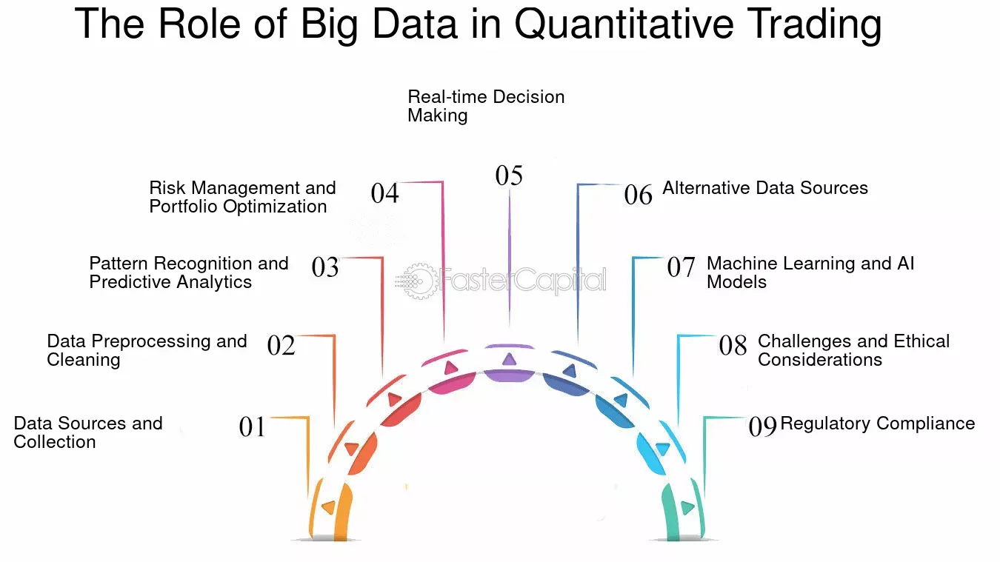

## Table of Contents

## What is big data and how is it defined in the context of finance?

Big data refers to extremely large and complex sets of information that traditional data processing tools can't handle easily. It includes data from various sources like social media, financial transactions, and sensors. In finance, big data means dealing with huge amounts of information about markets, customers, and transactions. This data comes from sources like stock market feeds, bank transactions, and customer interactions.

In the context of finance, big data is used to make better decisions and find new opportunities. For example, banks use big data to understand customer behavior and detect fraud. Investment firms use it to analyze market trends and make smarter investment choices. By using big data, financial institutions can improve their services, reduce risks, and increase profits.

## How does big data differ from traditional data sources used in trading?

Big data in trading is different from traditional data sources because it's much larger and comes from many more places. Traditional data in trading usually comes from stock prices, financial statements, and economic reports. This data is structured and easy to handle with regular tools. But big data includes things like social media posts, news articles, and even satellite images. It's not just numbers; it's also text, images, and videos, which makes it a lot more to deal with.

Another big difference is how big data is used in trading. With traditional data, traders mostly look at past numbers to guess what might happen next. They use charts and formulas to make decisions. But with big data, traders can look at what people are saying and doing right now. They can see trends and feelings in real-time. This helps them react faster and sometimes even predict market moves before they happen. So, big data gives traders a lot more information to work with, but it's also a lot more complicated to use.

## What are the basic ways big data can be used in quantitative trading?

In [quantitative trading](/wiki/quantitative-trading), big data can be used to find patterns and make predictions about the market. Traders use big data to look at lots of information from different places, like social media, news, and financial reports. They use computers to go through this data quickly and find things that might affect stock prices. For example, if a lot of people are talking about a company on social media, it might mean the stock price will go up or down. By using big data, traders can make better guesses about what will happen next in the market.

Another way big data is used in quantitative trading is to make trading strategies smarter. Traders can use big data to test their ideas and see if they work. They can look at past data to see how their strategies would have done before, and then use that information to improve their plans. This helps them make trades that are more likely to make money. Big data also helps traders react faster to changes in the market, because they can see new information as soon as it comes in. This can give them an edge over other traders who are not using big data.

## How has big data improved data analysis techniques in quantitative trading?

Big data has made data analysis in quantitative trading a lot better and faster. Before, traders only used small amounts of data, like stock prices and financial reports. Now, they can use big data from places like social media, news, and even satellite pictures. This means they have a lot more information to look at. Computers can go through all this data quickly and find patterns that traders might miss. This helps traders make better guesses about what will happen in the market.

Another way big data has helped is by making trading strategies smarter. Traders can use big data to test their ideas and see if they work. They can look at past data to see how their strategies would have done before, and then use that information to make their plans better. This helps them make trades that are more likely to make money. Big data also helps traders react faster to changes in the market, because they can see new information as soon as it comes in. This can give them an edge over other traders who are not using big data.

## What specific big data technologies are commonly used in quantitative trading?

In quantitative trading, big data technologies like Hadoop and Apache Spark are often used. Hadoop is good at handling huge amounts of data. It breaks the data into smaller pieces and processes them on different computers at the same time. This makes it faster to go through big data. Apache Spark is another technology that traders use. It's faster than Hadoop and can do more things, like [machine learning](/wiki/machine-learning), which helps traders find patterns in the data.

Another technology used in quantitative trading is NoSQL databases, like MongoDB and Cassandra. These databases are good at storing and getting information from big data quickly. They don't use the same structure as traditional databases, so they can handle different types of data, like text and images, which is important in big data. Traders also use cloud computing services, like Amazon Web Services (AWS) and Google Cloud Platform (GCP), to store and process their big data. These services let traders use a lot of computer power without having to buy and manage their own servers.

## How has big data changed the speed and efficiency of trading algorithms?

Big data has made trading algorithms much faster and more efficient. Before, traders used small amounts of data and their algorithms could only look at that limited information. Now, with big data, algorithms can look at a lot more information from places like social media, news, and even satellite images. This means they can find patterns and make decisions quicker. Big data technologies like Hadoop and Apache Spark help process all this information very fast, so traders can react to market changes in real-time.

The use of big data also means that trading algorithms can be tested and improved more easily. Traders can look at past data to see how their strategies would have worked before, and then use that information to make their plans better. This helps them make trades that are more likely to make money. Cloud computing services like Amazon Web Services and Google Cloud Platform also help by giving traders the computer power they need without having to buy and manage their own servers. This makes the whole process of using big data in trading smoother and more efficient.

## Can you explain how big data has influenced risk management in quantitative trading?

Big data has made risk management in quantitative trading a lot better. Before, traders only looked at numbers from stock prices and financial reports to guess how risky a trade might be. Now, they can use big data from places like social media, news, and even satellite images. This gives them a lot more information to look at. By using computers to go through all this data quickly, traders can find patterns that might mean a trade is riskier than they thought. This helps them make better decisions about which trades to make and how much money to risk.

Another way big data helps with risk management is by letting traders see what's happening in the market right now. They can react faster to changes and avoid big losses. For example, if a lot of people are talking about a company on social media, it might mean the stock price will go up or down soon. By knowing this, traders can adjust their strategies to lower their risk. Big data also helps traders test their ideas and see if they work, which means they can make their risk management plans better over time.

## What are some case studies where big data has significantly impacted trading strategies?

One case study where big data has significantly impacted trading strategies is with the investment firm Renaissance Technologies. They use big data to look at lots of information from places like stock prices, weather reports, and even social media posts. By using computers to go through all this data quickly, they can find patterns that other traders might miss. This has helped them make trades that are more likely to make money. Their big data approach has made them one of the most successful investment firms in the world.

Another example is how big data has been used by banks like JPMorgan Chase to improve their trading strategies. They use big data to understand what their customers are doing and what's happening in the market. For instance, they look at data from customer transactions and news articles to see if there are any signs of trouble in the market. By using this information, they can adjust their trading strategies to avoid big losses. This has made their trading more successful and helped them manage risk better.

## How does big data integration affect the scalability of quantitative trading models?

Big data integration makes quantitative trading models more scalable. Before, traders could only look at small amounts of data, like stock prices and financial reports. Now, with big data, they can look at a lot more information from places like social media, news, and even satellite images. This means they can handle more data and find patterns that they couldn't see before. By using big data technologies like Hadoop and Apache Spark, traders can process all this information quickly, even as the amount of data grows. This helps them make their trading models bigger and better without slowing down.

When traders use big data, they can also test their models on more data. This means they can see how their strategies would have worked in the past and make them better. Big data also lets traders react to market changes in real-time, which is important for keeping their models working well as the market changes. By using cloud computing services like Amazon Web Services and Google Cloud Platform, traders can store and process even more data without having to buy and manage their own servers. This makes it easier to scale up their trading models and keep them working well, no matter how much data they need to handle.

## What challenges does big data present to quantitative traders, and how can they be mitigated?

Big data presents some challenges to quantitative traders. One big challenge is that there is just so much data to look at. It can be hard to find the important information among all the noise. Also, big data can be messy and come from lots of different places, like social media and news articles. This makes it hard to put it all together in a way that makes sense. Another challenge is that big data needs a lot of computer power to process. This can be expensive and take a lot of time.

To deal with these challenges, traders can use special tools and technologies. For example, they can use Hadoop and Apache Spark to handle and process big data quickly. These tools help break the data into smaller pieces and work on them at the same time, making it faster to find patterns. Traders can also use cloud computing services like Amazon Web Services and Google Cloud Platform. These services let traders use a lot of computer power without having to buy and manage their own servers, which saves money and time. By using these tools and technologies, traders can make sense of big data and use it to make better trading decisions.

## How has big data altered the competitive landscape among quantitative trading firms?

Big data has changed the way quantitative trading firms compete with each other. Before, firms only used small amounts of data, like stock prices and financial reports. Now, they can use big data from places like social media, news, and even satellite images. This means they have a lot more information to look at. Firms that are good at using big data can find patterns and make trades that other firms might miss. This gives them an edge in the market and helps them make more money.

The use of big data has also made it more important for firms to have good technology. They need to use tools like Hadoop and Apache Spark to handle and process all this data quickly. They also need cloud computing services like Amazon Web Services and Google Cloud Platform to store and process the data without spending a lot of money on their own servers. Firms that can use these technologies well can react faster to market changes and make their trading strategies better. This has made the competition among quantitative trading firms even tougher, as everyone tries to use big data to get ahead.

## What future trends can we expect in the intersection of big data and quantitative trading?

In the future, big data and quantitative trading will keep getting closer. More and more, traders will use big data to find new ways to make money. They will use information from places like social media, news, and even satellite images to make their trading strategies better. This will help them react faster to what's happening in the market and make trades that are more likely to make money. As computers get better and faster, traders will be able to look at even more data and find patterns that they couldn't see before.

Another trend we might see is the use of [artificial intelligence](/wiki/ai-artificial-intelligence) (AI) and machine learning in big data for trading. These technologies can help traders go through huge amounts of data and find important information quickly. They can also learn from past data and make the trading strategies better over time. This means that traders will be able to make smarter decisions and manage risk better. As more firms start using AI and machine learning, the competition in quantitative trading will get even tougher, with everyone trying to use these new tools to get ahead.

## How does Big Data influence Quantitative Trading?

Big data has significantly transformed the way data input is handled in quantitative trading models. The availability of vast datasets from diverse sources allows traders and analysts to incorporate a broader range of variables into their models, beyond traditional financial metrics. This expansion in data inputs improves the robustness and flexibility of quantitative models, offering a more comprehensive view of market dynamics.

The improvement in algorithm development and back-testing efficiency is another critical benefit of big data in quantitative trading. Algorithms can be fine-tuned with more precise and representative datasets. Historical data sets that are larger and more granular enable more rigorous back-testing, ensuring that models are not only profitable in historical markets but also resilient to changes and anomalies. Python libraries like Pandas and NumPy, along with machine learning frameworks such as TensorFlow and PyTorch, are frequently employed to manage and analyze these large datasets efficiently, optimizing algorithmic strategies faster than ever before.

Enhanced accuracy in predictions and risk management is a notable advantage brought about by big data. By leveraging extensive datasets, traders can uncover subtle patterns and correlations that were previously unnoticed. More data points mean statistical anomalies are easier to identify and mitigate, thus refining prediction models. Techniques such as predictive analytics and machine learning help in constructing models that are not merely reactive but also predictive of future market trends. For example, employing a linear regression model on large datasets to predict asset prices might leverages the formula:

$$
\hat{y} = \beta_0 + \beta_1 x_1 + \beta_2 x_2 + \ldots + \beta_n x_n + \epsilon
$$

where $\hat{y}$ represents the predicted value, $\beta$ values are coefficients, $x$ are input features from the extensive dataset, and $\epsilon$ is the error term.

Moreover, extensive datasets allow for better scenario analysis and stress testing, crucial for risk management. They enable the modeling of extreme market conditions and the potential impact on portfolios, which helps in making informed decisions and setting appropriate risk limits. With real-time data processing capabilities, traders can respond swiftly to market changes, reducing potential risks and capitalizing on short-lived opportunities.

In summary, big data has revolutionized quantitative trading by enhancing the richness and precision of data inputs, significantly improving algorithmic strategy development and back-testing, and providing better accuracy in predictions and risk assessment. This technological evolution continues to redefine the landscape, allowing traders to operate with greater insight and confidence.

## References & Further Reading

[1]: Bergstra, J., Bardenet, R., Bengio, Y., & Kégl, B. (2011). ["Algorithms for Hyper-Parameter Optimization."](https://papers.nips.cc/paper_files/paper/2011/hash/86e8f7ab32cfd12577bc2619bc635690-Abstract.html) Advances in Neural Information Processing Systems 24.

[2]: ["Advances in Financial Machine Learning"](https://www.amazon.com/Advances-Financial-Machine-Learning-Marcos/dp/1119482089) by Marcos Lopez de Prado

[3]: ["Evidence-Based Technical Analysis: Applying the Scientific Method and Statistical Inference to Trading Signals"](https://www.wiley.com/en-gb/Evidence+Based+Technical+Analysis:+Applying+the+Scientific+Method+and+Statistical+Inference+to+Trading+Signals-p-9780470008744) by David Aronson

[4]: ["Machine Learning for Algorithmic Trading"](https://www.amazon.com/Machine-Learning-Algorithmic-Trading-intelligence/dp/9918608013) by Stefan Jansen

[5]: ["Quantitative Trading: How to Build Your Own Algorithmic Trading Business"](https://www.amazon.com/Quantitative-Trading-Build-Algorithmic-Business/dp/0470284889) by Ernest P. Chan