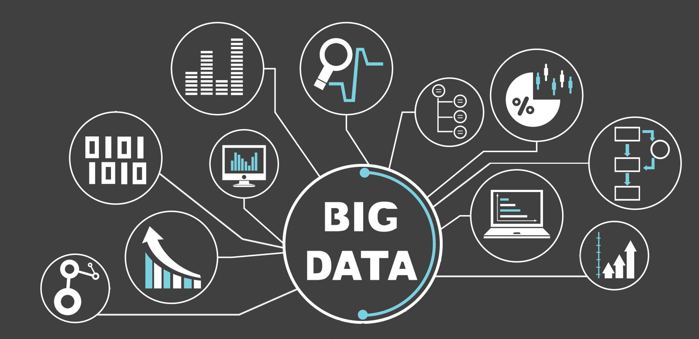

Big data refers to the vast volumes of structured and unstructured data generated at high velocity from various sources. This data holds immense potential for extracting insights and making informed decisions, especially in sectors dealing with large datasets, such as finance. Quantitative trading, on the other hand, involves the use of mathematical models and algorithms to execute trades in financial markets based on quantitative analysis. The intersection of these two fields has significantly reshaped the landscape of financial markets, offering new avenues for growth and innovation.



The importance of big data in transforming financial markets cannot be overstated. With the exponential increase in data availability, from market transactions to social media feeds, financial analysts now have access to a rich repository of information. This wealth of data facilitates more accurate market predictions, the optimization of trading strategies, and enhancements in risk management. Ultimately, big data empowers market participants to make data-driven decisions that can lead to improved performance and competitiveness.

Big data and quantitative trading are interconnected through the enhanced ability to process and analyze complex datasets rapidly. Quantitative trading strategies rely heavily on data for developing, testing, and refining algorithms. The integration of big data into these models allows traders to incorporate a broader array of variables, such as macroeconomic indicators, sentiment analysis, and alternative data sources, creating more robust and adaptive trading strategies. The synergy between big data and quantitative trading not only enhances execution precision but also introduces a paradigm shift in how market trends are identified and acted upon.

In summary, the convergence of big data and quantitative trading heralds a transformative era for financial markets. As data becomes increasingly integrated into the core of trading strategies, the potential for uncovering new insights and achieving higher efficiency expands, setting the stage for continued evolution and innovation in the financial sector.


## Table of Contents

## Understanding Big Data in Finance

Big data in finance refers to the massive amounts of structured and unstructured data that financial institutions amass daily. This data is characterized by its [volume](/wiki/volume-trading-strategy), velocity, variety, and veracity. Each of these characteristics uniquely pertains to finance, where high-frequency trading and real-time analytics require handling terabytes of data with accuracy and insight.

Key sources of financial big data include transaction records, market data, and customer interactions. Transaction data encompass details of trades, purchases, and any monetary exchanges, providing a wealth of information on market activity and consumer behavior. Market data includes real-time and historical prices, trading volumes, and other relevant financial metrics required for analytics and decision-making. Furthermore, non-traditional sources like social media sentiment and news articles are increasingly vital, offering a broader perspective on market dynamics.

Big data analytics in finance is employed across several domains to enhance performance, inform strategy, and manage risks. In investment management, it is used to refine trading algorithms and develop predictive models that anticipate market movements. Credit risk assessment is improved by analyzing patterns in borrower behavior, allowing for more accurate scoring models. Additionally, customer service is enhanced through personalized banking experiences driven by insights generated from transaction histories and engagement data.

Fraud detection is another critical application area. By analyzing transactional patterns, institutions can identify anomalies indicating potential fraud, enabling quicker, more accurate responses. For instance, machine learning algorithms can recognize unusual spending behaviors that deviate from historical norms.

Overall, big data in finance empowers institutions to make data-driven decisions, maintain competitive advantage, and ensure robust risk management. The continuous evolution in data collection and analysis methods means financial institutions must adopt adaptive strategies to leverage these vast data landscapes effectively.


## The Rise of Quantitative Trading

Quantitative trading, also known as quant trading, has increasingly become a defining force in the evolution of modern financial markets. Its history can be traced back to the latter half of the 20th century when the advent of computers began to reshape financial analysis and trading. In the 1970s and 1980s, banks and financial institutions started to leverage statistical models and computer-driven strategies, giving birth to [quantitative trading](/wiki/quantitative-trading). During this period, the Black-Scholes model for option pricing and portfolio management tools like the Capital Asset Pricing Model (CAPM) became important methods underpinning quant strategies.

As computational power increased, the 1990s saw a boom in [algorithmic trading](/wiki/algorithmic-trading), where trade orders are executed by algorithms at speeds and frequencies impossible for human traders to match. Algorithmic trading relies heavily on predetermined criteria, such as timing, price, and quantity, and is often employed to perform tasks such as [market making](/wiki/market-making), [arbitrage](/wiki/arbitrage), or [trend following](/wiki/trend-following). A key strategy in this domain is [statistical arbitrage](/wiki/statistical-arbitrage), which involves exploiting price differentials between correlated instruments.

Statistical arbitrage (stat arb) typically uses statistical methods and econometric techniques, such as mean reversion, to identify mispriced securities. The strategy assumes prices will eventually revert to a mean or equilibrium level. Consider a pair of stocks believed to be related—if one moves out of its historical price range relative to the other, a stat arb model might trigger buying the underperforming stock while shorting the overperforming one, anticipating convergence.

With the progression of technology, quantitative trading has benefitted massively from advances in computing as well as data processing and storage capabilities. High-frequency trading ([HFT](/wiki/high-frequency-trading-strategies)) emerged as a groundbreaking subset of algorithmic trading in the 2000s, leveraging ultra-fast data networks and co-location services to place numerous orders in milliseconds. This evolution was empowered by the continuous development in hardware speed, the sophistication of trading platforms, and the sheer availability of data.

Today, technology enables traders to incorporate [machine learning](/wiki/machine-learning) and [artificial intelligence](/wiki/ai-artificial-intelligence) into their models, allowing for dynamic adjustments based on real-time data. These technologies provide crucial insights by identifying patterns and predicting market movements more effectively as they can process vast datasets exceeding what human traders could handle.

Python, specifically, has emerged as a popular language in quantitative finance due to its robust ecosystem of libraries for data analysis (such as pandas and NumPy) and machine learning (like scikit-learn and TensorFlow). Here's a basic Python example of how statistical analysis might be implemented for market data:

```python
import pandas as pd
import numpy as np
from statsmodels.tsa.stattools import adfuller

# Load stock prices into a DataFrame
data = pd.read_csv('stock_prices.csv')
stock_a = data['Stock_A']
stock_b = data['Stock_B']

# Calculate the spread
spread = stock_a - stock_b

# Check for mean reversion using the Augmented Dickey-Fuller test
result = adfuller(spread)

# If p-value is less than 0.05, the spread is mean-reverting
if result[1] < 0.05:
    print('The spread between Stock A and Stock B is mean-reverting.')
else:
    print('The spread is not mean-reverting.')
```

In conclusion, quantitative trading has dramatically transformed with technological advancements, fostering a financial environment where decisions are increasingly data-driven and statistical methods are pivotal. As technology continues to evolve, so does the landscape of quantitative trading, leading to even more sophisticated strategies and implementations.


## Big Data's Influence on Quantitative Trading

Big data has significantly transformed the way data input is handled in quantitative trading models. The availability of vast datasets from diverse sources allows traders and analysts to incorporate a broader range of variables into their models, beyond traditional financial metrics. This expansion in data inputs improves the robustness and flexibility of quantitative models, offering a more comprehensive view of market dynamics.

The improvement in algorithm development and back-testing efficiency is another critical benefit of big data in quantitative trading. Algorithms can be fine-tuned with more precise and representative datasets. Historical data sets that are larger and more granular enable more rigorous back-testing, ensuring that models are not only profitable in historical markets but also resilient to changes and anomalies. Python libraries like Pandas and NumPy, along with machine learning frameworks such as TensorFlow and PyTorch, are frequently employed to manage and analyze these large datasets efficiently, optimizing algorithmic strategies faster than ever before.

Enhanced accuracy in predictions and risk management is a notable advantage brought about by big data. By leveraging extensive datasets, traders can uncover subtle patterns and correlations that were previously unnoticed. More data points mean statistical anomalies are easier to identify and mitigate, thus refining prediction models. Techniques such as predictive analytics and machine learning help in constructing models that are not merely reactive but also predictive of future market trends. For example, employing a linear regression model on large datasets to predict asset prices might leverages the formula:

$$
\hat{y} = \beta_0 + \beta_1 x_1 + \beta_2 x_2 + \ldots + \beta_n x_n + \epsilon
$$

where $\hat{y}$ represents the predicted value, $\beta$ values are coefficients, $x$ are input features from the extensive dataset, and $\epsilon$ is the error term.

Moreover, extensive datasets allow for better scenario analysis and stress testing, crucial for risk management. They enable the modeling of extreme market conditions and the potential impact on portfolios, which helps in making informed decisions and setting appropriate risk limits. With real-time data processing capabilities, traders can respond swiftly to market changes, reducing potential risks and capitalizing on short-lived opportunities.

In summary, big data has revolutionized quantitative trading by enhancing the richness and precision of data inputs, significantly improving algorithmic strategy development and back-testing, and providing better accuracy in predictions and risk assessment. This technological evolution continues to redefine the landscape, allowing traders to operate with greater insight and confidence.


## Technological Advancements and Tools

Technological advancements have significantly propelled the capabilities of quantitative trading, enabling traders to harness vast datasets with greater precision and speed. A cornerstone of this progress is the integration of machine learning (ML) and artificial intelligence (AI), which empower traders to develop complex models that identify patterns and predict market movements with unprecedented accuracy. These technologies facilitate the analysis of massive datasets, uncovering subtle insights that traditional methods might overlook. For instance, algorithms can now process historical price data, social media sentiment, and economic indicators to forecast stock trends, enhancing decision-making processes.

Platforms and tools for processing large datasets are essential to manage and analyze the increasing volume of financial data efficiently. Apache Hadoop and Apache Spark are prominent frameworks that provide robust solutions for distributed storage and computing, allowing traders to execute large-scale data processing tasks seamlessly. Spark, in particular, excels in handling real-time data streaming, crucial for trading environments where market conditions can change in milliseconds.

Python, with libraries such as Pandas for data manipulation, Scikit-learn for machine learning, and TensorFlow for constructing [deep learning](/wiki/deep-learning) models, has become a preferred programming language for quantitative analysts. An example of a Python script for basic data analysis might include loading financial data with Pandas and performing machine learning predictions:

```python
import pandas as pd
from sklearn.model_selection import train_test_split
from sklearn.ensemble import RandomForestRegressor

# Load financial data
data = pd.read_csv('financial_data.csv')
features = data[['feature1', 'feature2', 'feature3']]
target = data['target']

# Split data into training and test sets
X_train, X_test, y_train, y_test = train_test_split(features, target, test_size=0.2)

# Train a Random Forest model
model = RandomForestRegressor()
model.fit(X_train, y_train)

# Make predictions
predictions = model.predict(X_test)
```

Real-time data processing offers traders a competitive edge by enabling them to react to market changes as they happen. Technologies such as Kafka and Flink provide the infrastructure necessary for real-time analytics, where data is processed continuously, ensuring that trading strategies are always informed by the latest data. This capability is vital for high-frequency trading, where decisions must be made in fractions of a second.

As these technological tools and platforms evolve, they will further enhance the accuracy, efficiency, and speed of quantitative trading, solidifying their role as indispensable assets in the financial industry.


## Challenges and Considerations

Handling and interpreting large volumes of data present significant challenges for practitioners in quantitative trading. As the scale of data continues to expand, managing this enormous influx efficiently demands sophisticated approaches and tools. One major challenge is the inherent complexity in data management. Financial markets generate terabytes of data daily from various sources, including transaction records, news feeds, and social media. To effectively process and analyze this data, organizations need robust data management systems capable of storing, retrieving, and processing vast datasets without compromising speed or accuracy. This complexity often necessitates specialized knowledge in database management and data architecture.

Another challenge is the cost associated with implementing big data infrastructure. Building and maintaining the necessary hardware and software for big data analytics can be prohibitively expensive, particularly for smaller firms. Cloud computing offers scalable solutions that mitigate some cost concerns, but expenses related to data storage, computation, and bandwidth utilization can still accumulate. Additionally, hiring skilled professionals to manage these systems adds to the cost. Firms often need to balance the investment in cutting-edge technology with potential returns, a calculation that involves careful consideration of both short-term and long-term gains.

Ethical considerations and data privacy concerns also significantly impact the handling of big data in quantitative trading. Ensuring compliance with regulations like the General Data Protection Regulation (GDPR) is crucial, as data breaches or mismanagement can lead to severe reputational damage and financial penalties. Firms must implement strong data governance policies to protect sensitive information and respect individual privacy rights. This includes anonymizing data where possible, ensuring secure data storage, and maintaining transparency in how data is used. 

Ultimately, the synthesis of big data and quantitative trading offers tremendous opportunities for financial markets, but not without notable challenges. By navigating these complexities, managing costs, and upholding ethical standards, firms can harness the full potential of big data to drive innovation and maintain competitive advantages in the financial industry.


## Future Trends in Quantitative Trading and Big Data

Future trends in quantitative trading and the application of big data reveal a rapidly evolving landscape defined by innovation and integration. As technology advances, the intertwining of these fields is set to redefine trading strategies and enhance market insights significantly.

One of the most prominent trends is the growing integration of [alternative data](/wiki/best-alternative-data) sources. This encompasses a wide array of non-traditional data, including social media sentiment, satellite imagery, and even consumer spending patterns. These data sets provide unique insights that are not typically captured by traditional financial data, allowing traders to gain an edge in predicting market movements. By leveraging machine learning algorithms, these alternative data sources can be analyzed swiftly to uncover trends and correlations that might otherwise remain hidden. For example, natural language processing (NLP) techniques can be applied to social media feeds to gauge public sentiment and predict stock price movement, with algorithms scanning thousands of posts in real time.

Another significant trend is the potential role of emerging technologies such as quantum computing. The introduction of quantum computing could revolutionize quantitative trading by exponentially increasing computational power. This would facilitate the processing of vast datasets and complex computations far beyond current capabilities. Quantum computing holds promise for enhancing portfolio optimization, risk management, and the execution of trading algorithms by solving problems in seconds that would take classical computers years. Quantum algorithms, like Shor’s or Grover’s, show potential in dramatically reducing the time complexity of various optimization and search problems, thus offering traders faster and potentially more accurate solutions.

Furthermore, the integration of artificial intelligence and machine learning continues to mature, with models becoming more sophisticated and autonomous. AI-driven trading platforms are expected to become more prevalent, utilizing vast quantities of data to learn and adapt in real time, optimizing strategies and identifying opportunities much quicker than human analysis could achieve.

In conclusion, the convergence of big data with quantitative trading is poised to undergo substantial changes. With the integration of alternative data and the advent of quantum computing, the future landscape promises greater precision, speed, and innovative approaches to trading. As these fields progress, staying at the forefront of technological advancements will be key for traders aiming to maintain their competitive advantage.


## Conclusion

Big data has fundamentally transformed quantitative trading by providing a richer and more comprehensive dataset for analysis, aiding in the development of more sophisticated models, and enhancing the precision of predictive analytics. Quantitative trading, traditionally reliant on historical price data and basic statistical models, now benefits from massive volumes of data sourced from diverse areas, including transaction records, social media sentiment, and even satellite images. This wealth of information enables traders to identify patterns and correlations that were previously undetectable, thereby optimizing trading strategies and improving risk management.

As we continue to embrace this evolution, the landscape of quantitative trading is not static. The rapidly advancing field of data analytics, driven by innovations in machine learning and artificial intelligence, hints at further evolutions. We anticipate the integration of alternative data sources, such as IoT-generated data, which can unveil deeper insights and drive more informed decision-making. Furthermore, emerging technologies like quantum computing may revolutionize computation-intensive processes by exponentially increasing processing power, allowing for the handling of complex models that are currently constrained by traditional computing limits.

The dynamic nature of both big data and quantitative trading demands continuous adaptation and learning. Professionals in the field must stay abreast of technological advancements and evolving data practices to maintain a competitive edge. As algorithms become more advanced, and data more ubiquitous, the capacity to leverage these for insights will distinguish successful traders from others. Therefore, fostering a culture of perpetual learning and innovation is crucial, ensuring that practitioners can navigate and thrive in a landscape that is ever-changing and increasingly data-driven.


## References & Further Reading

[1]: Bergstra, J., Bardenet, R., Bengio, Y., & Kégl, B. (2011). ["Algorithms for Hyper-Parameter Optimization."](https://papers.nips.cc/paper_files/paper/2011/hash/86e8f7ab32cfd12577bc2619bc635690-Abstract.html) Advances in Neural Information Processing Systems 24.

[2]: ["Advances in Financial Machine Learning"](https://www.amazon.com/Advances-Financial-Machine-Learning-Marcos/dp/1119482089) by Marcos Lopez de Prado

[3]: ["Evidence-Based Technical Analysis: Applying the Scientific Method and Statistical Inference to Trading Signals"](https://www.wiley.com/en-gb/Evidence+Based+Technical+Analysis:+Applying+the+Scientific+Method+and+Statistical+Inference+to+Trading+Signals-p-9780470008744) by David Aronson

[4]: ["Machine Learning for Algorithmic Trading"](https://www.amazon.com/Machine-Learning-Algorithmic-Trading-intelligence/dp/9918608013) by Stefan Jansen

[5]: ["Quantitative Trading: How to Build Your Own Algorithmic Trading Business"](https://www.amazon.com/Quantitative-Trading-Build-Algorithmic-Business/dp/0470284889) by Ernest P. Chan