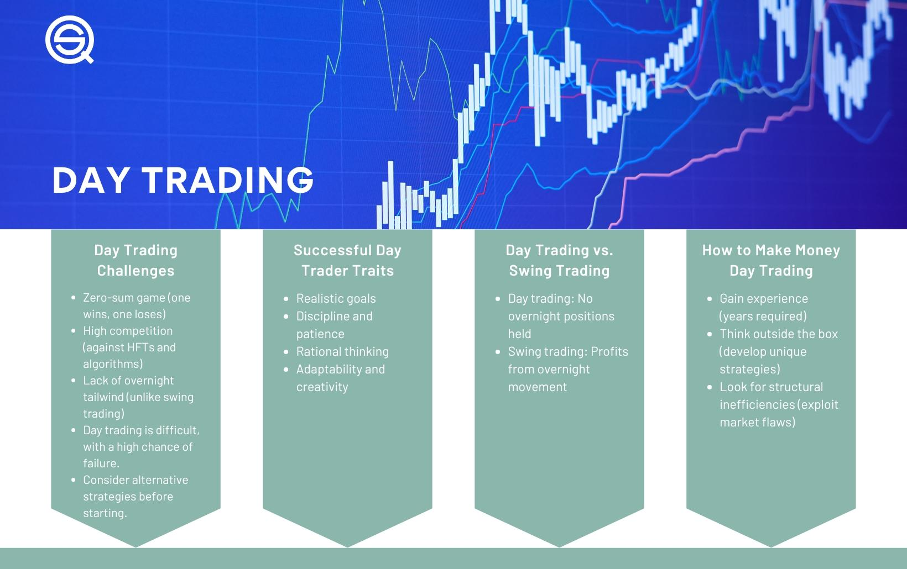

## Table of Contents

## What is day trading and why did you decide to start?

Day trading is when you buy and sell stocks or other investments within the same day. You try to make money from small changes in the price of these investments. It's different from long-term investing, where you hold onto stocks for a long time. Day trading can be exciting but also risky because the prices can go up and down a lot in a short time.

I decided to start day trading because I wanted to learn more about the stock market and how it works. I also thought it could be a way to make some extra money. It seemed like a good challenge, and I enjoy trying new things. But I knew it was important to learn as much as I could first and be careful with my money, because day trading can be risky if you don't know what you're doing.

## How did you educate yourself about day trading before starting?

Before I started day trading, I spent a lot of time learning about it. I read many books about the stock market and day trading. These books explained the basics, like how to read stock charts and understand market trends. I also found websites and blogs written by experienced traders. They shared their stories and tips, which helped me understand what to expect.

I also took online courses that taught me about different trading strategies. These courses had videos and quizzes that made learning fun and helped me remember what I learned. I practiced with a virtual trading account, where I could buy and sell stocks without using real money. This was a safe way to see how the market works and test my strategies. By the time I felt ready to start, I had a good understanding of day trading and felt more confident.

## What trading platform did you use and why?

I used the Robinhood trading platform to start day trading. I chose Robinhood because it's easy to use and it doesn't charge any fees for trading stocks. This was important to me because I was just starting out and wanted to keep my costs low. Robinhood also has a simple design that made it easy for me to understand and navigate, which was helpful since I was new to trading.

Another reason I picked Robinhood is that it has a lot of educational resources. They have articles and videos that helped me learn more about trading. This was great because I could keep learning even after I started trading. Overall, Robinhood was a good choice for me because it was user-friendly, free to use, and had the tools I needed to learn and trade.

## How much initial capital did you start with?

I started day trading with $1,000. I chose this amount because it was money I could afford to lose. Day trading can be risky, so I didn't want to use money that I needed for important things like bills or savings.

This amount also let me learn without too much pressure. I could make mistakes and learn from them without losing a lot of money. Starting small helped me get comfortable with trading before I thought about using more money.

## What were the first few trades you made and what did you learn from them?

The first few trades I made were small and simple. I bought a few shares of a tech company that I thought would go up in price during the day. I watched the price carefully and sold the shares when they went up a little bit. I made a small profit, which felt good, but I also learned that it's hard to predict what will happen next. Another trade I made was buying shares of a popular retail company. I thought it would do well because it was a busy shopping day. But the price went down instead, and I had to decide whether to hold onto the shares or sell them at a loss. I chose to sell and learned that emotions can make trading harder.

From these early trades, I learned a lot about the importance of having a plan. It's not just about guessing which stocks will go up. You need to set clear goals for each trade, like how much you're willing to risk and when you'll sell. I also realized that it's important to stay calm and not let emotions like fear or excitement control my decisions. These early experiences taught me to always keep learning and to be patient. Day trading is not about making quick, big profits but about making smart, steady choices over time.

## How did you develop your trading strategy?

I developed my trading strategy by first learning as much as I could about the stock market and different trading techniques. I read books, took online courses, and watched videos from experienced traders. I paid attention to what worked for them and tried to understand why. I also practiced a lot using a virtual trading account. This let me try out different strategies without losing real money. Over time, I started to see patterns and learned what strategies fit my style and goals.

After a while, I started to focus on a few key things in my strategy. I decided to only trade stocks that I understood well and that had clear trends. I set strict rules for when to buy and sell, like setting stop-loss orders to limit my losses. I also learned to be patient and not to trade too often. I realized that it's better to wait for the right opportunity than to make quick trades that might not work out. My strategy became about making careful, informed decisions rather than trying to make quick profits.

## What are the key indicators and tools you use for making trading decisions?

I use a few key indicators and tools to help me make trading decisions. One important tool is the moving average, which helps me see the overall trend of a stock's price over time. I look at both short-term and long-term moving averages to understand if the stock is going up or down. Another tool I use is the Relative Strength Index (RSI), which tells me if a stock is overbought or oversold. This helps me decide if it might be a good time to buy or sell. I also pay attention to volume, which shows how many shares are being traded. High volume can mean that a lot of people are interested in the stock, which can affect its price.

Another important tool is the candlestick chart, which gives me a clear picture of a stock's price movement over time. I look at patterns in the candlesticks to help me predict what might happen next. I also use technical analysis software that can show me support and resistance levels. These levels help me understand where the stock price might stop going down or up. All these tools together help me make more informed decisions about when to buy and sell stocks.

## How do you manage risk and what are your strategies for minimizing losses?

I manage risk by setting strict rules for myself before I start trading. One of the most important rules is using stop-loss orders. A stop-loss order is like a safety net that automatically sells my stock if the price drops too much. This helps me limit how much money I can lose on a single trade. I also only use money that I can afford to lose. This way, even if I have a bad day, it won't hurt my finances too much. Another way I manage risk is by not putting all my money into one stock. I spread it out over a few different stocks, which is called diversification. This means if one stock does badly, I won't lose all my money.

To minimize losses, I focus on planning my trades carefully. Before I buy a stock, I decide on my entry and exit points. I think about how much I'm willing to risk and what profit I want to make. I also keep learning and adjusting my strategies. If something isn't working, I try to figure out why and change my approach. I also make sure to take breaks and not trade too much. It's easy to get caught up in the excitement, but taking a step back helps me make better decisions. By staying disciplined and sticking to my rules, I can keep my losses small and give myself a better chance at making money in the long run.

## Can you share a success story where you made significant profits?

One of my success stories happened when I bought shares of a small tech company that was about to release a new product. I had been following the company for a while and noticed that their stock price was starting to go up as the release date got closer. I decided to buy a few shares the day before the product launch, hoping the price would go up even more. Sure enough, when the product was announced and got good reviews, the stock price jumped a lot. I sold my shares the same day and made a nice profit.

What made this trade special was that I had done my homework. I knew the company well and had a good feeling about the new product. I also stuck to my trading plan. I set a clear goal for how much profit I wanted and used a stop-loss order to protect my money if the price went down instead. This trade showed me that patience and planning can really pay off. It was exciting to see my hard work turn into a big win.

## What are some common mistakes you made early on and how did you overcome them?

Early on, I made a few common mistakes. One big mistake was letting my emotions control my trades. I would get excited when a stock went up and hold onto it too long, hoping to make even more money. But then I'd panic if the price started to drop and sell too quickly, often at a loss. Another mistake was not having a clear plan. I would jump into trades without thinking about when to buy or sell, which led to a lot of guesswork and bad decisions.

To overcome these mistakes, I started to focus more on planning and discipline. I set strict rules for myself, like always using stop-loss orders to limit my losses and deciding on my entry and exit points before making a trade. I also learned to take breaks and not trade when I was feeling too emotional. Over time, I got better at sticking to my plan and not letting my feelings get in the way. By being more patient and disciplined, I was able to make smarter trades and avoid the mistakes I made early on.

## How do you keep up with market trends and continue learning as a day trader?

I keep up with market trends by reading financial news every day. I look at websites like CNBC and Bloomberg to see what's happening in the stock market. I also follow some traders on social media who share their thoughts about the market. This helps me stay informed about big events that can affect stock prices, like company earnings reports or changes in the economy. By staying up to date, I can make better decisions about when to buy and sell.

I also keep learning by taking online courses and reading books about trading. There are always new strategies and tools to learn about, so I try to keep my skills sharp. I join trading communities where I can talk to other traders and learn from their experiences. This helps me see different ways of trading and understand what works for other people. By always learning and staying curious, I can improve my trading and adapt to changes in the market.

## What advice would you give to someone starting out in day trading?

If you're thinking about starting day trading, the first thing you need to do is learn as much as you can. Read books, take online courses, and watch videos about the stock market and trading strategies. It's important to understand how the market works and what can affect stock prices. Start with a virtual trading account where you can practice without losing real money. This will help you get a feel for trading and test your strategies safely. Remember, day trading can be risky, so only use money that you can afford to lose.

Once you start trading, make sure to have a clear plan for each trade. Decide when you'll buy and sell, and use stop-loss orders to limit your losses. Don't let your emotions control your decisions. It's easy to get excited or scared, but sticking to your plan is key. Also, be patient and don't trade too often. It's better to wait for the right opportunity than to make quick trades that might not work out. Keep learning and stay up to date with market news. By being disciplined and always improving, you can become a better trader over time.

## What is the Power of Backtesting?

Backtesting stands as a fundamental pillar in the domain of algorithmic trading, enabling traders to evaluate their strategies using historical data prior to live deployment. This process offers a structured approach for assessing how a trading strategy would have performed in the past, providing crucial insights into potential future outcomes. Thorough backtesting not only uncovers the strengths and weaknesses of a trading strategy but also facilitates the fine-tuning necessary to optimize its effectiveness.

A well-executed backtest involves simulating a strategy on extensive historical data to gauge its performance metrics. Key performance indicators include cumulative returns, drawdown metrics, Sharpe ratio, and more. For instance, the Sharpe ratio, often used to measure risk-adjusted returns, can be calculated as:

$$
\text{Sharpe ratio} = \frac{E[R] - R_f}{\sigma[R]}
$$

where $E[R]$ is the expected return of the strategy, $R_f$ is the risk-free rate, and $\sigma[R]$ is the standard deviation of the strategy's return.

Traders must exercise diligence to avoid overfitting during [backtesting](/wiki/backtesting), where a strategy performs exceptionally well on past data but fails to deliver similar results in real market conditions. Overfitting can be mitigated by ensuring that the strategy remains robust across diverse market conditions and timeframes. This involves:

1. **Using Out-of-Sample Data**: Divide the dataset into training and testing sets. Use the training set to develop the strategy, and the testing set to verify its performance.

2. **Cross-Validation**: Implement techniques like k-fold cross-validation, which subdivides data into k segments or "folds," allows the strategy to be tested multiple times, each time with a different fold used as the validation set.

3. **Walk-Forward Analysis**: This involves backtesting the strategy in a series of sequential steps, updating the model parameters as new data becomes available, to simulate real trading conditions.

4. **Stress Testing**: Apply the strategy to extreme market conditions, such as financial crises or unexpected geopolitical events, to evaluate its resilience.

Employing such practices during the backtesting phase not only sharpens the decision-making process but also enhances traders' confidence in their strategies. Moreover, the insights garnered from backtesting can be instrumental in refining algorithms to align closely with the evolving market dynamics. As a result, algorithmic traders are better positioned to craft strategies that are both profitable and resilient, ensuring preparedness for live trading scenarios.

## What is the Optimal Use of Technical Indicators?

Selecting and effectively utilizing technical indicators is essential for optimizing [algorithmic trading](/wiki/algorithmic-trading) strategies. By carefully choosing a set of reliable indicators that complement each other, traders can avoid redundant signals and improve their decision-making processes. Three primary categories of indicators—[momentum](/wiki/momentum), trend, and [volume](/wiki/volume-trading-strategy)—are especially popular due to the diverse insights they provide into market dynamics.

Momentum indicators, such as the Relative Strength Index (RSI) and the Moving Average Convergence Divergence (MACD), measure the speed and change of price movements. These indicators help traders identify overbought or oversold conditions, potentially signaling reversals. For instance, the RSI is calculated using the formula:

$$
RSI = 100 - \left( \frac{100}{1 + \frac{\text{Average Gain}}{\text{Average Loss}}} \right)
$$

Trend indicators, including moving averages and the Average Directional Index (ADX), are designed to identify and follow market trends. Moving averages, such as the Simple Moving Average (SMA) and Exponential Moving Average (EMA), smooth out price data to highlight the direction and strength of a trend. The ADX, on the other hand, quantifies the strength of a trend without indicating its direction, with higher values suggesting a stronger trend.

Volume indicators, such as the On-Balance Volume (OBV) and the Volume Weighted Average Price (VWAP), provide insights into the strength of a price movement by analyzing volume data. OBV adds or subtracts volume based on the direction of price movements, while VWAP combines price and volume to offer a more accurate average price over a specific period.

To maximize the effectiveness of these indicators, continuously refining their combination based on performance evaluations and current market conditions is crucial. This involves testing different settings for each indicator and monitoring their effectiveness in various market scenarios. For example, using backtesting and forward testing on historical and live data can reveal which indicator settings produce the best results.

Below is a simple Python example of how to use moving averages for trend analysis:

```python
import pandas as pd

# Load historical price data into a DataFrame
data = pd.read_csv('historical_data.csv')

# Calculate Simple Moving Average (SMA) for 50 and 200 days
data['SMA_50'] = data['Close'].rolling(window=50).mean()
data['SMA_200'] = data['Close'].rolling(window=200).mean()

# Trading signal: Buy when SMA_50 crosses above SMA_200, sell when SMA_50 crosses below SMA_200
data['Signal'] = 0
data.loc[(data['SMA_50'] > data['SMA_200']), 'Signal'] = 1
data.loc[(data['SMA_50'] < data['SMA_200']), 'Signal'] = -1

# Print the signals
print(data[['Close', 'SMA_50', 'SMA_200', 'Signal']].tail())
```

Consistently refining technical indicators based on their performance will enhance a trading system's ability to adapt to evolving market conditions, ultimately leading to more informed trading decisions.

## How can strategic stop losses be incorporated effectively?

Effectively placing stop-loss orders is a fundamental aspect of risk management in algorithmic trading, offering traders a means to protect their portfolios from excessive losses while optimizing their strategies for maximum profitability. A stop-loss order is designed to automatically close a trade when the price of an asset reaches a predetermined level, helping traders manage downside risk and protect capital.

To determine optimal stop loss distances, traders often use the Average True Range (ATR), a technical indicator that measures market [volatility](/wiki/volatility-trading-strategies). By analyzing the ATR values, traders can calculate stop loss levels that are neither too tight (causing premature exits during market fluctuations) nor too loose (which could lead to significant losses). The ATR is calculated using the formula:

$$
ATR = \frac{1}{n} \sum_{t=1}^{n} TR_t
$$

where $TR_t$ is the true range at time $t$, determined by the formula:

$$
TR_t = \max((H_t - L_t), |H_t - C_{t-1}|, |L_t - C_{t-1}|)
$$

Here, $H_t$ and $L_t$ are the high and low prices of the current period, and $C_{t-1}$ is the close price of the previous period. By multiplying the ATR by a specific [factor](/wiki/factor-investing) (commonly between 1.5 and 2), traders can set stop-loss levels that align with the current market volatility.

In addition to static stop-loss orders, incorporating trailing stops can enhance a strategy's ability to secure profits while allowing trades to capitalize on favorable price movements. A trailing stop adjusts the stop-loss level at predefined intervals as the price moves in a trader's favor. For example, if an asset's price increases, the trailing stop will move upward in step with the price action, ensuring that profits are protected without imposing a fixed constraint on potential gains.

Here's a simple Python example for implementing a trailing stop:

```python
def calculate_trailing_stop(entry_price, price, atr, atr_multiplier=1.5):
    initial_stop_loss = entry_price - (atr * atr_multiplier)
    trailing_stop_price = max(price - (atr * atr_multiplier), initial_stop_loss)
    return trailing_stop_price

# Example usage
entry_price = 100
current_price = 110
atr = 2
trailing_stop = calculate_trailing_stop(entry_price, current_price, atr)
print(f'Trailing Stop Price: {trailing_stop}')
```

In this example, the trailing stop dynamically adjusts with the market while ensuring that profits are secured once a favorable threshold is breached.

By leveraging tools like ATR and implementing trailing stops, algorithmic traders can more effectively balance risk and reward. These mechanisms not only protect against severe downturns but also enable strategies to remain flexible and responsive to evolving market conditions, ultimately contributing to the long-term success of a trading strategy.

## References & Further Reading

[1]: Hendershott, T., Jones, C. M., & Menkveld, A. J. (2011). ["Does Algorithmic Trading Improve Liquidity?"](https://onlinelibrary.wiley.com/doi/full/10.1111/j.1540-6261.2010.01624.x) The Journal of Finance, 66(1), 1-33.

[2]: Bergstra, J., Bardenet, R., Bengio, Y., & Kégl, B. (2011). ["Algorithms for Hyper-Parameter Optimization."](https://dl.acm.org/doi/10.5555/2986459.2986743) Advances in Neural Information Processing Systems 24.

[3]: Lopez de Prado, M. (2018). ["Advances in Financial Machine Learning."](https://www.amazon.com/Advances-Financial-Machine-Learning-Marcos/dp/1119482089) Wiley.

[4]: Aronson, D. R. (2007). ["Evidence-Based Technical Analysis: Applying the Scientific Method and Statistical Inference to Trading Signals."](https://onlinelibrary.wiley.com/doi/book/10.1002/9781118268315) Wiley.

[5]: Jansen, S. (2020). ["Machine Learning for Algorithmic Trading."](https://github.com/stefan-jansen/machine-learning-for-trading) Packt Publishing.

[6]: Chan, E. P. (2008). ["Quantitative Trading: How to Build Your Own Algorithmic Trading Business."](https://github.com/ftvision/quant_trading_echan_book) Wiley.