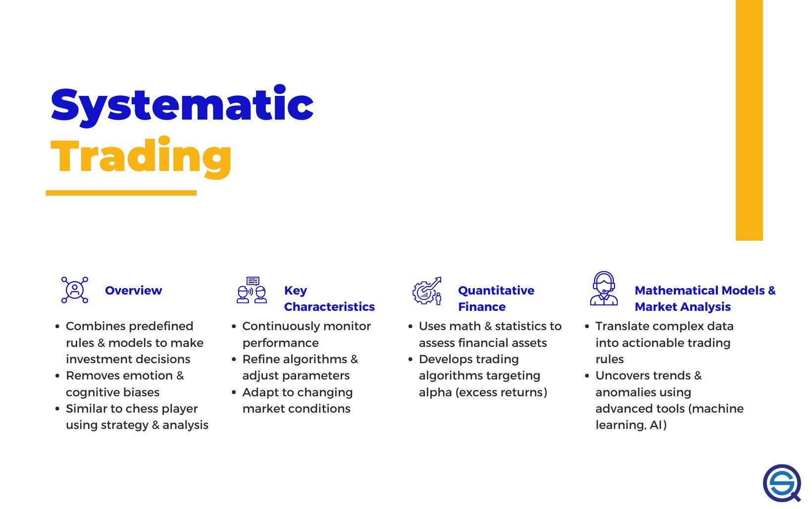

## Table of Contents

## What is quantitative research?

Quantitative research is a way of studying things by using numbers and measurements. It helps researchers find out how many people think or act a certain way, or how often something happens. This type of research often uses surveys, experiments, and statistics to collect data. The goal is to get clear, objective results that can be used to make predictions or test theories.

In quantitative research, data is collected in a structured way, which means that everyone is asked the same questions in the same way. This makes it easier to compare results and see patterns. For example, if you want to know how many students in a school like a new lunch menu, you could give them all a survey with the same questions. Then, you can count the answers and see what percentage of students like the new menu. This kind of research is useful in fields like science, business, and social studies because it gives solid, measurable evidence.

## What is a systematic trading hedge fund?

A systematic trading hedge fund is a type of investment fund that uses computer programs to make trading decisions. Instead of people choosing what to buy or sell based on their feelings or guesses, these funds use math and data to decide. The computer looks at lots of information like prices, trends, and other numbers to figure out the best trades. This way, the decisions are based on facts and rules, not emotions.

These funds are called "hedge funds" because they often try to make money no matter if the market goes up or down. They do this by using different strategies to balance out risks. For example, they might buy one thing and sell another at the same time, hoping to make a profit from the difference. Systematic trading hedge funds are popular because they can handle a lot of trades quickly and without human mistakes. However, they still need smart people to set up the rules and keep an eye on things to make sure everything works well.

## How does quantitative research contribute to the development of trading strategies?

Quantitative research helps in creating trading strategies by using numbers and data to find patterns and trends in the market. Traders use this research to look at lots of information, like stock prices, trading volumes, and economic reports. By studying this data, they can figure out what has worked in the past and use that to predict what might happen next. For example, they might see that a certain stock goes up every time a specific economic report comes out. They can then create a strategy to buy that stock just before the report is released.

Once traders have these patterns, they can make rules for their trading strategies. These rules tell them when to buy or sell, how much to trade, and how to manage risk. For instance, if the data shows that a stock usually goes up by 2% after a good earnings report, the trading strategy might include buying the stock right before the report and selling it after it goes up. This way, the strategy is based on solid evidence, not just guesses. By using quantitative research, traders can make their strategies more reliable and increase their chances of making money in the market.

## What are the key benefits of using quantitative research in systematic trading?

Using quantitative research in systematic trading helps traders make better decisions because it uses numbers and data to find patterns in the market. Instead of guessing what might happen, traders can look at past data to see what has worked before. For example, they might find that a stock goes up after a certain event happens. By using this information, traders can set up rules for when to buy or sell, making their trading strategies more reliable and less risky.

Another big benefit is that quantitative research makes trading more consistent. Because the strategies are based on data and rules, they are less affected by emotions or mistakes that people might make. This means that the trades are done the same way every time, which can lead to more predictable results. Overall, using quantitative research can help traders make smarter, more informed decisions, and improve their chances of making money in the market.

## Can you explain how data analysis fits into quantitative research for hedge funds?

Data analysis is a big part of quantitative research for hedge funds. It's like looking at a lot of numbers and information to find patterns and trends. Hedge funds use computers to go through all this data quickly. They look at things like stock prices, how much people are buying and selling, and other important numbers. By doing this, they can see what has happened in the past and use that information to make guesses about what might happen next. This helps them decide when to buy or sell things to make money.

Once the data is analyzed, hedge funds use it to make trading rules. These rules tell them exactly when to buy or sell, how much to trade, and how to manage risk. For example, if the data shows that a stock goes up after a certain event, the hedge fund might make a rule to buy that stock right before the event happens. This way, the trading decisions are based on facts and numbers, not just feelings or guesses. Using data analysis helps hedge funds make smarter and more reliable trading strategies.

## What types of data are typically used in quantitative research for systematic trading?

In quantitative research for systematic trading, hedge funds use different kinds of data to make their trading decisions. They look at stock prices, which tell them how much a stock is worth at any given time. They also use trading volumes, which show how many shares of a stock are being bought and sold. Economic reports are another important type of data, as they give information about things like unemployment rates or inflation, which can affect the market. Additionally, hedge funds might use data from financial statements of companies, like their earnings and revenues, to understand how well a company is doing.

Another type of data that's often used is market sentiment data, which shows how people feel about the market. This can come from surveys, social media, or news articles. Technical indicators are also important; these are calculations based on stock prices and volumes that help predict future price movements. For example, moving averages can show if a stock's price is going up or down over time. By combining all these different types of data, hedge funds can create detailed models and strategies to make better trading decisions.

## How does quantitative research help in risk management within a hedge fund?

Quantitative research helps hedge funds manage risk by using numbers and data to understand how risky their trades might be. They look at past data to see how different investments have done in the past. By doing this, they can figure out how much a certain investment might go up or down. This helps them decide how much money to put into each trade. For example, if the data shows that a stock is very likely to drop a lot, the hedge fund might decide to invest less in that stock to avoid big losses.

Another way quantitative research helps with risk management is by setting up rules for how to handle risky situations. Hedge funds use the data to make rules about when to cut losses or take profits. This means they can automatically stop trading if things start going badly, which helps protect their money. By using numbers and facts instead of guesses, hedge funds can make smarter choices about how to manage risk and keep their investments safe.

## What are the challenges faced when implementing quantitative research in a trading environment?

Using quantitative research in trading can be hard because it needs a lot of data and powerful computers to handle it. Traders have to gather all sorts of information, like stock prices and economic reports, and then use special programs to look at it all. Sometimes, the data can be messy or missing, which makes it tough to get good results. Also, the computers and software needed to do this kind of research can be expensive, and they need to be fast and reliable to keep up with the fast-moving markets.

Another challenge is that the market can change quickly, and what worked in the past might not work in the future. Traders need to keep updating their models and strategies to stay on top of things. This means they have to keep learning and testing new ideas, which can take a lot of time and effort. Plus, even with all the data and computers, there's always a bit of uncertainty, so traders have to be ready for surprises and know how to handle them.

## How does machine learning enhance quantitative research in systematic trading?

Machine learning helps make quantitative research in systematic trading better by finding patterns in big sets of data that people might miss. It can look at lots of information, like stock prices and trading volumes, and learn from it over time. This means machine learning can spot trends and make predictions more accurately than just using old-fashioned math and stats. For example, it can figure out how a stock might move based on past data and then use that to decide when to buy or sell. This makes trading strategies smarter and more likely to make money.

Another way machine learning helps is by making it easier to handle and use new data. Markets change all the time, so traders need to keep updating their models. Machine learning can quickly learn from new information and adjust the trading rules without needing a lot of extra work. This keeps the strategies fresh and able to deal with new situations. By using machine learning, hedge funds can make their trading more reliable and better at managing risks, which is really important in the fast-paced world of trading.

## What are the latest trends in quantitative research methods for hedge funds?

One of the latest trends in quantitative research methods for hedge funds is the increased use of machine learning and artificial intelligence (AI). These technologies help hedge funds analyze huge amounts of data faster and more accurately than before. Machine learning can find patterns in the data that might be too hard for people to see. This means hedge funds can make better predictions about how the market will move and create smarter trading strategies. For example, AI can look at social media posts and news articles to understand how people feel about the market, which can help predict what might happen next.

Another trend is the use of alternative data sources. Hedge funds are now using data from places like satellite images, credit card transactions, and even weather reports to get a better picture of what's happening in the market. This kind of data can give them an edge over other traders who only look at traditional data like stock prices and economic reports. By combining all these different types of data, hedge funds can make more informed decisions and find new opportunities to make money. This trend is making quantitative research more detailed and effective.

## How do hedge funds measure the success of quantitative research in their trading strategies?

Hedge funds measure the success of their quantitative research by looking at how much money they make from their trading strategies. They keep track of things like the total profit, how much the value of their investments goes up or down, and the percentage of trades that make money. If the strategies based on quantitative research are making more money than they are losing, then the hedge fund knows that the research is working well. They also compare their results to other funds or to the overall market to see if they are doing better than average.

Another way hedge funds measure success is by looking at how well their strategies handle risk. They use numbers to see if their trades are too risky or if they are managing risk well. For example, they might look at how much money they could lose on a bad day and compare that to how much they usually make. If the research helps them make more money while keeping losses small, then it's considered successful. This way, hedge funds can tell if their quantitative research is helping them make smart and safe trading decisions.

## What advanced statistical techniques are used in quantitative research for optimizing trading algorithms?

In quantitative research for optimizing trading algorithms, hedge funds use advanced statistical techniques like regression analysis. This helps them understand how different things, like stock prices and economic reports, affect each other. By using regression, they can predict how a stock might move based on other factors. Another technique they use is time series analysis, which looks at how data changes over time. This is useful for spotting trends and patterns in stock prices, helping traders decide when to buy or sell.

Another important technique is machine learning, which lets computers learn from data and make better predictions. Hedge funds use this to find complex patterns that are hard for people to see. For example, machine learning can help figure out how news and social media affect stock prices. They also use techniques like Monte Carlo simulations to test how their strategies might work in different situations. By running many different scenarios, they can see how their trades might perform and make their algorithms more reliable and less risky.

## How can risk be managed through quantitative analysis?

Utilizing quantitative methods in risk management serves as a cornerstone for systematic trading hedge funds. By applying precise mathematical and statistical techniques, these funds can identify, measure, and mitigate potential risks more effectively.

One primary method in quantitative risk management is stress testing, which evaluates how potential unfavourable market conditions could impact a trading portfolio. Stress testing involves simulating extreme market conditions to assess the resilience of trading strategies. This approach helps to reveal potential vulnerabilities in the portfolio and develop strategies to address them. For instance, traders can simulate historical crises or hypothetical scenarios to understand their impact on current investments. By examining asset correlations and volatilities under these stress scenarios, it becomes possible to estimate potential losses and adjust positions accordingly.

Scenario analysis complements stress testing by exploring the effects of specific financial events or economic changes on a portfolio. This type of analysis allows traders to evaluate the implications of both anticipated and unexpected events. By analyzing how different scenarios impact asset prices and correlations, quantitative researchers can derive strategies to safeguard against significant losses.

Quantitative research also plays a crucial role in maintaining portfolio diversification and managing leverage. Diversification involves allocating investments across various assets to reduce exposure to any single source of risk. Quantitative tools, such as correlation matrices and clustering algorithms, identify assets with low or negative correlations, which are ideal candidates for diversification. By ensuring that asset returns do not move in tandem, hedge funds can minimize unsystematic risk.

Furthermore, managing leverage is critical to maintaining financial stability within a portfolio. Quantitative techniques aid in determining the optimal levels of leverage by analyzing risk-adjusted returns on different investment strategies. For example, using the Sharpe Ratio, which is calculated as:

$$
\text{Sharpe Ratio} = \frac{E[R_p] - R_f}{\sigma_p}
$$

where $E[R_p]$ is the expected portfolio return, $R_f$ is the risk-free rate, and $\sigma_p$ is the portfolio's standard deviation of returns, quant analysts can assess whether the additional expected returns from leverage justify the increased risk.

Quantitative research also enables the backtesting of risk management strategies to ensure their robustness over various market conditions. Backtesting involves applying trading strategies to historical data to evaluate their potential efficacy. This process can help identify strategies that perform well under different financial environments, thus providing a basis for the implementation of effective risk management techniques.

In conclusion, the application of quantitative methods in risk management not only helps hedge funds navigate the complexities of financial markets but also empowers them to optimize their trading strategies systematically. The insights gained through stress testing, scenario analysis, diversification, and leverage management are invaluable in enhancing a fund's risk-adjusted performance and ensuring its long-term success.

## References & Further Reading

[1]: Bergstra, J., Bardenet, R., Bengio, Y., & Kégl, B. (2011). ["Algorithms for Hyper-Parameter Optimization."](https://papers.nips.cc/paper_files/paper/2011/hash/86e8f7ab32cfd12577bc2619bc635690-Abstract.html) Advances in Neural Information Processing Systems 24.

[2]: ["Advances in Financial Machine Learning"](https://www.amazon.com/Advances-Financial-Machine-Learning-Marcos/dp/1119482089) by Marcos Lopez de Prado.

[3]: ["Evidence-Based Technical Analysis: Applying the Scientific Method and Statistical Inference to Trading Signals"](https://www.wiley.com/en-gb/Evidence+Based+Technical+Analysis:+Applying+the+Scientific+Method+and+Statistical+Inference+to+Trading+Signals-p-9780470008744) by David Aronson.

[4]: ["Machine Learning for Algorithmic Trading: Predictive Models to Extract Signals from Market and Alternative Data for Systematic Trading Strategies with Python"](https://www.amazon.com/Machine-Learning-Algorithmic-Trading-intelligence/dp/9918608013) by Stefan Jansen.

[5]: ["Quantitative Trading: How to Build Your Own Algorithmic Trading Business"](https://www.amazon.com/Quantitative-Trading-Build-Algorithmic-Business/dp/0470284889) by Ernest P. Chan.

[6]: Simons, J. (2020). ["A Man for All Markets: From Las Vegas to Wall Street, How I Beat the Dealer and the Market."](https://www.amazon.com/Man-All-Markets-Street-Dealer/dp/1400067960) Random House.

[7]: Hull, J. C. (2018). ["Risk Management and Financial Institutions"](https://www.amazon.com/Management-Financial-Institutions-Wiley-Finance/dp/1118955943) by John Wiley & Sons.