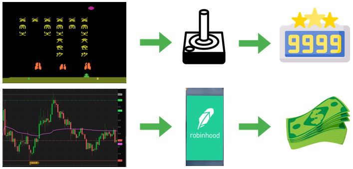

Reinforcement learning (RL) is a branch of artificial intelligence (AI) where systems learn to achieve specific goals through trial and error interactions with dynamic environments. RL is characterized by its ability to let an agent optimize actions based on feedback from these interactions, making it highly applicable in diverse domains such as robotics, gaming, healthcare, and autonomous vehicles. Unlike traditional machine learning techniques that require extensive labeled datasets, RL focuses on learning optimal behaviors through the accumulation of rewards, providing a potent framework for decision-making in complex scenarios.

Trading, particularly in financial markets, is an area ripe for the application of reinforcement learning. Financial markets are inherently dynamic, with intricate data patterns influenced by numerous unpredictable factors. Here, RL can be leveraged to develop models that more effectively predict market trends, manage portfolios, and execute trades autonomously. By learning from market data, RL algorithms can discern patterns and strategize without being explicitly programmed for each task, overcoming the limitations of traditional trading algorithms that may falter in the face of unprecedented market movements.

The importance of incorporating advanced technologies like RL in financial markets cannot be overstated. These markets are increasingly dominated by high-frequency trades and algorithmic strategies that require automation and rapid decision-making. RL presents an opportunity to enhance these strategies by providing a mechanism to adapt to market conditions in real-time, thus potentially increasing trading efficiency, profitability, and risk management. As financial environments continue to evolve with technological advancements, the role of RL in shaping future trading systems appears substantial, offering promising avenues for innovation and enhanced market interaction.

## Table of Contents

## Understanding Reinforcement Learning

Reinforcement learning (RL) is a specialized branch of [machine learning](/wiki/machine-learning) where an agent interacts with an environment and learns to make decisions by receiving feedback through rewards or penalties. Unlike supervised learning, where a model is trained on a dataset containing input-output pairs, RL focuses on learning optimal behaviors through exploration and exploitation without explicit instructions or labeled data.

**Key Components of Reinforcement Learning**

1. **Agent**: The learner or decision-maker that interacts with the environment to achieve a goal. The agent's objective is to learn a policy—a strategy for selecting actions—that maximizes the cumulative reward over time.

2. **Environment**: The world with which the agent interacts. It provides feedback, typically in the form of a reward, based on the actions taken by the agent. The environment can be modeled as a Markov Decision Process (MDP), which provides a formal framework for decision-making.

3. **Actions**: The set of all possible moves or decisions the agent can make. The agent chooses actions based on its policy, which is refined over time through interaction with the environment.

4. **States**: A representation of the environment at a particular time. The state provides the necessary information for the agent to decide the next action. In MDPs, the transition from one state to another depends on the current state and the action taken.

5. **Rewards**: A scalar value given to the agent after an action is taken, indicating the immediate benefit of that action. The goal of the agent is to learn a policy that maximizes the expected sum of rewards over time, known as the return.

Mathematically, the problem is often modeled using the Bellman Equation, which provides a recursive decomposition of the value function, $ V(s) $:

$$
V(s) = \max_{a} \left[ R(s, a) + \gamma \sum_{s'} P(s' | s, a) V(s') \right] 
$$

where $V(s)$ is the value of being in state $s$, $R(s, a)$ is the reward for taking action $a$ in state $s$, and $P(s' | s, a)$ is the probability of transitioning to state $s'$ given action $a$ is taken in state $s$. The discount factor $\gamma$ (between 0 and 1) determines the importance of future rewards.

**Difference from Other Machine Learning Paradigms**

Reinforcement learning distinctly differs from supervised and unsupervised learning. In supervised learning, the model learns from labeled data where both inputs and corresponding outputs are provided. In unsupervised learning, the model identifies hidden patterns without any labeled responses. RL, however, involves learning to take actions by trial and error, receiving feedback from the environment, where the focus is on finding a balance between exploring uncharted territory and exploiting known information.

Through its interactions and evolutionary approach to learning, RL enables the development of systems that can adapt and optimize decision-making processes over time, making it especially potent for applications requiring dynamic adjustment to ever-changing conditions.

## Basics of Trading Systems

Trading systems are integral to financial markets, facilitating the buying and selling of assets such as stocks, bonds, currencies, and derivatives. Understanding these systems requires a grasp of both traditional and modern approaches, notably algorithmic and automated trading systems.

Traditional trading has long been characterized by manual processes, where human traders make decisions based on market analysis, news, and experience. This approach requires significant expertise and involves high levels of human emotion, which can sometimes lead to inconsistent decision-making. Traditional trading is often slower and may not efficiently capture fleeting market opportunities.

In contrast, [algorithmic trading](/wiki/algorithmic-trading) uses computer algorithms to execute trades at speeds and efficiencies impossible for humans. These systems rely on pre-defined instructions and mathematical models to make trading decisions. For example, a simple trading algorithm might follow the formula:

$$
\text{Trade Signal} = \begin{cases} 
\text{Buy}, & \text{if } P_t < L_t \\
\text{Sell}, & \text{if } P_t > H_t \\
\text{Hold}, & \text{otherwise} 
\end{cases}
$$

where $ P_t $ is the current price, $ L_t $ is a predefined lower threshold, and $ H_t $ is a higher threshold.

Automated trading takes algorithmic trading a step further by allowing systems to execute these trades without human intervention. These systems can adjust their parameters dynamically, adapting to market conditions in real-time.

Designing effective trading strategies poses various challenges. One significant challenge is developing algorithms that can adapt to rapidly changing market conditions. Markets are influenced by countless [factor](/wiki/factor-investing)s, from economic indicators to political events, making predictability a major hurdle. Moreover, algorithmic and automated trading systems must be robust against technical failures and cybersecurity threats, which requires extensive testing and optimization.

Opportunities in trading system design lie in exploiting inefficiencies within markets to generate profits. Algorithmic trading can capitalize on [arbitrage](/wiki/arbitrage) opportunities, exploit price discrepancies, and execute complex strategies like [market making](/wiki/market-making) or [statistical arbitrage](/wiki/statistical-arbitrage). Additionally, the advancement of machine learning and AI has opened new possibilities for crafting strategies that learn and evolve over time, potentially leading to more profitable outcomes.

In summary, trading systems are becoming increasingly sophisticated, moving from traditional manual methods to complex algorithmic and automated systems. The design of these systems involves both challenges and opportunities, as traders endeavor to harness technology to gain a competitive edge in the financial markets.

## How Reinforcement Learning is Applied in Trading

Reinforcement learning (RL) is increasingly being integrated into trading systems to leverage its ability to learn and adapt in complex market environments. The integration of RL algorithms into trading involves the use of techniques like Q-learning and Deep Q-Networks (DQN), which enable autonomous decision-making and strategy optimization.

Q-learning, a form of model-free RL, is applied in trading to determine optimal strategies by learning the value of actions in different market states. It involves updating a Q-value matrix, $Q(s, a)$, representing the quality of action $a$ in state $s$, using the Bellman equation:

$$
Q(s, a) = Q(s, a) + \alpha [r + \gamma \max_{a'} Q(s', a') - Q(s, a)]
$$

where:
- $ \alpha $ is the learning rate,
- $ r $ is the reward obtained,
- $ \gamma $ is the discount factor,
- $ \max_{a'} Q(s', a') $ is the maximum future reward obtained by taking action $ a' $.

Deep Q-Networks (DQN) enhance Q-learning by utilizing [neural network](/wiki/neural-network)s to approximate the Q-value function, which is especially useful in high-dimensional state spaces like those encountered in financial markets. The DQN algorithm uses experience replay and target networks to improve stability and convergence, thereby allowing trading systems to make informed decisions based on large datasets and complex patterns.

Practical applications of these RL models in trading include the development of autonomous trading bots that can execute trades based on the learned policies, adapting in real-time to market conditions. These bots analyze vast amounts of data to discern profitable trading opportunities and execute them without human intervention. Furthermore, RL assists in optimizing trading strategies by continuously improving and adjusting actions to augment returns, manage risks, and respond swiftly to market shifts.

Integration of RL in trading systems is ushering in a new era of financial technology, providing sophisticated tools for strategy optimization and dynamic market interaction. As a result, RL is becoming an indispensable component in developing advanced, adaptive trading systems.

## Advantages of Using Reinforcement Learning in Trading

Reinforcement Learning (RL) offers several compelling advantages when applied to trading, primarily due to its dynamic learning capabilities. One of the most significant benefits is its ability to learn and adapt from market data without requiring explicit programming. Unlike traditional models, RL algorithms can update the strategy based on new data, which is crucial in the ever-changing financial markets. This adaptability enables the RL agent to discover optimal trading strategies by simulating a wide range of market scenarios and learning from each iteration.

Another key advantage is the execution of strategies that can maximize returns based on learned patterns. By continuously interacting with the trading environment, RL algorithms can identify complex patterns and relationships within the data that other models might overlook. This pattern recognition allows for the development of strategies that optimize for specific performance metrics, such as maximizing the Sharpe ratio, which is a measure of risk-adjusted return:

$$
\text{Sharpe Ratio} = \frac{E[R_p - R_f]}{\sigma_p}
$$

Where:
- $E[R_p]$ is the expected portfolio return,
- $R_f$ is the risk-free rate,
- $\sigma_p$ is the standard deviation of the portfolio's excess return.

The potential for managing risk and responding to market fluctuations in real-time is another crucial advantage of using RL. Trading environments are inherently volatile, with prices fluctuating due to numerous unpredictable factors. An RL agent can dynamically adjust its strategy in response to these fluctuations, allowing for real-time risk management. This feature is particularly beneficial for mitigating downside risks and capitalizing on upside opportunities. Techniques such as Deep Q-Learning and Policy Gradients can be utilized to optimize actions that take varying levels of risk into account.

Furthermore, RL models are capable of learning strategies that are robust to various market conditions, offering consistent performance even in periods of high [volatility](/wiki/volatility-trading-strategies). This resilience against different market dynamics reduces the likelihood of significant losses during market downturns, maintaining a stable trajectory towards traders' financial goals.

In conclusion, the application of [reinforcement learning](/wiki/reinforcement-learning) in trading provides traders with advanced tools for developing adaptive, profitable, and robust trading strategies. With the ability to autonomously learn from and react to market data, RL represents a paradigm shift towards more intelligent and responsive trading systems.

## Challenges and Limitations

Implementing reinforcement learning (RL) models in the trading sector presents a myriad of challenges, largely because of the dynamic and volatile nature of financial markets. Unlike static environments, markets continually fluctuate due to numerous unpredictable factors such as economic data releases, geopolitical events, and sentiment changes. This makes it challenging for RL [agents](/wiki/agents) to adapt swiftly and consistently.

A significant hurdle is the requirement for large amounts of data and computational resources. RL models rely heavily on historical market data to train and validate their decision-making processes. High-frequency trading, for instance, demands processing vast datasets at a rapid rate, often necessitating sophisticated hardware accelerations such as GPUs or TPUs. The computational cost not only comprises financial expenditure but also involves extensive time investments, particularly when fine-tuning complex models or conducting hyperparameter optimizations.

Another critical challenge is the potential for overfitting, where a model performs well on historical data but fails to generalize to unseen data. This is particularly relevant in RL as models can excessively optimize for past market conditions that no longer hold. Introducing regularization techniques and employing cross-validation strategies can mitigate some of these issues, but they cannot wholly eliminate the risks associated with model overfitting.

Slow convergence rates pose another limitation. Due to the highly stochastic nature of financial environments, RL models may require extensive training time to stabilize and provide actionable insights. Techniques to improve convergence such as using prioritized experience replay or adjusting learning rates dynamically are essentials, yet they add an additional layer of complexity to deployment.

Ethical considerations also emerge as a significant limitation. The opacity of RL models, especially those based on [deep learning](/wiki/deep-learning) methodologies, can lead to a lack of transparency in how trading decisions are made. This raises concerns about accountability and the potential for biased decision-making, which could inadvertently destabilize markets or favor particular market players unfairly. Ensuring ethical compliance and interpretability in model deployment is crucial in harnessing RL's full potential in trading.

Thus, while RL provides a transformative edge in trading, embracing its full capabilities without sidelining the associated challenges and ethical considerations is imperative for deploying effective and responsible trading systems.

## Case Studies and Real-World Applications

Reinforcement Learning (RL) has made substantial inroads into the trading sector, where it is being harnessed to develop intelligent trading systems capable of learning from and adapting to market dynamics. Several notable applications by financial institutions and tech companies illustrate how RL is transforming trading strategies.

One successful example is JPMorgan Chase, which has integrated machine learning techniques, including RL, into its trading systems. The company developed LOXM, a trading algorithm that reportedly executes transactions faster and more efficiently than human traders by learning optimal execution strategies through trial and error. This implementation has significantly reduced transaction costs and improved the execution quality of trades, showcasing RL’s potential in optimizing high-frequency trading operations.

Another prominent case is Google DeepMind's collaboration with Barclays, where RL algorithms were employed to optimize execution strategies in stock trading. DeepMind's approach leverages RL to minimize the market impact of trades by intelligently adjusting order sizes and timings based on real-time market data. This capability demonstrates RL’s strength in processing vast amounts of data and making split-second decisions that enhance trading performance in fast-moving markets.

In the tech sector, Alpaca, a startup specializing in commission-free trading APIs, has utilized RL for autonomous trading strategies. Their approach involves using Deep Q-Networks (DQN) to automate the trading of stocks based on historical market data. By employing RL, Alpaca has developed trading bots that learn to optimize decisions that maximize portfolio returns, demonstrating the benefits of reduced human intervention and increased efficiency.

These real-world applications offer valuable insights into RL's transformative potential in trading. One key takeaway is the ability of RL systems to adaptively improve trading strategies by continuously learning from market experiences, unlike traditional static models. This adaptability not only enhances the accuracy of predictions but also offers more robust risk management by swiftly adjusting to market shifts.

Moreover, insights from these implementations indicate that RL can reduce operational costs and increase profits by automating complex trading processes that would otherwise require significant human intervention. This suggests a future where RL-driven trading strategies could handle an increasingly large portion of trading activities, pushing the frontier of automated financial systems.

However, while the successes are noteworthy, they also highlight the necessity for advanced technological infrastructure and expertise to effectively deploy RL in trading environments. The successful integration of RL hinges on the availability of high-quality data, substantial computational resources, and nuanced understanding of market mechanisms to avoid common pitfalls like overfitting.

Overall, these examples of RL in trading illustrate a promising avenue for innovation in financial markets, providing a foundation for future developments in automated trading strategies. The continued evolution of RL technologies is likely to further enhance their applicability and reliability, making them indispensable tools in the financial sector.

## Future of Reinforcement Learning in Trading

Emerging trends indicate that reinforcement learning (RL) is poised to play an increasingly critical role in financial markets. One key trend is the introduction of more sophisticated RL algorithms that leverage deep neural networks and other advanced machine learning techniques to enhance decision-making processes in trading systems. These algorithms can handle non-linear relationships and high-dimensional data sets, which are typical in financial environments, thereby improving the predictive accuracy of trading models.

Recent advancements in AI and machine learning are integral to the evolution of RL applications in trading. The development of more powerful computing resources and better optimization techniques allows for faster training of RL models, enabling real-time decision-making. Integrating techniques like transfer learning and ensemble models could further improve the robustness of RL systems, allowing them to generalize from one market to another or improve performance in volatile conditions.

Speculation on how RL might transform trading practices points towards creating more autonomous trading systems. These systems could continuously learn and adapt to market changes, effectively handling unforeseen events and exploiting arbitrage opportunities that humans might miss. The potential for RL to seamlessly integrate risk management into trading strategies is another notable prospect, where models continuously assess and mitigate risks based on learned patterns.

Moreover, as RL continues to evolve, it might lead to more democratized trading platforms, making sophisticated trading strategies accessible to individual traders and smaller financial firms. The convergence of RL with other technologies such as blockchain and quantum computing could further redefine trading environments, potentially increasing transparency, security, and efficiency in transactions.

In summary, the future of reinforcement learning in trading is bright and expansive, driven by cutting-edge AI advancements. Its potential to transform trading practices with innovative applications and highly adaptive systems underscores its growing importance in the financial landscape.

## Conclusion

Reinforcement learning (RL) has become increasingly important in modern trading contexts due to its unique ability to learn from vast amounts of market data and adapt to changing conditions autonomously. This adaptability allows RL-based systems to devise trading strategies that maximize returns by identifying and leveraging patterns in the data that may not be apparent through traditional methods.

Among the primary benefits of RL in trading is its capability to handle real-time market fluctuations, offering a proactive approach to risk management. Such systems can continuously learn and refine strategies, striving to optimize for the highest reward over time, given a set of constraints and goals. This continuous learning process provides a dynamic edge over static algorithmic trading models which rely heavily on predefined rules and assumptions.

However, utilizing RL in trading is not without its challenges. Successfully implementing these models requires substantial computational resources and extensive datasets to train the system effectively. Moreover, the intricate nature of financial markets can lead to potential pitfalls, such as overfitting to historical data, slow convergence rates, and ethical considerations surrounding automated trading's impact on market stability.

Looking ahead, the future of RL in trading seems promising, driven by rapid advancements in AI and machine learning technologies. These advancements will likely improve RL's efficiency and applicability, further transforming trading practices. As we see RL models become more sophisticated, they will offer even more refined strategies, enhancing decision-making processes and potentially altering how financial markets operate.

In conclusion, RL's integration into trading reflects the broader trend of evolving financial strategies through advanced technology. While it presents challenges, the potential rewards and strategic advantages offered by RL signify a paradigm shift in how trading strategies are developed and deployed. The ongoing evolution in this space underscores the adaptability and forward-thinking required to remain competitive in today's fast-paced financial environments.

## References & Further Reading

[1]: Bergstra, J., Bardenet, R., Bengio, Y., & Kégl, B. (2011). ["Algorithms for Hyper-Parameter Optimization."](https://papers.nips.cc/paper/4443-algorithms-for-hyper-parameter-optimization) Advances in Neural Information Processing Systems 24.

[2]: ["Advances in Financial Machine Learning"](https://www.amazon.com/Advances-Financial-Machine-Learning-Marcos/dp/1119482089) by Marcos Lopez de Prado

[3]: ["Evidence-Based Technical Analysis: Applying the Scientific Method and Statistical Inference to Trading Signals"](https://www.wiley.com/en-gb/Evidence+Based+Technical+Analysis:+Applying+the+Scientific+Method+and+Statistical+Inference+to+Trading+Signals-p-9780470008744) by David Aronson

[4]: ["Machine Learning for Algorithmic Trading"](https://www.amazon.com/Machine-Learning-Algorithmic-Trading-intelligence/dp/1839217715) by Stefan Jansen

[5]: ["Quantitative Trading: How to Build Your Own Algorithmic Trading Business"](https://www.amazon.com/Quantitative-Trading-Build-Algorithmic-Business/dp/0470284889) by Ernest P. Chan