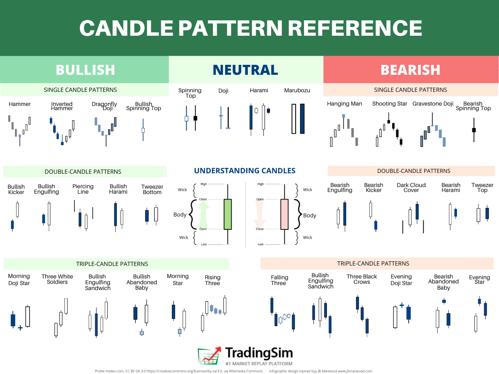

In algorithmic trading, understanding market patterns is crucial, and candlesticks provide valuable insights into market sentiment. Candlestick patterns form an integral part of technical analysis, widely employed by traders to predict future price movements. These patterns offer a graphical representation of price movements over time, reflecting the underlying psychology and sentiment of market participants. By analyzing sequences of candlesticks, traders can identify potential trading opportunities based on historical price data.

This article examines the various candlestick patterns utilized in algorithmic trading and their significance to trading strategies. Algorithmic trading, which uses computer programs to execute trades automatically, incorporates these patterns to enhance decision-making processes. By quantifying the visual and subjective aspects of candlestick patterns into objective criteria, algorithms can automate the identification and execution of trades, aiming to improve efficiency and reduce emotional bias.



Some commonly used candlestick patterns include Doji, Hammer, and Shooting Star, each offering distinct insights into market directions. This comprehensive guide will address popular patterns, their interpretations, and their integration into trading algorithms. Understanding these patterns is beneficial for traders at all levels, whether you are a seasoned professional or just beginning your journey in algorithmic trading, providing you with a robust framework for analyzing market data and executing strategies based on the insights derived from candlestick patterns.

## Table of Contents

## What are Candlestick Patterns?

Candlestick patterns are key tools in technical analysis, comprising combinations of one or more candlesticks on a price chart used to forecast future market movements. These patterns trace their origins back to 18th-century Japanese rice traders, who developed them to understand market psychology and predict rice prices. Each candlestick encapsulates a range of price data over a predetermined time frame, including the opening, closing, high, and low prices.

The anatomy of a candlestick includes the body, which represents the difference between the opening and closing prices, and the wicks or shadows, which denote the high and low price points over the specified time frame. If the closing price is higher than the opening price, the candlestick is typically colored green or white, signaling bullish conditions. Conversely, a closing price lower than the opening price results in a red or black candlestick, indicating bearish conditions.

Candlestick patterns can signal bullish, bearish, or neutral market conditions. Bullish patterns, such as the Hammer and the Bullish Engulfing, suggest potential upward movement, inviting buy signals. Bearish patterns, including the Shooting Star and Bearish Engulfing, imply downward trends, providing sell signals. Neutral patterns, like the Doji, where the open and close prices are virtually equal, denote market indecision.

For example, the Hammer pattern is a bullish reversal pattern often seen in downtrends. It features a small body at the upper end of the trading range with a long lower wick, suggesting that sellers drove prices lower during the session but buyers regained control, pushing the price up to near the session high. The Shooting Star, conversely, is a bearish reversal pattern seen in uptrends, characterized by a small body near the lower end of the trading range and a long upper wick, indicating potential exhaustion of buying pressure.

Understanding these visual cues aids traders in deciphering market sentiment and making informed decisions based on price action. By interpreting candlestick patterns, traders can gain insights into potential turning points in markets, allowing them to anticipate movements and strategize accordingly.

## How Many Candlestick Patterns Exist?

Candlestick patterns represent a rich and diverse component of technical analysis, with a substantial number that have been formally recognized by traders. Research highlights that there are at least 75 distinct candlestick patterns identified within trading circles. These patterns offer a variety of configurations, each demonstrating a unique interpretation of market sentiment. A candlestick pattern can range from simple formations involving a single candle, such as a "Doji" or a "Hammer", to more complex formations that consist of multiple candlesticks like "Morning Star" or "Three Black Crows".

The proliferation of these patterns is not static. New patterns frequently emerge as market conditions evolve and trading strategies become more sophisticated. This continuous development is facilitated by the dynamic nature of markets, which prompts traders to innovate and adapt by identifying new visual cues that signify potential price movements.

Traders can select from this extensive collection of patterns to suit their specific analytical preferences and trading styles. Some traders might prefer the simplicity and direct signals of single-candle patterns, while others may gravitate towards the more nuanced information provided by multi-candle configurations. The extensive list of candlestick patterns thus provides a flexible framework that can be tailored to individual strategies, accommodating both novice and experienced traders.

For those interested in exploring this further, programming environments like Python offer tools and libraries, such as `pandas` and `TA-Lib`, which can be utilized to identify and analyze these patterns programmatically. For example, using Python, a trader can write scripts to automatically detect specific candlestick patterns in historical data, facilitating [backtesting](/wiki/backtesting) and strategy development:

```python
import talib
import pandas as pd

# Load data into a DataFrame
data = pd.read_csv('historical_data.csv')
close_prices = data['Close'].values

# Identify the Hammer pattern
hammer_pattern = talib.CDLHAMMER(data['Open'], data['High'], data['Low'], data['Close'])
data['Hammer'] = hammer_pattern

# Filter data to show only the points where a Hammer pattern was detected
detected_hammers = data[data['Hammer'] != 0]
print(detected_hammers)
```

Through such technological solutions, traders can efficiently identify and implement candlestick patterns, augmenting their strategies with quantitative insight and precision.

## Popular Candlestick Patterns in Algo Trading

In [algorithmic trading](/wiki/algorithmic-trading), the utilization of specific candlestick patterns is favored due to their notable reliability in predicting market movements. Among these, the Bullish Engulfing, Bearish Engulfing, Hammer, and Shooting Star are prevalently employed by traders.

The Bullish Engulfing pattern occurs when a small bearish candlestick is followed by a larger bullish candlestick that completely engulfs the previous day's candle, indicating a potential reversal in market sentiment towards an uptrend. Conversely, the Bearish Engulfing pattern is characterized by a small bullish candlestick followed by a larger bearish one, suggesting a potential reversal to a downtrend.

The Hammer pattern is identified by a small body with a long lower wick, appearing after a downtrend, and signaling a potential reversal upwards. The Shooting Star is the opposite, with a small body and a long upper wick, indicating a potential downward reversal after an uptrend.

These patterns are integrated into algorithmic trading strategies to automate decision-making. By coding algorithms to recognize these patterns, traders can enable automatic execution of trades based on predefined criteria, which mitigates the influence of emotional bias on trading decisions. 

For example, in Python, detecting a Bullish Engulfing pattern can be coded as follows:

```python
def is_bullish_engulfing(previous_candle, current_candle):
    # Extract relevant candle information
    prev_open, prev_close, prev_high, prev_low = previous_candle
    curr_open, curr_close, curr_high, curr_low = current_candle

    # Check if previous candle is bearish and current is bullish
    if prev_close < prev_open and curr_close > curr_open:
        # Check if current candle engulfs the previous one
        if curr_open < prev_close and curr_close > prev_open:
            return True
    return False
```

Such algorithmic implementations allow traders to efficiently capitalize on market opportunities by systematically applying trading rules without the interference of subjective judgment, thereby enhancing the trading process's efficiency and coherence in response to market signals.

## Integrating Candlestick Patterns in Algorithms

Algorithmic trading involves encoding candlestick patterns into software capable of analyzing market data and making informed trading decisions based on predefined criteria. This process begins with identifying key candlestick patterns, which are then integrated into algorithms. These algorithms automate the trading process by triggering buy or sell orders when specific patterns are detected in market data, enhancing trading efficiency and removing emotional bias.

A fundamental step in this integration is backtesting, which assesses the performance of candlestick patterns against historical market data under varied conditions. Backtesting helps traders evaluate the reliability of patterns, ensuring that they can yield profitable outcomes when applied to actual trading. By simulating trades over historical data, traders can adjust their strategies to maximize returns, minimizing risk and identifying potential flaws in their methodology.

Successful integration of candlestick patterns into trading algorithms requires the establishment of clear rules for pattern identification and corresponding trading actions. For example, an algorithm might be designed to execute a buy order when a Bullish Engulfing pattern is detected and market conditions meet certain criteria, such as [volume](/wiki/volume-trading-strategy) thresholds or trend confirmation from other indicators. These rules must be precisely defined to prevent false signals and errant trades.

Modern trading platforms provide tools to backtest and optimize strategies using candlestick patterns, enabling traders to refine their algorithms continuously. These platforms often support scripting in languages like Python, which is widely used for developing and testing trading algorithms due to its simplicity and extensive range of libraries. For instance, Python libraries such as Pandas for data analysis, TA-Lib for technical analysis, and Backtrader for strategy backtesting are popular choices among algorithmic traders.

To ensure that algorithms remain relevant and effective, they must adapt to current market trends. Markets are dynamic, and patterns that previously yielded reliable results may not be as effective in different market conditions. Continuous analysis of market behavior, combined with regular updates and optimizations to trading algorithms, can help maintain their performance. This process often involves re-evaluating the success of deployed strategies and introducing new patterns or techniques as market dynamics evolve.

By integrating candlestick patterns into algorithms, traders can automate decision-making processes, enhance the rationality of their trades, and potentially increase profitability. However, it's essential to handle these integrations with a comprehensive approach that considers ongoing market changes and complements candlestick patterns with additional technical indicators for a robust trading strategy.

## Challenges and Considerations

Despite their widespread application, candlestick patterns in algorithmic trading are fraught with challenges that require careful consideration. These patterns, while useful, are not infallible and often subject to interpretation. One primary concern is the rapid change in market conditions, which can significantly affect the reliability of candlestick patterns. For instance, a pattern that historically indicates a bullish trend might fail in a volatile market influenced by unforeseen geopolitical events or macroeconomic shifts.

Precision in pattern recognition is paramount. Small errors in identifying patterns can lead to false signals, resulting in incorrect trading decisions. For example, misidentifying a Hammer pattern when it is, in fact, a Doji could lead to premature trade entry or [exit](/wiki/exit-strategy), causing substantial financial losses.

To enhance the robustness of strategies utilizing candlestick patterns, it is crucial to combine them with other technical indicators. Indicators such as Moving Averages, Relative Strength Index (RSI), or Bollinger Bands can corroborate signals provided by candlestick patterns. This combination can mitigate risks associated with the standalone use of candlestick patterns. A Python snippet illustrating this could be:

```python
import pandas as pd
import talib

# Example using TA-Lib to combine candlestick patterns with RSI
data = pd.read_csv('market_data.csv')
candlestick_pattern = talib.CDLHAMMER(data['open'], data['high'], data['low'], data['close'])
rsi = talib.RSI(data['close'], timeperiod=14)

# Define a strategy
signals = (candlestick_pattern == 100) & (rsi < 30)
```

Ongoing evaluation and adjustment of algorithms are essential for maintaining optimal performance in algorithmic trading. As market conditions evolve, algorithms must be fine-tuned to adapt to new patterns or adjust existing ones to maintain their effectiveness. This iterative process is crucial for managing risks and ensuring that trading strategies remain profitable over time.

In conclusion, while candlestick patterns are a vital tool for traders, their efficacy depends on nuanced understanding and strategic implementation. Continuous learning, adaptation, and the integration of complementary indicators are necessary to navigate the complexities of modern financial markets efficiently.

## Conclusion

Candlestick patterns remain indispensable for technical traders, serving as a critical component in the development of robust algorithmic trading strategies. In algorithmic trading, the ability to automate decision-making processes through these patterns significantly enhances operational efficiency. With a repertoire of at least 75 recognized patterns, traders are equipped with a wealth of options to customize strategies tailored to specific market conditions and personal trading styles. 

Integrating candlestick patterns into algorithms requires a comprehensive methodology that considers prevailing market conditions and incorporates other technical indicators to formulate more reliable trading strategies. It's essential to recognize that each pattern may [carry](/wiki/carry-trading) a different weight and produce varying results depending on the market context. Therefore, traders should ensure that their algorithms are adaptable, allowing for continuous updates and refinements based on real-time data analysis and backtesting outcomes.

Ongoing learning and adaptation are vital for traders aiming to maximize the usefulness of candlestick patterns in algorithmic trading. With markets constantly evolving, the ability to adjust strategies in response to new data and changing market dynamics is crucial. This adaptability not only aids in maintaining the algorithm's performance but also empowers traders to stay ahead in a competitive trading environment.

## References & Further Reading

[1]: ["Japanese Candlestick Charting Techniques: A Contemporary Guide to the Ancient Investment Techniques of the Far East"](https://www.amazon.com/Japanese-Candlestick-Charting-Techniques-Contemporary/dp/0139316507) by Steve Nison

[2]: ["Technical Analysis of the Financial Markets: A Comprehensive Guide to Trading Methods and Applications"](https://www.amazon.com/Technical-Analysis-Financial-Markets-Comprehensive/dp/0735200661) by John J. Murphy

[3]: ["Algorithmic Trading: Winning Strategies and Their Rationale"](https://www.wiley.com/en-us/Algorithmic+Trading%3A+Winning+Strategies+and+Their+Rationale-p-9781118460146) by Ernie Chan

[4]: Sweeny, J., & Nison, S.(2023). ["Candlestick Patterns: Keys to Anticipating Market Turns"](https://onlinelibrary.wiley.com/doi/pdf/10.1002/9781119204541.fmatter)

[5]: Do, B., Faff, R., & Wickramanayake, J. (2006). ["A Test of the Adaptive Market Hypothesis using the DJIA."](https://www.sciencedirect.com/science/article/abs/pii/S0378426615002824) 

[6]: Zhang, G. P. (2003). ["Time series forecasting using a hybrid ARIMA and neural network model."](https://dl.icdst.org/pdfs/files/2c442c738bd6bc178e715f400bec5d5f.pdf)