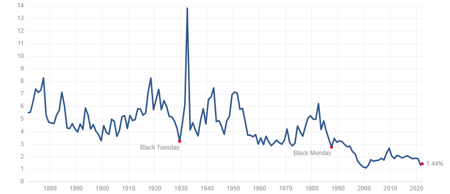

Algorithmic trading, often referred to as algo trading, has become an integral part of modern financial markets. It involves the use of computer algorithms to automate trading decisions, enabling rapid execution of trades with minimal human intervention. The increasing reliance on technology in the stock market has brought algorithmic trading to the forefront, particularly within major indices like the S&P 500.

The S&P 500, which comprises the 500 largest U.S. companies by market capitalization, serves as a significant benchmark for the U.S. economy and stock market performance. As such, the adoption of algorithmic trading strategies by companies within this index can offer a window into the broader trends in the market. The application of algorithmic trading in the S&P 500 is not just widespread but is shaping the way these companies engage with the financial markets.

In this article, the focus will be on understanding the extent to which companies in the S&P 500 employ algorithmic trading, exploring the advantages they gain, and analyzing the impact of these strategies on both the companies and the broader market. The integration of algorithmic trading in the S&P 500 highlights a significant shift towards technology-driven finance, underscoring the evolving landscape of market operations.

## Table of Contents

## Understanding Algorithmic Trading

Algorithmic trading, also known as algo trading, refers to the use of computer algorithms to automate trading decisions in financial markets. These algorithms, often developed by quantitative analysts, are designed to execute trades at high speeds and with precision, utilizing mathematical models and complex computational formulas to determine optimal trading strategies. By automatically processing market data, these algorithms can identify and exploit trading opportunities more efficiently than human traders.

The primary advantages of algorithmic trading include speed, accuracy, and data processing capability. Speed is a critical [factor](/wiki/factor-investing) as algorithmic trading systems can execute orders within milliseconds, taking advantage of market fluctuations effectively and minimizing potential market impact. This level of speed is unattainable for manual trading processes. Moreover, algo trading minimizes human error by executing trades based on pre-defined criteria, ensuring consistency and reliability in trading decisions.

Algorithmic systems are capable of processing vast amounts of data from multiple sources, which allows for more informed trading decisions. These systems can analyze historical market data, current trading volumes, price levels, and other financial indicators to forecast trends and make data-driven decisions. By harnessing big data and real-time analytics, algorithmic trading provides traders with a significant competitive advantage in today's markets.

The widespread adoption of [algorithmic trading](/wiki/algorithmic-trading) spans across various markets, including equities, commodities, and foreign exchange. The technology is particularly prevalent in high-frequency trading ([HFT](/wiki/high-frequency-trading-strategies)), where algorithms execute large volumes of trades at extremely high speeds, often within microseconds. This widespread adoption reflects the growing reliance on technology to enhance trading efficiency, reduce transaction costs, and capitalize on short-lived [arbitrage](/wiki/arbitrage) opportunities.

As the financial landscape evolves, algorithmic trading continues to grow in significance. Its ability to leverage advanced technology and data analysis will likely shape future trading strategies and market dynamics, influencing both institutional and retail investors worldwide.

## The Role of the S&P 500 Index

The S&P 500 Index is a stock market index that comprises 500 of the largest publicly traded companies in the United States. It is widely regarded as one of the most accurate representations of the U.S. stock market and economy. Each company in the index is chosen based on market capitalization, [liquidity](/wiki/liquidity-risk-premium), and industry sector, reflecting a diverse array of economic activities.

The significance of the S&P 500 lies in its comprehensive scope. As it includes companies across all major sectors of the economy—such as technology, healthcare, financials, and consumer goods—it serves as a barometer for overall market health and investor sentiment. The index is market-capitalization-weighted, which means that larger companies have a greater influence on its overall performance. This structure ensures that the index reacts proportionally to changes in the value of its largest constituents.

Understanding why the S&P 500 is considered a benchmark for the U.S. economy involves recognizing its widespread usage among investors, analysts, and policymakers. It provides insights into economic trends and is often used as a benchmark for mutual funds and investment products. By tracking the S&P 500, individuals and institutions can gauge economic conditions, anticipate market movements, and compare investment returns against a consistent standard. Therefore, the index's performance is closely watched as it encapsulates the financial prosperity and challenges within the United States.

## Prevalence of Algorithmic Trading in the S&P 500

Algorithmic trading, often associated with high-frequency transactions, is prevalent among S&P 500 companies. While exact data on the percentage of these companies employing algorithmic strategies may vary, studies and industry reports indicate a substantial adoption rate, especially among firms involved in sectors like finance, technology, and energy.

### Extent of Algorithmic Trading Among S&P 500 Companies

A significant portion of trading [volume](/wiki/volume-trading-strategy) on U.S. equity markets can be attributed to algorithmic trading, reaching estimates as high as 70-80% according to some industry analysts, though specific figures for the S&P 500 companies themselves might not be explicitly available in every study. This high percentage suggests that a large number of these companies, either directly or through intermediaries, leverage algorithmic strategies to conduct trading activities.

### Sectors Most Likely to Use Algorithmic Trading

Within the S&P 500, certain sectors are more inclined towards adopting algorithmic trading. The financial sector, comprising banks and investment firms, prominently uses these methods to optimize buy and sell decisions, manage portfolios, and facilitate market-making activities. Technology companies, with their inherent expertise in software and data analytics, also frequently utilize algorithmic trading. Additionally, the energy sector engages in algorithms to manage commodities trading, leveraging real-time data to predict price movements and optimize transactions.

### Factors Driving Adoption

Several factors drive S&P 500 companies towards algorithmic trading:

1. **Efficiency and Speed**: Algorithms can process vast datasets at speeds unattainable by humans, facilitating quicker decision-making and execution.

2. **Cost Reduction**: By automating processes, companies can significantly reduce operational costs and trading fees, enhancing profitability margins.

3. **Data-Driven Strategies**: Access to an abundance of financial and market data allows companies to formulate predictive models to gain insights into market trends.

4. **Competitive Edge**: Staying ahead in the competitive landscape often requires utilizing the latest technologies. Algorithmic trading provides a technological edge by optimizing trade execution and strategies.

5. **Risk Management**: Algorithmic trading systems can mitigate risk through the implementation of complex risk management algorithms that adapt to changing market conditions in real-time.

In conclusion, while precise metrics on the prevalence of algorithmic trading among S&P 500 companies are not universally documented, the trend indicates substantial integration, particularly among sectors that benefit directly from the efficiencies and competitive advantages these sophisticated systems provide. As technology continues to advance, the adoption rate of algorithmic trading is likely to increase, shaping the dynamics of financial markets.

## Impact of Algorithmic Trading on S&P 500 Companies

Algorithmic trading significantly affects both liquidity and [volatility](/wiki/volatility-trading-strategies) in the S&P 500. Liquidity, defined as the ease with which assets can be bought or sold in the market without affecting the asset's price, is enhanced by algo trading through the continuous buying and selling executed by algorithms. These automated systems can execute orders much faster than human traders, ensuring there is always a buyer or seller available, which generally improves liquidity. However, during extreme market conditions, the same strategies may contribute to a sudden withdrawal of liquidity.

As for volatility, algorithmic trading can both stabilize and destabilize markets. Algorithms can react instantly to market news, potentially smoothing out price fluctuations by taking advantage of arbitrage opportunities, thus reducing volatility. Conversely, in certain cases like a flash crash, the swift action of algorithms can exacerbate market movements, temporarily causing heightened volatility. 

A notable example of the competitive edge provided by algorithmic trading is seen in high-frequency trading (HFT). HFT utilizes complex algorithms to trade large volumes of orders at extremely fast speeds, often in fractions of a second. This gives firms engaging in HFT the ability to capitalize on minuscule price discrepancies, leading to significant profit potential. For instance, HFT strategies may involve price arbitrage, which exploits price differences in various markets, or liquidity provision, where the algorithm acts akin to a market maker.

Despite its advantages, algorithmic trading is not without controversy. Flash crashes, such as the infamous event on May 6, 2010, when the Dow Jones Industrial Average plummeted nearly 1,000 points only to recover in minutes, highlight the potential risks of algo trading. These rapid, large-scale price drops are largely attributed to the interaction of numerous automated trading programs responding to each other's actions, sometimes with minimal oversight.

Furthermore, the regulatory landscape for algorithmic trading continues to evolve. Concerns around market fairness and stability have prompted regulators to scrutinize the use of algorithms in financial markets. This includes ensuring adequate risk controls are in place and potentially introducing measures to curb excessive volatility induced by algorithms.

In summary, while algorithmic trading enhances liquidity and offers competitive advantages in trading efficiencies, it also poses risks like increased volatility and market instability, alongside regulatory challenges. The ongoing development of standards and regulations aims to mitigate these risks while maintaining the benefits provided by such technologies.

## Case Studies of S&P 500 Companies Utilizing Algorithmic Trading

In examining the presence of algorithmic trading within S&P 500 companies, certain firms stand out for their significant use and development of sophisticated trading techniques. These companies leverage technology to enhance their trading efficiency and effectiveness, integrating algorithmic strategies as a core component of their trading operations.

One prominent example is Goldman Sachs, an investment banking giant renowned for its advanced algorithmic trading division. Goldman Sachs employs a variety of algorithmic strategies, including [market making](/wiki/market-making), [statistical arbitrage](/wiki/statistical-arbitrage), and high-frequency trading (HFT), to optimize trade execution. By utilizing algorithms, Goldman Sachs can quickly and accurately process large volumes of data, enabling it to execute trades at speeds unmatched by manual methods. The outcomes of these strategies are evident in the firm's ability to maintain competitive spreads and manage large trade volumes while minimizing market impact.

Another key player in this domain is JPMorgan Chase & Co., which has embraced algorithmic trading not only for equities but also across asset classes like fixed income and foreign exchange. The firm leverages [machine learning](/wiki/machine-learning) and [artificial intelligence](/wiki/ai-artificial-intelligence) to enhance its trading strategies, continually refining algorithms to adapt to changing market conditions. JPMorgan's use of algorithmic trading has resulted in improved liquidity and reduced transaction costs, contributing to its robust market presence and profitability.

Morgan Stanley is also noteworthy for its advanced algorithmic trading capabilities. The firm offers a suite of algorithms designed to optimize execution performance and reduce slippage, a common concern in large trades. These algorithms utilize real-time market data and historical trends to dynamically adjust trading strategies, ensuring optimal execution outcomes. Morgan Stanley's commitment to algorithmic trading has allowed it to provide superior trading services, attracting a broad range of institutional clients.

Citadel Securities, although not a constituent of the S&P 500, plays a critical role by providing liquidity to S&P 500 companies through its extensive use of algorithmic trading. Citadel is known for its proprietary trading systems that employ statistical models to identify and capitalize on market inefficiencies. The firm’s algorithms contribute to its status as a major liquidity provider, facilitating smoother and more efficient market operations.

The strategies employed by these companies underscore the transformative impact of algorithmic trading on financial markets. Through the continuous refinement and deployment of sophisticated trading algorithms, these firms have not only increased their own competitive edge but also enhanced overall market efficiency and transparency.

## The Future of Algorithmic Trading in the S&P 500

Predicting the future of algorithmic trading in the S&P 500 involves examining emerging trends, the role of advanced technologies like artificial intelligence (AI), and anticipating regulatory shifts. Given the rapid developments in technology, it is reasonable to expect continued growth in the use of algorithmic trading strategies among companies within this prestigious index.

### Trends in Adoption

The adoption of algorithmic trading is likely to become even more ubiquitous as companies seek to enhance their trading efficiency. The introduction of AI and machine learning into trading algorithms promises to refine decision-making processes. These technologies offer the capability to analyze and interpret massive datasets, uncovering insights that humans might miss. This adaptability allows for more nuanced trading strategies that can react to market changes in real-time, leveraging historical data to predict future market behaviors.

One plausible trend is the increasing use of AI-driven predictive analytics. Companies may develop models that consume a variety of data inputs—ranging from traditional financial metrics to [alternative data](/wiki/best-alternative-data) sources like social media sentiment or geopolitical events—to anticipate market trends with greater accuracy. 

### Implications of Advancing Technology and AI

As AI technologies evolve, they could transform how risks are assessed and managed in trading strategies. Techniques like [deep learning](/wiki/deep-learning) can improve pattern recognition and anomaly detection, potentially reducing error rates and enhancing the reliability of trading systems. Furthermore, the integration of natural language processing could allow for the parsing of qualitative data, such as earnings call transcripts, to quantify sentiment-driven factors.

The potential for high-speed, high-frequency trading will also expand with improvements in computational power and connectivity, such as low-latency networks and edge computing. These advancements may lead to scenarios where algorithms not only execute trades but also dynamically recalibrate strategies with minimal human intervention.

### Potential Regulatory Changes

While technological evolution broadens the scope for algorithmic trading, it also raises the specter of increased regulatory scrutiny. Regulators may seek to impose stricter oversight to mitigate risks associated with high-frequency trading (HFT), such as market manipulation and systemic instability. 

Anticipated regulatory changes could include transparency requirements for algorithms to ensure fair trading practices and prevent unfair advantages. There might also be mandates for firms to maintain certain liquidity levels to counteract potential flash crashes—unexpected market plummets exacerbated by rapid algorithmic trading activities.

Furthermore, as AI plays a more significant role in trading, there could be calls for ethical guidelines ensuring AI systems' accountability, fairness, and transparency. This might involve auditing algorithms to ascertain that they are not perpetuating bias or engaging in malpractices.

In conclusion, while the future of algorithmic trading in the S&P 500 appears promising, it is intricately linked to the pace of technological advancements and regulatory developments. Balancing innovation with oversight will be key to harnessing these tools' full potential in fostering efficient, equitable markets.

## Conclusion

Algorithmic trading, as discussed throughout this article, stands as a transformative force within S&P 500 companies, reshaping the mechanics of trading with its inherent speed and precision. The deployment of sophisticated computer algorithms to automate trading decisions offers significant enhancements in terms of liquidity and reduced volatility. This approach allows firms to analyze and react to market conditions at speeds unmatched by human traders. Sectors within the S&P 500 have adopted algorithmic trading strategies to gain a competitive edge, especially in the high-frequency trading domain.

However, while this technology offers considerable benefits, it is not without its controversies and challenges. Flash crashes and regulatory scrutiny highlight the potential risks and complexities associated with such automated systems. The examples of specific S&P 500 companies illustrate both the strategic advantage and the outcomes of implementing algorithmic trading techniques.

Understanding the impact of technology on financial markets is crucial, as it shapes not only the present landscape but also the future trajectory of market dynamics. As technology and artificial intelligence continue to advance, the integration and regulation of algorithmic trading within the S&P 500 will likely evolve, posing both opportunities and challenges to the financial industry.

## FAQs

**How does algorithmic trading benefit companies in the S&P 500?**

Algorithmic trading offers several advantages to companies within the S&P 500. One of the primary benefits is the increased speed of execution, as algorithms can analyze multiple market variables and execute trades in microseconds, far faster than human capabilities. This speed allows companies to capitalize effectively on even the slightest price discrepancies, enhancing their competitive edge, particularly in high-frequency trading scenarios. Moreover, algo trading enhances accuracy by reducing human error in trading decisions and consistently applying predefined strategies. Companies can also process vast amounts of market data in real-time, providing valuable insights and improving decision-making processes. Additionally, algorithmic trading facilitates better risk management through sophisticated models and simulations, enabling companies to optimize their portfolios and mitigate risks.

**Are there any disadvantages to using algorithmic trading?**

Despite its benefits, algorithmic trading also presents certain drawbacks. One significant concern is the potential for increased market volatility. Algorithms can generate a large volume of trades in a short period, potentially leading to rapid price fluctuations. This aspect was notably observed during events like flash crashes, where markets experienced abrupt price declines within minutes. Furthermore, reliance on algorithmic strategies exposes companies to technological risks, including software glitches or network outages, which could lead to unintended trading losses. Regulatory challenges are another consideration, as evolving market regulations may impact algorithmic trading practices, potentially requiring companies to adapt their strategies to comply with new rules. Lastly, the high cost of developing and maintaining complex algorithms and technology infrastructure may pose a barrier to entry for smaller firms or limit their ability to compete with larger, well-resourced companies.

**What percentage of S&P 500 companies use algorithmic trading actively?**

While specific data on the exact percentage of S&P 500 companies actively using algorithmic trading may not always be publicly available, it is widely acknowledged that a significant portion of these companies have integrated some form of algorithmic trading into their operations. According to industry estimates, a substantial majority of trading volume in the U.S. equity market is now driven by algorithms, with figures often cited around 60-80%. Considering the S&P 500's representation of large-cap U.S. companies, it is reasonable to infer that a considerable number of these companies utilize algorithmic trading, reflecting its prevalent role in modern financial markets.

## References & Further Reading

[1]: ["Advances in Financial Machine Learning"](https://www.amazon.com/Advances-Financial-Machine-Learning-Marcos/dp/1119482089) by Marcos Lopez de Prado

[2]: Bergstra, J., Bardenet, R., Bengio, Y., & Kégl, B. (2011). ["Algorithms for Hyper-Parameter Optimization."](https://dl.acm.org/doi/10.5555/2986459.2986743) Advances in Neural Information Processing Systems 24.

[3]: ["Evidence-Based Technical Analysis: Applying the Scientific Method and Statistical Inference to Trading Signals"](https://www.amazon.com/Evidence-Based-Technical-Analysis-Scientific-Statistical/dp/0470008741) by David Aronson

[4]: ["Machine Learning for Algorithmic Trading"](https://github.com/PacktPublishing/Machine-Learning-for-Algorithmic-Trading-Second-Edition) by Stefan Jansen

[5]: ["Quantitative Trading: How to Build Your Own Algorithmic Trading Business"](https://books.google.com/books/about/Quantitative_Trading.html?id=j70yEAAAQBAJ) by Ernest P. Chan