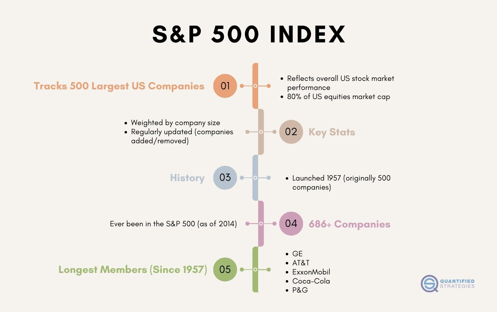

## Table of Contents

## What is the S&P 500 Index?

The S&P 500 Index is a stock market index that measures the performance of 500 large companies in the United States. It is maintained by Standard & Poor's, a financial services company. The index is widely regarded as the best single measure of the overall health of the U.S. stock market and the broader economy. Investors and financial analysts often use the S&P 500 as a benchmark to compare the performance of their own investments.

The companies included in the S&P 500 are chosen based on their market size, liquidity, and industry representation. This means that the index includes a diverse range of industries, such as technology, healthcare, and finance. The value of the S&P 500 goes up or down based on the stock prices of these companies. When people say "the market is up" or "the market is down," they are often referring to changes in the S&P 500.

## How is a company selected for inclusion in the S&P 500?

A company is chosen for the S&P 500 based on a few important rules. The main rule is that the company must be big, which means it should have a high market value. This is called market capitalization. The company also needs to be based in the United States and have its stock listed on a major U.S. stock exchange, like the New York Stock Exchange or Nasdaq. Another important rule is that the company must have enough shares available for the public to buy and sell easily. This is called liquidity.

The S&P 500 also tries to include companies from many different industries. This helps make sure the index represents the whole U.S. economy. A special committee at Standard & Poor's decides which companies to include. They look at all these rules and try to pick the best companies that fit. If a company is doing well and meets all the rules, it might be added to the S&P 500. If a company is not doing well or no longer fits the rules, it might be removed.

## How many companies are currently in the S&P 500?

The S&P 500 always has 500 companies in it. This number stays the same even if some companies are added or taken away.

The people who manage the S&P 500 look at the companies all the time. They make sure that the 500 companies in the index are the best ones to show how the U.S. economy is doing.

## What is the history of the S&P 500 Index?

The S&P 500 Index started a long time ago, in 1923. It was made by a company called Standard & Poor's. At first, it was called the "Composite Index" and it had 233 companies in it. Over time, the index changed and grew. In 1957, it became the S&P 500 we know today, with 500 companies. The S&P 500 was made to help people understand how the big companies in the U.S. were doing.

The S&P 500 has become very important over the years. It is now seen as a good way to see how the whole U.S. stock market is doing. Many people use it to decide if they should buy or sell stocks. The index has gone through many ups and downs, like during the Great Depression in the 1930s and the big drop in 2008. But it has always come back and kept growing. Today, the S&P 500 is watched by people all over the world to see how the U.S. economy is doing.

## How often do companies enter and exit the S&P 500?

Companies enter and [exit](/wiki/exit-strategy) the S&P 500 a few times each year. The people who manage the S&P 500 look at the companies all the time. They decide if a company should be added or taken away based on rules like how big the company is and how easy it is to buy and sell its stock.

When a company is doing really well and gets bigger, it might be added to the S&P 500. If a company is not doing well or gets smaller, it might be taken out. These changes usually happen at the end of each quarter, which means about four times a year. But sometimes, if something big happens, like a company merging with another, changes can happen at other times too.

## Can you list some notable companies that have been removed from the S&P 500?

Some well-known companies that have been taken out of the S&P 500 include General Motors and Eastman Kodak. General Motors was removed in 2009 during the financial crisis when it went bankrupt. It came back to the S&P 500 later, in 2013, after it got better. Eastman Kodak was taken out in 2010. It had trouble because people started using digital cameras instead of film cameras, which hurt their business a lot.

Another company that was removed is J.C. Penney. It was taken out of the S&P 500 in 2018. J.C. Penney had a hard time because more people were shopping online instead of going to their stores. This change in how people shop made it difficult for J.C. Penney to stay in the S&P 500.

## What criteria lead to a company being removed from the S&P 500?

A company can be taken out of the S&P 500 if it no longer fits the rules set by Standard & Poor's. One big reason is if the company gets smaller and its market value drops a lot. The S&P 500 is made to show how big companies are doing, so if a company isn't big anymore, it might be removed. Another reason is if the company gets bought by another company or goes bankrupt. These big changes can mean the company no longer fits in the S&P 500.

Sometimes, a company can be removed if it doesn't have enough shares that people can buy and sell easily. This is called [liquidity](/wiki/liquidity-risk-premium). If it's hard for people to trade the company's stock, it might be taken out. Also, the S&P 500 tries to include companies from many different industries. If a company's industry is not doing well and there are better companies in that industry, the company might be removed to make room for a new one.

## How has the total number of companies in the S&P 500 changed over time?

The S&P 500 started out in 1923 with 233 companies. It was called the "Composite Index" back then. Over the years, the index grew and changed. By 1957, it became the S&P 500 we know today, with exactly 500 companies. This number has stayed the same ever since.

Even though the total number of companies in the S&P 500 has been 500 for a long time, the companies in it change. Some companies get bigger and are added, while others get smaller or have problems and are taken out. The people who manage the S&P 500 look at the companies all the time to make sure the 500 companies in the index are the best ones to show how the U.S. economy is doing.

## What is the average tenure of a company in the S&P 500?

The average time a company stays in the S&P 500 has changed over the years. In the past, companies used to stay in the index for a long time. But now, because of how fast things change in business and technology, companies don't stay in the S&P 500 as long as they used to. A study from 2020 by Innosight found that the average time a company stays in the S&P 500 is about 21 years. This is much shorter than it was in the 1960s, when companies stayed in the index for an average of 33 years.

This shorter time in the S&P 500 shows how quickly the business world is changing. Companies need to keep up with new technology and new ways of doing things to stay in the index. If they don't, they might get smaller or have problems, and then they could be taken out of the S&P 500. This means that the companies in the S&P 500 are always changing to show the best and biggest companies in the U.S. at that time.

## How does the turnover rate of the S&P 500 compare to other major indices?

The S&P 500 has a turnover rate that shows how often companies are added or removed from the index. This rate is about 4% to 5% each year. This means that around 20 to 25 companies might be changed in the S&P 500 every year. Compared to other major indices, the S&P 500 has a moderate turnover rate. For example, the Dow Jones Industrial Average, which has only 30 companies, has a much lower turnover rate because it changes less often. On the other hand, the Russell 2000, which focuses on smaller companies, has a higher turnover rate because smaller companies can grow or shrink more quickly.

The Nasdaq Composite, which includes many technology companies, also has a higher turnover rate than the S&P 500. This is because the tech industry changes very fast, and companies can rise or fall quickly. The S&P 500 tries to balance between showing the biggest and most stable companies while still keeping up with changes in the economy. This is why its turnover rate is not as high as some other indices but still shows that the business world is always changing.

## What impact does being added or removed from the S&P 500 have on a company's stock price?

When a company is added to the S&P 500, its stock price usually goes up. This happens because many big investors, like mutual funds and pension funds, have rules to buy stocks that are in the S&P 500. So, when a company gets added, these investors need to buy its stock to keep their investments in line with the index. This extra buying can push the stock price higher. Also, being in the S&P 500 can make a company look more important and successful, which can make more people want to buy its stock.

On the other hand, when a company is taken out of the S&P 500, its stock price often goes down. This is because the same big investors who had to buy the stock when it was added now have to sell it when it's removed. This extra selling can push the stock price lower. Also, being removed from the S&P 500 can make a company look like it's not doing as well, which can make people less interested in buying its stock. So, being added or removed from the S&P 500 can have a big effect on a company's stock price.

## How many unique companies have been part of the S&P 500 since its inception?

Since the S&P 500 started in 1923, over 1,000 different companies have been part of it at some point. The index began with 233 companies and grew to 500 by 1957. Over the years, companies have been added and removed based on rules like how big they are and how easy it is to buy and sell their stocks. This means that many companies have come and gone as the U.S. economy and businesses have changed.

The number of unique companies in the S&P 500 shows how much the business world has changed over time. Some companies stay in the index for a long time, while others are in it for just a few years. The changes in the companies that make up the S&P 500 reflect big events like new technology, economic problems, and changes in what people buy and sell. This helps the S&P 500 stay a good way to see how the U.S. economy is doing.

## References & Further Reading

[1]: ["Advances in Financial Machine Learning"](https://www.amazon.com/Advances-Financial-Machine-Learning-Marcos/dp/1119482089) by Marcos Lopez de Prado

[2]: Bergstra, J., Bardenet, R., Bengio, Y., & Kégl, B. (2011). ["Algorithms for Hyper-Parameter Optimization."](https://dl.acm.org/doi/10.5555/2986459.2986743) Advances in Neural Information Processing Systems 24.

[3]: ["Evidence-Based Technical Analysis: Applying the Scientific Method and Statistical Inference to Trading Signals"](https://www.amazon.com/Evidence-Based-Technical-Analysis-Scientific-Statistical/dp/0470008741) by David Aronson

[4]: ["Machine Learning for Algorithmic Trading"](https://github.com/PacktPublishing/Machine-Learning-for-Algorithmic-Trading-Second-Edition) by Stefan Jansen

[5]: ["Quantitative Trading: How to Build Your Own Algorithmic Trading Business"](https://books.google.com/books/about/Quantitative_Trading.html?id=j70yEAAAQBAJ) by Ernest P. Chan