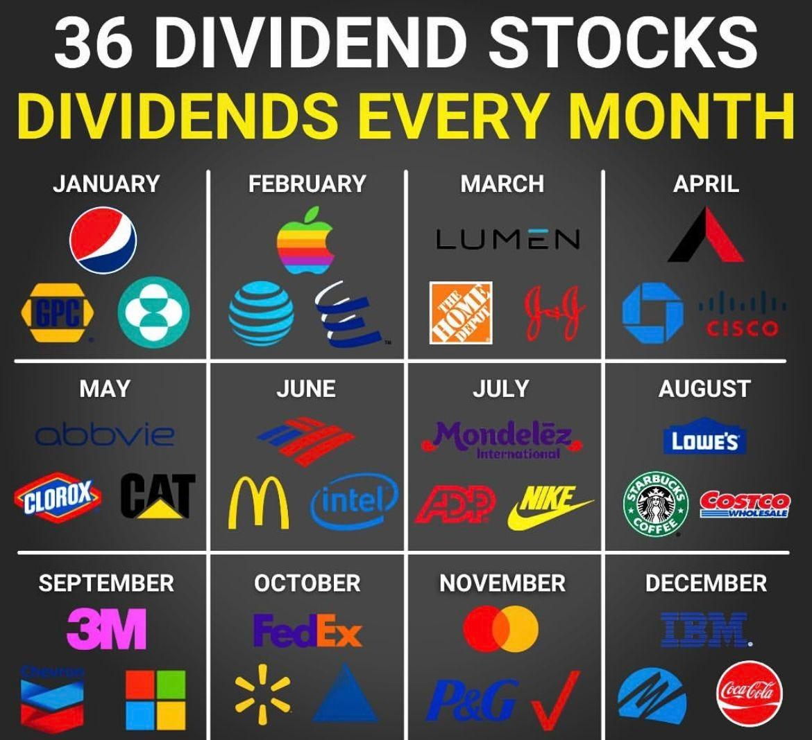

Dividend stocks represent a unique class of equities that offer investors a share in the company's profit in the form of regular cash payouts. These stocks are particularly appealing for investors seeking not just capital appreciation but also a steady income stream. Companies that pay dividends are typically well-established with a history of profitability, making dividend stocks an attractive option for risk-averse investors. The relevance of dividend stocks in trading is underscored by their dual benefit of providing income and the potential for price appreciation, which contributes to their popularity among long-term investors.

The advent of algorithmic trading, or algo trading, has transformed the landscape of modern financial markets. Algorithmic trading involves the use of computer programs to execute trades at speeds and frequencies that humans cannot achieve. This method of trading is characterized by its accuracy and ability to backtest strategies across historical data, effectively assessing their viability before actual implementation. The rising interest in algo trading is driven by its capacity to handle large volumes of data efficiently, leading to better-informed decision-making processes.



Incorporating algo trading into the management of dividend stock portfolios presents a compelling opportunity for investors. By automating trade decisions based on predefined criteria, investors can optimize their portfolios, potentially increasing returns while controlling for risks. The systematic approach of algo trading is especially beneficial when dealing with dividend stocks, allowing for the precise timing of purchases and sales to maximize dividend capture.

The purpose of this article is to explore how investors can determine the optimal number of dividend stocks to hold when employing an algorithmic trading strategy. By integrating various factors—such as diversification needs, risk tolerance, and investment objectives—with the capabilities of algorithmic systems, investors can design a balanced and efficient dividend stock portfolio. This guidance aims to provide readers with a clearer understanding of how to harness the power of technology to enhance their dividend investing strategies.

## Table of Contents

## Understanding Dividend Stocks

Dividend stocks are shares in companies that pay regular dividends to their shareholders, typically on a quarterly basis. A dividend is a portion of a company's earnings distributed to shareholders as a reward for their investment. Dividends are often paid in cash, though they can also be issued as additional shares of stock.

## How Dividend Stocks Work

Companies generate profits from their operations, and a portion of these profits can be retained for business expansion or reserved as cash, while another portion might be distributed to shareholders in the form of dividends. The decision to pay dividends usually reflects the company's profitability and cash flow stability. Typically, well-established companies with stable earnings are the ones that consistently pay dividends.

Dividends are declared by a company's board of directors and require shareholder approval. The amount paid per share—referred to as the dividend per share—is fixed for a given period, and multiply this by the number of shares owned gives the total dividend income for a shareholder. 

The date when the company announces its upcoming dividend is known as the declaration date. Following this, an important deadline for investors is the ex-dividend date. Investors who own the stock before the ex-dividend date are eligible to receive the declared dividend. Ownership after this date will not qualify for the forthcoming dividend payout, making the date significant for trading and investment decisions.

## Benefits of Owning Dividend Stocks

Dividend stocks provide several advantages, particularly for investors seeking both income and growth. One major benefit is regular income. Unlike [growth stocks](/wiki/growth-stocks), which primarily provide returns through capital appreciation, dividend stocks offer a steady stream of income. This can be particularly beneficial in volatile markets or during periods of economic uncertainty.

In addition to regular income, dividend stocks often come with tax advantages. In many regions, qualified dividends are taxed at a lower rate than regular income, enhancing overall returns. Furthermore, dividends can be reinvested in additional shares, a strategy known as dividend reinvestment. This approach can benefit from compounding returns over time – initially small dividend amounts can grow significantly if reinvested continuously over many years.

For long-term investors, dividend stocks offer stability. Companies that consistently pay dividends often demonstrate robust business models, providing an implicit assurance of their financial health. This reliability makes them attractive, particularly for investors who prioritize steady returns over time. 

Moreover, dividend-paying stocks can help mitigate the impact of market downturns. While stock prices may fall, dividend payments can help offset potential losses, offering a cushion for the investor's portfolio. For these reasons, dividend stocks are a cornerstone of many long-term investment strategies, often forming a key part of retirement and income-focused portfolios.

 to Algorithmic Trading

Algorithmic trading, often referred to as algo trading, involves the use of computer programs to execute trades in financial markets at speeds and frequencies that are impossible for a human trader. These programs, governed by a set of predefined rules and strategies, automatically place buy or sell orders when market conditions meet the algorithm's specifications. Such trading paradigms have revolutionized the financial industry by enhancing the precision, speed, and efficiency of trade execution.

One of the primary benefits of using algorithms in trading is the significant reduction in the latency of trade execution. Algorithms can process vast amounts of market data in real-time, executing trades in milliseconds, thereby capitalizing on even the slightest market inefficiencies. This speed is crucial in volatile markets where the price of financial instruments can change within seconds.

Efficiency is another advantage of [algorithmic trading](/wiki/algorithmic-trading). By automating trades, algorithmic systems can handle complex strategies involving multiple assets and conditions, which would be cumbersome and time-consuming for human traders. This includes intricate tasks like [arbitrage](/wiki/arbitrage), [market making](/wiki/market-making), and statistical analysis of market behavior.

Backtesting is an integral component of algorithmic trading. It involves testing a trading strategy on historical data to evaluate its effectiveness before deploying it in live markets. This process enables traders to fine-tune their strategies based on past performance, optimizing them for future market scenarios. Through [backtesting](/wiki/backtesting), traders can assess the potential profitability of their algorithmic strategies while adjusting for risks and uncertainties.

Algorithmic trading is particularly applicable to managing dividend stock portfolios. Dividend stocks, which offer periodic payouts, are often favored by income-focused investors. By employing algorithms, investors can efficiently manage large portfolios of dividend stocks, balancing between maximizing dividends and maintaining risk control. Algorithms can be programmed to track and respond to dividend declarations, changes in dividend yields, and shifts in stock market conditions, ensuring that portfolios remain aligned with investment goals. The application of algo trading in dividend stocks enables systematic portfolio rebalancing and the implementation of sophisticated strategies like cash flow matching and yield enhancement. By automating these processes, investors can ensure their dividend stock investments operate at optimal efficiency and profitability.

Overall, the integration of algorithmic trading into dividend stock management represents a powerful tool for investors aiming to maximize returns while effectively managing the inherent risks and intricacies of the stock market.

## Factors Influencing the Number of Dividend Stocks to Own

Several key factors influence the appropriate number of dividend stocks to own in an investment portfolio. These include an investor's risk tolerance, investment objectives, and prevailing market conditions. Each of these elements plays a critical role in shaping the composition and performance of a dividend stock portfolio.

**Risk Tolerance**

Risk tolerance refers to an individual's ability and willingness to endure [volatility](/wiki/volatility-trading-strategies) in the financial markets. It is a crucial determinant of how many dividend stocks should be held. Investors with a higher risk tolerance may opt for a concentrated portfolio with fewer diversified dividend stocks, aiming for potentially higher returns from select high-yield stocks. Conversely, risk-averse investors might prefer a broader range of dividend stocks to mitigate individual stock risk. This diversity is vital for achieving a balanced risk-return trade-off.

**Investment Goals**

Investment goals are the long-term objectives that guide portfolio construction. For income-focused investors, dividend stocks offer a steady stream of returns. If the goal is to maximize income, then holding a variety of dividend stocks across different sectors can help ensure steady dividend flows. Investors focusing on growth might incorporate growth-oriented dividend stocks that could appreciate over time, affecting the total number of holdings required.

**Market Conditions**

Market conditions significantly influence the choice and number of dividend stocks to hold. Economic growth, [interest rate](/wiki/interest-rate-trading-strategies) changes, and industry performance can impact dividend payouts and stock values. During volatile or bearish markets, a diversified portfolio of dividend stocks across sectors may buffer against sector-specific downturns. Conversely, in bullish markets, investors might consolidate holdings in fewer high-performing dividend stocks for maximized returns.

**Diversification and Risk Management**

Diversification is essential in managing risk within dividend portfolios. By spreading investments across various dividend-paying stocks, investors can limit exposure to any single company's financial health. Effective diversification reduces unsystematic risk—the risk associated with individual stocks—allowing investors to focus on the market's systematic risks.

**Achieving Diversification Through Algorithmic Trading**

Algorithmic trading offers sophisticated means of achieving portfolio diversification. By using algorithms to analyze market data, trading strategies can automatically adjust the number and type of dividend stocks held, in response to changing market conditions and investor-specific criteria.

For example, a simple Python implementation could look like:

```python
import numpy as np

def optimal_dividend_stocks(cov_matrix, target_return, risk_tolerance):
    inv_cov_matrix = np.linalg.inv(cov_matrix)
    weights = np.dot(inv_cov_matrix, target_return) / np.dot(np.ones(len(target_return)), np.dot(inv_cov_matrix, target_return))
    adjusted_weights = weights * risk_tolerance
    return adjusted_weights

# Illustrative covariance matrix and target returns
cov_matrix = np.array([[0.1, 0.02], [0.02, 0.15]])
target_return = np.array([0.1, 0.12])
risk_tolerance = 0.5

portfolio_weights = optimal_dividend_stocks(cov_matrix, target_return, risk_tolerance)
print("Portfolio Weights:", portfolio_weights)
```

In this example, adjusting the `risk_tolerance` parameter guides the algorithm in dynamically rebalancing the portfolio's composition. Algorithmic strategies can capitalize on market inefficiencies and execute trades at optimal times, using vast amounts of data to refine diversification levels.

In conclusion, determining the optimal number of dividend stocks to own is multifaceted, hinging on risk tolerance, investment goals, and market conditions. Diversification remains pivotal in mitigating risks, with algorithmic trading offering powerful tools to automate and optimize portfolio management strategies.

## The Role of Backtesting in Dividend Stock Algo Trading

Backtesting is a crucial component in the evaluation and implementation of trading strategies, particularly in the context of algorithmic trading for dividend stocks. At its core, backtesting involves the simulation of a trading strategy using historical market data to assess its potential effectiveness. This process allows traders and investors to understand how a strategy might have performed in the past and provides insights into its potential future performance.

To apply backtesting effectively, one must possess a comprehensive data set that includes historical prices, dividends, and any other relevant financial metrics. By inputting this data into an algorithm, traders can model the behavior of the strategy over a specific period. This process helps in identifying patterns, potential returns, and risks associated with the executed trades.

In determining the optimal number of dividend stocks to own, backtesting assists by evaluating various portfolio configurations. By simulating performance across different market conditions and stock combinations, it becomes possible to ascertain an optimal range that balances risk and reward. Through this approach, traders can gauge the impact of diversification on portfolio volatility and returns, ensuring that their investment strategy is aligned with their risk tolerance and financial goals.

For instance, a trader might use backtesting to analyze a strategy involving the ownership of 30 dividend stocks. By examining the historical performance of these stocks under different market conditions, the trader can observe the portfolio's stability and income generation over time. The results might show that while 30 stocks provide a good balance between risk and diversification, a slight adjustment to 40 stocks could yield marginally better returns with reduced volatility.

Several case studies illustrate the successful application of backtesting in refining dividend stock strategies. For example, a study might reveal that during market downturns, portfolios with a higher number of dividend-paying stocks tended to exhibit lower volatility, thus preserving capital better than less diversified portfolios. This insight underscores the importance of diversification, which can be convincingly analyzed through backtesting.

Additionally, backtesting enables the testing of various algorithmic strategies, such as rebalancing frequencies or the inclusion of specific financial criteria for stock selection. By simulating these strategies over extended historical periods, traders can identify the approaches that consistently outperform or meet their investment criteria.

In conclusion, backtesting serves as a vital tool in algorithmic trading of dividend stocks. It provides empirical evidence of a strategy's potential success, facilitating informed decision-making regarding the optimal number of stocks to hold. As such, it plays a pivotal role in the design and optimization of dividend stock portfolios, assisting traders in achieving their investment objectives.

## Optimal Number of Dividend Stocks: General Guidelines

Determining the optimal number of dividend stocks to own in an algorithmic trading strategy is essential for achieving diversification and minimizing risk while maximizing returns. A commonly recommended range is between 20 to 60 stocks. This range considers the need for diversification, whereby owning a variety of stocks across different sectors and industries can mitigate the risks associated with market volatility and sector-specific downturns.

### Diversification Needs

Diversification is a fundamental principle that reduces portfolio risk by spreading investments across various financial instruments, industries, and other categories. The key to an effectively diversified portfolio lies in owning enough stocks to minimize unsystematic risk, which is specific to individual stocks, while managing systematic risk, which affects the entire market. 

The concept of diversification can be supported through statistical measures such as the Sharpe Ratio, which evaluates the performance of an investment by adjusting for its risk. A well-diversified portfolio should ideally show a higher Sharpe Ratio.

### Recommended Stock Range

Research suggests that holding approximately 20 to 30 dividend stocks tends to capture the benefits of diversification effectively. Financial theorists, such as those behind Modern Portfolio Theory (MPT), assert that beyond a certain point, typically around 20 stocks, the benefits of reducing unsystematic risk diminish. However, in the context of algorithmic trading, going up to 60 stocks can provide additional diversification benefits while maintaining manageable complexity in trading strategies.

```python
# Example: Simulating portfolio diversification impact
import numpy as np
import matplotlib.pyplot as plt

# Simulating the effect of diversification on risk
# Assume a portfolio with 100 stocks, each having a risk (variance) of 0.04 and correlations with each other
stock_risk = 0.04
correlation = 0.3
num_stocks = range(1, 101)
portfolio_risks = [stock_risk * np.sqrt((1/n) + (n-1)/n * correlation) for n in num_stocks]

plt.plot(num_stocks, portfolio_risks)
plt.title('Portfolio Risk vs Number of Stocks')
plt.xlabel('Number of Stocks')
plt.ylabel('Portfolio Risk')
plt.axvline(x=20, color='r', linestyle='--', label='Minimum Diversification')
plt.axvline(x=60, color='g', linestyle='--', label='Maximum Diversification')
plt.legend()
plt.show()
```

### Real-life Examples and Expert Recommendations

Real-life portfolio management often reflects these guidelines, as seen with famous investors like Warren Buffet, who have advocated for diversification while also stressing the importance of not over-diversifying to the point where portfolio management becomes cumbersome.

The S&P 500 Dividend Aristocrats Index, which consists of stocks from companies with consistently increasing dividends, shows an example of a balanced approach to dividend investing. This index includes a selection of high-quality dividends stocks, offering a model portfolio that typically fits within the 40 to 60-stock range. 

From expert recommendations, financial advisors, such as those from Vanguard and BlackRock, emphasize starting with a core group of 20-30 stocks to balance exposure across key sectors. They suggest extending up to 60 stocks to exploit opportunities in secondary markets or emerging industries, which could present higher risk but potentially greater returns.

In conclusion, determining the optimal number of dividend stocks in an algorithmic trading strategy requires balancing diversification with the manageability of the trading system. By leveraging the efficiency of algorithms, investors can effectively handle a larger number of dividend stocks, thus optimizing their portfolios in line with both market conditions and individual financial goals.

## Implementing Algo Trading Strategies for Dividend Stocks

Implementing an algorithmic trading strategy for dividend stocks involves several systematic steps. It requires careful selection and configuration of tools and platforms, as well as continuous monitoring and adjustment of trading strategies to ensure optimal performance. This section provides a structured approach to setting up such a strategy.

### Step-by-Step Guide to Setting Up an Algo Trading Strategy for Dividend Stocks

1. **Define the Investment Objective:**
   - Clearly outline your investment goals, such as maximizing dividend yield, achieving price appreciation, or balancing both. This helps in tailoring the algorithm to meet specific requirements.

2. **Select Suitable Dividend Stocks:**
   - Utilize financial data platforms and stock screeners to filter dividend stocks based on criteria like dividend yield, payout ratio, and dividend growth history. Stocks with stable and growing dividends are generally preferred.

3. **Choose an Algorithmic Trading Platform:**
   - Platforms like QuantConnect, AlgoTrader, and MetaTrader offer robust environments for algorithmic trading. These platforms provide access to historical data, integrated development environments (IDEs), and backtesting capabilities. QuantConnect, in particular, supports Python, making it accessible for those familiar with the language.

4. **Develop the Trading Algorithm:**
   - Write the algorithm to implement your strategy. For instance, a basic strategy might involve buying stocks when their dividend yield exceeds a specified threshold and selling when certain risk parameters are breached. Here’s a simple Python pseudocode example:

   ```python
   class DividendAlgo:
       def __init__(self, initial_cash, yield_threshold):
           self.cash = initial_cash
           self.yield_threshold = yield_threshold
           self.portfolio = {}

       def evaluate_stock(self, stock):
           if stock.dividend_yield > self.yield_threshold:
               self.buy_stock(stock)
           elif stock_check_exit_conditions(stock):
               self.sell_stock(stock)

       def buy_stock(self, stock):
           # logic to buy stock
           pass

       def sell_stock(self, stock):
           # logic to sell stock
           pass

   # Example usage
   algo = DividendAlgo(initial_cash=100000, yield_threshold=0.03)
   for stock in stock_market:
       algo.evaluate_stock(stock)
   ```

5. **Backtesting the Strategy:**
   - Use historical data to test how your algorithm would have performed in the past. This helps identify any flaws and refine the strategy. Platforms typically provide backtesting tools that simulate trades using past market data to evaluate performance metrics such as return on investment, win rate, and drawdowns.

6. **Optimize the Algorithm:**
   - Analyze backtesting results to tweak the algorithm for better performance. Adjust parameters, incorporate additional decision criteria, and aim for a balance between risk and return.

7. **Deploy the Algorithm in a Live Environment:**
   - Transition from testing to live trading. Most platforms offer simulated trading environments for a risk-free live market experience before committing real capital.

8. **Monitor and Adjust the Strategy:**
   - Continuously monitor the algorithm’s performance. Use real-time data dashboards and set alerts for significant market movements or deviations from expected outcomes. Regular adjustments based on feedback can help maintain the efficacy and safety of the strategy.

9. **Risk Management and Diversification:**
   - Incorporate risk management controls within the algorithm, such as stop-loss orders and position sizing rules. Diversifying across different sectors or geographic regions can also mitigate specific risks associated with individual stocks or markets.

### Tools and Platforms for Algo Trading and Backtesting

- **QuantConnect:** Offers a cloud-based platform with access to multiple asset classes and historical data. It supports Python and provides comprehensive backtesting tools.
- **AlgoTrader:** A professional algorithmic trading software that allows for trading in various markets and supports multi-asset classes.
- **MetaTrader 4/5:** Widely used in forex trading, it provides automated trading capabilities and a robust community for sharing and developing trading strategies.
- **Interactive Brokers API:** Enables custom trading solutions through its API, supporting a wide range of programming languages.

### Tips for Optimizing Dividend Stock Portfolios

- **Utilize Machine Learning Techniques:** Advanced algorithms can analyze vast datasets to identify patterns and improve decision-making.
- **Stay Informed on Market Developments:** Regular updates on economic indicators, interest rates, and company earnings reports are crucial for timely strategy adjustments.
- **Continuous Education:** Engage in webinars, online courses, and forums to stay updated with the latest developments in algorithmic trading and financial markets.

Implementing an algorithmic trading strategy for dividend stocks is not only about setting up code but continuously evolving the strategy based on market insights and technological advancements. This structured approach ensures a well-grounded introduction and sustainable management of dividend stock portfolios through algorithmic trading.

## Conclusion

In this article, we examined the intricacies of combining dividend stocks with algorithmic trading to enhance portfolio management. Dividend stocks provide investors with regular income streams and potential tax benefits, making them a popular choice among long-term investors. Algorithmic trading offers the advantages of speed, efficiency, and the ability to backtest strategies, making it a powerful tool for managing dividend stock portfolios.

We discussed that the optimal number of dividend stocks to own in an algorithmic trading strategy typically ranges from 20 to 60, balancing diversification and management efficiency. Diversification helps mitigate risks in a volatile market, an element that is crucial in maintaining a resilient investment portfolio. Through the process of backtesting, investors can simulate various strategies and assess how different numbers of dividend stocks may perform under different market conditions. This practice aids in identifying strategies that historically have achieved favorable outcomes, thereby optimizing investment decisions.

Implementing an algo trading strategy for dividend stocks involves selecting the right tools and platforms for strategy execution and backtesting. Continuous monitoring and tweaking of these strategies ensure they remain aligned with market developments and investment goals.

Overall, the integration of algorithmic trading with dividend stock investment holds significant potential for optimizing investment strategies. Investors are encouraged to leverage algorithmic tools to maximize their dividend portfolios, all while considering their individual risk tolerances and financial objectives. As technology continues to evolve, the accessibility and sophistication of algorithmic trading offer promising avenues for enhancing investment performance in dividend stocks.

## References & Further Reading

[1]: Bergstra, J., Bardenet, R., Bengio, Y., & Kégl, B. (2011). ["Algorithms for Hyper-Parameter Optimization."](https://papers.nips.cc/paper/4443-algorithms-for-hyper-parameter-optimization) Advances in Neural Information Processing Systems 24.

[2]: ["Advances in Financial Machine Learning"](https://www.amazon.com/Advances-Financial-Machine-Learning-Marcos/dp/1119482089) by Marcos Lopez de Prado

[3]: ["Evidence-Based Technical Analysis: Applying the Scientific Method and Statistical Inference to Trading Signals"](https://www.amazon.com/Evidence-Based-Technical-Analysis-Scientific-Statistical/dp/0470008741) by David Aronson

[4]: ["Machine Learning for Algorithmic Trading"](https://github.com/stefan-jansen/machine-learning-for-trading) by Stefan Jansen

[5]: ["Quantitative Trading: How to Build Your Own Algorithmic Trading Business"](https://books.google.com/books/about/Quantitative_Trading.html?id=j70yEAAAQBAJ) by Ernest P. Chan