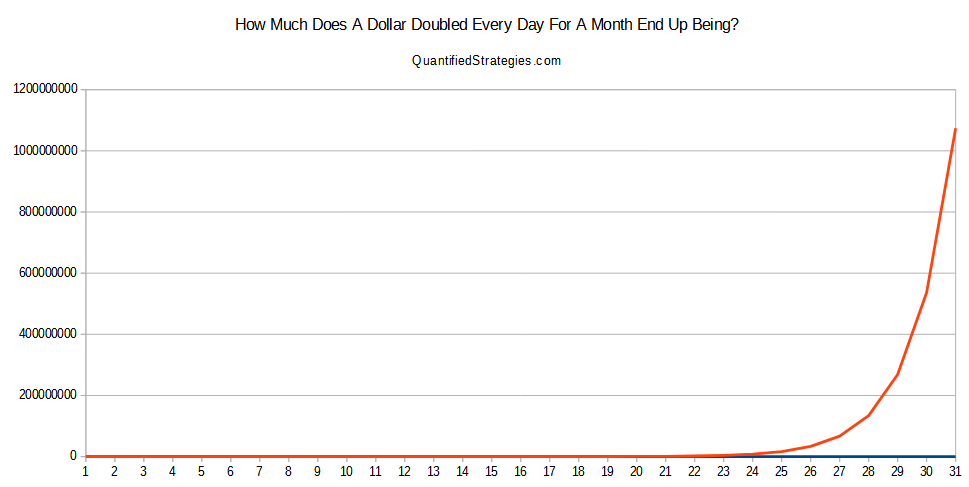

## Table of Contents

## What does it mean to double a dollar every day for a month?

If you start with one dollar and double it every day for a month, you will end up with a lot of money. At first, the amount grows slowly. For example, on day one you have $1, on day two you have $2, on day three you have $4, and so on. This slow growth can make it seem like you are not getting much money.

But as you keep going, the amount of money starts to grow very fast. By the middle of the month, you will have hundreds of dollars. By the end of the month, the amount becomes huge. If you do this for 30 days, you will have over $500 million dollars. This shows how powerful the idea of doubling can be over time.

## How do you calculate the value of a dollar doubled daily over a month?

To figure out how much money you would have if you doubled a dollar every day for a month, you use a simple math rule. Start with $1 on the first day. On the second day, you double it to get $2. On the third day, you double the $2 to get $4. You keep doing this every day, doubling the amount from the day before.

This process is called exponential growth. It starts slow but gets bigger and bigger each day. For example, by day 10, you would have $512. By day 20, you would have over $524,000. If you keep going for the whole month, say 30 days, you end up with over $500 million. That's a lot of money just from doubling a dollar every day!

## What is the formula for exponential growth in this context?

The formula for exponential growth in this case is pretty simple. If you start with $1 and double it every day, you can use this formula: Amount = 1 * 2^(days - 1). Here, "days" is the number of days you've been doubling the money. So, if you want to know how much money you have after 10 days, you plug in 10 for "days" and get Amount = 1 * 2^(10 - 1) = 1 * 2^9 = $512.

This formula works because each day you are multiplying the amount from the day before by 2. The "^" means "to the power of," so 2^9 means 2 multiplied by itself 9 times. This is why the numbers get so big so quickly. By the end of 30 days, using this formula, you'll find that you have over $500 million. It's amazing how fast exponential growth can add up!

## Can you explain the concept of compound interest as it relates to doubling a dollar daily?

Compound interest is when you earn interest on both the money you put in and the interest you've already earned. When you double a dollar every day, it's like getting compound interest at an extreme rate. Instead of adding a little bit of interest each day, you're doubling the whole amount. This makes the money grow much faster than regular compound interest because you're not just adding a percentage, you're multiplying by two every single day.

Imagine you put money in a bank and they give you 100% interest every day. That's like doubling your money every day! In real life, banks don't give that much interest, but this example shows how powerful compound interest can be. If you start with a small amount and let it grow with compound interest over a long time, even at a lower rate, it can still turn into a lot of money. That's why people say starting to save early is a good idea, because your money has more time to grow.

## What would be the total amount if you started with one dollar and doubled it every day for 30 days?

If you start with one dollar and double it every day for 30 days, you will end up with a huge amount of money. On the first day, you have just one dollar. By the second day, it's two dollars. This keeps going, doubling each day. By the middle of the month, the amount starts to get really big. For example, by day 15, you would have over $16,000.

By the end of the 30 days, the total amount is over $500 million. This happens because each day you are not just adding a little bit, you are doubling the whole amount from the day before. It shows how powerful the idea of doubling can be over time. Starting with just one dollar and doubling it every day for a month can turn it into a fortune.

## How does the length of the month affect the final amount when doubling a dollar daily?

The length of the month matters a lot when you're doubling a dollar every day. If the month is 30 days long, you end up with over $500 million. But if the month is shorter, like 28 days, you'll have less money. For a 28-day month, you would have about $134 million. That's still a lot, but it's a lot less than what you get with 30 days.

The difference comes from how many times you get to double the money. Every extra day means you get to double the amount one more time. So, two extra days can make a huge difference because of how fast the money grows. This shows how important each day is when you're dealing with doubling and exponential growth.

## What are the practical implications of such exponential growth in real-world scenarios?

Exponential growth, like doubling a dollar every day, shows up in real life in many ways. It can be seen in how money grows in investments or savings accounts. If you put money into a savings account with compound interest, your money grows faster over time because you earn interest on both the money you put in and the interest you've already earned. This is why starting to save early is a good idea. The longer your money has to grow, the more you end up with. But it's not just money; things like population growth or the spread of diseases can also grow exponentially. If a population doubles every few years, it can quickly get very big. The same goes for diseases; if the number of cases doubles every few days, it can spread very fast.

Understanding exponential growth can help us make better decisions. For example, knowing how quickly money can grow might make you start saving earlier or invest in something that grows faster. It can also help in managing things like population or disease outbreaks. If you know something is growing exponentially, you can take steps to slow it down before it gets out of control. But exponential growth can also be risky. If you borrow money and the interest compounds quickly, you could end up owing a lot more than you expected. So, it's important to think about how exponential growth can affect different parts of life and plan accordingly.

## How does starting with a different initial amount affect the final sum when doubling daily?

When you start with a different amount of money and double it every day, the final amount you end up with changes a lot. If you start with $2 instead of $1, you will have twice as much money at the end of the month. For example, if you start with $2 and double it every day for 30 days, you'll end up with over $1 billion. That's because you are starting with more money, so each day's doubling gives you a bigger increase.

Starting with a smaller amount, like 50 cents, means you'll have less money at the end. If you start with 50 cents and double it every day for 30 days, you'll end up with about $250 million. Even though it's still a lot of money, it's half of what you would get if you started with a dollar. This shows how important the starting amount is when you're dealing with exponential growth. The bigger you start, the bigger you end up.

## What are the mathematical principles behind exponential growth and how do they apply here?

Exponential growth is a way of describing how something gets bigger and bigger over time. It happens when a number is multiplied by itself over and over again. In the case of doubling a dollar every day, you start with $1 and then multiply it by 2 each day. This is called an exponential function, where the growth rate stays the same but the amount you're growing from gets bigger each time. The formula for this kind of growth is Amount = Initial Amount * (Growth Rate)^(Time - 1). Here, the initial amount is $1, the growth rate is 2, and time is the number of days you're doubling.

This kind of growth is different from linear growth, where you add the same amount each time. With exponential growth, the amount you're adding gets bigger and bigger because you're always starting from a bigger number. That's why, even though you're just doubling every day, the total amount gets huge very quickly. By the end of 30 days, starting with just $1 can turn into over $500 million. This shows how powerful exponential growth can be and why understanding it is important in many parts of life, like saving money or studying how diseases spread.

## How would the result change if the doubling period was changed from daily to weekly or monthly?

If you change the doubling period from daily to weekly, the amount of money you end up with after a month will be much less. Instead of doubling every day, you would only double your money every 7 days. So, in a 30-day month, you would only get to double your money about 4 times (since 30 days divided by 7 days is about 4). If you start with $1 and double it every week for 4 weeks, you'll have $16 at the end of the month. That's a lot less than the over $500 million you would get if you doubled daily.

If you switch to doubling monthly, the growth would be even slower. You would only double your money once in a 30-day month. Starting with $1 and doubling it once would give you just $2 at the end of the month. This shows how important the frequency of doubling is. The more often you double, the faster your money grows. Daily doubling leads to huge amounts, while weekly or monthly doubling results in much smaller totals.

## What are the limitations and assumptions in the model of doubling a dollar every day for a month?

The model of doubling a dollar every day for a month assumes that you can keep doubling your money every single day without any problems. It also assumes that you can find someone who will double your money for you every day, which is not something that happens in real life. In reality, no bank or investment would give you 100% interest every day. The model also doesn't take into account things like taxes or fees, which would take away some of the money you're [earning](/wiki/earning-announcement).

Another limitation is that the model assumes you can keep track of the money and that it stays safe. In real life, managing such a huge amount of money would be very hard. Also, the model doesn't consider what happens if you miss a day of doubling. If you miss even one day, the final amount you end up with will be much smaller. So, while the model is good for showing how powerful exponential growth can be, it's not something you can actually do in the real world.

## How can the concept of doubling a dollar daily be used to teach financial literacy and the power of exponential growth?

The idea of doubling a dollar every day can help teach kids and adults about money and how it can grow. By showing them how starting with just one dollar can turn into over $500 million in a month, it makes the idea of saving and investing more exciting. It helps people see that even small amounts of money can grow a lot if you let them. This can encourage them to start saving early, even if it's just a little bit, because over time, that money can turn into a lot more.

This concept also shows how powerful exponential growth is. It's not just about money; it can apply to things like how quickly a disease can spread or how a population can grow. By using the example of doubling a dollar, teachers can explain how starting small and letting things grow over time can lead to big results. This understanding can help people make better choices about saving, investing, and even understanding how other things in the world can change quickly.

## What is the Power of Compounding?

Compounding is recognized as a powerful financial concept due to its ability to facilitate exponential growth of investments over extended periods. This principle is founded on the reinvestment of returns, enabling investors to earn returns not just on their initial principal, but also on the accumulated interest from prior periods. This creates a snowball effect, dramatically enhancing wealth over time.

To illustrate, consider the act of doubling an initial amount regularly. This action leverages the principles of compounding, driving exponential increases in wealth. The fundamental formula capturing this growth is expressed as:

$$
A = P \times (1 + r)^t
$$

Where:
- $A$ represents the future value of the investment/loan, including interest.
- $P$ is the principal investment amount (initial deposit or loan amount).
- $r$ denotes the annual interest rate (decimal).
- $t$ indicates the time the money is invested or borrowed for, in years.

This mathematical framework underpins how a modest principal can burgeon significantly under optimal conditions. For example, if an initial investment of $1 is subject to a doubling process within specific time intervals, the resultant growth underscores the power of compounding. 

The exponential nature of this growth becomes increasingly evident over extended periods, as illustrated by the hypothetical exercise of doubling a dollar each day for 30 days. Although such scenarios are theoretical, available calculations demonstrate the impressive potential of compounding.

In practical financial environments, compounding periods can vary—daily, monthly, quarterly, or annually—profoundly influencing the final amount. Compounding becomes especially advantageous when reinvested earnings significantly bolster the original principal, enabling a continuous cycle of growth. 

The principle of compounding plays a crucial role in different investment vehicles, from savings accounts to equities and beyond. In each context, understanding and optimizing the impact of compounding can drive substantial wealth accumulation.

## What happens when a dollar is doubled for 30 days? What are the numbers?

Starting with an initial investment of one dollar and doubling it each day for 30 days results in a final sum of $1,073,741,824. This remarkable outcome illustrates the nature of exponential growth, which is a central feature of compounded returns. The following breakdown demonstrates how a seemingly modest beginning can escalate into an extraordinary amount through consistent doubling.

$$
A_n = A_0 \times 2^n
$$

where:
- $A_n$ is the amount on the nth day,
- $A_0$ is the initial amount, which is $1,
- $n$ is the number of days the amount is doubled (from 0 to 30).

By applying this formula, each day's amount can be calculated systematically:

- **Day 1**: $1 \times 2^1 = 2$
- **Day 2**: $1 \times 2^2 = 4$
- **Day 3**: $1 \times 2^3 = 8$
- **...**
- **Day 29**: $1 \times 2^{29} = 536,870,912$
- **Day 30**: $1 \times 2^{30} = 1,073,741,824$

The sequence exhibits a doubling pattern each day, leading to a geometric progression where each term is twice the previous one. This phenomenon highlights the power of exponential growth, a concept leveraged in various fields including finance, science, and technology.

To clearly visualize this exponential progression, the following Python code provides a simple implementation:

```python
def calculate_doubling(initial_amount, days):
    for day in range(days + 1):
        amount = initial_amount * (2 ** day)
        print(f"Day {day}: ${amount:,}")

# Let's calculate for 30 days, starting with $1
calculate_doubling(1, 30)
```

Upon execution, this script provides a day-by-day account of the doubling process. It emphasizes the stark difference between early-stage growth and the explosive increase towards the later stages, encapsulating the essence of compounding's impact in terms of rapid acceleration of accumulated value.

The progression not only serves as a theoretical exercise but also as an invaluable reminder of the profound effects compounding can have in financial strategies, embodying potential for substantial wealth accumulation under consistent growth conditions.

## What is Algorithmic Trading and how does it relate to Compounding?

Algorithmic trading leverages the power of compounding by incorporating strategies that focus on reinvesting earnings, resulting in potentially significant growth over time. This process is akin to the mathematical concept of doubling a dollar each day, illustrating the exponential increase that can be achieved through effective trading algorithms. In this model, by starting with a base amount and systematically doubling it, the result showcases the potential magnitude of compounded returns.

For instance, consider an algorithm that executes trades based on precise mathematical models and reinvests gains to amplify returns. By optimizing such algorithms, traders strive to replicate the multiplicative effects of compounding. This is achieved through careful adjustments to trading strategies, where profits are continually reinvested to enhance the overall growth pattern. The mathematical foundation for this can be formulated as:

$$
A = P \times (1 + r)^n
$$

where $A$ represents the future value of the investment, $P$ is the principal investment amount, $r$ is the rate of return per period, and $n$ denotes the number of compounding periods.

In Python, a simple simulation to illustrate this concept might involve defining a function to calculate compounded returns over a set period:

```python
def compounded_growth(principal, rate, periods):
    return principal * (1 + rate) ** periods

# Example: doubling a dollar over 30 days
initial_amount = 1
daily_rate = 1  # 100% growth rate per day
days = 30

final_amount = compounded_growth(initial_amount, daily_rate, days)
print(f"The final amount after doubling each day for 30 days is: ${final_amount}")
```

Traders seek to achieve similar effects in the financial markets by implementing algorithms that target favorable risk-reward ratios, adjust to market conditions, and exploit [arbitrage](/wiki/arbitrage) opportunities. Effective [algorithmic trading](/wiki/algorithmic-trading) requires balancing potential returns with the inherent risks, which can vary with market [volatility](/wiki/volatility-trading-strategies) and economic changes.

Through reinvesting profits, algorithmic traders mimic the exponential growth illustrated by the dollar doubling exercise, aiming for substantial returns from compounded reinvestments while systematically monitoring and mitigating risks. This approach underscores the potential power of algorithmic trading, when coupled with the strategic reinvestment of gains, to transform modest capital allocations into significant financial outcomes over time.

## References & Further Reading

[1]: ["The Intelligent Investor: The Definitive Book on Value Investing"](https://www.amazon.com/Intelligent-Investor-Definitive-Investing-Essentials/dp/0060555661) by Benjamin Graham

[2]: ["A Random Walk Down Wall Street: The Time-tested Strategy for Successful Investing"](https://www.amazon.com/Random-Walk-Down-Wall-Street/dp/0393358380) by Burton Malkiel

[3]: ["Principles of Corporate Finance"](https://www.mheducation.com/highered/product/principles-corporate-finance-brealey-myers/M9781264080946.html) by Richard A. Brealey, Stewart C. Myers, and Franklin Allen

[4]: Hull, J. C. (2009). ["Options, Futures, and Other Derivatives"](https://www.amazon.com/Options-Futures-Other-Derivatives-9th/dp/0133456315). Prentice Hall.

[5]: ["Mathematics for Finance: An Introduction to Financial Engineering"](https://link.springer.com/book/10.1007/b97511) by Marek Capinski and Tomasz Zastawniak