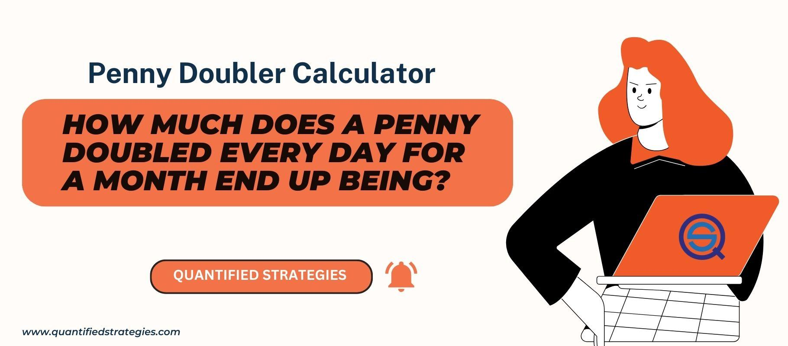

Compounding is a fundamental concept in finance and trading, where the reinvestment of earnings generates additional earnings over time. This self-reinforcing mechanism enables small amounts to grow into significant sums given sufficient time and a favorable rate of return. In finance, compounding is used across savings accounts, bonds, stock market investments, and algorithmic trading to maximize wealth accumulation. 

A particularly striking illustration of compounding is the penny doubling scenario. Here, if you start with a single penny and double it every day, by the 30th day, the initial amount would grow beyond $5 million. This illustrates the principle of exponential growth, which is mathematically represented by the formula:



$$
A = P \times (1 + r)^t
$$

where $A$ is the future value of the investment/loan, including interest, $P$ is the principal investment amount, $r$ is the annual interest rate (as a decimal), and $t$ is the number of years the money is invested or borrowed. In the case of penny doubling, $r$ is 100% daily compounding for 30 days, highlighting how quickly repeated doubling can escalate value.

This scenario captivates many due to its unexpected outcome, drawing attention to exponential financial growth's potent nature and the strategic mechanisms that leverage such growth. In algorithmic trading, similar principles are applied where trading strategies strive to compound returns incrementally. The iterative gains, if effectively managed, can lead to substantial profit accumulation over long periods. Understanding compounding's nuances can greatly benefit traders and investors aiming to optimize their financial strategies and harness potential gains in the market.

## Table of Contents

## The Penny Doubling Phenomenon

The penny doubling phenomenon is a classic illustration of exponential growth and compound interest, showcasing how small investments can grow significantly over time. In this scenario, a single penny ($0.01) doubles every day for 30 days. While it may initially appear modest, this compounding effect results in an astonishing final value exceeding $5 million.

This is the breakdown of how a penny doubles over a 30-day period:

| Day | Amount ($)       |
|-----|------------------|
| 1   | 0.01             |
| 2   | 0.02             |
| 3   | 0.04             |
| 4   | 0.08             |
| 5   | 0.16             |
| 6   | 0.32             |
| 7   | 0.64             |
| 8   | 1.28             |
| 9   | 2.56             |
| 10  | 5.12             |
| 11  | 10.24            |
| 12  | 20.48            |
| 13  | 40.96            |
| 14  | 81.92            |
| 15  | 163.84           |
| 16  | 327.68           |
| 17  | 655.36           |
| 18  | 1310.72          |
| 19  | 2621.44          |
| 20  | 5242.88          |
| 21  | 10485.76         |
| 22  | 20971.52         |
| 23  | 41943.04         |
| 24  | 83886.08         |
| 25  | 167772.16        |
| 26  | 335544.32        |
| 27  | 671088.64        |
| 28  | 1342177.28       |
| 29  | 2684354.56       |
| 30  | 5368709.12       |

This table clearly demonstrates the power of exponential growth. The initial days show modest increases and might be easily overlooked. For example, by day 10, the total is merely $5.12, which seems insignificant. However, by day 20, the amount leaps to $5,242.88, and by the 30th day, it surpasses $5 million.

The amazement [factor](/wiki/factor-investing) lies in the rapid escalation of the final amounts. While the growth seems slow initially, each doubling markedly increases the total in the latter half of the period. This scenario powerfully illustrates the concept of compound interest: wealth grows by reinvesting earnings so that the base continually increases.

The penny doubling phenomenon showcases how compound interest can transform a seemingly trivial sum into immense wealth, and serves as a compelling example of incremental growth potential when time and patience are factored into savings or investment strategies.

## Algorithmic Trading and Compound Interest

In [algorithmic trading](/wiki/algorithmic-trading), the principles of compounding found in the penny doubling scenario are applied to optimize financial growth through systematic and automated strategies. Algorithmic trading leverages computer algorithms to execute trades based on predetermined criteria, often capitalizing on compounding returns to enhance profitability. This methodology is akin to the penny doubling effect, where consistent, compounded growth results in exponential accumulation over time.

Traders employ compounding strategies by reinvesting profits to generate additional returns. For instance, a trader might deploy an algorithm that continuously reinvests gains from successful trades into subsequent trades, thereby compounding the returns. This strategy potentially transforms modest profits into a significant capital base when compounded systematically over time. By adhering to a disciplined reinvestment approach, traders can achieve incremental gains which, much like the penny doubling, can lead to substantial growth with sustained effort and a well-crafted algorithm.

Risk management is a critical aspect of algorithmic trading. The inherent risks of trading necessitate strategies that protect capital and optimize returns. Algorithms are designed to manage risk through diversification, stop-loss orders, and automated adjustments based on market conditions. This enables traders to mitigate losses, ensuring that the compounding process remains profitable over the long term. The importance of a long-term mindset cannot be overstated in algorithmic trading. While the allure of quick profits exists, the true power of compounding lies in its ability to accumulate wealth gradually. A sustained commitment to incremental growth allows for recovery from inevitable market fluctuations and potential losses.

In summary, algorithmic trading effectively mirrors the penny doubling scenario through the strategic application of compounding principles. By automating trade execution and consistently reinvesting gains, traders can achieve compounded returns. Risk management and a long-term perspective are essential components, ensuring the durability and success of these strategies in generating wealth over time.

## Mathematics of Compounding: The Formula

The mathematical formula of compounding is central to understanding exponential financial growth. The equation is expressed as:

$$
A = P \times (1 + r)^t
$$

where $A$ represents the accumulated amount, $P$ is the principal amount, $r$ is the rate of interest per period, and $t$ is the number of periods. 

To illustrate, consider the penny doubling scenario: starting with $P = 0.01$ (one penny), the value doubles daily, which translates to a 100% daily [interest rate](/wiki/interest-rate-trading-strategies) ($r = 1.0$). By applying the compounding formula over 30 days ($t = 30$), we calculate the final amount:

$$
A = 0.01 \times (1 + 1)^{30}
$$

With any programming language, this computation can be automated. Here is an example using Python:

```python
P = 0.01
r = 1
t = 30
A = P * (1 + r)**t
print("Final amount after 30 days: ${:.2f}".format(A))
```

Executing the above code will yield a surprising outcome: $A = 10737418.24$, which equates to over 10 million dollars.

The critical factors in achieving such substantial growth are the rate of interest and the time period over which compounding occurs. The formula exemplifies that even modest starting amounts grow significantly under high compounding rates, particularly over extended periods. 

Time amplifies the effect of compounding, turning linear increments into geometric expansion. A slight increase in the interest rate or a longer investment period can exponentially increase the final accumulation. These insights underline the importance of compounding in financial strategies and wealth management, urging both investors and financial strategists to prioritize time and rate factors in their calculations and projections.

## Lessons in Patience and Strategy

Compounding is an essential concept in growth strategies, emphasizing the virtue of patience over the allure of immediate rewards. The penny doubling scenario is a powerful metaphor illustrating the exponential growth potential achievable with patience and strategic foresight. This example begins with seemingly trivial amounts, growing from $0.01 on the first day to a staggering $5,368,709.12 by the 30th day. During the initial stages, growth appears insignificant, requiring the investor to maintain confidence that their strategy will yield significant returns over time. 

This phenomenon highlights the importance of not being swayed by short-term fluctuations or modest initial gains. For instance, by day 10 of the doubling penny, the amount is only $5.12—a reminder that substantial financial results require enduring commitment and resilience. This is analogous to investing, where early contributions might seem small relative to ultimate financial goals, yet they lay the groundwork for significant future wealth.

Encouraging early and regular investing harnesses the power of compounding effectively. Initiating investments early in life amplifies the benefits of compound growth due to the extended timeframe available to multiply returns. Regular contributions further augment this effect, facilitating continued growth and counteracting periodic market downturns. The principle of "time in the market" outweighing "timing the market" is a fundamental lesson, illustrating that early and consistent investment strategies can significantly impact a portfolio's final value.

Consider the formula for compound interest, which is $A = P \times (1 + r)^t$. Here, $P$ represents the initial principal balance, $r$ the rate of interest per period, and $t$ the number of periods. The exponentiation in the formula showcases how even small rates, when compounded over numerous periods, can lead to considerable capital growth.

In conclusion, investors should recognize the power of patience and strategic long-term thinking in wealth accumulation. Early investors who consistently add to their portfolios are well-positioned to capitalize on exponential growth, appreciating how early efforts and consistent strategies contribute to future financial success. This disciplined approach not only aids in wealth creation but also instills the virtues of patience and perseverance in an ever-dynamic financial landscape.

## Practical Applications in Trading

Traders implement compounding techniques in various trading strategies primarily to enhance returns by reinvesting profits over time. Compounding in trading revolves around the concept of using profits to increase the investment base and thus, potentially magnifying growth exponentially. One popular application is through algorithmic trading, where automated systems execute trades based on pre-defined criteria, enabling consistent application of compounding principles.

### Algorithmic Trading Solutions and Platforms

Algorithmic trading platforms facilitate the automation of compounding strategies, providing traders with tools to execute trades systematically without manual intervention. These platforms utilize algorithms programmed to follow specific strategies, optimizing for factors such as market trends, price patterns, and [volume](/wiki/volume-trading-strategy) data. By leveraging high-speed computational capabilities, these solutions can implement compounding strategies efficiently, often with less emotional bias than human traders.

Some popular algorithmic trading platforms include MetaTrader, TradeStation, and [Interactive Brokers](/wiki/interactive-brokers-api)' Trader Workstation. These platforms allow traders to develop scripts using languages like Python, MQL, or EasyLanguage, enabling tailored algorithms that can, for example, increase the trade size proportionally when profits are realized. A simple example in Python demonstrates compounding through reinvesting gains:

```python
initial_investment = 1000
annual_return_rate = 0.10  # 10% annual return
years = 5

for year in range(1, years + 1):
    initial_investment *= (1 + annual_return_rate)
    print(f"Year {year}: ${initial_investment:.2f}")
```

This code calculates the compounded growth of an initial investment over a period using a fixed annual return rate, showcasing how profits can be reinvested to generate further gains.

### Risks and Benefits

While compounding offers significant benefits, including potentially higher returns and the ability to build wealth over time, it also presents risks. The primary advantage is the exponential growth potential, allowing small, consistent gains to accumulate significantly with patience. However, this potential comes with certain risks in trading scenarios.

One major risk is market [volatility](/wiki/volatility-trading-strategies), which can disrupt any compounding strategy if not managed wisely. With rapid price changes, the capital at risk may increase significantly, potentially leading to larger losses. Furthermore, algorithmic strategies that rely on compounding necessitate rigorous [backtesting](/wiki/backtesting) and optimization to ensure they function effectively across different market conditions.

Additionally, reliance on automated systems involves technological risks such as software bugs or connectivity issues, which could result in unanticipated trades or missed opportunities. To mitigate these risks, traders often employ robust risk management strategies, including setting stop losses and regularly monitoring the performance of their algorithms.

In conclusion, the practical application of compounding in trading, particularly through algorithmic trading platforms, offers exciting opportunities for enhancing returns. However, it requires a careful balance of disciplined strategy development, regular scrutiny, and risk management to harness its full potential.

## Key Takeaways and Real-World Implications

Understanding and using compounding is essential for achieving significant financial growth and success in trading. The key advantage of compounding lies in its ability to produce exponential growth over time, transforming modest initial investments into substantial sums. This principle is pivotal not only in personal finance but also in professional trading strategies, where the power of incremental growth accumulates to yield considerable profits.

Investing time in learning about compound interest and its application can greatly benefit investors. By comprehending factors such as the compounding frequency and rate of return, investors can strategically incorporate these insights into their portfolios to maximize returns. For instance, regularly reinvesting dividends and interest can enhance investment results exponentially, allowing individuals to achieve their financial goals more efficiently.

Strategic patience and disciplined investing habits play an integral role in leveraging compounding effectively. Early investment and consistent contributions increase the total effect of compounding over time, making the initial low returns in early periods significantly higher in the long run. This patience can be particularly rewarding when market downturns occur, as it allows investors to strengthen their positions and leverage eventual market recoveries. Furthermore, disciplined investing minimizes the impact of emotional decision-making, aligning investment actions with long-term goals instead of short-term market fluctuations.

In conclusion, realizing the full potential of compounding entails a dual focus on financial literacy and behavioral discipline. Investors are encouraged to educate themselves on tailoring compounding strategies to meet their financial aspirations, ensuring that each investment decision contributes positively toward long-term wealth accumulation. By maintaining a calculated, patient approach, investors can leverage the power of compounding to achieve enduring financial growth.

## FAQs

### FAQs

#### What does it mean to double your money, and how can it be achieved?

Doubling your money simply means increasing the value of your investment to twice its original amount. This can be achieved through various strategies, including investing in high-yield savings accounts, stocks, real estate, or mutual funds. The key to successfully doubling your money lies in understanding and leveraging the power of compounding, where not just your initial investment earns returns, but also the returns themselves generate further income over time. However, it's essential to approach these strategies with caution and to thoroughly research or consult with financial advisors to mitigate risks and avoid scams that promise unrealistic returns.

#### How can individuals find suitable investment strategies for compounding returns?

To find suitable investment strategies for compounding returns, individuals should consider several factors, including their financial goals, risk tolerance, and investment time horizon. Diversifying investments across different asset classes can reduce risk and increase the likelihood of steady returns. It is advisable to start with a clear goal, such as saving for retirement, buying a home, or funding education, and then choose investment options that align with these objectives. Consulting with a financial advisor, conducting thorough research on investment products, and keeping abreast of market trends are also critical steps in selecting the right strategy for compounding returns.

#### What is the Rule of 72, and how is it used in estimating doubling time for investments?

The Rule of 72 is a simple formula used to estimate the number of years required to double an investment at a fixed annual rate of return. To use the Rule of 72, divide 72 by the expected annual return rate (expressed as a percentage). The result is the approximate number of years it will take for the investment to double.

For example, if you have an investment that yields an 8% annual return, you can estimate the doubling time as follows:

$$
\text{Doubling Time} = \frac{72}{8} = 9 \, \text{years}
$$

This rule provides a quick and rough estimation and is particularly useful for investors seeking to understand the impact of different interest rates on investment growth without needing complex calculations. However, it’s important to remember that the Rule of 72 is an approximation and actual results can be influenced by various factors, including changes in interest rates and investment risks.

## References & Further Reading

[1]: Bergstra, J., Bardenet, R., Bengio, Y., & Kégl, B. (2011). ["Algorithms for Hyper-Parameter Optimization."](https://papers.nips.cc/paper/4443-algorithms-for-hyper-parameter-optimization) Advances in Neural Information Processing Systems 24.

[2]: ["Advances in Financial Machine Learning"](https://www.amazon.com/Advances-Financial-Machine-Learning-Marcos/dp/1119482089) by Marcos Lopez de Prado

[3]: ["Evidence-Based Technical Analysis: Applying the Scientific Method and Statistical Inference to Trading Signals"](https://www.amazon.com/Evidence-Based-Technical-Analysis-Scientific-Statistical/dp/0470008741) by David Aronson

[4]: ["Machine Learning for Algorithmic Trading"](https://github.com/PacktPublishing/Machine-Learning-for-Algorithmic-Trading-Second-Edition) by Stefan Jansen

[5]: ["Quantitative Trading: How to Build Your Own Algorithmic Trading Business"](https://books.google.com/books/about/Quantitative_Trading.html?id=j70yEAAAQBAJ) by Ernest P. Chan