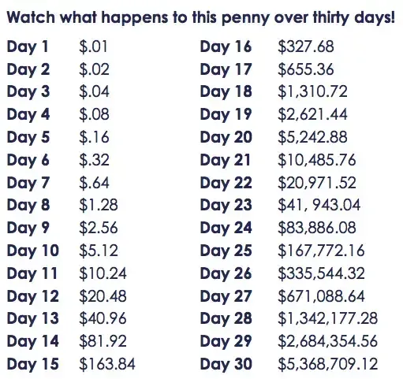

## Table of Contents

## What is the concept of doubling a penny every day?

The concept of doubling a penny every day is a simple way to show how money can grow really fast through something called compound interest. Imagine if you start with just one penny on the first day, and then you double it every day after that. So, on the second day, you'd have two pennies, on the third day, you'd have four pennies, and so on. This idea helps people understand how small amounts of money can turn into big amounts over time if they keep growing.

By the end of a month, the results can be surprising. If you keep doubling the penny every day for 30 days, you'll end up with over $5 million! This shows how powerful compound interest can be. It's a good lesson for saving money because it teaches us that even starting with a tiny amount can lead to huge savings if we let it grow over time.

## How do you calculate the value of a penny doubled daily?

To calculate the value of a penny doubled daily, you start with one penny on the first day. On the second day, you double it to get two pennies. On the third day, you double the two pennies to get four pennies, and you keep doing this every day. The math you use is simple: each day's amount is the previous day's amount times two. So, if you want to know how much money you have on any day, you can use the formula: amount = 1 penny × 2^(day - 1). For example, on day 5, you would calculate 1 penny × 2^(5 - 1) = 1 penny × 2^4 = 1 penny × 16 = 16 pennies.

This way of calculating shows how quickly the money grows. Let's say you want to find out how much you have after 30 days. You would use the formula: amount = 1 penny × 2^(30 - 1) = 1 penny × 2^29. When you do the math, 2^29 is a big number: 536,870,912. So, after 30 days, you would have 536,870,912 pennies. Since there are 100 pennies in a dollar, you divide this number by 100 to find out how many dollars you have: 536,870,912 ÷ 100 = $5,368,709.12. That's over five million dollars from just one penny!

## What is the formula for exponential growth related to this scenario?

Exponential growth is when something grows by the same percentage over and over again. In the case of doubling a penny every day, the growth rate is 100% each day. The formula for this kind of growth is A = P × (1 + r)^t. Here, A is the amount of money you have at the end, P is the starting amount (which is 1 penny in our example), r is the growth rate (which is 1 for 100% because we're doubling), and t is the time in days.

When you use this formula for our penny example, P is 1 penny, r is 1 (because doubling is the same as growing by 100%), and t is the number of days you want to calculate for. So, if you want to know how much money you have after 30 days, you plug in the numbers: A = 1 penny × (1 + 1)^30. This simplifies to A = 1 penny × 2^30. After doing the math, you find out that after 30 days, you have over 5 million dollars from just one penny!

## How much would a penny be worth after one week of doubling daily?

If you start with one penny and double it every day, after one week, you'll have a lot more money than you started with. By the end of the first week, which is 7 days, the penny will have grown to 128 pennies. This is because each day, the amount of money doubles. So, on day 1, you have 1 penny; on day 2, you have 2 pennies; on day 3, you have 4 pennies; on day 4, you have 8 pennies; on day 5, you have 16 pennies; on day 6, you have 32 pennies; and on day 7, you have 64 pennies doubled, which is 128 pennies.

In dollars, 128 pennies is $1.28. This shows how quickly money can grow when it doubles every day. Even starting with just one penny, after just one week, you end up with more than a dollar. It's a simple way to see how powerful compound growth can be, even over a short time like one week.

## What is the total value of a penny doubled every day for 30 days?

If you start with one penny and double it every day for 30 days, you will end up with a lot of money. By the end of 30 days, the penny will have grown to over 5 million dollars. This is because each day the amount of money doubles, so it grows very fast. On the first day, you have 1 penny. On the second day, you have 2 pennies. On the third day, you have 4 pennies. This keeps going until day 30, when you have 536,870,912 pennies. Since there are 100 pennies in a dollar, this means you have $5,368,709.12.

This example shows how powerful compound growth can be. Even though you start with just one penny, the daily doubling makes the amount grow very quickly. It's a simple way to understand how saving and investing can lead to big results over time. If you keep doubling every day, the money grows so fast that by the end of the month, you have a huge amount of money from just starting with one tiny penny.

## How does the choice of starting day affect the final amount in a month?

The choice of starting day can change the final amount you get at the end of a month when you double a penny every day. If you start on the first day of the month, you will have the full 30 or 31 days to double the penny. This means by the end of the month, you will have a huge amount, over 5 million dollars. But, if you start on a later day, like the 15th, you will have fewer days to double the penny. So, the amount at the end of the month will be much smaller because you didn't have as many days for the penny to grow.

For example, if you start on the 15th of a 30-day month, you will only have 16 days to double the penny. Starting with one penny on the 15th, by the end of the month, you will have 65,536 pennies. That's a lot less than the over 500 million pennies you would have if you started on the first day. The fewer days you have, the less time the penny has to grow, so the final amount will be smaller. This shows how important it is to start early if you want to see big results from something that grows over time.

## What are the differences in results if you use a 30-day month versus a 31-day month?

If you double a penny every day for a 30-day month, starting with one penny, you'll end up with a huge amount of money. By the end of 30 days, you'll have over 5 million dollars. This is because the penny doubles every day, so it grows very fast. If you start on the first day of a 30-day month, you get the full benefit of all 30 days of doubling.

In a 31-day month, starting on the first day and doubling every day, you'll have one more day for the penny to grow. This extra day makes a big difference. After 31 days, you'll end up with over 10 million dollars. That's a lot more than the over 5 million dollars you get in a 30-day month. So, even one extra day can double the amount of money you end up with because of how quickly the penny grows when it doubles every day.

## How does the concept of compound interest relate to doubling a penny daily?

The concept of doubling a penny every day is a simple way to understand compound interest. Compound interest is when the money you have grows not just on the original amount, but also on the interest you earn over time. When you double a penny every day, you are seeing the power of this kind of growth. Each day, the amount of money you have doubles, which is like [earning](/wiki/earning-announcement) interest on your money and then earning more interest on that interest.

This example of doubling a penny daily shows how quickly money can grow with compound interest. Even though you start with just one penny, by the end of a month, you can end up with millions of dollars. It teaches us that even small amounts of money can grow into big amounts if you let them compound over time. This is why starting to save or invest early can lead to much bigger results in the future.

## What historical or mathematical significance does this penny-doubling problem have?

The penny-doubling problem is a famous example used to teach people about the power of exponential growth and compound interest. It has been used in math classes for a long time because it shows in a simple way how quickly something can grow when it doubles every day. Even though it starts with just one penny, the amount grows so fast that by the end of a month, it can reach millions of dollars. This problem helps people understand why starting to save or invest money early can lead to big results later.

This problem also has historical significance because it relates to stories and legends about exponential growth. One famous story is about the inventor of chess who asked the king for a reward of one grain of rice on the first square of the chessboard, two grains on the second square, four on the third, and so on, doubling each time. The king agreed, not realizing how quickly the number of grains would grow. By the end of the 64 squares, the total amount of rice was so huge that it was impossible to give. This story, like the penny-doubling problem, shows how powerful and surprising exponential growth can be.

## How can the penny-doubling concept be applied to investment strategies?

The penny-doubling concept can be a great way to understand how to make your money grow when you invest. Just like how a penny doubles every day to become a lot of money, your investments can grow over time if you let them compound. This means you earn money not just on what you put in at the start, but also on the money your investment makes. The key is to start early and keep your money invested for a long time. Even if you start with a small amount, like the penny, it can turn into a lot if you let it grow without taking it out.

This idea also shows why it's important to keep adding to your investments regularly. Just like doubling the penny every day, if you keep putting more money into your investments, you can see your money grow even faster. It's like giving your money more chances to double. So, if you want your investments to grow big, start early, keep your money in, and add to it as often as you can. This way, you can use the power of compounding to turn small investments into big savings over time.

## What are the limitations or assumptions in the penny-doubling model?

The penny-doubling model is a simple way to show how fast money can grow, but it makes some big assumptions. It assumes that you can double your money every single day without fail, which is not possible in real life. In the real world, investments don't grow that fast, and there are risks that can make your money go down instead of up. The model also doesn't take into account things like taxes, fees, or inflation, which can eat into your earnings and make your money grow slower.

Another thing to think about is that the penny-doubling model is just a way to teach about the idea of compound growth. It's not something you can actually do with a penny, because no bank or investment will double your money every day. It's meant to be a simple example to help people understand how powerful compounding can be over time. But in real life, you need to be patient and understand that investments grow much more slowly and with ups and downs.

## How can the penny-doubling problem be used as an educational tool in teaching exponential growth?

The penny-doubling problem is a great way to teach kids about exponential growth because it's easy to understand. You start with one penny and double it every day. By the end of a month, you have millions of dollars! This simple idea helps kids see how fast things can grow when they double every day. They can do the math and see how the numbers get bigger and bigger, which makes the idea of exponential growth clear and exciting.

Teachers can use this problem to show how starting with a small amount can lead to big results over time. It's like a fun game where you keep doubling the penny and watching it grow. This can help kids understand why it's good to start saving or investing early. They learn that even though it might seem slow at first, the growth can become huge if you let it keep going. This lesson can be really helpful in teaching them about money and how to plan for the future.

## What is the Mathematics of Compounding: The Formula?

The mathematical formula of compounding is central to understanding exponential financial growth. The equation is expressed as:

$$
A = P \times (1 + r)^t
$$

where $A$ represents the accumulated amount, $P$ is the principal amount, $r$ is the rate of interest per period, and $t$ is the number of periods. 

To illustrate, consider the penny doubling scenario: starting with $P = 0.01$ (one penny), the value doubles daily, which translates to a 100% daily [interest rate](/wiki/interest-rate-trading-strategies) ($r = 1.0$). By applying the compounding formula over 30 days ($t = 30$), we calculate the final amount:

$$
A = 0.01 \times (1 + 1)^{30}
$$

With any programming language, this computation can be automated. Here is an example using Python:

```python
P = 0.01
r = 1
t = 30
A = P * (1 + r)**t
print("Final amount after 30 days: ${:.2f}".format(A))
```

Executing the above code will yield a surprising outcome: $A = 10737418.24$, which equates to over 10 million dollars.

The critical factors in achieving such substantial growth are the rate of interest and the time period over which compounding occurs. The formula exemplifies that even modest starting amounts grow significantly under high compounding rates, particularly over extended periods. 

Time amplifies the effect of compounding, turning linear increments into geometric expansion. A slight increase in the interest rate or a longer investment period can exponentially increase the final accumulation. These insights underline the importance of compounding in financial strategies and wealth management, urging both investors and financial strategists to prioritize time and rate factors in their calculations and projections.

## What are Frequently Asked Questions?

### FAQs

#### What does it mean to double your money, and how can it be achieved?

Doubling your money simply means increasing the value of your investment to twice its original amount. This can be achieved through various strategies, including investing in high-yield savings accounts, stocks, real estate, or mutual funds. The key to successfully doubling your money lies in understanding and leveraging the power of compounding, where not just your initial investment earns returns, but also the returns themselves generate further income over time. However, it's essential to approach these strategies with caution and to thoroughly research or consult with financial advisors to mitigate risks and avoid scams that promise unrealistic returns.

#### How can individuals find suitable investment strategies for compounding returns?

To find suitable investment strategies for compounding returns, individuals should consider several factors, including their financial goals, risk tolerance, and investment time horizon. Diversifying investments across different asset classes can reduce risk and increase the likelihood of steady returns. It is advisable to start with a clear goal, such as saving for retirement, buying a home, or funding education, and then choose investment options that align with these objectives. Consulting with a financial advisor, conducting thorough research on investment products, and keeping abreast of market trends are also critical steps in selecting the right strategy for compounding returns.

#### What is the Rule of 72, and how is it used in estimating doubling time for investments?

The Rule of 72 is a simple formula used to estimate the number of years required to double an investment at a fixed annual rate of return. To use the Rule of 72, divide 72 by the expected annual return rate (expressed as a percentage). The result is the approximate number of years it will take for the investment to double.

For example, if you have an investment that yields an 8% annual return, you can estimate the doubling time as follows:

$$
\text{Doubling Time} = \frac{72}{8} = 9 \, \text{years}
$$

This rule provides a quick and rough estimation and is particularly useful for investors seeking to understand the impact of different interest rates on investment growth without needing complex calculations. However, it’s important to remember that the Rule of 72 is an approximation and actual results can be influenced by various factors, including changes in interest rates and investment risks.

## References & Further Reading

[1]: Bergstra, J., Bardenet, R., Bengio, Y., & Kégl, B. (2011). ["Algorithms for Hyper-Parameter Optimization."](https://papers.nips.cc/paper/4443-algorithms-for-hyper-parameter-optimization) Advances in Neural Information Processing Systems 24.

[2]: ["Advances in Financial Machine Learning"](https://www.amazon.com/Advances-Financial-Machine-Learning-Marcos/dp/1119482089) by Marcos Lopez de Prado

[3]: ["Evidence-Based Technical Analysis: Applying the Scientific Method and Statistical Inference to Trading Signals"](https://www.amazon.com/Evidence-Based-Technical-Analysis-Scientific-Statistical/dp/0470008741) by David Aronson

[4]: ["Machine Learning for Algorithmic Trading"](https://github.com/PacktPublishing/Machine-Learning-for-Algorithmic-Trading-Second-Edition) by Stefan Jansen

[5]: ["Quantitative Trading: How to Build Your Own Algorithmic Trading Business"](https://books.google.com/books/about/Quantitative_Trading.html?id=j70yEAAAQBAJ) by Ernest P. Chan