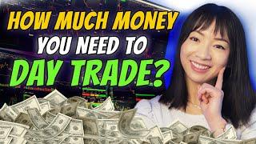

## Table of Contents

## What is the minimum amount of money needed to start trading?

The minimum amount of money needed to start trading can vary a lot depending on where you want to trade and what you want to trade. For example, if you want to trade stocks, some brokers let you start with as little as $1. But if you want to trade futures or forex, you might need more money to start, sometimes hundreds or even thousands of dollars.

It's also important to think about how much money you can afford to lose. Trading can be risky, and it's easy to lose money, especially if you're new to it. So, it's a good idea to only use money that you don't need for important things like rent or food. Starting small and learning as you go can help you become a better trader without risking too much money.

## How does the choice of trading platform affect the initial investment required?

The choice of trading platform can make a big difference in how much money you need to start trading. Some platforms, like certain online brokerages, let you start with very little money, sometimes even just a few dollars. These platforms often have low or no fees for trading stocks or ETFs, which makes it easier for people with less money to start trading. On the other hand, other platforms might require more money to open an account, especially if you want to trade things like futures or forex. These platforms might have higher fees or require a minimum balance, which can make it harder for people with less money to start.

Also, different platforms offer different tools and features that can affect how much money you need to start. For example, some platforms offer commission-free trading, which means you don't have to pay a fee every time you buy or sell something. This can help you save money and start trading with less. But other platforms might charge higher commissions, which means you need more money to cover those costs. So, when choosing a platform, it's important to think about how much money you have and what kind of trading you want to do, because that will affect how much you need to start.

## What are the costs associated with trading, such as fees and commissions?

When you start trading, you need to know about the costs that come with it, like fees and commissions. These costs can eat into your profits, so it's important to understand them. Most trading platforms charge a commission every time you buy or sell something. This fee can be a flat amount, like $5 per trade, or it can be a percentage of the total amount you're trading. Some platforms offer commission-free trading for certain types of investments, like stocks or ETFs, but they might still charge fees for other services, like account maintenance or withdrawing money.

There are also other fees you might have to pay. For example, some platforms charge an inactivity fee if you don't trade often enough. Others might charge a fee for transferring money in or out of your account. If you're trading things like futures or [forex](/wiki/forex-system), you might have to pay extra fees, like overnight financing charges or data fees for real-time market information. All these costs can add up, so it's a good idea to read the fine print and understand all the fees before you start trading.

In the end, the total cost of trading depends on the platform you choose and what you're trading. Some platforms are cheaper than others, but they might not offer all the tools and features you need. It's important to find a balance between low costs and the right tools for your trading style. By understanding all the fees and commissions, you can make better decisions and keep more of your profits.

## How can a beginner manage their trading capital effectively?

For a beginner, managing trading capital effectively is all about being careful and planning ahead. Start by only using money you can afford to lose. Trading can be risky, and it's easy to lose money, so it's important not to use money you need for important things like rent or food. It's also a good idea to start small. Instead of putting all your money into one trade, spread it out over several smaller trades. This way, if one trade goes bad, you won't lose everything. 

Another important thing is to set clear goals and stick to a plan. Decide how much money you want to make and how much you're willing to lose before you start trading. This can help you stay focused and avoid making emotional decisions. It's also helpful to keep learning and improving your skills. Use tools like demo accounts to practice trading without risking real money. By being patient and learning from your mistakes, you can get better at managing your trading capital and increase your chances of success.

## What is the difference between trading with a small account versus a large account?

Trading with a small account means you have less money to work with. This can make it harder to spread your money across different trades, which is called diversification. With a small account, you might have to take bigger risks to make a profit, and if one trade goes bad, it can hurt your account a lot. Small accounts can also limit the types of investments you can make, like futures or forex, because these often need more money to start. But, starting small can help you learn to trade without risking too much money.

On the other hand, trading with a large account gives you more flexibility. You can spread your money across more trades, which can help you manage risk better. With more money, you can also take advantage of more trading opportunities and invest in things that might need a bigger initial investment. But, having a large account can also make you feel more confident, which might lead to taking bigger risks. It's important to stay disciplined and stick to your trading plan, no matter how much money you have.

In the end, the key to successful trading, whether with a small or large account, is to manage your money carefully and keep learning. With a small account, you might need to be more patient and focus on smaller, safer trades. With a large account, you can take on more opportunities but need to be careful not to get too confident. Both require a good trading plan and discipline to be successful.

## How does leverage impact the amount of money needed for trading?

Leverage lets you trade with more money than you actually have. It's like borrowing money from your broker to make bigger trades. This can be good because it lets you make more money if your trades go well. But it's also risky because if your trades go bad, you can lose a lot more money than you started with. Because of this, you might need less money to start trading when you use leverage, but you need to be careful because the risks are higher.

When you use leverage, you only need to put down a small amount of money, called margin, to control a bigger position. For example, with 10:1 leverage, you can control $10,000 worth of a trade with just $1,000. This means you can start trading with less money, but it also means that small changes in the market can have a big impact on your account. If the market moves against you, you could get a margin call, where you need to add more money to your account or close your position. So, while leverage can help you start trading with less money, it's important to understand the risks and use it carefully.

## What are the risks of undercapitalization in trading?

Undercapitalization in trading means you don't have enough money in your account. This can be a big problem because it makes it hard to handle the ups and downs of the market. If you don't have enough money, even a small drop in the market can wipe out your account. You might also have to close your trades early just to cover losses, which can stop you from making money in the long run.

Another risk is that you might be tempted to take bigger risks to make more money quickly. When you don't have enough money, you might start trading with too much of your account on one trade, hoping for a big win. But this is very risky and can lead to big losses. It's important to have enough money in your account to spread your trades out and handle the normal ups and downs of the market without losing everything.

## How should one adjust their trading strategy based on their account size?

If you have a small account, you need to be careful and patient. You should focus on making small, safe trades instead of trying to make a lot of money quickly. This means you might want to trade things like stocks or ETFs that don't need a lot of money to start. You should also spread your money out over different trades to lower your risk. It's important not to use all your money on one trade because if it goes bad, you could lose everything. With a small account, you should also learn as much as you can and use tools like demo accounts to practice without losing real money.

If you have a large account, you have more options and can take bigger risks if you want to. You can spread your money out over more trades and invest in things that might need more money to start, like futures or forex. But just because you have more money doesn't mean you should take big risks. It's still important to have a good trading plan and stick to it. With a large account, you might feel more confident, but you need to be careful not to get too confident and start making bad decisions. No matter how much money you have, the key is to manage it well and keep learning.

## What are the benefits of increasing trading capital over time?

Increasing your trading capital over time can help you trade better. When you have more money, you can spread it out over more trades. This means you can take on more opportunities and lower your risk. Instead of putting all your money into one trade, you can try different things and see what works best for you. More money also lets you trade things that might need a bigger starting amount, like futures or forex. This can open up new ways to make money.

Another benefit is that more money can help you handle the ups and downs of the market. With a bigger account, small changes in the market won't hurt as much. You can keep your trades open longer and wait for the right time to make a profit. This can lead to better results in the long run. Plus, having more money can make you feel more confident, but it's important to stay disciplined and stick to your trading plan. By slowly increasing your trading capital, you can become a better trader and make more money over time.

## How do professional traders determine the optimal amount of capital for their trading style?

Professional traders figure out the best amount of money for their trading style by looking at a few things. First, they think about how much risk they want to take. They know that trading can be risky, so they decide how much money they can afford to lose without hurting their finances. They also look at the types of trades they want to make. Some trades, like stocks or ETFs, need less money to start, while others, like futures or forex, need more. By understanding their risk level and the kind of trading they want to do, they can figure out how much money they need.

Another thing professional traders think about is their trading strategy. If they like to spread their money out over many small trades, they might need more money to start. This helps them lower their risk and take advantage of more opportunities. On the other hand, if they prefer to focus on a few big trades, they might need less money but still need to be careful about the risks. By matching their capital to their strategy, they can trade more effectively and increase their chances of making money.

## What role does diversification play in managing trading capital?

Diversification is important when you're managing your trading capital. It means spreading your money across different types of investments instead of putting it all in one place. This can help lower your risk because if one investment goes bad, you won't lose all your money. For example, if you only trade one stock and it goes down, you could lose a lot. But if you have money in different stocks, some might go up even if others go down. This way, you can protect your trading capital and have a better chance of making money over time.

To use diversification well, you need to think about how much money you have and what you want to trade. If you have a small account, you might need to be careful and focus on a few different investments. With a bigger account, you can spread your money out more and try different things. No matter how much money you have, the key is to balance your investments so that you're not too dependent on any one trade. By diversifying, you can manage your trading capital better and increase your chances of success in the long run.

## How can advanced traders use risk management techniques to optimize their trading capital?

Advanced traders use risk management techniques to make the most of their trading capital by setting clear rules for how much they're willing to lose on each trade. They use something called a stop-loss order, which automatically closes a trade if it goes down by a certain amount. This helps them limit their losses and keep their trading capital safe. They also decide how much of their account they want to risk on each trade, usually a small percentage like 1% or 2%. By doing this, they can keep trading even if they have a few losing trades, because they won't lose all their money at once.

Another way advanced traders manage their capital is by using position sizing. This means they figure out how much money to put into each trade based on how risky it is and how much they want to make. They might use tools like the Kelly Criterion to help them decide the best amount to bet. By carefully choosing how much to invest in each trade, they can balance their risk and reward and make their trading capital last longer. This helps them stay in the game and have more chances to make money over time.

## What is a Cost-Benefit Analysis?

Performing a cost-benefit analysis (CBA) of [algorithmic trading](/wiki/algorithmic-trading) strategies is essential for traders seeking to quantify the financial viability of their operations. This assessment allows traders to systematically evaluate whether the potential returns justify the associated costs and identify opportunities for optimization.

### Key Metrics and KPIs

Several metrics and key performance indicators (KPIs) are crucial in evaluating the effectiveness of trading algorithms:

1. **Return on Investment (ROI)**: ROI is the ratio of the net profit generated by the trading algorithm to the total cost incurred, calculated as:
$$
   \text{ROI} = \left(\frac{\text{Net Profit}}{\text{Total Cost}}\right) \times 100\%

$$

2. **Sharpe Ratio**: This metric helps assess the risk-adjusted return of the trading strategy, calculated by subtracting the risk-free rate from the algorithm's returns and dividing by the standard deviation of returns:
$$
   \text{Sharpe Ratio} = \frac{E[R_p - R_f]}{\sigma_p}

$$

   where $E[R_p - R_f]$ is the expected return in excess of the risk-free rate, and $\sigma_p$ is the standard deviation of the portfolio return.

3. **Alpha**: Represents the excess return of the algorithm relative to a benchmark index. A positive alpha indicates that the algorithm is performing better than the market benchmark.

4. **Cost Ratio**: This KPI measures the proportion of total trading profits consumed by costs, providing insight into how much overhead affects profitability:
$$
   \text{Cost Ratio} = \left(\frac{\text{Total Costs}}{\text{Gross Profits}}\right) \times 100\%

$$

5. **Drawdown**: Analyzes the peak-to-trough decline in the portfolio's value and is critical in understanding the risk and volatility associated with the algorithm.

### Case Studies and Examples

Successful cost management in algorithmic trading can illustrate the practical application of these metrics and KPIs:

- **Case Study: High-Frequency Trading Firm**: An anonymous high-frequency trading (HFT) firm optimized their trading algorithms by implementing machine learning models to predict market trends more accurately. By reducing latency through co-location with exchanges and optimizing their network infrastructure, the firm managed to decrease operational costs by 15%. This strategic realignment led to a 10% improvement in their ROI and enhanced profitability.

- **Example: Retail Trader Using Algorithm Optimization**: A retail trader leveraged open-source platforms to develop custom trading algorithms, avoiding high licensing fees associated with proprietary software. By carrying out a detailed cost-benefit analysis and constantly modifying algorithms in response to market changes, the trader achieved a positive alpha over the S&P 500 index and reduced their Cost Ratio to under 20%.

### Conclusion

To effectively conduct a CBA for trading algorithms, traders must continuously monitor and adapt their strategies based on these financial metrics. By harnessing the power of quantitative analysis, traders can make informed decisions that align with their risk appetite and market expectations, ensuring a balanced and profitable trading operation.

## References & Further Reading

[1]: Bergstra, J., Bardenet, R., Bengio, Y., & Kégl, B. (2011). ["Algorithms for Hyper-Parameter Optimization."](https://proceedings.neurips.cc/paper/2011/file/86e8f7ab32cfd12577bc2619bc635690-Paper.pdf) Advances in Neural Information Processing Systems 24.

[2]: ["Advances in Financial Machine Learning"](https://www.amazon.com/Advances-Financial-Machine-Learning-Marcos/dp/1119482089) by Marcos Lopez de Prado

[3]: ["Evidence-Based Technical Analysis: Applying the Scientific Method and Statistical Inference to Trading Signals"](https://www.amazon.com/Evidence-Based-Technical-Analysis-Scientific-Statistical/dp/0470008741) by David Aronson

[4]: ["Machine Learning for Algorithmic Trading"](https://github.com/PacktPublishing/Machine-Learning-for-Algorithmic-Trading-Second-Edition) by Stefan Jansen

[5]: ["Quantitative Trading: How to Build Your Own Algorithmic Trading Business"](https://books.google.com/books/about/Quantitative_Trading.html?id=j70yEAAAQBAJ) by Ernest P. Chan