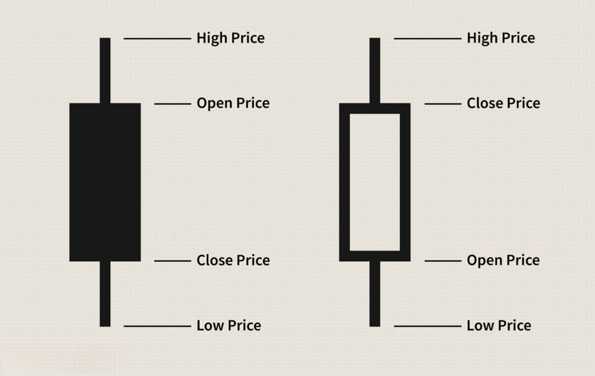

The rapid evolution of technology has significantly transformed the trading landscape, shifting from traditional methods to more automated approaches. Algorithmic trading, commonly referred to as algo trading, utilizes computer algorithms to automatically execute trades at high speeds and volumes. This form of trading capitalizes on predetermined criteria, allowing strategies to be implemented without the delay and potential error of human intervention. By leveraging these advanced computational methods, traders and financial institutions can process vast quantities of market data in real-time, identifying opportunities with precision and speed unattainable by manual trading.

While this technological advancement promises high returns and efficiency, it comes with its set of costs, both apparent and hidden. The allure of rapid trade execution and the potential to capitalize on minuscule market inefficiencies necessitates substantial investments in technology and infrastructure. These requirements introduce a range of expenses, from initial setup costs, including software and hardware procurement, to ongoing operational costs essential for maintaining and updating trading systems. Moreover, unforeseen costs such as regulatory compliance and security measures add to the complexity of managing an algorithmic trading operation.

Understanding the true cost of deploying and maintaining trade algos is crucial for traders looking to optimize profits. Without a comprehensive grasp of these financial commitments, the anticipated benefits of algorithmic trading could quickly be offset by overlooked expenditures or mismanagement. Traders must engage in a detailed analysis of these costs, weighing them against the potential financial gains to make informed decisions about their trading strategies.

This article aims to provide a comprehensive insight into the different costs associated with algo trading. By examining the multifaceted nature of these expenses, from development and operational phases to hidden risks, traders can better navigate the algorithmic trading landscape. This understanding not only aids in efficiently allocating resources but also enhances the potential for sustainable profitability in an increasingly competitive financial market.

## Table of Contents

## Understanding Algo Trading

Algorithmic trading, commonly known as algo trading, refers to the use of computer algorithms to execute trades based on pre-programmed instructions. This approach eliminates the need for manual order placement, allowing trades to be executed at speeds and volumes that are impossible for human traders to achieve. The reliance on automated systems enables precise, rapid trading decisions based on an array of market signals and data inputs.

One of the primary advantages of algorithmic trading is speed. Automated systems can process a wide range of market information and execute trades within milliseconds. This ability to act instantaneously is crucial in today's markets, where price movements occur rapidly and opportunities can dissipate in seconds. Additionally, algo trading enhances accuracy as the execution of trades is based on predefined rules, reducing the likelihood of human errors such as mistyping an order.

Algo trading also contributes to increased market efficiency by narrowing bid-ask spreads and improving [liquidity](/wiki/liquidity-risk-premium). It enables the execution of trades at optimal prices, as sophisticated algorithms analyze vast datasets to identify small, exploitable price discrepancies. Moreover, [algorithmic trading](/wiki/algorithmic-trading) mitigates the emotional and cognitive biases that often affect human traders, such as fear and overconfidence.

The prevalence of algo trading in modern markets can be attributed to advancements in technology and the increased availability of market data. With the proliferation of high-frequency trading, algorithms now account for a considerable proportion of trading [volume](/wiki/volume-trading-strategy) in major financial markets. This widespread adoption is driven by the quest for efficiency gains and competitive advantages that algo trading offers over manual trading strategies.

Traders deploy a variety of algorithms, each with its specific purpose. Statistical [arbitrage](/wiki/arbitrage) algorithms seek to exploit pricing inefficiencies across correlated securities by using historical and real-time data analytics. Momentum-based algorithms capitalize on short-term trends, buying securities that are rising and selling those that are declining, with the assumption that these trends will continue. Market-making algorithms, on the other hand, provide liquidity by continuously quoting bid and ask prices, aiming to profit from the spread.

These types encompass a wide range of specific strategies, all of which leverage the power of computing to improve trading outcomes. Algorithmic trading’s evolution continues to shape the landscape of financial markets, signaling a shift from traditional methods towards more automated, data-driven approaches.

## Types of Costs in Algo Trading

Algo trading encompasses various costs that traders must consider to ensure the sustainability and profitability of their operations. These costs can broadly be categorized into initial setup costs, operational costs, and unexpected costs. A thorough budget plan covering these factors is essential for maintaining a viable trading strategy.

**Initial Setup Costs**: This category includes the expenses involved in developing and implementing a trading algorithm. Initial setup costs cover software development, hiring skilled personnel, licensing fees for specialized trading software, and acquiring historical data for backtesting. High-performance computing infrastructure, such as servers equipped with significant processing power and low-latency capabilities, represents another crucial initial investment. This infrastructure is necessary to execute trades swiftly in response to market movements.

**Operational Costs**: Once a trading algorithm is live, there are ongoing costs that traders must manage. These operational costs include server maintenance fees, subscriptions for real-time data feeds, and co-location services to ensure minimal latency between the trader's server and the exchange. Algorithms also require regular monitoring and updates to adapt to shifting market conditions, incurring additional costs for software modifications and system upgrades. Furthermore, effective risk management systems are crucial, as they minimize potential losses and protect the trading strategy's integrity.

**Unexpected Costs**: Algo trading is not immune to unforeseen expenses, which can significantly impact profitability. These include costs associated with cybersecurity measures to safeguard sensitive data and infrastructure against breaches. Malfunctions in algorithms, leading to flash crashes or erroneous trades, can also impose substantial financial and reputational consequences. Compliance with regulatory requirements, such as reporting standards and audits, forms another unexpected cost burden that traders must be prepared to address. 

**Slippage** is another critical cost consideration in algo trading. It occurs when there is a difference between the expected price of a trade and the actual price at which it is executed. Slippage can arise from market volatility or execution delays, often due to latency issues or insufficient liquidity. Its impact can erode profit margins, necessitating strategies that account for potential slippage in the cost-benefit analysis of algorithmic strategies.

Carefully planning and budgeting for these diverse cost elements allow traders to focus on refining their algorithms and strategy execution, ensuring more sustainable and successful trading operations.

## Initial Setup Costs

Developing an effective trading algorithm involves several initial setup costs that are crucial for ensuring optimal performance and accuracy. 

### Software and Programming Expenses

Creating an algorithm that can efficiently execute trades requires specialized software and sophisticated programming skills. Costs here include licensing fees for proprietary trading platforms, which can range from a few hundred to several thousand dollars per month. Additionally, hiring skilled software developers or data scientists, who can command salaries upwards of $100,000 annually, represents a significant expense. These professionals are crucial for developing, testing, and refining algorithms to align them with trading strategies and market conditions.

### High-Performance Computing and Reliable Infrastructure

The execution of trading algorithms demands high-performance computing environments that can handle large volumes of data with minimal latency. The investment in reliable, high-speed servers and computing clusters, which can cost between $10,000 and $100,000 or more, is essential. Such infrastructure ensures that algorithms can process and react to market data in real-time, a crucial [factor](/wiki/factor-investing) in competitive trading environments. Additionally, ensuring redundancy and backup systems to prevent data loss or downtime adds to the infrastructure costs.

### Data Acquisition Costs

Access to accurate, real-time market data is indispensable for algo trading. These data feeds, which provide the necessary input for [backtesting](/wiki/backtesting) and real-time decision-making, are typically provided on a subscription basis. Depending on the asset class and depth of data required, costs can vary significantly, ranging from several hundred to several thousand dollars per month. Data providers often charge premium rates for low-latency feeds that are essential for high-frequency trading strategies.

In summary, the initial setup costs for algorithmic trading encompass a substantial investment in software development, high-performance computing infrastructure, and data acquisition. These components are foundational to the creation of robust and efficient trading algorithms capable of thriving in the high-speed world of modern trading.

## Operational Costs

Maintaining and running an algorithmic trading operation involves a series of ongoing costs that are crucial for ensuring robustness, reliability, and competitiveness in the market. These costs can be broadly categorized into server expenses, data subscriptions, regular updates, and risk management services.

Server expenses constitute a significant part of operational costs. Successful algo trading requires low-latency environments to execute trades rapidly, often within milliseconds. Traders typically invest in high-performance servers or opt for co-location services, where their trading systems are hosted in close proximity to exchange servers to minimize latency. The costs for these services can be extensive, varying based on the level of computational power and proximity to exchange infrastructure required.

Data subscriptions are vital since access to real-time market data and historical data is essential for making informed trading decisions. Fees for data subscriptions can include payments for live feeds, such as Level 1 (best bid and offer prices) or Level 2 data (full market depth). Such data not only assists in the algorithm's initial development but also plays a continuous role in strategy refinement and validation. The cost varies based on the exchanges and data providers but is non-negotiable for maintaining a competitive edge.

Regular updates and modifications to the algorithms pose another ongoing expense. As market conditions evolve, algorithms must adapt to maintain their effectiveness. This can include code enhancements, integration of new data analysis techniques, or adjusting parameters to reflect changes in market dynamics. Keeping a dedicated team of developers or quant specialists to continuously refine algorithms results in labor costs, emphasizing the necessity of skilled personnel for maintaining operational success.

Monitoring and risk management services are indispensable in algorithmic trading. Effective systems must be in place to monitor algos in real-time to detect and rectify anomalies or malfunctions immediately. These systems involve the use of specialized software and dedicated personnel, increasing operational outlay. Additionally, employing robust risk management frameworks is crucial to prevent significant financial losses, requiring sophisticated tools and strategies, which adds to the operational costs.

In conclusion, operational costs in algo trading encompass a broad range of expenses from servers and data to personnel and software, all of which are fundamental for sustaining efficient trading operations. Traders must strategically allocate resources to these areas to ensure their algorithms perform optimally in rapidly changing market environments.

## Hidden Costs and Risks

Algorithmic trading, while offering precision and efficiency, presents various hidden costs and risks that can significantly impact profitability and sustainability. Among these costs, cybersecurity measures are paramount. As algo trading systems handle sensitive financial data and execute numerous trades rapidly, they become attractive targets for cyberattacks. Implementing robust cybersecurity protocols is essential to safeguard against data breaches, unauthorized access, and potential financial losses. Encryption, regular security audits, and intrusion detection systems are fundamental components that secure trading operations but entail significant expenses.

Algorithm malfunctions pose another substantial risk. These malfunctions can result from programming errors, unexpected market events, or unanticipated interactions between multiple algorithms. Such errors may lead to erroneous trades, causing substantial financial losses. Moreover, flash crashes, sudden market price drops due to automated selling, exemplify the potential catastrophic impact of malfunctioning algorithms. Flash crashes can disrupt markets, resulting in regulatory scrutiny and loss of investor confidence, highlighting the need for comprehensive testing and monitoring systems to mitigate these risks.

Compliance and regulatory costs are increasingly relevant for algorithmic traders. Financial markets are subject to stringent regulations to ensure fair trading practices and market stability. For algo traders, compliance involves adhering to regulations concerning trade reporting, order execution, and data management, among other requirements. This necessitates investments in legal expertise and compliance frameworks, as failing to meet regulatory standards can result in hefty fines and reputational damage. As regulations evolve in response to technological advancements and market dynamics, the associated costs for maintaining compliance are likely to increase, presenting an ongoing challenge for algo traders.

## Cost-Benefit Analysis

Performing a cost-benefit analysis (CBA) of algorithmic trading strategies is essential for traders seeking to quantify the financial viability of their operations. This assessment allows traders to systematically evaluate whether the potential returns justify the associated costs and identify opportunities for optimization.

### Key Metrics and KPIs

Several metrics and key performance indicators (KPIs) are crucial in evaluating the effectiveness of trading algorithms:

1. **Return on Investment (ROI)**: ROI is the ratio of the net profit generated by the trading algorithm to the total cost incurred, calculated as:
$$
   \text{ROI} = \left(\frac{\text{Net Profit}}{\text{Total Cost}}\right) \times 100\%

$$

2. **Sharpe Ratio**: This metric helps assess the risk-adjusted return of the trading strategy, calculated by subtracting the risk-free rate from the algorithm's returns and dividing by the standard deviation of returns:
$$
   \text{Sharpe Ratio} = \frac{E[R_p - R_f]}{\sigma_p}

$$

   where $E[R_p - R_f]$ is the expected return in excess of the risk-free rate, and $\sigma_p$ is the standard deviation of the portfolio return.

3. **Alpha**: Represents the excess return of the algorithm relative to a benchmark index. A positive alpha indicates that the algorithm is performing better than the market benchmark.

4. **Cost Ratio**: This KPI measures the proportion of total trading profits consumed by costs, providing insight into how much overhead affects profitability:
$$
   \text{Cost Ratio} = \left(\frac{\text{Total Costs}}{\text{Gross Profits}}\right) \times 100\%

$$

5. **Drawdown**: Analyzes the peak-to-trough decline in the portfolio's value and is critical in understanding the risk and volatility associated with the algorithm.

### Case Studies and Examples

Successful cost management in algorithmic trading can illustrate the practical application of these metrics and KPIs:

- **Case Study: High-Frequency Trading Firm**: An anonymous high-frequency trading (HFT) firm optimized their trading algorithms by implementing machine learning models to predict market trends more accurately. By reducing latency through co-location with exchanges and optimizing their network infrastructure, the firm managed to decrease operational costs by 15%. This strategic realignment led to a 10% improvement in their ROI and enhanced profitability.

- **Example: Retail Trader Using Algorithm Optimization**: A retail trader leveraged open-source platforms to develop custom trading algorithms, avoiding high licensing fees associated with proprietary software. By carrying out a detailed cost-benefit analysis and constantly modifying algorithms in response to market changes, the trader achieved a positive alpha over the S&P 500 index and reduced their Cost Ratio to under 20%.

### Conclusion

To effectively conduct a CBA for trading algorithms, traders must continuously monitor and adapt their strategies based on these financial metrics. By harnessing the power of quantitative analysis, traders can make informed decisions that align with their risk appetite and market expectations, ensuring a balanced and profitable trading operation.

## Strategies to Minimize Costs

Minimizing costs in algorithmic trading is crucial for maintaining profitability and competitiveness. Several strategies can help traders achieve this goal efficiently, leveraging technological advancements and commercial negotiations.

Firstly, algorithm performance optimization is essential. This involves refining the algorithm to execute trades more efficiently and accurately. A well-optimized algorithm reduces execution times and minimizes slippage, which can significantly affect trading costs. Reducing data latency is also crucial. Employing techniques such as proximity hosting can lower the time it takes for data to travel between the exchange and the trader's system, thus enabling faster decision-making and execution.

Leveraging cloud computing is another effective strategy. Cloud services offer scalable resources which can be adjusted based on current needs, eliminating the need for large upfront infrastructure investments. This flexibility allows traders to pay only for what they use, significantly lowering operational costs. Integrating open-source platforms can further reduce software expenses. Open-source tools often have robust community support and can be tailored to meet specific trading needs without the licensing fees associated with proprietary software.

Negotiating with service providers can also lead to cost reductions. For instance, traders may seek better rates on data feeds, which are crucial for real-time decision-making. High-quality data at lower rates can enhance the profitability of algo trading strategies. Similarly, negotiating terms for co-location services—where a trader's systems are placed physically close to exchange servers—can result in savings. These negotiations not only potentially lower direct costs but also enhance trading efficiency by reducing latency further.

In conclusion, optimizing algorithm performance, leveraging cloud computing, utilizing open-source tools, and negotiating service agreements are practical strategies to reduce algo trading costs. Employing these strategies allows traders to maintain a competitive edge by decreasing unnecessary expenditure while still capitalizing on technological efficiencies.

## Future Trends Affecting Algo Trading Costs

As algorithmic trading continues to evolve, upcoming technological and regulatory trends are poised to reshape its cost structure. These changes are crucial for market participants to consider as they seek to remain competitive and cost-effective.

One prominent trend is the increasing integration of [artificial intelligence](/wiki/ai-artificial-intelligence) (AI) and [machine learning](/wiki/machine-learning) (ML) into algorithmic trading platforms. AI and ML algorithms can analyze vast datasets, identify patterns, and execute trades with enhanced precision and speed. This advance could reduce the need for costly manual intervention and improve decision-making accuracy, ultimately lowering operational costs. However, the initial deployment of AI and ML technologies involves substantial capital investment in data science expertise and high-performance computing infrastructure. As these technologies mature and become more accessible, traders might realize cost efficiencies in data processing and analysis.

In addition to AI, blockchain technology is emerging as a potential disruptor in trading operations. Blockchain can offer transparent and efficient settlement processes, potentially reducing back-office costs associated with clearing and reconciliation. Blockchain's decentralized nature could lead to cost savings in terms of reduced fraud risk and enhanced data security.

Regulatory trends also play a critical role in shaping costs. As global markets evolve, regulators are increasingly focusing on the implications of high-frequency and algorithmic trading. Firms may face heightened compliance and reporting requirements, necessitating investment in sophisticated risk management and surveillance systems to ensure adherence to regulations. Compliance costs could rise as firms seek advanced solutions to meet evolving regulatory frameworks.

Evolving global market conditions, such as geopolitical shifts and economic fluctuations, further complicate the cost landscape. For instance, market [volatility](/wiki/volatility-trading-strategies) can increase transaction costs due to slippage and liquidity constraints. Traders might need to invest in adaptive algorithms capable of responding to these fluctuations efficiently. Moreover, changes in interest rates, currency valuations, and trade policies could influence the pricing of cross-border trading operations, impacting overall costs.

In summary, while technological advancements like AI, ML, and blockchain hold the promise of cost reductions in data processing and transaction efficiencies, they also demand significant initial investments. Concurrently, regulatory changes and global market shifts introduce complexities that may elevate compliance and operational costs. Algorithmic traders must stay informed of these trends to strategically manage their cost structures and optimize their trading strategies.

## Conclusion

In conclusion, understanding the multi-faceted cost structure of algorithmic trading is essential for any trader aiming to maximize profitability while minimizing risks. The initial setup costs, including software development, data acquisition, and hardware investments, form the foundation of a trading operation. These initial outlays are complemented by ongoing operational expenses like server maintenance, data subscriptions, and the updates necessary to keep algorithms responsive to market dynamics.

Hidden costs, such as those associated with cybersecurity measures and regulatory compliance, further complicate the financial landscape, presenting unexpected financial burdens. Moreover, risks from algorithm malfunctions or market disruptions, like flash crashes, emphasize the need for comprehensive risk management strategies.

Traders must perform rigorous cost-benefit analyses, weighing the potential returns of their strategies against these various costs. Metrics such as return on investment (ROI) and key performance indicators (KPIs) can serve as valuable tools in assessing the efficacy of trading algorithms relative to their expenditures. Case studies of successful cost management illustrate the potential for optimization and innovation in this field.

Adopting strategies to minimize costs, such as optimizing algorithm performance, leveraging cloud technologies, and negotiating better terms with service providers, is vital in maintaining cost-effectiveness. These measures not only reduce expenses but also enhance operational efficiency and adaptability.

As the technological landscape evolves, keeping abreast of emerging trends such as artificial intelligence and machine learning is critical. These advancements can reshape the cost dynamics, offering new opportunities for efficiency and profitability. The evolving regulatory environment and global market conditions further highlight the need for continual reassessment of trading strategies.

In summary, the success of algorithmic trading hinges not only on the robustness of the algorithms but also on a nuanced understanding and management of the associated costs. By strategically navigating these financial challenges, traders can better position themselves to capitalize on the opportunities presented by this innovative trading approach.

## References & Further Reading

[1]: Bergstra, J., Bardenet, R., Bengio, Y., & Kégl, B. (2011). ["Algorithms for Hyper-Parameter Optimization."](https://proceedings.neurips.cc/paper/2011/file/86e8f7ab32cfd12577bc2619bc635690-Paper.pdf) Advances in Neural Information Processing Systems 24.

[2]: ["Advances in Financial Machine Learning"](https://www.amazon.com/Advances-Financial-Machine-Learning-Marcos/dp/1119482089) by Marcos Lopez de Prado

[3]: ["Evidence-Based Technical Analysis: Applying the Scientific Method and Statistical Inference to Trading Signals"](https://www.amazon.com/Evidence-Based-Technical-Analysis-Scientific-Statistical/dp/0470008741) by David Aronson

[4]: ["Machine Learning for Algorithmic Trading"](https://github.com/PacktPublishing/Machine-Learning-for-Algorithmic-Trading-Second-Edition) by Stefan Jansen

[5]: ["Quantitative Trading: How to Build Your Own Algorithmic Trading Business"](https://books.google.com/books/about/Quantitative_Trading.html?id=j70yEAAAQBAJ) by Ernest P. Chan