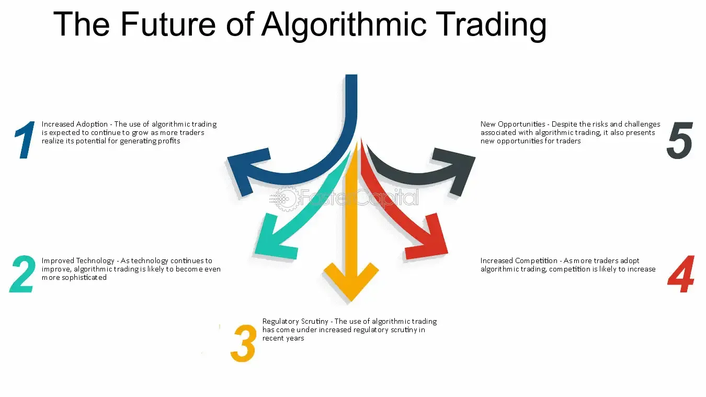

## Table of Contents

## What is algorithmic trading?

Algorithmic trading is when computers use math formulas to buy and sell things like stocks or currencies automatically. Instead of people making these decisions, a computer program follows a set of rules to decide when to trade. This can happen very quickly, often in fractions of a second, which is much faster than a human could do it.

These algorithms can look at a lot of information at once, like news, prices, and other data, to make smart trading decisions. Many big banks and trading companies use algorithmic trading because it can help them make more money and reduce the risk of losing money. However, it can also be risky if the algorithms are not set up correctly or if something unexpected happens in the market.

## How does algorithmic trading work?

Algorithmic trading works by using computer programs to buy and sell things like stocks or currencies based on a set of rules. These rules, or algorithms, are like recipes that tell the computer what to do. The computer looks at lots of information, like current prices, news, and past data, to decide when to make a trade. If the rules say the price is good, the computer will buy. If the rules say the price is too high, it might sell. All of this happens very quickly, often in less than a second.

The goal of [algorithmic trading](/wiki/algorithmic-trading) is to make money by taking advantage of small changes in prices. For example, if the computer sees that a stock's price is going up, it might buy that stock and then sell it later at a higher price. Or, if it sees that a currency's price is going down, it might sell that currency and buy it back later at a lower price. This can be done many times a day, and because the computer is so fast, it can make many small profits that add up over time.

## What are the basic strategies used in algorithmic trading?

In algorithmic trading, one common strategy is called [trend following](/wiki/trend-following). This means the computer looks at the price of something, like a stock, and tries to see if it's going up or down over time. If the price is going up, the computer might buy the stock, hoping to sell it later at a higher price. If the price is going down, the computer might sell the stock, hoping to buy it back later at a lower price. This strategy works well when the market is moving in a clear direction.

Another strategy is called mean reversion. This is based on the idea that prices don't keep going up or down forever. Instead, they tend to go back to their average price over time. So, if the price of a stock is much higher than its average, the computer might sell it, expecting the price to go back down. If the price is much lower than its average, the computer might buy it, expecting the price to go back up. This strategy can be useful when the market is not moving in a clear direction.

A third strategy is [arbitrage](/wiki/arbitrage). This involves taking advantage of small differences in prices between different markets or different forms of the same asset. For example, if the same stock is selling for a slightly different price on two different exchanges, the computer might buy it on the cheaper exchange and sell it on the more expensive one, making a small profit. This strategy relies on the computer being very fast to take advantage of these small price differences before they disappear.

## What are the advantages of using algorithmic trading?

One big advantage of using algorithmic trading is that it can make trades very quickly. Computers can look at a lot of information and make decisions in just a fraction of a second. This is much faster than a human could do it. Because they are so fast, computers can take advantage of small changes in prices that might not last long enough for a person to act on. This can lead to making more money over time by doing many small trades.

Another advantage is that algorithmic trading can help reduce the risk of making bad trades. The computer follows a set of rules, so it doesn't get influenced by emotions like fear or greed, which can lead people to make poor decisions. Also, the computer can look at a lot of data at once and make more informed decisions based on that data. This can help to make trading more consistent and less risky.

## What are the potential risks and challenges of algorithmic trading?

One big risk of algorithmic trading is that it can make big mistakes if the rules, or algorithms, are not set up right. If something goes wrong with the computer program, it might make a lot of trades that lose money. This can happen fast because the computer trades so quickly. Also, if the market changes in a way that the algorithm did not expect, it might keep making bad trades until someone stops it. This is why it's important to keep checking and updating the algorithms to make sure they are working well.

Another challenge is that algorithmic trading can make the market move in big, unexpected ways. When a lot of computers are trading at the same time, they can all react to the same news or data at once. This can cause the price of stocks or other things to go up or down very quickly. This is called a "flash crash," and it can be hard to predict or control. Traders need to be ready for these sudden changes and have plans in place to handle them.

Lastly, there's the issue of technology and security. Algorithmic trading relies on computers and the internet, which can have problems. If there's a technical glitch or a power outage, the trading might stop working, which could lead to losses. Also, because trading algorithms are valuable, they can be targets for hackers trying to steal them or mess with them. Keeping the systems safe and secure is a big challenge for people using algorithmic trading.

## How has algorithmic trading evolved over the past decade?

Over the past decade, algorithmic trading has grown a lot. It started as something only big banks and trading companies did, but now more and more people are using it. This is because technology has gotten better and cheaper. Computers are faster and can handle more data than before. Also, there are now more tools and platforms that make it easier for people to create and use their own trading algorithms. This means that even smaller traders can use algorithmic trading to try and make money.

Another big change is that the algorithms themselves have become more complex. They now use things like [machine learning](/wiki/machine-learning) and [artificial intelligence](/wiki/ai-artificial-intelligence) to make better trading decisions. These smart algorithms can learn from past data and get better over time. They can also look at more types of information, like social media and news, to help them decide when to trade. This has made algorithmic trading more powerful and able to handle more kinds of markets and situations.

## What technologies are driving advancements in algorithmic trading?

The main technology driving advancements in algorithmic trading is faster and more powerful computers. These computers can process a lot of information very quickly, which is important for making fast trading decisions. They can look at prices, news, and other data in real-time and decide when to buy or sell. This speed helps traders take advantage of small changes in the market that might not last long. Also, the internet has gotten better, which means that trading can happen more quickly and reliably.

Another important technology is machine learning and artificial intelligence. These technologies let computers learn from past data and get better at making trading decisions over time. They can find patterns in the market that might be hard for people to see. This makes the algorithms smarter and more able to handle different situations. Also, cloud computing has made it easier for traders to use these advanced technologies without needing to buy expensive equipment themselves. They can rent computing power from the cloud, which makes algorithmic trading more accessible to more people.

## How can one start with algorithmic trading as a beginner?

To start with algorithmic trading as a beginner, you first need to learn the basics. You can find a lot of free resources online, like tutorials and courses, that can teach you about stocks, trading, and how algorithms work. It's a good idea to start by practicing with a demo account, which lets you trade without using real money. This way, you can try out different strategies and see how they work without risking any money. Once you feel more comfortable, you can start using a small amount of real money to trade.

Next, you'll need to choose a platform or software to create and run your trading algorithms. There are many options available, some of which are free and some that you have to pay for. It's important to pick one that's easy to use and has good support for beginners. You can start by writing simple algorithms and then make them more complex as you learn more. It's also a good idea to join online communities or forums where you can ask questions and learn from other traders. Remember, the key is to keep learning and improving your skills over time.

## What regulatory considerations should be taken into account in algorithmic trading?

When you start algorithmic trading, it's important to know about the rules that govern it. Different countries have different rules about trading, and you need to follow them. For example, in the United States, the Securities and Exchange Commission (SEC) and the Commodity Futures Trading Commission (CFTC) set rules to make sure trading is fair and safe. They have rules about how much you can trade, how you can use data, and how you should report your trades. It's important to learn these rules and follow them to avoid getting in trouble.

Another thing to think about is that some rules are made to stop bad things from happening, like market manipulation or fraud. These rules might say that you need to keep records of your trades and be ready to show them to regulators if they ask. Also, some places have rules about using high-frequency trading, which is a type of algorithmic trading that happens very fast. You might need special permission or have to follow special rules if you want to do this kind of trading. It's a good idea to talk to a lawyer or a financial advisor to make sure you understand all the rules and are doing everything right.

## How do advanced algorithms enhance trading performance?

Advanced algorithms make trading better by using smart math to look at a lot of information quickly. They can see patterns in the market that people might miss. For example, they can use machine learning to learn from past trades and get better over time. This means they can make smarter decisions about when to buy or sell. They can also look at things like news and social media to understand what's happening in the market right now. This helps them react faster to changes and make trades that take advantage of small price movements.

These algorithms also help traders manage risk better. They can set rules to stop trading if things start going wrong, which can help prevent big losses. They can also spread out trades over time to avoid making the market move too much in one direction. This can make trading more stable and less risky. Overall, advanced algorithms help traders make more money and lose less by being smarter, faster, and more careful.

## What are the future trends and innovations expected in algorithmic trading?

In the future, algorithmic trading is expected to get even smarter and faster. One big trend is the use of more advanced artificial intelligence and machine learning. These technologies will help computers learn from more data and make even better decisions. They'll be able to understand more about what's happening in the market by looking at things like news, social media, and even weather reports. This means they can react to changes in the market even quicker and make trades that take advantage of small price movements. Another trend is the use of quantum computing, which is a new kind of computer that can solve very hard problems much faster than regular computers. This could make algorithmic trading even more powerful and able to handle more complex situations.

Another important trend is the focus on making trading safer and more fair. Regulators are working on new rules to make sure that algorithmic trading doesn't cause big problems in the market. They want to stop things like flash crashes, where the market moves a lot very quickly. Traders are also working on new ways to manage risk and make sure their algorithms are working correctly. This includes using more advanced testing and monitoring tools to catch any problems before they cause trouble. Overall, the future of algorithmic trading looks like it will be about making trades smarter, faster, and safer.

## How can algorithmic trading be integrated with other financial technologies for better results?

Algorithmic trading can work better when it's used with other financial technologies. One way is by using it with robo-advisors, which are computer programs that help people invest their money. Robo-advisors can use algorithms to pick the best investments for someone based on their goals and how much risk they want to take. By combining algorithmic trading with robo-advisors, the computer can not only pick the right investments but also trade them at the best times to make more money. This makes investing easier and potentially more profitable for people.

Another way to make algorithmic trading better is by using it with blockchain technology. Blockchain is a way of keeping records that is very secure and can't be changed easily. When used with algorithmic trading, blockchain can help make trades more transparent and safe. It can also help with something called smart contracts, which are agreements that automatically do things when certain conditions are met. By using blockchain and smart contracts with algorithmic trading, traders can make sure their trades happen exactly as they want them to, without worrying about fraud or mistakes. This can make trading faster and more reliable.

## References & Further Reading

[1]: Bergstra, J., Bardenet, R., Bengio, Y., & Kégl, B. (2011). ["Algorithms for Hyper-Parameter Optimization."](https://papers.nips.cc/paper_files/paper/2011/hash/86e8f7ab32cfd12577bc2619bc635690-Abstract.html) Advances in Neural Information Processing Systems 24.

[2]: ["Advances in Financial Machine Learning"](https://www.amazon.com/Advances-Financial-Machine-Learning-Marcos/dp/1119482089) by Marcos Lopez de Prado

[3]: ["Evidence-Based Technical Analysis: Applying the Scientific Method and Statistical Inference to Trading Signals"](https://www.wiley.com/en-gb/Evidence+Based+Technical+Analysis:+Applying+the+Scientific+Method+and+Statistical+Inference+to+Trading+Signals-p-9780470008744) by David Aronson

[4]: ["Machine Learning for Algorithmic Trading"](https://www.amazon.com/Machine-Learning-Algorithmic-Trading-intelligence/dp/9918608013) by Stefan Jansen

[5]: ["Quantitative Trading: How to Build Your Own Algorithmic Trading Business"](https://www.amazon.com/Quantitative-Trading-Build-Algorithmic-Business/dp/0470284889) by Ernest P. Chan