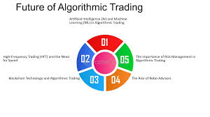

Algorithmic trading has emerged as a pivotal component in the modern financial markets, marking a transformative shift from traditional trading methods to those driven by advanced technology. At its core, algorithmic trading involves using computer algorithms to automatically execute trades, capitalizing on speed and efficiency. This form of trading has grown substantially, largely due to its ability to process large volumes of data and execute orders at lightning speed, outperforming human capabilities and minimizing errors associated with manual trading practices.



The roots of algorithmic trading can be traced back to the development of electronic communication networks in the late 20th century, which facilitated faster trade execution and smaller transaction costs. Over time, with advancements in technology, algorithmic trading has evolved from simple rule-based systems to complex, adaptive strategies incorporating machine learning and artificial intelligence. These technological advancements have not only enhanced the precision and speed of trade execution but have also allowed traders to devise sophisticated strategies capable of evaluating multiple variables and adapting to dynamic market conditions.

As we look to the future, the promise of algorithmic trading continues to expand. The continuous integration of cutting-edge technologies like AI and blockchain holds the potential to revolutionize trading practices further. Such technologies can enhance the ability of trading systems to predict market movements and respond to them with heightened accuracy and speed. This raises the pivotal question: How promising is algorithmic trading as we move forward? In the forthcoming sections, we will explore various facets of algorithmic trading, from its current trends and benefits to the challenges it faces, and predict its future trajectory in the global financial markets.


## Table of Contents

## What is Algorithmic Trading?

Algorithmic trading refers to the use of computer algorithms to execute trading orders efficiently and systematically. This form of trading involves pre-programmed instructions accounting for timing, price, and [volume](/wiki/volume-trading-strategy), enabling traders to execute orders swiftly with minimal human intervention.

There are several types of [algorithmic trading](/wiki/algorithmic-trading) strategies, each tailored to leverage specific market conditions. High-Frequency Trading ([HFT](/wiki/high-frequency-trading-strategies)) is one type that focuses on the rapid execution of multitude trades, often within fractions of a second, capitalizing on small price discrepancies. Its success hinges on speed, as the slightest delay can negate any advantage. On the other hand, [quantitative trading](/wiki/quantitative-trading) involves mathematical models and statistical analysis to identify trading opportunities. These strategies are based on large datasets and rely heavily on pattern recognition and predictive analytics, allowing traders to make informed decisions based on historical performance.

At the core of algorithmic trading are algorithms and computer programs that automate the execution of trades. These algorithms continuously monitor market conditions and execute trades when predefined criteria are met. By leveraging complex mathematical models and vast computing power, algorithms can parse through massive amounts of data in seconds, making split-second decisions that would be impossible for humans to match manually. This level of automation not only enhances the speed and accuracy of trade execution but also eliminates the emotional biases that often influence human judgment.

Overall, algorithmic trading represents a significant evolution in trading practices, combining the precision of computing with sophisticated financial models to navigate increasingly complex markets effectively.


## Current Trends in Algorithmic Trading

Algorithmic trading has been at the forefront of innovation within financial markets, continually evolving through significant technological advancements. Recent trends indicate a profound transformation, primarily driven by the increasing adoption among both institutional and retail investors, as well as the integration of machine l[earning](/wiki/earning-announcement) and [artificial intelligence](/wiki/ai-artificial-intelligence) to create more sophisticated trading algorithms.

Recent advancements are reshaping the trading landscape by enhancing efficiency, precision, and speed. The rise in popularity among institutional investors is evident as they leverage algorithmic trading to execute large volume trades with minimal market impact. Firms such as Renaissance Technologies and D.E. Shaw have set benchmarks by using quantitative strategies that rely heavily on algorithms. Similarly, retail investors are increasingly using algorithmic platforms, allowing individuals greater access to complex trading strategies that were once exclusive to large financial institutions. This democratization of trading tools has sparked a surge in trading volume and participation rates across various markets.

A significant impact on algorithmic trading arises from the incorporation of [machine learning](/wiki/machine-learning) (ML) and artificial intelligence (AI). These technologies facilitate the development of more sophisticated trading algorithms that can analyze vast datasets, recognize patterns, and make split-second decisions that conventional human analysis cannot match. Machine learning models can adapt to ever-changing market conditions by continuously learning and updating themselves on new data, providing a competitive edge.

For instance, the integration of natural language processing (NLP) enables algorithms to analyze news headlines and social media sentiment in real time, influencing trading decisions based on public perception. Reinforcement learning, a branch of machine learning, is also being applied to train algorithms that learn optimal trading strategies through trial and error, continuously improving their performance over time.

The impact of these technologies has also fostered the development of algorithmic trading platforms featuring advanced analytics and automated trading capabilities, making it easier for traders to build, backtest, and deploy trading algorithms. These platforms not only support various trading strategies but also allow users to fine-tune algorithms based on historical performance data and predictive analytics.

In summary, the current trends in algorithmic trading highlight a pivotal shift driven by technological advancements and an expanding user base. With machine learning and AI playing a vital role, trading algorithms are evolving to capitalize on market opportunities with unprecedented efficiency and accuracy. As these technologies further unfold, they hold immense potential to transform the financial markets, providing even more innovative solutions and opportunities.


## Benefits of Algorithmic Trading

Algorithmic trading has revolutionized the financial markets, primarily through its ability to execute trades with remarkable speed and efficiency. By leveraging computer algorithms, trades are executed in fractions of a second, much faster than any human could achieve. This speed not only allows traders to capitalize on fleeting market opportunities but also contributes to increased market [liquidity](/wiki/liquidity-risk-premium) and tighter spreads. For instance, high-frequency trading firms use sophisticated algorithms to execute millions of orders in a blink, often making profits from small price discrepancies across different exchanges.

Another crucial benefit of algorithmic trading is the substantial reduction of human error and emotional decision-making. Human traders are prone to biases and emotional responses, which can lead to suboptimal decision-making, especially in volatile market conditions. Algorithms, on the other hand, operate based on pre-defined criteria and are unaffected by emotions or fatigue. This objectivity results in more consistent and disciplined trading approaches that can lead to more reliable performance over time.

Additionally, algorithmic trading offers an enhanced ability to backtest and optimize trading strategies. By simulating a trading strategy using historical market data, traders can assess its viability before risking actual capital. This process of [backtesting](/wiki/backtesting) involves statistical analysis, which can help refine strategies to improve their effectiveness. Furthermore, optimization can be carried out to adjust parameters of the trading algorithms to maximize their expected returns and minimize risk. Tools such as Monte Carlo simulations and optimization algorithms are frequently employed to ensure strategies are robust under different market conditions. For example, Python libraries like NumPy and pandas can be used to conduct such analyses efficiently, as shown below:

```python
import numpy as np
import pandas as pd

# Simulating a simple moving average crossover backtest
def moving_average_crossover(data, short_window, long_window):
    signals = pd.DataFrame(index=data.index)
    signals['price'] = data['price']
    signals['short_mavg'] = data['price'].rolling(window=short_window).mean()
    signals['long_mavg'] = data['price'].rolling(window=long_window).mean()
    signals['signal'] = 0.0
    signals['signal'][short_window:] = np.where(
        signals['short_mavg'][short_window:] > signals['long_mavg'][short_window:], 1.0, 0.0
    )
    signals['positions'] = signals['signal'].diff()
    return signals

# Example usage
historical_data = pd.DataFrame({
    'price': [100, 102, 104, 103, 105, 110, 115, 120, 125, 128]
}, index=pd.date_range(start='2023-01-01', periods=10))

signals = moving_average_crossover(historical_data, short_window=2, long_window=4)
print(signals)
```

This code exemplifies how quantitative traders can create and test strategies using historical price data, thereby optimizing their trading algorithms for future success. Through such backtesting and optimization, traders gain confidence in their models' performance and are better equipped to adapt to evolving market dynamics.


## Challenges and Risks Associated with Algorithmic Trading

Algorithmic trading, while offering numerous advantages, also presents several challenges and risks that participants must navigate. Understanding these [factor](/wiki/factor-investing)s is crucial for effectively implementing algorithmic strategies in financial markets.

**Technological and Operational Risks**

One primary concern in algorithmic trading is the risk of technological and operational failures. The reliance on sophisticated software and real-time data makes algorithmic systems vulnerable to glitches and malfunctions. These issues can stem from hardware problems, network disruptions, or bugs in the code. For instance, a system failure during a critical trading period can lead to substantial financial losses or missed opportunities. To mitigate these risks, robust IT infrastructure and rigorous testing protocols are essential. Firms often employ redundancy systems to ensure trading continuity even if some components fail.

**Market Risks: Volatility and Liquidity Concerns**

Algorithmic trading strategies must contend with inherent market risks such as [volatility](/wiki/volatility-trading-strategies) and liquidity. During periods of high market volatility, prices can fluctuate rapidly, sometimes resulting in slippage, where the executed price deviates from the expected entry or [exit](/wiki/exit-strategy) level. This unpredictability can adversely impact algorithmic models, especially those designed under the assumption of stable market conditions. Additionally, liquidity risk is prevalent when trading large volumes of assets; insufficient liquidity can exacerbate price impacts, diminishing the effectiveness of the strategy. Ensuring strategies account for these variables is crucial. Techniques like volatility-adjusted indicators or staggered order execution can help minimize the adverse effects of these market conditions.

**Regulatory Challenges and Compliance**

Regulatory challenges pose another significant risk to algorithmic trading. As these strategies have proliferated, global regulatory bodies have introduced rules to ensure market fairness and stability. Complying with these regulations requires firms to implement precise monitoring and reporting systems, which can be resource-intensive. Non-compliance may result in fines or sanctions, adding financial and reputational risk. Moreover, regulations can vary significantly across jurisdictions, complicating multi-market strategies and necessitating comprehensive legal oversight. Investors and trading firms need to stay informed about regulatory changes and ensure their systems are agile enough to adapt without compromising performance.

Addressing these challenges involves a combination of technological safeguards, strategic market considerations, and meticulous compliance efforts. While the risks associated with algorithmic trading are non-negligible, they can be managed with diligence and foresight to harness the full potential of algorithmic strategies.


## The Future of Algorithmic Trading

The future of algorithmic trading holds significant potential, driven by advancements in technology and expanding market interest. Forecasts suggest continued robust growth in the algorithmic trading market, bolstered by increased participation from both institutional and retail investors. A report by MarketsandMarkets estimates that the algorithmic trading market is expected to grow from USD 11.1 billion in 2019 to USD 18.8 billion by 2024, at a compound annual growth rate (CAGR) of 11.1%[^1^].

Emerging technologies, particularly blockchain, are poised to revolutionize algorithmic trading. Blockchain technology offers traceability, transparency, and enhanced security, which are critical in maintaining the integrity of financial transactions. By leveraging smart contracts on blockchain, trades can be executed automatically when predetermined conditions are met, thereby increasing efficiency and reducing the potential for human error. Furthermore, blockchain's decentralized nature can mitigate risks associated with single points of failure, offering a more resilient trading infrastructure.

Artificial Intelligence (AI) and Machine Learning (ML) are expected to further refine trading algorithms. These technologies enable the processing of vast amounts of data far beyond human capability, identifying trends and patterns that can inform better trading decisions. For example, AI algorithms can analyze social media sentiment, economic indicators, and other non-traditional data sources to predict market movements more accurately.

As algorithmic trading becomes more sophisticated, its adoption across various asset classes is likely to expand. Beyond equities and foreign exchange, where algorithmic trading is already prevalent, there is growing interest in applying these strategies to commodities, cryptocurrencies, and other financial instruments. This broadening scope enables traders to diversify portfolios and hedge against risks across different markets.

In conclusion, the future landscape of algorithmic trading is promising, characterized by technological innovations and greater market penetration. As these trends continue, algorithmic trading is expected to play an increasingly vital role in the global financial ecosystem, offering enhanced efficiency, transparency, and profitability.

[^1^]: [MarketsandMarkets](https://www.marketsandmarkets.com/Market-Reports/algorithmic-trading-market-251304201.html)


## Conclusion

Algorithmic trading has become an integral part of the modern financial ecosystem, offering numerous advantages that enhance trading efficiency and precision. As discussed, its ability to execute trades at lightning speed reduces transaction costs and minimizes the influence of human emotion, enabling traders to make decisions based on robust data analytics. Furthermore, the capacity to backtest and optimize strategies continually provides a competitive edge that manual trading can scarcely match.

Nevertheless, the journey of algorithmic trading is not devoid of challenges. Technological and operational risks, such as system failures, remain a significant concern. Markets can be unpredictable, with volatility and liquidity presenting substantial risks. Additionally, regulatory scrutiny and the need for compliance continue to shape the operational landscape for traders employing algorithms.

The future of algorithmic trading is indeed promising, as advancements in artificial intelligence and machine learning continue to pave the way for more sophisticated trading strategies. Emerging technologies like blockchain hold the potential to revolutionize how trades are recorded and verified, adding a layer of security and transparency to the process. As the adoption of algorithmic trading expands across different asset classes, its influence on global markets is set to grow, fostering better market efficiency and liquidity.

In summary, while algorithmic trading presents a powerful set of tools that can significantly benefit financial markets, it is essential to remain cognizant of the inherent risks. Striking a balance between leveraging technology and managing potential pitfalls will determine its success and sustainability. As we look towards the future, staying informed and adaptable to technological advancements will be crucial in harnessing the full potential of algorithmic trading.


## Call to Action

Staying updated on the newest trends and developments in algorithmic trading is crucial for anyone involved in financial markets. The rapidly evolving nature of this field means there's always something new to learn, whether it's a breakthrough in machine learning algorithms or regulatory changes. To stay informed, consider subscribing to reputable newsletters that focus on algorithmic trading. They often provide insights from expert analysts and up-to-date market news. Following industry experts and thought leaders on platforms like LinkedIn and Twitter can also offer real-time updates and expert opinions.

Engagement is key to deepening your understanding, so don't hesitate to leave comments or share your thoughts on the content you read. Engaging with the community through social media platforms can spark discussions and offer new perspectives on algorithmic trading. Remember, the exchange of ideas can significantly enhance your learning journey and keep you at the forefront of industry developments.


## References & Further Reading

[1]: Bergstra, J., Bardenet, R., Bengio, Y., & Kégl, B. (2011). ["Algorithms for Hyper-Parameter Optimization."](https://papers.nips.cc/paper_files/paper/2011/hash/86e8f7ab32cfd12577bc2619bc635690-Abstract.html) Advances in Neural Information Processing Systems 24.

[2]: ["Advances in Financial Machine Learning"](https://www.amazon.com/Advances-Financial-Machine-Learning-Marcos/dp/1119482089) by Marcos Lopez de Prado

[3]: ["Evidence-Based Technical Analysis: Applying the Scientific Method and Statistical Inference to Trading Signals"](https://www.wiley.com/en-gb/Evidence+Based+Technical+Analysis:+Applying+the+Scientific+Method+and+Statistical+Inference+to+Trading+Signals-p-9780470008744) by David Aronson

[4]: ["Machine Learning for Algorithmic Trading"](https://www.amazon.com/Machine-Learning-Algorithmic-Trading-intelligence/dp/9918608013) by Stefan Jansen

[5]: ["Quantitative Trading: How to Build Your Own Algorithmic Trading Business"](https://www.amazon.com/Quantitative-Trading-Build-Algorithmic-Business/dp/0470284889) by Ernest P. Chan