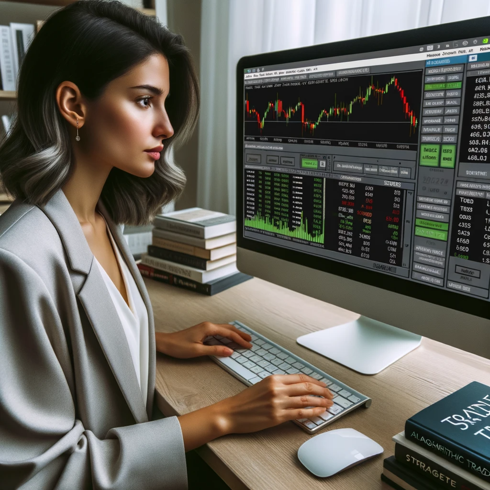

In the financial markets, the landscape of trading has undergone a transformative shift over the past few decades. From the days of floor trading and manually executed transactions, we've transitioned into an era dominated by algorithmic and high-frequency trading (HFT). Algorithms now execute a substantial fraction of global trading volumes, making decisions in milliseconds based on complex mathematical models. HFT, a subset of algorithmic trading, is characterized by holding positions for extremely short durations, sometimes mere seconds, executing thousands of trades in a single day. The prominence of these technologies has made the world of trading incredibly dynamic and competitive, with vast amounts of capital moved every split second.

With this evolution comes an amplified demand for robust, data-driven trading strategies. In such a high-speed, high-stakes environment, relying on intuition or outdated models can be catastrophic. This is where the role of backtesting becomes paramount. Backtesting is the practice of testing a trading strategy against historical data to validate its efficacy before deploying it in live markets. By analyzing how a strategy would have performed in the past, traders gain insights into its potential risks and rewards. Such rigorous testing ensures that a trading algorithm is not just a mathematical marvel but is practically poised for success in the real-world markets. It's akin to a flight simulator for pilots, allowing them to experience and prepare for various scenarios without any real-world risks.


## Table of Contents

## What is Backtesting?

Backtesting is a rigorous method employed by traders and financial analysts to evaluate the viability of a trading strategy or investment model by applying it to historical data. Essentially, it answers the hypothetical question: "If I had applied this strategy in the past, how would it have performed?" By simulating trades based on past data, backtesting offers a quantitative framework for assessing a strategy's potential profitability, associated risks, and weaknesses before deploying capital in real-time markets.



Its relevance and necessity cannot be overstated. In the high-stakes realm of financial markets, decisions are often made based on projections and forecasts. However, forecasting is inherently fraught with uncertainty. Backtesting acts as a mitigating measure, offering a data-driven approach to validate or invalidate assumptions. It's the bridge between theoretical strategy and practical application, ensuring traders don't enter the market flying blind.

The roots of backtesting trace back to the early days of stock markets, albeit in a more rudimentary form. Initially, traders would manually sift through historical price charts to identify patterns and test their observations. With the dawn of computers in the 1960s and 1970s, the process began to be automated, leading to more complex and granular tests. The 1980s and 1990s saw the rise of statistical software and electronic trading platforms, allowing for sophisticated algorithmic strategies and quantitative models to be tested over vast datasets.

However, it was the explosion of computing power and data availability in the 21st century that truly revolutionized backtesting. Today, strategies can be tested over decades of data, across multiple markets, factoring in various external conditions, all within mere minutes.

## The Significance of Backtesting

The significance of backtests can be dissected into various facets, each underscoring the value it brings to the table for both novice and veteran traders.

**Risk Mitigation**

While no tool can eliminate risk entirely, backtesting helps in quantifying and understanding it. By applying a strategy to historical data, traders can observe potential drawdowns, volatility, and other risk metrics. This knowledge allows them to adjust their strategy, set appropriate stop-loss orders, and determine position sizes that align with their risk tolerance.

**Strategy Validation**

Ideas are plenty, but not all shine in the crucible of the market. Backtesting is the crucible. By simulating how a strategy would have performed in the past, traders gain empirical evidence of its effectiveness. A strategy that consistently performs well across different time periods and market conditions is more likely to be robust, whereas inconsistent results may indicate overfitting or other issues[1].

**Performance Forecasting**

While past performance is no guarantee of future results, a well-backtested strategy provides a reasonable expectation. For instance, a strategy that historically yielded an average of 10% annual returns with a 15% standard deviation gives a trader a ballpark of what might be anticipated, facilitating better financial planning and goal setting.

**Psychological Preparedness for Traders**

Trading is as much a mental game as it is a financial one. Backtesting reinforces confidence in a strategy. When traders witness their strategies succeeding (and sometimes failing) in a simulated environment, they're better equipped to stick to their plans in real-time trading, resisting the urge to make impulsive decisions based on emotions like fear or greed.

In essence, backtesting serves as a compass in the vast and tumultuous ocean of trading. It provides direction, assurance, and a framework within which traders can operate, making it an indispensable tool in the quest for consistent market success.

## Key Components Required for Backtesting

Backtesting is more than just running numbers; it demands a meticulous blend of quality data, robust hardware and software, and seasoned human judgment. A slight compromise on any of these components can significantly skew the results, potentially leading to misinformed trading decisions.

**Data Integrity**

The phrase "garbage in, garbage out" stands true, especially in the realm of backtesting. High-quality, granular data is the bedrock of any reliable backtest. Without accurate historical data, the entire premise of backtesting crumbles. This means prioritizing datasets that offer detailed timestamps, accurate price and volume information, and adjustments for stock splits or dividends. Moreover, granularity matters – daily data might suffice for long-term strategies, but high-frequency trading demands tick-by-tick data. However, it's not just about the quality; quantity also plays a role. The more data one has, the more comprehensive the backtest becomes, covering various market cycles and events.

**Hardware and Software Considerations**

The computational power required for backtesting can vary significantly based on the complexity of the strategy and the granularity of the data. Simple strategies tested over daily data might be adequately backtested using Excel[2]. However, sophisticated strategies, especially those involving high-frequency trading, demand high-end computational resources, sometimes even cloud-based simulations, to ensure timely processing of vast data volumes. On the software front, tools range from platform-specific software like MetaTrader for forex trading to programming languages like Python, which offers flexibility and can be integrated with powerful backtesting libraries[3].

**Human Oversight**

A backtest's output isn't a straightforward "success" or "failure" verdict; it's a trove of data points and metrics. Interpreting these results requires experience and intuition. For instance, a strategy showing high returns might still be risky if it shows significant drawdowns or isn't consistent across different market phases. Human oversight helps in discerning such nuances, understanding the context behind numbers, and making informed tweaks to the strategy. It's the combination of machine precision and human wisdom that crafts a robust and dependable trading strategy.

<aside>
💡 Here are the most common simulation tools:

#### Backtest

Backtesting is simulating a strategy on historic data and looking at the PnL curve at the end. Basically you run the strategy like normal, but the data comes from a historical file and time goes as fast as the computer can process.

#### Event Study

In an event study, you find all the points in time that you have a signal and then average the proceeding and preceding return paths. This shows you on average what happens before and after. You can see how alpha accumulates over time and if there is information leakage before the event.

#### Correlation

The correlation of a signal with future returns is a quick measure of how accuately it predicts. It is better than a backtest when you need just a single number to compare strategies, such as for plotting an information horizon. You can configure a lagged correlation test in Excel in under a minute. However it doesn’t take into account transaction costs, and it doesn’t output trading-relevant metrics like Sharpe ratio or drawdown.

The information horizon diagram was published in Grinold and Kahn’s Active Portfolio Management. It is a principled way of determining how long to hold positions.

#### Paper Trading

Paper trading refers to trading a strategy through your broker’s API, but using a demo account with fake money. It’s good because you can see that the API works, and see if it crashes or if there are data errors. And it also gives you a better feel for the number of trades it will make and how it will feel emotionally. However it takes a long time since you have to wait for the markets. It is more practical for high frequency systems which can generate a statistically significant number of data points in a short amount of time.

</aside>

| Test | Run Time | Setup Time | Completeness | Good For |
| --- | --- | --- | --- | --- |
| Backtest | Long | Long | Good | Everything |
| Event Study | Medium | Medium | Good | News |
| Correlation | Fast | Fast | Bad | Prototyping |
| Paper Trading | Live | None | Good | Production Testing |

## Step-by-Step Guide to Backtesting

The backbone of effective backtesting begins with a well-defined trading strategy. You might have the most sophisticated backtesting tools at your disposal, but without a comprehensive and clear strategy, the results might not only be meaningless but could also lead to potential losses.

### Strategy Definition

1. **Objective Setting**: Determine the primary goal of your trading strategy. Are you looking for consistent small gains, or are you more risk-tolerant aiming for larger returns, albeit with potentially larger drawdowns? Knowing what you aim to achieve will guide the subsequent steps.
2. **Selection of Asset and Time Frame**: Depending on your risk appetite and market familiarity, decide on the asset or group of assets you intend to trade. Moreover, choose the timeframe for your strategy, whether it's intraday, daily, or long-term. This will inform the type of data you'll need for backtesting.
3. **Indicator and Criteria Selection**: Whether you're relying on fundamental factors like earnings or technical indicators like moving averages, clearly define them. For instance, if using the moving average crossover method, specify the short and long periods you wish to use.
4. **Entry and Exit Rules**: These rules determine when you'll enter a trade and when you'll exit, either to take profits or cut losses. For example, if you decide to enter a trade when the price of an asset rises above its 50-day moving average and exit when it falls below, these conditions must be clearly stipulated.
5. **Risk Management Protocols**: Decide upfront how much of your portfolio you'll risk on each trade. Setting stop-loss and take-profit levels is essential. These not only help to protect your capital but also provide clarity when evaluating the backtest results.
6. **Possible Adjustments**: Anticipate scenarios where you might need to modify your strategy. For instance, in case of significant geopolitical events or central bank announcements, you might want to sidestep your usual trading rules.
7. **Documentation**: While this might sound mundane, maintaining a clear record of your strategy's rules is crucial. As you proceed with backtesting, you'll likely revisit and tweak these rules based on results. Documenting each version ensures clarity and avoids confusion.

It's imperative to understand that strategy definition isn't a one-time task. As you immerse deeper into backtesting, insights gathered might lead you back to this stage to refine your approach. The key is to maintain clarity and consistency in rules, ensuring that every decision, change, or adjustment is rooted in logic and sound reasoning[^13^].

### Data Collection

Acquiring accurate and comprehensive data is the foundation of backtesting. After all, the effectiveness of a strategy is gauged by how it performs against historical data. Thus, ensuring the data's quality is paramount. Here's a structured approach to data collection:

1. **Source Selection**: Opt for [reputable data providers](https://github.com/edarchimbaud/awesome-systematic-trading#data-sources) that are well-regarded in the industry. Platforms like [Bloomberg](https://www.bloomberg.com/), [Reuters](https://www.reuters.com/), and [Quandl](https://demo.quandl.com/) offer extensive datasets covering multiple assets across various timeframes.
2. **Data Granularity**: Choose data granularity based on your strategy's requirements. While long-term strategies might be content with daily closing prices, intraday strategies might demand tick-by-tick data or data at a minute's granularity.
3. **Historical Depth**: It's crucial to obtain data that spans several market cycles – bull markets, bear markets, periods of high volatility, and times of market calm. This ensures a robust backtest across different market conditions.
4. **Dividends, Splits, and Corporate Actions**: If you're backtesting equities, ensure your dataset accounts for dividends, stock splits, and other corporate actions, as these can materially impact stock prices.
5. **Verify Data Integrity**: Cross-reference your dataset with another reputable source. This helps identify and rectify any discrepancies, missing values, or outliers.
6. **Avoiding Survivorship Bias**: It's a common pitfall where only assets that have 'survived' till the present day are considered, ignoring those that might have failed during the backtest period. Ensure your data source includes delisted or bankrupt entities if backtesting on equities.
7. **Consider Costs**: While free sources like Yahoo Finance can provide a wealth of information, they might lack the granularity, breadth, or adjustments professional traders seek. Sometimes, it's worth investing in premium data sources to ensure the highest quality.
8. **Storing and Organizing Data**: Efficiently storing your data can save time in the long run. Consider [databases](https://github.com/edarchimbaud/awesome-systematic-trading#databases) like SQL for structured data and ensure your storage solution aligns with your backtesting tool's requirements.
9. **Regular Updates**: Market data is continually evolving. Regularly update your datasets to incorporate recent data, ensuring your strategy remains relevant and tested against the latest market conditions.

Remember, data quality can make or break the validity of your backtest. Taking the time to meticulously select, verify, and organize your data ensures that your backtest results are rooted in accuracy, setting a robust foundation for future strategy deployments.

<aside>
💡 Here are the most common types of bar data:

#### Time bars

Periodic “bar” data is the easiest to get. Is sampled at regular intervals (minutely, hourly, daily, weekly) and looks like this:

```
Date,Open,High,Low,Close,Volume
11-May-09,33.78,34.72,33.68,34.35,142775884
12-May-09,34.42,34.48,33.52,33.93,147842117
13-May-09,33.63,33.65,32.96,33.02,175548207
14-May-09,33.10,33.70,33.08,33.39,140021617
15-May-09,33.36,33.82,33.23,33.37,121326308
18-May-09,33.59,34.28,33.39,34.24,114333401
19-May-09,34.14,34.74,33.95,34.40,129086394
20-May-09,34.54,35.04,34.18,34.28,131873676
21-May-09,34.02,34.26,33.31,33.65,139253125

```

“Quote” data shows the best bid and offer:

```
SYMBOL,DATE,TIME,BID,OFR,BIDSIZ,OFRSIZ
QQQQ,20080509,9:36:26,47.94,47.95,931,964
QQQQ,20080509,9:36:26,47.94,47.95,931,949
QQQQ,20080509,9:36:26,47.94,47.95,485,616
QQQQ,20080509,9:36:26,47.94,47.95,485,566
QQQQ,20080509,9:36:26,47.94,47.95,485,576
QQQQ,20080509,9:36:26,47.94,47.95,931,944
QQQQ,20080509,9:36:26,47.94,47.95,849,944
QQQQ,20080509,9:36:26,47.94,47.95,837,944
QQQQ,20080509,9:36:26,47.94,47.95,837,956

```

#### Tick bars

“Tick” or “trade” data shows the most recent trades:

```
SYMBOL,DATE,TIME,PRICE,SIZE
QQQQ,20080509,8:01:29,47.97,1000
QQQQ,20080509,8:01:56,47.97,500
QQQQ,20080509,8:01:56,47.97,237
QQQQ,20080509,8:02:20,47.98,160
QQQQ,20080509,8:02:50,47.98,100
QQQQ,20080509,8:02:50,47.98,200
QQQQ,20080509,8:02:50,47.98,1700
QQQQ,20080509,8:02:50,47.98,500
QQQQ,20080509,8:02:53,47.98,100

```

“Order book” data shows every order submitted and canceled. If you do not know what it looks like, then odds are you do not have the resources to be fast enough to trade on it, so do not worry about it.

#### Volume bars

Volume bars circumvent that problem by sampling every time a pre-defined amount of the security’s units (shares, futures contracts, etc.) have been exchanged. For example, we could sample prices every time a futures contract exchanges 1,000 units, regardless of the number of ticks involved.

Tick bars can introduce arbitrariness in the number of ticks and order fragmentation, while volume bars sample every time a pre-defined amount of the security's units have been exchanged, resulting in better statistical properties and providing a convenient artifact for analyzing the interaction between prices and volume in market microstructure theories.

#### Dollar bars

Dollar bars are formed by sampling an observation every time a pre-defined market value is exchanged, which is more reasonable than sampling by tick or volume when the analysis involves significant price fluctuations. The number of outstanding shares often changes multiple times over the course of a security’s life, as a result of corporate actions, and dollar bars tend to be robust in the face of those actions. Thus, dollar bars are more interesting than time, tick, or volume bars.

#### Tick Imbalance Bars

The tick rule defines a sequence of tick imbalances in a given sequence of ticks, where the imbalance is defined as the accumulation of signed ticks exceeding a given threshold. Tick imbalance bars (TIBs) are then defined as T-contiguous subsets of ticks that meet a certain condition. TIBs are more likely to occur when there is informed trading and can be thought of as containing equal amounts of information.

#### Volume/Dollar Imbalance Bars

The concept of tick imbalance bars (TIBs) is extended to volume imbalance bars (VIBs) and dollar imbalance bars (DIBs) to sample bars when volume or dollar imbalances diverge from expectations. The procedure to determine the index of the next sample involves computing the expected value of the imbalance at the beginning of the bar and defining VIB or DIB as a T-contiguous subset of ticks such that the expected imbalance exceeds a given threshold. The bar size is adjusted dynamically, making it more robust to corporate actions.

#### Tick Runs Bars

TIBs, VIBs, and DIBs are methods to monitor order flow imbalance in terms of ticks, volumes, and dollar values exchanged. Tick runs bars (TRBs) measure the sequence of buys in the overall volume and take samples when that sequence diverges from our expectations. TRBs count the number of ticks of each side without offsetting them and are useful in forming bars. The expected value of the current run can be estimated using exponentially weighted moving averages.

#### Volume/Dollar Runs Bars

Volume runs bars (VRBs) and dollar runs bars (DRBs) are based on the same concept as tick runs bars (TRBs), but they monitor volume or dollar imbalances instead of tick imbalances. The procedure to determine the index T of the last observation in the bar is similar to TRBs, and it involves defining the volumes or dollars associated with a run, and defining a VRB or DRB as a T-contiguous subset of ticks such that the expected volume or dollar from runs exceeds our expectation for a bar.

</aside>

### Strategy Execution

Executing your strategy on historical data is the crux of backtesting. It's where your well-defined trading rules meet the intricate patterns of the past, revealing how the strategy would have performed. Here's a systematic approach to this process:

1. **Environment Setup**: Choose a backtesting environment that aligns with your strategy complexity. For simple strategies, platforms like Excel can suffice. However, for intricate algorithmic models, specialized software like MetaTrader or Python-based tools such as Backtrader are more appropriate.
2. **Initial Conditions**: Set the starting conditions for your backtest. This includes parameters like starting capital, leverage (if used), and transaction costs. These conditions should mirror realistic trading scenarios.
3. **Data Integration**: Incorporate your collected data into the chosen platform. Ensure it's in the right format and granularity. Adjust for splits, dividends, and other corporate actions to ensure accurate pricing.
4. **Implement Strategy Rules**: Translate your strategy rules into executable code or platform-specific directives. Ensure that all conditions, triggers, and exit rules are accounted for. For algorithmic models, this would involve coding the algorithm, while in platforms like MetaTrader, it might involve setting specific conditions for trade execution.
5. **Run the Backtest**: Initiate the simulation. Your strategy will execute trades based on its rules, applied to the historical data. Depending on the span of data and strategy complexity, this could be instantaneous or take some time.
6. **Rolling Window Analysis**: For a more robust assessment, consider running the strategy on multiple rolling windows of data. For example, if testing a strategy on 10 years of data, run separate backtests on year 1 to 5, 2 to 6, 3 to 7, and so on. This offers insights into how the strategy performs in different market conditions.
7. **Out-of-Sample Testing**: Reserve a part of your dataset (typically the most recent) as out-of-sample data. After backtesting on the main dataset, test the strategy on this reserved data. It's a validation method to ensure the strategy isn't merely curve-fitting to past data.
8. **Account for Slippage**: Markets are dynamic. The price at which you intend to execute a trade might not be the price you get. Factor in a realistic slippage rate to account for this discrepancy between expected and actual trade execution prices.

Remember, strategy execution is more than just seeing if you make a profit. It's about understanding how the strategy performs, where it excels, and where it might falter. It sets the stage for the next steps, where results are analyzed, and strategy refinements are made.

### Result Compilation

Once a strategy is executed over historical data, the next crucial step is compiling and organizing the results. These outcomes provide a tangible snapshot of your strategy's historical performance, facilitating informed decisions on its feasibility and potential adjustments. Here's how to methodically collate and visualize these findings:

1. **Trade Logs**: Maintain a comprehensive trade log detailing each trade executed during the backtest. Key columns should include entry and exit dates, entry and exit prices, position size, trade duration, and realized profit or loss.
2. **Performance Metrics**: Calculate vital performance metrics like the total net profit, gross profit, gross loss, profit factor (ratio of gross profit to gross loss), maximum drawdown, and the Sharpe ratio. These metrics offer insights into the strategy's profitability, risk-reward balance, and overall stability.
3. **Equity Curve**: Plot the equity curve by graphing the cumulative profit and loss over time. It provides a visual representation of the strategy's consistency, revealing periods of growth and drawdown.
4. **Drawdown Analysis**: Highlight periods where the strategy's performance dipped below its peak value. Analyzing these drawdowns – both in terms of depth (how much) and duration (how long) – is vital in understanding the risk a strategy might pose in adverse conditions.
5. **Trade Distribution**: Visualize the distribution of winning and losing trades. Histograms or pie charts can be effective tools here, indicating whether losses are frequently small (and manageable) or if large losses are skewing overall performance.
6. **Performance Over Different Market Conditions**: Break down performance during bullish, bearish, and sideways markets. Recognizing the strategy's adaptability (or lack thereof) across different market phases is instrumental in determining its robustness.
7. **Benchmark Comparison**: Compare the strategy's performance against a benchmark, like the S&P 500 for equities trading. This comparison places the strategy's returns in the context of broader market movements, indicating whether it's outperforming, matching, or underperforming general market trends.
8. **Visual Aids**: Utilize charts, graphs, and heat maps to represent data visually. For instance, a heat map could be employed to show monthly or yearly performance, making it easier to identify seasonality or recurrent patterns in the strategy's success or failure.
9. **Conditional Breakdowns**: Evaluate how the strategy performs concerning specific conditions like volatility, volume, or day of the week. Such breakdowns can uncover hidden inefficiencies or strengths within the strategy.
10. **Export and Share**: Ensure that the results are easily exportable to formats like CSV or Excel for further analysis or sharing with stakeholders. Many backtesting platforms allow for seamless exporting of backtest results for more detailed offline evaluation.

By meticulously compiling and visualizing backtest results, traders garner a clear and comprehensive understanding of a strategy's historical strengths and weaknesses. This clarity is foundational for future refinements and real-world implementation[4].

### Performance Analysis

Analyzing the performance of your backtested strategy goes beyond simply calculating the net profit or loss. An in-depth performance analysis offers insights into the strategy's potential strengths and weaknesses, guiding adjustments and future decision-making. Here's how to approach it:

1. **Total Net Profit/Loss**: Determine the cumulative profit or loss from all trades executed during the backtest. While a straightforward metric, it's the initial barometer of a strategy's historical success.
2. **Drawdown**: Calculate both the maximum and average drawdown. This represents the largest decline in portfolio value from a peak to a trough, giving insight into potential risks during prolonged losing streaks.
3. **Profit Factor**: Compute the profit factor by dividing the absolute value of gross profit by gross loss. A value greater than one indicates the strategy has historically been profitable, while a value less than one signals the opposite.
4. **Sharpe Ratio**: This metric quantifies the risk-adjusted return of the strategy. It's computed by subtracting the risk-free rate from the strategy's return and then dividing by the standard deviation of its returns. A higher Sharpe ratio suggests better risk-adjusted performance.
5. **Sortino Ratio**: Similar to the Sharpe ratio, the Sortino ratio focuses solely on the strategy's downside volatility. By emphasizing negative returns, it provides a more nuanced view of potential downside risks.
6. **Win Rate**: Calculate the percentage of trades that were profitable. While a high win rate might be appealing, it should be considered alongside other metrics like profit factor to gauge the quality of those wins.
7. **Average Win to Average Loss Ratio**: Divide the average profit from winning trades by the average loss from losing trades. A value greater than one suggests that, on average, winning trades have historically outperformed losing ones.
8. **Expectancy**: This metric offers a mean value of all trades, considering both wins and losses. It's calculated as: (Win Rate * Average Win) - (Loss Rate * Average Loss). Positive expectancy denotes that the strategy is, on average, profitable per trade.
9. **Beta**: Measure how the strategy's returns correlate with a benchmark (like the S&P 500). A beta value greater than one indicates higher volatility than the benchmark, while a value less than one suggests lower volatility.
10. **Annualized Return and Volatility**: Provide insights into the strategy's expected yearly performance and its variability, facilitating comparison with other potential investment avenues.
11. **Skewness and Kurtosis**: Evaluate the asymmetry and tail risk of the strategy's return distribution. Understanding these can highlight potential vulnerabilities to extreme market events.
12. **Visual Representations**: Use equity curves, drawdown charts, and other visual aids to better comprehend the strategy's performance over time.

A robust performance analysis, underpinned by these metrics, fosters a profound understanding of the intricacies of a trading strategy.

### Iterative Refinement

The journey to a robust trading strategy is not linear. Often, initial backtesting results reveal areas for improvement. Iterative refinement, which involves revising and retesting the strategy multiple times, is pivotal to enhancing its efficacy. Here's a pragmatic approach to this refining process:

1. **Analyze Results Critically**: Begin by scrutinizing the backtest results. Identify periods of underperformance or unusually high drawdowns. Understand the market conditions during those times and consider if the strategy misinterpreted or overlooked certain signals.
2. **Adjust Strategy Parameters**: Tweak parameters such as entry or exit criteria, stop-loss levels, and position sizing. However, avoid the temptation of over-optimization where the strategy performs exceptionally well on past data but fails in real-time trading.
3. **Re-evaluate Data Sources**: Ensure that the data used for backtesting is comprehensive and relevant. Sometimes, improving data granularity or extending the testing period can offer fresh insights.
4. **Stress Test**: Introduce random variations in the data or simulate "worst-case" market scenarios to understand how the strategy behaves under extreme conditions.
5. **Consider Different Market Phases**: Markets are dynamic, moving through bull, bear, consolidation, and other phases. A strategy might perform well in one phase but falter in another. Evaluate its adaptability across different market conditions.
6. **Evaluate External Factors**: Factors such as slippage, commissions, and latency can significantly influence real-world results. Simulate these in the backtest for a more realistic performance assessment.
7. **Solicit Feedback**: Engage peers or mentors to review the strategy. Often, a fresh pair of eyes can spot overlooked issues or offer new perspectives.
8. **Document Changes**: Maintain a detailed log of all iterations. Documenting what was changed, why, and the subsequent results will provide valuable insights for future strategy development.
9. **Stay Informed**: The financial markets are influenced by global events, policy changes, and technological advancements. Regularly update your knowledge to ensure the strategy remains relevant in evolving market conditions.
10. **Limit the Number of Iterations**: While refinement is crucial, there comes a point of diminishing returns. Set a limit on the number of iterations to prevent falling into an endless loop of tweaks without substantial improvements.
11. **Re-backtest After Every Major Change**: After making significant modifications, always re-run the backtest. This ensures that the changes had the desired effect and didn't inadvertently introduce new issues.

Iterative refinement, grounded in meticulous analysis and a commitment to improvement, is the linchpin to transforming an average trading strategy into a superior one. By embracing this iterative process, traders position themselves for consistent, long-term success.

### Real-world Testing

Transitioning from a controlled backtesting environment to real-world testing is a crucial step. While historical data can offer valuable insights, contemporary markets with their real-time intricacies often present unforeseen challenges. Here's a structured approach to ensure that your strategy is truly prepared for live trading:

1. **Shift to Recent Data**: Begin with the most recent and granular data available. By utilizing the latest data, you position your strategy to account for any recent market anomalies or shifts in market behavior.
2. **Paper Trading**: Before committing actual funds, simulate trades using real-time data without executing them in the market. Platforms like MetaTrader and ProRealTime offer paper trading capabilities, enabling you to gauge performance without financial risk.
3. **Account for Latency**: Real-world markets are not instantaneously responsive. The time taken for an order to travel, get processed, and receive a response can introduce slippage. Incorporate this latency into your simulations for a realistic assessment.
4. **Factor in Costs**: Transaction fees, spread costs, and overnight holding costs (swap or rollover) can significantly influence net profitability. Ensure these costs are included in real-world testing scenarios.
5. **Stay Updated on Macro Events**: Macro events like policy changes, geopolitical tensions, or significant economic indicators releases can cause erratic market movements. Stay informed and consider temporarily pausing testing during such high-volatility periods.
6. **Adjust Position Sizes**: Start with smaller position sizes than you intend for full-scale trading. This not only limits potential losses but also offers an opportunity to understand how position size affects your strategy’s performance.
7. **Monitor Continuously**: Unlike backtesting, real-world testing requires continuous monitoring. Unexpected events, software glitches, or internet outages can adversely impact trading. Immediate intervention might be required to prevent substantial losses.
8. **Compare with Backtesting Results**: Regularly juxtapose real-world results with backtested outcomes. Significant deviations could indicate that the strategy may not be as adaptable or that there's an external factor previously unaccounted for.
9. **Re-calibrate if Necessary**: If real-world results are consistently underwhelming, consider reverting to iterative refinement. It's essential to pinpoint the areas of divergence and address them before resuming live testing.
10. **Duration of the Test**: Real-world testing should span several weeks to months, covering various market conditions. A longer testing period increases confidence in the strategy's robustness.

## Common Tools and Platforms for Backtesting

In the realm of backtesting, various tools and platforms have emerged, each offering unique features tailored to different levels of expertise and needs. Here's an overview of the popular ones, elucidating their advantages and limitations.

**MetaTrader**

- **Advantages**: A favorite among forex traders, MetaTrader provides intuitive interfaces (especially MT5) for backtesting. It incorporates a scripting language called MQL, allowing traders to code custom strategies and indicators. The platform also boasts a large online community, meaning ample resources and third-party tools are available.
- **Limitations**: Mostly tailored for forex trading, it may not have features specific to other markets. Its scripting language, MQL, has a learning curve and is proprietary to MetaTrader[5].

**Python (with libraries like Backtrader and PyAlgoTrade)**

- **Advantages**: Python's open-source nature has given birth to powerful libraries for backtesting. Backtrader is flexible and can be integrated with various data sources. PyAlgoTrade, on the other hand, emphasizes simplicity and documentation, making it beginner-friendly.
- **Limitations**: Requires programming knowledge, which may not suit everyone. Real-time data integration can sometimes be problematic, especially for those unfamiliar with API connections[6].

**Excel**

- **Advantages**: Excel is ubiquitous and accessible. For simple strategies, Excel can be a quick way to backtest without diving into programming. With functions like VLOOKUP and pivot tables, traders can analyze historical data efficiently.
- **Limitations**: Not suitable for complex strategies or high-frequency data. Excel can become slow and unwieldy with large datasets.

**Commercial Platforms**

- These platforms often come with a price tag but offer extensive features, support, and data integration. Examples include TradeStation, MultiCharts, and NinjaTrader.
- **Advantages**: Robust features, excellent data integration, and dedicated support. They often allow both backtesting and automated trading, offering a one-stop solution.
- **Limitations**: Costs can add up, especially with monthly or annual subscriptions. Some platforms use proprietary scripting languages, which means traders have to invest time in learning a new system.

In conclusion, the best platform often hinges on the trader's specific needs, expertise, and budget. While proprietary platforms might offer out-of-the-box solutions, open-source tools provide flexibility and customization at the cost of a steeper learning curve.

## The Art and Science of Backtesting

Backtesting is not merely a mechanical process of applying algorithms to data; it harmoniously blends quantitative rigor with qualitative insights.

Quantitative rigor ensures that the backtesting process is systematic, repeatable, and free from glaring errors. This scientific approach demands a clear hypothesis (the trading strategy) and rigorous testing against historical data. Quantitative metrics like the Sharpe ratio, drawdowns, and annualized returns provide a standardized measure of a strategy's performance[7].

Yet, the numbers only tell part of the story. Even a strategy with stellar metrics might fail in real trading if it doesn't account for practical considerations like transaction costs, liquidity constraints, or sudden market shocks. Here's where the art comes into play.

Qualitative insights come from experience and intuition. An experienced trader can spot anomalies in backtest results that might stem from overfitting or a data quirk. They bring in the understanding of market microstructure, the psychology of market participants, and a sense of when something seems too good to be true.

For instance, a strategy might show excellent returns during a specific turbulent period in the past, but an experienced trader would question its sustainability. Is it exploiting a one-time market anomaly, or does it have a genuine edge?

Moreover, intuition plays a role in the initial formulation of a strategy. Sometimes, a trader's hunch or observation leads to a new strategy idea, which then undergoes rigorous backtesting. The cycle of intuition leading to hypothesis formation, followed by scientific testing and then refining based on both quantitative and qualitative feedback, epitomizes the iterative nature of strategy development.

In essence, while the science of backtesting provides the tools and techniques, the art ensures that these are applied wisely and judiciously in the ever-evolving landscape of financial markets.

## Pitfalls and Biases in Backtesting

Backtesting, while invaluable, isn't immune to pitfalls that can skew results, leading traders to erroneous conclusions. Recognizing these potential missteps is essential for an accurate assessment of trading strategies.

**Overfitting**: This occurs when a model is excessively tailored to fit historical data, capturing noise rather than a genuine trend. An overfitted model may perform exceptionally well on historical data but is likely to falter in real-time trading. To mitigate overfitting, use out-of-sample testing. By dividing your dataset into a training set for model creation and a separate test set for validation, you can check if the strategy genuinely holds merit.

**Survivorship Bias**: This bias arises when backtesting only considers assets that have survived till the end of the testing period, ignoring those that may have failed during that span. Such a bias inflates performance as failing assets typically underperform, because the companies that went bankrupt have disappeared from the data set. Even companies whose market capitalizations decreased because their prices fell will be missing. You need a data source that includes companies’ records even after they have gone bankrupt or delisted. Or you need to think very carefully about the strategy you are testing to make sure it is not susceptible to this bias. For an independent trader, the latter is more practical.

**Look-Ahead Bias**: Accidentally using future data in the backtest, typically due to data mismanagement or coding errors, leads to this bias. Ensuring data synchronization and employing strict data management practices are vital to prevent this. If you have a strategy that gives a Sharpe over 3 or so on the first test, you should check very carefully that you are not accidentally introducing omniscience. For example, if you use lagged correlation to test a 6-period moving average crossover trend-following strategy and use the moving average through time T to predict time T itself, then you will get a high, but not unreasonable correlation, like .32. It is a hard error to catch and will make your results during live trading quite disappointing.

**Data Snooping Bias**: This emerges when the same dataset is repeatedly used to generate multiple strategies. With enough iterations, one is bound to find a strategy that works well for that specific dataset purely by chance. Cross-validation, where data is split into multiple sets, can reduce the risk of this bias.

**Transaction Costs**: Ignoring transaction costs, including taxes, slippage, and commission, can significantly overstate strategy profitability. Always incorporate all transaction costs in your backtesting framework to get a realistic picture.

**Liquidity Constraints**: Not all assets are readily tradeable in large volumes. Ignoring liquidity can lead to overstated performance. Ensure your backtesting considers the liquidity of assets and adjusts for it.

**Adverse Selection**: When executing using limit orders, you will only get filled when someone thinks it will be profitable to trade at your price. That means every position is slightly more likely to move against you than you may have assumed in simulation.

**Instantaneous Communication**: It is impossible to trade on a price right when you see it, although this is a common implementation for a backtester. This is mainly a problem for high-frequency systems where communication latency is not negligible relative to holding periods.

**Unrealistic Backtesting**: There are other issues that sometimes cause problems up but are less universal. For example, your data might not be high enough resolution to show precisely how the strategy will perform. Another problem is if the exchange does not provide enough data to perfectly reconstruct the book (eg the CME).

To navigate these pitfalls, always approach backtesting with a healthy skepticism. Cross-check results, be wary of strategies that appear 'too good to be true', and continuously refine and validate your methods. By being aware of these biases and actively working to mitigate them, traders can achieve a more accurate and reliable backtest, better preparing them for real-world conditions.

## Backtesting with cross validation

In machine learning, cross-validation is used to assess how well models generalize over unseen data by splitting the training dataset into parts: a train part to train the model, and a validation part to assess the model on unseen data. Time-series models are prone to overfitting, making cross-validation crucial in estimating the degree of overfitting.

However, standard k-fold cross-validation assumes that data is drawn from an independent and identically distributed stochastic process, which is violated in time-series modeling due to serial correlation. This leads to information leakage between the folds, where information from the training set leaks into the validation set, resulting in an overestimation of the model's performance on unseen data.

To address this, Prado (2018) developed a more robust cross-validation scheme called Combinatorial Purged Cross Validation, which is similar to k-fold but accounts for information leakage. This method purges and embargoes (removes) samples from the train set that are close to the validation set to prevent information leakage, resulting in better estimates of the model's performance on unseen data.

## Backtesting in Different Markets

Understanding the nuances of each market is crucial for effective backtesting. Using a generalized approach across markets can lead to misleading results, underlining the importance of a tailored strategy that accounts for market-specific dynamics.

**Equities**: When backtesting stock trading strategies, one deals with company-specific factors and broader market influences. Considerations such as dividend payments, stock splits, and mergers can significantly affect stock prices. Moreover, macroeconomic news or sector-wide changes can lead to market-wide movements. These events should be reflected accurately in the data used for backtesting to capture a true representation of stock performance.

**Forex**: The foreign exchange market operates 24 hours, with different trading sessions corresponding to major financial centers worldwide. This continuous trading nature leads to data that lacks the opening and closing prices seen in stock markets. Forex strategies also need to account for interest rate differentials between currencies, geopolitical events, and economic data releases that can lead to sharp price movements.

**Commodities**: Commodities such as gold, oil, or grains have their own set of supply and demand dynamics. Factors such as weather events, geopolitical tensions, or discoveries of new reserves can influence prices. When backtesting commodity strategies, it's also vital to account for contract rollovers, as commodities are often traded using futures contracts. The storage cost, known as 'carry', and the term structure of futures prices, are critical components in commodity markets.

**Crypto**: Cryptocurrencies are a relatively new market, with unique volatility patterns and influences. The lack of historical data compared to traditional assets, regulatory announcements, technology updates (like hard forks), and market sentiment play significant roles in crypto price movements. The 24/7 trading environment and the influence of global events make backtesting crypto strategies a unique challenge. Liquidity can vary dramatically between different coins and exchanges.

## Case Studies

In the realm of trading, theory and real-world applications often diverge. Analyzing real-world case studies of trading strategies, their backtests, and real-world results can provide invaluable insights. Here, we delve into three such instances.

**Trend-Following in Equities**: A popular strategy among traders is trend-following, the idea being that stocks showing a consistent upward or downward trajectory will continue in that direction. A backtest of this strategy from 2000 to 2010 on the S&P 500, using a simple moving average crossover system, showed significant profits[8]. However, when this strategy was implemented from 2010 to 2020, the results were mixed. The frequent changes in market leadership and increased influence of technology stocks led to many false signals and whipsaw losses. This divergence between backtested and real-world performance highlighted the necessity to adapt strategies to changing market conditions.

**Carry Trade in Forex**: The Japanese yen (JPY) and Australian dollar (AUD) carry trade is a famed strategy wherein traders borrow in a low-interest currency (JPY) and invest in a high-interest currency (AUD). Backtesting this from 2000 to 2007 showed steady profits as interest rate differentials were stable. However, post the 2008 financial crisis, the strategy faced substantial losses due to extreme volatility and currency fluctuations. While backtesting painted a rosy picture, real-world events, particularly unforeseen black swan events, can drastically alter results.

**3. Momentum in Cryptocurrencies**: In the nascent world of cryptocurrencies, many traders applied traditional momentum strategies to digital assets. Backtesting a momentum strategy on Bitcoin and Ethereum from 2015 to 2017 yielded astronomical returns due to the significant bull run in the cryptocurrency market[9]. However, the crypto winter of 2018 saw prolonged bearish trends, leading to substantial drawdowns for momentum strategies. Here, the limited historical data and the inherent volatility of crypto markets rendered backtesting less indicative of future performance.

These case studies emphasize the gap that can sometimes exist between backtested results and actual trading outcomes. While backtesting provides a structured approach to validate trading hypotheses, it's imperative to recognize its limitations and the ever-evolving nature of financial markets.

## Conclusion

Trading strategies, whether based on traditional technical analysis or intricate algorithmic models, need rigorous testing to ensure they hold water in the real-world trading environment. Backtesting offers traders and financial institutions the lens to view a strategy's past performance, giving them a semblance of its potential successes and failures.

However, as invaluable as backtesting is, it's also a double-edged sword. While it offers insights based on historical data, it's essential to approach the results with caution and awareness of its limitations. The financial realm is brimming with uncertainties, and past performance, as they say, is not always indicative of future results.

Yet, despite these limitations, the process remains indispensable. Backtesting serves as the bridge between theoretical strategy formulation and its practical application. It provides a sandbox for traders to experiment, learn, and refine their strategies before taking the plunge into live markets. As the complexities of trading evolve, driven by both technological innovations and ever-shifting market dynamics, backtesting stands firm as the anchor, ensuring strategies are built on robust foundations.

In closing, for anyone aspiring to thrive in the trading world, understanding and embracing the nuances of backtesting is not just a recommendation—it's a necessity. Happy trading!

## Frequently Asked Questions

**What is backtesting in trading?**

Backtesting is the process of evaluating a trading strategy or model by applying it to historical data. This helps traders understand how the strategy would have performed in the past, offering insights into its potential future success.

**Why is backtesting important?**

Backtesting allows traders to evaluate the validity and effectiveness of their trading strategies. By assessing performance on historical data, traders can identify potential risks, make refinements, and gain confidence in their strategies before deploying them in real-time markets.

**Is backtesting a guarantee of future performance?**

No. While backtesting provides insights based on past performance, it's essential to remember that past results don't guarantee future outcomes. Market conditions change, and unforeseen events can impact performance.

**What is survivorship bias, and why is it a concern?**

Survivorship bias refers to the distortion that arises when failed companies or assets are excluded from performance analysis. In backtesting, if only assets that 'survived' during the testing period are included, it can lead to an overestimation of a strategy's success.

**Which tools can I use for backtesting?**

Popular tools for backtesting include MetaTrader, ProRealTime, Python libraries like Backtrader and PyAlgoTrade, Excel, and various commercial platforms. The choice of tool often depends on the complexity of the strategy and the user's proficiency.

**How do I avoid overfitting during backtesting?**

Overfitting occurs when a strategy performs exceptionally well on historical data but poorly in real-world scenarios due to being too tailored to past events. To avoid this, use out-of-sample data for validation, simplify the strategy, and be wary of over-optimizing parameters.

**Can backtesting account for slippage and trading fees?**

Yes, many sophisticated backtesting platforms allow users to incorporate slippage (the difference between the expected price and the executed price) and trading fees to provide a more realistic representation of potential returns.

**How does backtesting differ across market types?**

The core principles of backtesting remain consistent, but nuances exist. For instance, backtesting a forex strategy might involve consideration of interest rate differentials, while equities might focus on corporate actions like dividends. Commodity strategies might emphasize roll yields, and crypto can revolve around technological shifts and regulatory changes.

**Are there alternatives to traditional backtesting?**

Yes, besides the conventional approach, traders explore multi-factor backtesting, machine learning models, and real-time backtesting to account for various influences and changing market dynamics.

**How frequently should I backtest my strategy?**

Regular backtesting is essential, especially if market conditions change or if the strategy undergoes modifications. Periodic reviews ensure the strategy remains relevant and effective.

## References & Further Reading

[1]: Bailey, David H., and Marcos Lopez de Prado. "[The Deflated Sharpe Ratio: Correcting for Selection Bias, Backtest Overfitting, and Non-Normality.](https://papers.ssrn.com/sol3/papers.cfm?abstract_id=2460551)" Journal of Portfolio Management, 40 (2014): 94-107.

[2]: Van Vliet, Ben. "[Building Automated Trading Systems.](https://www.amazon.fr/Building-Automated-Trading-Systems-Introduction/dp/0750682515)" Elsevier, 2007.

[3]: Hilpisch, Yves. "[Python for Finance.](https://www.amazon.com/Python-Finance-Mastering-Data-Driven/dp/1492024333)" O'Reilly Media, Inc., 2014.

[4]: Elder, Alexander. "[Come Into My Trading Room: A Complete Guide to Trading](https://www.amazon.com/Come-Into-My-Trading-Room/dp/0471225347)." Wiley, 2002.

[5]: "[Expert Advisor Programming for MetaTrader 5: Creating Automated Trading Systems in the MQL5 Language.](https://www.amazon.com/Expert-Advisor-Programming-MetaTrader-automated/dp/0982645953)" Andrew R. Young, 2019.

[6]: "[Python for Finance: Mastering Data-Driven Finance.](https://www.amazon.com/Python-Finance-Mastering-Data-Driven/dp/1492024333)" Yves Hilpisch, 2018.

[7]: "[Quantitative Trading: How to Build Your Own Algorithmic Trading Business.](https://www.amazon.com/Quantitative-Trading-Build-Algorithmic-Business/dp/0470284889)" Ernie Chan, 2008.

[8]: "[Following the Trend: Diversified Managed Futures Trading](https://www.amazon.com/Following-Trend-Diversified-Managed-Futures/dp/1118410858)." Andreas F. Clenow, 2012.

[9]: "[Cryptocurrency Market Efficiency and Arbitrage Opportunities](https://papers.ssrn.com/sol3/papers.cfm?abstract_id=4571439)." Dimitrios Koutmos, 2018. International Review of Financial Analysis.