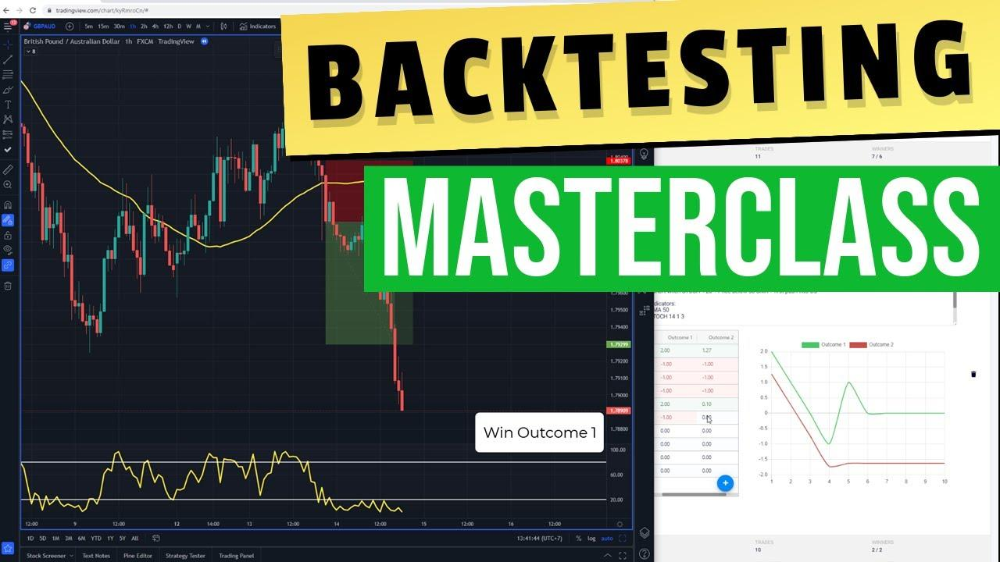

## Table of Contents

## What is backtesting and why is it important for trading strategies?

Backtesting is when you test a trading strategy using old market data to see how it would have worked in the past. It's like a practice run where you use historical data to pretend you're trading and see if your strategy makes money or loses money. You can do this on a computer with special software that lets you input your rules and see the results.

Backtesting is important for trading strategies because it helps you understand if your strategy is good before you use real money. If your strategy does well in the past, it might work well in the future too. But, it's not perfect because the future can be different from the past. Still, it's a useful way to check and improve your trading ideas without risking your money.

## What are the basic steps to start backtesting a trading strategy?

To start backtesting a trading strategy, first you need to clearly define your strategy. This means writing down the rules for when to buy and sell, and what signals or indicators you will use. For example, you might decide to buy a stock when its 50-day moving average crosses above its 200-day moving average. Once you have your rules, you need to find historical data for the assets you want to trade. This data should include prices, volumes, and any other information your strategy needs.

Next, you'll need [backtesting](/wiki/backtesting) software or a programming language to run your tests. There are many tools available, from simple spreadsheet programs to more advanced platforms like MetaTrader or Python libraries like Backtrader. You'll input your strategy rules into the software and then run the backtest using your historical data. The software will simulate trades based on your rules and show you how your strategy would have performed over time. Make sure to check the results carefully, looking at metrics like total return, risk, and how often your strategy wins or loses.

After running your initial backtest, it's important to refine your strategy. Look at where it worked well and where it didn't. You might need to adjust your rules or test different time periods to see if your strategy is robust. Remember, backtesting is not a guarantee of future success, but it's a valuable tool to help you improve and validate your trading ideas before you risk real money.

## What data is required for backtesting and where can it be sourced?

For backtesting, you need historical data about the assets you want to trade. This data usually includes prices like the opening price, highest price, lowest price, and closing price for each day or time period. It can also include trading [volume](/wiki/volume-trading-strategy), which is how many shares or contracts were traded. Sometimes, you might need other information like dividends, splits, or interest rates if your strategy uses them. The key is to have enough data that covers the time period you want to test and matches the frequency of your trading strategy, whether it's daily, hourly, or even minute-by-minute.

You can get this data from many places. Some popular sources are financial websites like Yahoo Finance or Google Finance, which offer free historical data for stocks and other assets. If you need more detailed or specific data, you might have to pay for it from data providers like Bloomberg or Refinitiv. There are also some free and paid APIs (Application Programming Interfaces) that you can use to download data directly into your backtesting software. It's important to check the quality and accuracy of the data, no matter where you get it from, to make sure your backtesting results are reliable.

## How do you choose the right time frame for backtesting?

Choosing the right time frame for backtesting depends on your trading strategy and goals. If you're a day trader who makes quick trades, you'll want to use short time frames like minutes or hours. This helps you see how your strategy would work in the fast-paced world of [day trading](/wiki/day-trading-spy). On the other hand, if you're an investor who holds onto stocks for months or years, you'll want to use longer time frames like daily or weekly data. This way, you can see how your strategy performs over longer periods, which is more relevant to your style of investing.

It's also important to consider the market conditions during the time frame you choose. If you only backtest during a bull market, your strategy might look great but fail in a bear market. To get a better picture, try to include different market conditions in your backtest, like times of growth and times of decline. This helps you see if your strategy can handle different situations. Remember, the goal is to make sure your backtesting results are as realistic and useful as possible for your future trading.

## What are common metrics used to evaluate the performance of a backtested strategy?

When you backtest a trading strategy, you look at several key numbers to see how well it did. One important number is the total return, which tells you how much money you would have made or lost if you used this strategy in the past. Another number is the risk, often measured by something called the maximum drawdown, which shows the biggest drop in your money from the highest point to the lowest point. You also want to know the win rate, which is how often your strategy made money, and the average win and loss sizes, which tell you how big your wins and losses were on average.

Another useful metric is the Sharpe ratio, which helps you understand if the returns you got were worth the risk you took. A higher Sharpe ratio means your strategy did well for the amount of risk it took. The Sortino ratio is similar but focuses only on the bad risk, or downside risk. You might also look at the profit [factor](/wiki/factor-investing), which is the total money made divided by the total money lost. All these numbers together give you a good idea of how your strategy performed in the past and help you decide if it's worth trying in the future.

## How can you ensure the data used for backtesting is clean and accurate?

To make sure the data you use for backtesting is clean and accurate, you need to check it carefully. Start by looking for any missing values or strange numbers in your data. If you find any, you might need to fill in the missing parts or fix the strange numbers. It's also a good idea to compare your data with data from other sources to see if they match. If they don't, you might need to find out why and fix it. Using tools like data cleaning software can help you do this more easily.

Another important thing is to make sure your data is from a reliable place. Some data providers are better than others, so it's worth spending time to find a good one. Also, think about the time period your data covers. If it's too short, you might miss important market changes. If it's too long, you might include old data that isn't relevant anymore. By taking these steps, you can trust that your backtesting results are based on good, clean data.

## What are the pitfalls to avoid when backtesting a trading strategy?

When you're backtesting a trading strategy, one big mistake to avoid is overfitting. This happens when you make your strategy too complicated, trying to fit it perfectly to past data. It might look great in your backtest, but it won't work well in the future because it's too specific to the past. Another pitfall is not accounting for transaction costs like fees and slippage. These can eat into your profits, so you need to include them in your backtest to get a realistic picture.

Another common mistake is using data that's not clean or accurate. If your data has missing values or errors, your backtest results won't be reliable. Always check your data and fix any problems before you start. Also, be careful about the time frame you choose for your backtest. If you only test during a good market period, your strategy might fail when the market changes. Make sure to test over different market conditions to see how your strategy holds up.

Lastly, don't forget about the psychological aspect of trading. Backtesting can't show you how you'll feel when you're actually trading with real money. It's easy to stick to a strategy when it's just numbers on a screen, but real trading can be emotional. Remember that backtesting is a tool to help you, but it's not a guarantee of success. Always keep learning and adjusting your strategy based on new information and experiences.

## How can you incorporate transaction costs and slippage into backtesting?

When you backtest a trading strategy, it's important to include transaction costs and slippage to get a realistic view of how your strategy will perform. Transaction costs are the fees you pay to buy or sell an asset, like brokerage fees or commissions. Slippage happens when the price you get for a trade is different from the price you expected, often because the market moved quickly. To add these into your backtest, you need to set up your backtesting software to take away these costs from your profits each time you make a trade. This way, you can see if your strategy still makes money after paying for these costs.

Adding transaction costs and slippage can change your backtest results a lot. If you don't include them, your strategy might look better than it really is. For example, if you're trading a lot, the fees can add up quickly and eat into your profits. Slippage can also make a big difference, especially in fast-moving markets. By including these costs in your backtest, you get a more honest picture of whether your strategy will work in the real world. This helps you make better decisions before you start trading with real money.

## What advanced techniques can be used to improve the robustness of backtesting results?

To make your backtesting results more reliable, you can use a technique called walk-forward optimization. This means you split your historical data into two parts: one part for creating your strategy and another part for testing it. You keep moving forward in time, using the first part to make your strategy and the second part to see how it does. This helps you see if your strategy can work well in different times and not just in the past. It's like practicing with different sets of data to make sure your strategy is strong and can handle changes in the market.

Another way to improve your backtesting is by using Monte Carlo simulations. This technique uses random changes to your data to see how your strategy would do in many different situations. It's like playing out your strategy many times with different twists and turns to see if it can still make money. By doing this, you can understand how your strategy might handle unexpected events or market changes. Both walk-forward optimization and Monte Carlo simulations help you make your backtesting more thorough and give you more confidence in your trading strategy.

## How do you validate a backtesting model to prevent overfitting?

To validate a backtesting model and prevent overfitting, you need to make sure your strategy works well on different sets of data, not just the one you used to create it. One way to do this is by using a method called out-of-sample testing. This means you test your strategy on data it hasn't seen before. For example, you can use the first half of your data to build your strategy and the second half to see how it does. If your strategy still works well on the new data, it's a good sign that it's not just overfitting to the past.

Another way to check for overfitting is by using a technique called cross-validation. This involves splitting your data into several parts, building your strategy on some of the parts, and then testing it on the others. You do this many times with different combinations of data. If your strategy performs well across all these different tests, it's more likely to be robust and not just tuned to one specific set of data. By using these methods, you can feel more confident that your backtesting model will work in the real world and not just in the past.

## What are the differences between in-sample and out-of-sample testing, and why is out-of-sample testing crucial?

In-sample testing is when you use the same data to create and test your trading strategy. It's like practicing with the same set of questions before a test. This can make your strategy look really good because it's been fine-tuned to work well with that specific data. But, there's a problem: if you only use in-sample testing, your strategy might not work well with new data because it's too focused on the past.

Out-of-sample testing is different. It's when you test your strategy on data it hasn't seen before. It's like taking a practice test with new questions to see if you really understand the material. Out-of-sample testing is crucial because it helps you see if your strategy can work in the real world, not just in the past. If your strategy does well on new data, you can feel more confident that it's not just overfitting and that it might work when you start trading for real.

## How can machine learning be integrated into backtesting to enhance strategy development?

Machine learning can help make backtesting better by finding patterns in past data that a person might miss. You can use [machine learning](/wiki/machine-learning) to create models that learn from the data and make predictions about what might happen next. For example, you can use algorithms like decision trees or neural networks to find out when to buy or sell based on lots of different information, like prices, volumes, and even news. By using machine learning, you can test many different strategies quickly and see which ones work best. This can help you find a strategy that is more likely to make money in the future.

But, it's important to be careful when using machine learning in backtesting. Just like with regular backtesting, you need to make sure you're not overfitting your model to the past data. This means you should use out-of-sample testing to check if your machine learning model can work well with new data it hasn't seen before. Also, machine learning can be tricky because it needs a lot of data and can be hard to understand why it makes certain decisions. So, it's a good idea to use machine learning along with other methods to make sure your trading strategy is strong and can handle different situations in the market.

## References & Further Reading

[1]: Bailey, David H., and Marcos Lopez de Prado. "[The Deflated Sharpe Ratio: Correcting for Selection Bias, Backtest Overfitting, and Non-Normality.](https://papers.ssrn.com/sol3/papers.cfm?abstract_id=2460551)" Journal of Portfolio Management, 40 (2014): 94-107.

[2]: Van Vliet, Ben. "[Building Automated Trading Systems.](https://www.amazon.fr/Building-Automated-Trading-Systems-Introduction/dp/0750682515)" Elsevier, 2007.

[3]: Hilpisch, Yves. "[Python for Finance.](https://www.amazon.com/Python-Finance-Mastering-Data-Driven/dp/1492024333)" O'Reilly Media, Inc., 2014.

[4]: Elder, Alexander. "[Come Into My Trading Room: A Complete Guide to Trading](https://www.amazon.com/Come-Into-My-Trading-Room/dp/0471225347)." Wiley, 2002.

[5]: "[Expert Advisor Programming for MetaTrader 5: Creating Automated Trading Systems in the MQL5 Language.](https://www.amazon.com/Expert-Advisor-Programming-MetaTrader-automated/dp/0982645953)" Andrew R. Young, 2019.

[6]: "[Python for Finance: Mastering Data-Driven Finance.](https://www.amazon.com/Python-Finance-Mastering-Data-Driven/dp/1492024333)" Yves Hilpisch, 2018.

[7]: "[Quantitative Trading: How to Build Your Own Algorithmic Trading Business.](https://www.amazon.com/Quantitative-Trading-Build-Algorithmic-Business/dp/0470284889)" Ernie Chan, 2008.

[8]: "[Following the Trend: Diversified Managed Futures Trading](https://www.amazon.com/Following-Trend-Diversified-Managed-Futures/dp/1118410858)." Andreas F. Clenow, 2012.

[9]: "[Cryptocurrency Market Efficiency and Arbitrage Opportunities](https://papers.ssrn.com/sol3/papers.cfm?abstract_id=4571439)." Dimitrios Koutmos, 2018. International Review of Financial Analysis.