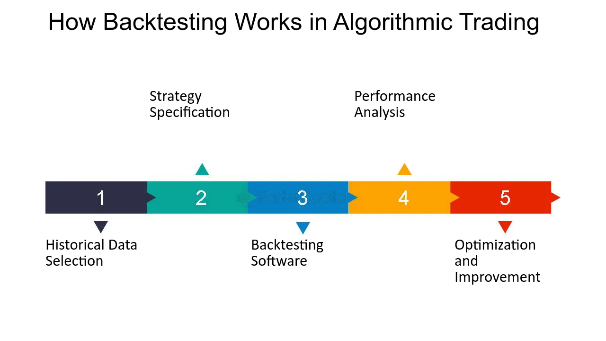

Building a quantitative trading system requires a combination of knowledge in finance, mathematics, statistics, and programming. Here's a detailed guide to help you create your own system.

## Table of Contents

## Training and understanding

- **Fundamental education**: Familiarize yourself with financial, mathematical and statistical concepts. Courses in quantitative finance, programming and data analysis are highly recommended.
- **Market discovery**: Understand the particularities of the markets in which you wish to trade: equities, bonds, currencies, commodities, etc.

## Strategy development

- **Fundamental research**: Identify macroeconomic factors or trends that may influence your target market.
- **Technical analysis**: Examine price and volume patterns to identify recurring trends.
- **Statistical approaches**: Use models such as time series or statistical arbitrage to develop strategies based on historical data.

## Data acquisition

- **Data sources**: Obtain reliable data, whether price, volume, economic indicators or other relevant information.
- **Cleaning and processing**: Ensure that your data is free of errors, inconsistencies or gaps.

## Rigorous backtesting

- **Test environment**: Use specialized tools and platforms to test your strategy on historical data.
- **Results analysis**: Study past performance, identify drawdown periods and assess the stability of your strategy.

## Optimization

- **Adjustments**: Modify your strategy's parameters to improve returns.
- **Prevent over-adjustment**: Be vigilant to avoid over-optimizing your model for past situations, to the detriment of future performance.

## Paper Trading

- **Simulation**: Test your strategy in real-time, but without real money, to assess its performance under current conditions.

## Deployment

- **Implementation**: Integrate your strategy with a trading platform to execute orders automatically.
- **Small steps**: Start with limited capital to test the robustness of the system in real-life conditions.

## Continuous monitoring

- **Monitoring tools**: Use dashboards and alerts to track your strategy's performance in real time.
- **Regular review**: Regularly review performance to identify any deviation or degradation.

## Rigorous risk management

- **Limits**: Establish clear limits for maximum acceptable losses.
- **Diversification**: Avoid concentrating too much capital on a single strategy or market.

## Continuous improvement

- **Continuous research**: Markets are constantly evolving. Spend time on research to refine and improve your strategy.
- **Training**: Keep abreast of the latest advances in quantitative finance, programming, and data analysis.

## Conclusion

Building a [quantitative trading](/wiki/quantitative-trading) system requires a rigorous approach and constant questioning. The key lies in the combination of solid research, strict risk management, and a willingness to learn and adapt continuously. By following these steps, you'll maximize your chances of success in the complex world of quantitative trading.

## References & Further Reading

[1]: Bergstra, J., Bardenet, R., Bengio, Y., & Kégl, B. (2011). ["Algorithms for Hyper-Parameter Optimization."](https://papers.nips.cc/paper_files/paper/2011/hash/86e8f7ab32cfd12577bc2619bc635690-Abstract.html) Advances in Neural Information Processing Systems 24.

[2]: ["Advances in Financial Machine Learning"](https://www.amazon.com/Advances-Financial-Machine-Learning-Marcos/dp/1119482089) by Marcos Lopez de Prado

[3]: ["Evidence-Based Technical Analysis: Applying the Scientific Method and Statistical Inference to Trading Signals"](https://www.wiley.com/en-gb/Evidence+Based+Technical+Analysis:+Applying+the+Scientific+Method+and+Statistical+Inference+to+Trading+Signals-p-9780470008744) by David Aronson

[4]: ["Machine Learning for Algorithmic Trading"](https://www.amazon.com/Machine-Learning-Algorithmic-Trading-intelligence/dp/9918608013) by Stefan Jansen

[5]: ["Quantitative Trading: How to Build Your Own Algorithmic Trading Business"](https://www.amazon.com/Quantitative-Trading-Build-Algorithmic-Business/dp/0470284889) by Ernest P. Chan