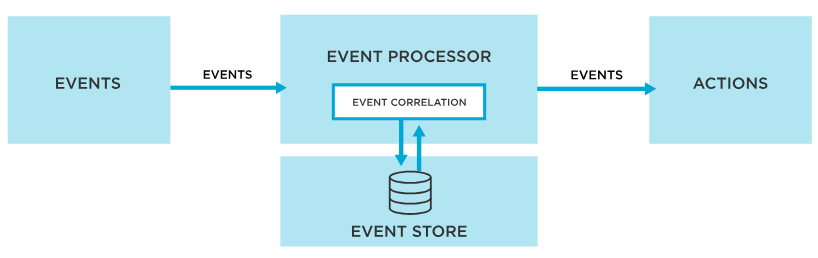

In modern finance, technology has rapidly transformed the landscape, rendering traditional methods nearly obsolete. This transformation is most evident in the world of trading, where automation has ushered in an era of unprecedented efficiency and precision. The rise of automation in trading is not merely a trend but a significant shift, enabling traders to execute strategies at speeds and scales previously unimaginable.

Automated trading systems, often hailed as the bedrock of today's financial markets, are indispensable for several reasons. For starters, they allow for 24/7 trading, making the most of global market opportunities as they arise, regardless of time zones. Additionally, they mitigate human errors, reducing the risk of costly mistakes that can arise from manual trades. The sheer speed and volume at which automated systems can operate also allow them to capitalize on minute price discrepancies that may exist only for a fraction of a second.

In an environment defined by its volatility and dynamism, the agility and reliability of automated systems have made them an essential tool for institutional and retail traders alike. As we delve deeper into this guide, we'll unravel the intricacies of automated trading systems, their components, and their profound influence on the modern trading ecosystem.

## Table of Contents

## Unraveling Automated Trading: A Deep Dive

Automated trading, in its most basic form, refers to the utilization of computer systems and software to execute trades based on predefined criteria without the need for human intervention. The significance of such a system lies in its ability to process vast amounts of data at high speeds and execute trades in fractions of a second, giving it a distinct edge over manual trading. In the modern trading world, where milliseconds can mean the difference between profit and loss, the importance of automated systems cannot be overstated.

However, while the term "automated trading" is often used as a catch-all phrase, it's vital to differentiate between its various forms, specifically: Automated Trading, Algorithmic Trading, and Trading Robots.

1. **Automated Trading:** At its core, this involves using computer programs to automate the process of trade execution. Traders set specific rules for trade entries and exits, and the system executes these trades when the conditions are met.
2. **Algorithmic Trading:** This is a subset of automated trading but is more sophisticated. It involves the use of complex mathematical models and algorithms to make trading decisions. For example, an algorithm might analyze real-time market data to detect patterns and then execute trades based on those patterns.
3. **Trading Robots (or Expert Advisors):** These are specific types of automated trading systems available on certain platforms like MetaTrader. They are programmed to execute trades based on a set of criteria, and they can operate around the clock, taking advantage of any market condition. It's worth noting that while these robots can be efficient, they're as good as the underlying strategy they're based on.

Tracing the history of trading, we see a transformational journey. In the past, traders relied on telephones and physical trading floors to execute trades. It was a system that was riddled with inefficiencies and was bound by the constraints of human speed and endurance. However, the advent of computers in the late 20th century marked the dawn of a new era. The 1980s saw the introduction of electronic trading, which allowed for faster execution of trades and access to global markets.

Fast forward to today, and we have the world of high-frequency trading ([HFT](/wiki/high-frequency-trading-strategies)). HFT firms leverage sophisticated algorithms, high-speed data feeds, and ultra-fast execution systems to trade securities at lightning speeds, often holding positions for mere seconds or even milliseconds. The transition from manual to high-frequency automated systems underscores the relentless pursuit of efficiency and edge in the ever-evolving world of trading.

## The Underlying Architecture of Automated Trading

### Market Adapter

A Market Adapter, sometimes known as a Market Data Interface, acts as a bridge between an automated trading system and the external market data sources. Essentially, it facilitates the flow of real-time market data into the trading system and allows executed trade orders to reach the market. Let's delve into its fundamental components and the pivotal role they play:

1. **Data Feed Handlers:** These are specialized modules that connect to market data providers or exchanges and consume raw data. They decode, normalize, and distribute this data to the trading algorithms. The robustness of a data feed handler can significantly influence the accuracy of the trading system since it determines how quickly and accurately market data is processed.
2. **Order Management Interface:** This facilitates the sending of orders from the trading system to the market. A well-optimized order management interface ensures that trade orders are transmitted rapidly and reliably to the exchange or broker, minimizing the time gap between trade decision and execution.
3. **Connection Protocols:** These are the predefined rules that dictate how data is exchanged between systems. FIX (Financial Information eXchange) is an industry-standard messaging protocol widely adopted for real-time exchange of trade-related messages[1]. Understanding and optimizing for the specific protocols used by your chosen exchanges or data providers can significantly enhance system performance.

The emphasis on low latency in automated trading cannot be understated. Low latency architectures aim to minimize the delay in the processing and transmission of information. The reasons they're vital for automated trading systems include:

- **Competitive Edge:** In the world of high-frequency trading, every microsecond counts. Achieving lower latencies can provide a competitive advantage, allowing traders to capitalize on fleeting market opportunities that might be missed by slower systems.
- **Reduced Slippage:** Slippage refers to the difference between the expected price of a trade and the price at which the trade is executed. With reduced latency, the chances of encountering significant slippage diminish, leading to more predictable and accurate trade outcomes.
- **Synchronization with Market Reality:** A low latency system ensures that trading decisions are made based on the most current market data. This is particularly important in fast-moving markets where price data can change rapidly.

In essence, a Market Adapter serves as the vital link ensuring seamless interaction between an automated trading system and the broader market. Optimizing this link with keen attention to protocols and low latency architectures is crucial for achieving optimal trading outcomes.

### Complex Event Processing Engine

A Complex Event Processing (CEP) Engine lies at the heart of many modern automated trading systems. By analyzing multiple streams of information in real-time, the CEP identifies intricate patterns, relationships, or conditions that can signify trading opportunities or threats. These capabilities make it indispensable for traders wanting to maintain an edge in dynamic markets.

**Core Components of a CEP Engine**

1. **Event Listeners:** These components are continually tuned into various data streams, be it market prices, news feeds, or social media buzz. Their primary task is to capture and forward relevant events to the processing units for analysis.
2. **Event Processing Units:** Once the raw event data is captured, these units begin their work. Utilizing pre-defined rules or patterns, they continuously evaluate incoming events to determine their significance. If a specific sequence or condition is met, an actionable insight is generated.
3. **Actionable Insight Generators:** Upon identifying a noteworthy pattern, the system doesn't just stop at recognition. It's programmed to take certain actions – this could mean generating an alert, initiating a trade, or even adjusting an existing position.

**Role of Protocols in CEP**

Protocols standardize the way data is represented and communicated. In the context of a CEP Engine, they ensure that event data from disparate sources can be understood, processed, and acted upon seamlessly. For instance, protocols like MQTT[2] or WebSockets are often employed for their low latency and real-time communication capabilities, making them ideal for trading scenarios where speed is paramount.

**Low Latency in CEP**

Low latency is the differentiator when it comes to CEP in trading. As markets move, the ability to process events and act in real-time can be the difference between profit and loss. Key reasons why low latency is crucial in CEP include:

- **Rapid Response:** Especially in high-frequency trading, the time between an event's occurrence and a system's reaction needs to be minimized to exploit short-lived opportunities.
- **Accurate Pattern Recognition:** If there's a lag in processing, the pattern recognized might no longer be valid, leading to potentially erroneous actions.
- **Synchronized Analysis:** With multiple data streams being processed, it's vital that they're analyzed in tandem, reflecting the market's current state accurately.

By facilitating real-time analysis of multiple event streams, a well-architected CEP Engine with low latency can empower traders to detect and exploit market anomalies rapidly. Given the relentless speed and complexity of today's financial markets, this capability is less of a luxury and more of a necessity.

### Order Routing System

The Order Routing System (ORS) acts as the intermediary, ensuring that trade orders from automated strategies reach the intended exchange or market seamlessly and efficiently. A proficient ORS is pivotal to the efficacy of an automated trading system, ensuring that trades are executed promptly and at the desired price levels.

**Key Components of an Order Routing System**

1. **Order Generators:** This component receives signals from the strategy or Complex Event Processing engine, transforming them into actionable orders. The order generator ensures that all requisite details, such as price, volume, and trade type, are accurately defined.
2. **Transmission Protocols:** Once orders are generated, they must be sent to the target destination. Transmission protocols standardize this communication, ensuring orders are not just dispatched quickly, but also in a format recognizable by the receiving exchange.
3. **Order Queues:** In instances where numerous orders are generated simultaneously, an order queue systematically organizes them, ensuring no orders are skipped or duplicated. This sequential handling is especially vital during high volatility periods where rapid market moves can result in a surge of order signals.
4. **Confirmation Handlers:** After an order is executed, the exchange sends back a confirmation. The ORS must efficiently handle these confirmations, updating the system's internal records and possibly triggering subsequent actions based on the trade outcome.

**The Centrality of Protocols in ORS**

Protocols, like FIX (Financial Information eXchange), play a pivotal role. FIX has become an industry standard for transmitting trade orders to exchanges. Its uniformity ensures that traders can route orders to virtually any exchange worldwide without needing different transmission methods for each one. The importance of protocols also extends to ensuring reliability. When orders are transmitted, they must arrive intact, without missing or altered details, preserving trade integrity.

**The Imperative for Low Latency in Order Routing**

Low latency isn't just about speed but precision. In the breakneck pace of financial markets, even microseconds matter.

- **Price Preservation:** Delayed order execution can mean missing the desired price point. Especially in volatile markets, prices can shift rapidly. An efficient ORS ensures trades are executed at or near the indicated prices.
- **Optimal Order Fulfillment:** For strategies that rely on placing numerous orders concurrently, delays can disrupt the intended trade sequence or hierarchy, potentially compromising the strategy's efficacy.
- **Avoiding Slippage:** Latency can result in slippage, where the executed price deviates from the expected one. Over time, such slippages, even if minimal, can erode trading profits.

A well-structured Order Routing System is not merely about conveying trade orders to exchanges but doing so with the requisite speed, accuracy, and reliability. Given the financial implications of trade executions, ORS excellence isn't optional but a fundamental requirement for any successful automated trading setup.

### Risk Management Mechanisms

Risk Management Mechanisms are foundational pillars in automated trading systems, ensuring that traders' capital is protected from unexpected market adversities. The need for an effective risk management mechanism in an automated trading setup can't be overemphasized due to the high-speed decision-making process.

**Components of Risk Management Mechanisms**

1. **Position Limiters:** This is a mechanism that ensures a trader does not exceed a predetermined amount of capital at risk in a single trade or multiple trades. It's a preventive measure to avoid excessive losses that can stem from rogue algorithms or erroneous trade signals.
2. **Stop-Loss and Take-Profit Orders:** Automated triggers that automatically sell or buy securities when they reach certain predefined prices. These act as safety nets, ensuring trades are exited if they move against the trader's expectations or when desired profits are attained.
3. **Margin Monitors:** With the ubiquity of leverage in modern trading, it's essential to have real-time monitors that track margin usage and trigger alerts or actions if the margin thresholds are breached.
4. **Volatility Monitors:** Automated systems equipped with volatility monitors can adjust strategies in real-time based on market volatility, either reducing exposure or stopping trading entirely in highly volatile scenarios.

**Significance of Protocols in Risk Management**

Protocols, like the Financial Information eXchange (FIX), play a vital role in ensuring swift and standardized communication of risk parameters and instructions between trading platforms, brokers, and exchanges. Such protocols help ensure that risk management commands, such as stop-loss orders or margin calls, are promptly acted upon and are in a universally understood format across various platforms.

**The Critical Role of Low Latency in Risk Management:**

Low latency architectures are indispensable for effective risk management in automated trading for the following reasons:

- **Swift Response to Market Movements:** Financial markets can shift rapidly. Low latency ensures that risk management triggers, such as stop-loss orders, are executed in real-time, minimizing potential losses.
- **Accuracy in Fast-Paced Markets:** Delayed responses in high-frequency trading environments can lead to significant financial discrepancies. Low latency ensures that risk checks and balance updates are always up-to-date.
- **Synchronized Trading and Risk Checks:** Automated trading strategies often involve executing multiple trades in quick succession. Low latency ensures that risk checks happen in tandem with trade executions, ensuring that no trade violates risk parameters.

While automated trading systems offer vast opportunities for profit, they also come with inherent risks. Effective risk management mechanisms, fortified by standardized protocols and low latency architectures, ensure that these risks are kept in check, paving the way for sustainable trading success.

## Crafting Your Automated Trading System: A Step-by-Step Guide

### Pre-building considerations

Establishing a comprehensive trading plan stands as the cornerstone of any successful automated trading system. In the ever-evolving and fast-paced world of financial markets, embarking on the journey of automated trading without a well-structured plan is akin to navigating uncharted waters without a compass.

A solid trading plan provides clarity, direction, and a reference point. Here's why it's paramount:

1. **Objective Framework:** A trading plan offers an objective framework for making decisions. It minimizes the influence of emotions, which can be especially damaging in a volatile market. By adhering to predefined rules and criteria, traders can maintain consistency in their approach, reducing the likelihood of making impulsive decisions based on fear or greed.
2. **Performance Metrics:** By laying out specific goals and benchmarks, a trading plan provides metrics to evaluate the system's performance. This enables traders to identify areas of improvement and adjust strategies accordingly. It also offers a standard against which to measure and track growth over time.
3. **Risk Management:** A well-constructed trading plan explicitly defines the risk parameters. This includes setting stop-loss points, determining maximum drawdowns, and establishing position sizes. Such predetermined rules ensure that traders don't expose themselves to unnecessary risks and can protect their capital more effectively.
4. **Clear Entry and Exit Criteria:** One of the primary components of a trading plan is outlining the exact criteria for entering and exiting trades. By having these set in advance, automated systems can operate efficiently, ensuring trades are executed at the right moments, based on sound logic rather than speculation.
5. **Adaptability to Market Conditions:** Financial markets are not static. A robust trading plan accounts for this dynamism and includes provisions for adjusting strategies based on changing market conditions. Whether it's a major geopolitical event, an unexpected economic downturn, or a paradigm shift in technology, a solid trading plan provides guidelines on how to navigate these changes.
6. **Continuous Learning and Refinement:** trading is vast, with myriad strategies, tools, and methodologies. A comprehensive trading plan emphasizes continuous learning and adaptation. It encourages traders to stay updated with the latest trends, tools, and technologies, integrating new knowledge into their strategies and refining their approach.

In essence, diving into automated trading without a solid trading plan is a recipe for inconsistency and potential failure. A structured plan, on the other hand, serves as the backbone of a successful trading system, guiding decisions, streamlining operations, and fostering a disciplined and methodical approach to the markets[3].

### Designing your system

At the heart of every efficient automated trading system lies a robust design, seamlessly blending technical prowess with strategic acumen. Let's delve into the intertwining of these two core aspects:

**1. Technical Considerations:**

- **Platform Selection:** Depending on your trading needs, you may opt for proprietary platforms offered by brokerages or choose open-source solutions. Your choice will be influenced by factors like programming flexibility, scalability, and supported languages. For example, platforms like MetaTrader 4 and 5 are favored for Forex trading due to their user-friendly scripting language MQL.
- **Data Feed:** Real-time, accurate data is essential. Ensure that your chosen platform supports high-quality data feeds and provides backup solutions to account for potential data loss or discrepancies.
- **Latency:** Speed is of the essence in automated trading. Ensure your system minimizes lag, especially if you're considering high-frequency trading. Opt for VPS hosting or colocated servers to reduce latency.
- **Hardware:** The reliability of your trading system is as good as the hardware it runs on. Invest in quality hardware, ensuring minimal downtime and efficient execution.

**2. Strategic Considerations:**

- **Trading Strategy:** The cornerstone of your system. Whether you're looking to exploit arbitrage opportunities or trend-following, your chosen strategy will define your trading parameters. Detailed backtesting can validate the effectiveness of your chosen strategy.
- **Position Sizing:** Determine the percentage of your portfolio to allocate to each trade. This consideration is paramount for risk management and can be dynamic, adjusting based on the volatility of the asset or overall market conditions.
- **Entry and Exit Points:** Clearly define the criteria that will trigger the system to enter or exit a trade. This could be based on technical indicators, fundamental news, or a combination of both.
- **Risk-Reward Ratio:** Pre-determine the potential loss you're willing to accept for a potential gain. A commonly adopted ratio is 3:1, where the potential gain is three times the potential loss.
- **Adaptability:** Markets evolve, and so should your system. Design it to be adaptable, allowing for strategy modifications based on changing market conditions without overhauling the entire system.
- **Filtering Mechanisms:** Especially relevant in volatile markets, filters can prevent your system from making trades in uncertain conditions. For instance, during major economic announcements, some traders might choose to avoid trading due to increased volatility.

To ensure your automated trading system operates with surgical precision and can withstand the unpredictable waves of the financial markets, intertwining technical foundations with strategic imperatives is not just an option; it's a necessity.

### Risk Management

In automated trading, risk management isn't a mere afterthought; it's an integral component that determines the longevity and success of your trading system. Implementing prudent risk management tools and practices not only safeguards your capital but also ensures the sustainability of your trading endeavors.

**1. Stop Loss and Take Profit:** These are pre-determined price levels where a trade will be automatically closed. A stop loss protects against excessive losses by closing a position if the price moves unfavorably. Conversely, a take profit locks in profits by closing a position when a certain profit level is reached.

**2. Maximum Drawdown:** This metric gauges the largest peak-to-trough decline in the value of a portfolio. By setting a limit to this, traders can ensure that the system doesn't take positions that could lead to a drawdown greater than a predefined percentage of the portfolio.

**3. Diversification:** Avoid putting all your eggs in one basket. By trading multiple instruments or strategies simultaneously, you can mitigate the risks associated with any single asset or strategy underperforming[4].

**4. Position Sizing:** Determine the amount of capital to risk on each trade. This could be a fixed dollar amount, a percentage of your portfolio, or determined by the volatility of the asset being traded.

**5. Leverage and Margin:** While leverage can amplify profits, it can also magnify losses. Always be aware of the amount of leverage your system is using and ensure you have sufficient margin to cover potential losses[5].

**6. Daily Loss Limit:** Implement a mechanism that halts trading if losses exceed a pre-defined threshold within a single day. This can prevent the system from spiraling into significant losses during tumultuous market conditions.

**7. Regular Monitoring:** Despite the "set and forget" nature of automated systems, regular monitoring is crucial. This helps in identifying any anomalies or deviations from expected behavior and taking corrective actions promptly.

**8. Stress Testing:** Simulate extreme market conditions to evaluate how the system performs during significant market crashes or extremely volatile periods[6]. This provides insights into potential vulnerabilities.

**9. Circuit Breakers:** Implement safety measures that automatically halt trading during extreme market volatility or when certain conditions are met, thereby protecting against large, unexpected losses.

Incorporating these tools and practices into your automated trading system can significantly shield your investments from unnecessary exposures and potential pitfalls. Remember, in trading, capital preservation is as crucial as capital appreciation.

### Building the System

Building an automated trading system necessitates more than just an idea; it requires the right tools and software to turn that idea into a functioning entity. Picking the appropriate tools not only streamlines the development process but also ensures robustness and reliability.

**1. Programming Languages:**

- **Python:** Renowned for its simplicity and extensive libraries like Pandas, NumPy, and QuantConnect. Python is a favorite among quants and algorithmic traders.
- **Java:** Offers high performance and is commonly used in large banks and financial institutions for high-frequency trading.
- **C++:** Known for its ultra-low latency and is utilized in situations where speed is paramount.

**2. Integrated Development Environments (IDEs):**

- **Jupyter Notebook:** An open-source platform that supports live code and visualizations, making it perfect for strategy development in Python.
- **Eclipse:** Widely used for Java-based applications, it comes with a plethora of plugins for ease of development.
- **Visual Studio:** Best suited for C++ and offers powerful debugging tools.

**3. Backtesting Platforms:**

- **QuantConnect:** An algorithmic trading platform that supports backtesting and live trading with numerous data sources.
- **Backtrader:** A Python-based platform, flexible and offers visualizations out-of-the-box.
- **MetaTrader 4/5:** While primarily a trading platform, its built-in MQL4/5 language allows for strategy development and backtesting.

**4. Data Sources:**

- **Quandl:** A marketplace for financial, economic, and alternative data.
- **Alpha Vantage:** Offers free APIs for historical and real-time data.
- **Interactive Brokers:** Provides comprehensive market data along with a trading platform.

**5. Version Control:**

- **Git:** Essential for collaborative projects. Platforms like GitHub or Bitbucket offer hosting services for repositories, ensuring code safety and version tracking.

**6. Continuous Integration and Deployment (CI/CD) Tools:**

- **Jenkins:** Automates parts of the development process, ensuring smoother deployments.
- **Docker:** Creates containerized environments, making sure your system runs consistently across different platforms.

**7. Monitoring and Alerting:**

- **Grafana:** An open-source platform for monitoring and observability.
- **PagerDuty:** An incident response platform that alerts users to disruptions and system outages.

Choosing the right software and tools is a critical step. While the aforementioned tools are among the most popular, it's essential to pick those that align best with your strategy, skills, and the specific requirements of your trading system.

### Testing and Refining

In automated trading, a strategy's theoretical underpinning is only as good as its real-world performance. To ascertain the robustness of your trading system, rigorous testing and constant refining are paramount.

**Backtesting:** This involves applying your trading strategy to historical data to evaluate its past performance[7]. While backtesting provides valuable insights, remember that past performance isn't always indicative of future results. Nevertheless, it's an essential first step.

- **Data Quality:** Ensure you're using high-quality, accurate data. Any anomalies or errors in your data can lead to misleading results.
- **Slippage and Commission:** Incorporate realistic transaction costs and potential price changes during order execution to simulate real trading conditions.

**Forward Testing or Paper Trading:** Once satisfied with backtest results, run the strategy on live market data without committing real capital. This allows you to see how the strategy performs in real-time without financial risk.

**Stress Testing:** Subject your system to extreme market conditions, simulating rare but impactful events, like financial crises or flash crashes[8]. It's essential to know how your system would respond to these outliers.

**Monte Carlo Simulation:** This statistical method involves running the trading strategy through a broad set of random scenarios to understand potential variability in returns[9]. It helps estimate the probability of extreme losses.

**Performance Metrics:** Track metrics like the Sharpe ratio, maximum drawdown, profit factor, and annualized return. These metrics help evaluate the strategy's risk-adjusted returns and overall health.

**Feedback Loop:** The financial markets are continually evolving, driven by global events, technological advances, and changing market dynamics. It's vital to have a feedback loop where you periodically re-evaluate and adjust your strategy based on its performance and any changes in the market environment.

**Avoid Overfitting:** Overfitting occurs when a strategy is too finely tuned to past data and performs poorly in real trading[10]. Always prioritize simplicity and ensure that the strategy's logic is grounded in a sound market hypothesis.

**External Peer Review:** Consider having your strategy reviewed by trusted peers or mentors in the trading community. Fresh eyes can offer valuable feedback and catch potential issues you might have missed.

### Taking the System Live

Taking your automated trading system live is the culmination of extensive planning, designing, and testing. However, this step also comes with its own set of challenges that require vigilance and adherence to best practices.

**Start Small:** Regardless of how successful your strategy was during testing, always begin with a small amount of capital. The live markets have a myriad of unforeseen factors that might affect your system differently than in the backtest or paper trading stages.

**Constant Monitoring:** Never adopt a "set it and forget it" approach. Always monitor the system, especially in the early stages, to catch and rectify any unexpected behaviors or deviations from its expected performance.

**Set Limits:** Implement daily, weekly, or monthly drawdown limits to protect your capital. If losses exceed these limits, the system should automatically pause to allow for evaluation.

**Emergency Protocols:** Have a clear shutdown procedure in place for scenarios when market behaviors become highly erratic or when there's significant geopolitical news. Unpredictable events can lead to massive losses if not addressed promptly.

**Stay Updated:** Ensure that your software, including the trading platform and any third-party tools, remains up to date. Software updates often contain crucial bug fixes and enhancements that can impact your trading activities.

**Audit Logs:** Maintain detailed logs of all trading activities. These logs can be invaluable for troubleshooting, refining the system, or for compliance and record-keeping purposes.

**Periodic Reviews:** Even after going live, periodically review and assess the system's performance. The financial markets are dynamic, and what works today might not be optimal tomorrow.

**Avoid Emotional Overrides:** Trust in the strategy you've developed and resist the urge to intervene manually, especially based on emotions. Frequent manual interventions can diminish the edge your system might have.

**Diversification:** Consider deploying multiple strategies or trading in various markets to spread risk. Diversification can help in reducing the impact of poor performance in one area.

**Stay Informed:** Stay abreast of financial news and global events. Understanding the broader market context can provide insights into your system's performance and any potential tweaks needed.

Remember, transitioning to live trading is not the end, but a new beginning. The continuous evolution of your system, coupled with adherence to these precautions and best practices, will be crucial in navigating the unpredictable waters of the financial markets.

## The Real-world Mechanics of Automated Trading

### Choosing the Right Market and Its Significance

The decision to select an appropriate market for your automated trading system isn't merely technical; it's intrinsically tied to strategy and the overarching goal. Choosing the right market plays a pivotal role in determining the effectiveness, sustainability, and profitability of your system.

**Market Liquidity:** Highly liquid markets, like major currency pairs in Forex or prominent stocks in equity markets, tend to have tighter spreads and offer smoother price movements . This liquidity facilitates easier trade execution and lessens the impact cost, making them attractive for automated trading systems.

**Market Volatility:** While volatility can present opportunities for profit, it also carries risk. Automated strategies must be tailored to cope with the specific volatility patterns of a chosen market. For instance, intraday trading systems might thrive on the intraday volatility of certain stocks or indices.

**Data Availability:** Historical and real-time data are vital for backtesting and live trading respectively. Markets with abundant, reliable, and accessible data are preferable, as they allow for rigorous testing and real-time decision-making.

**Cost Structure:** Every market has its own cost structure, encompassing spreads, commissions, and overnight holding costs (like swaps in Forex). A keen understanding of these costs is vital, as they can significantly influence the net profitability of trades.

**Regulatory Environment:** Regulatory norms vary across markets and regions. Some markets have stringent regulations which might restrict certain trading activities or strategies, making them less conducive for specific automated systems.

**Operational Hours:** The operational hours and trading sessions of a market can influence its behavior. For example, Forex operates 24 hours, presenting unique opportunities and challenges compared to stock markets with defined opening and closing times.

**Market Information:** Markets driven by information, like equities, can exhibit sharp reactions to news releases. If your system isn't designed to handle such events, it's wise to opt for markets less sensitive to news or to integrate news-filtering mechanisms.

**Correlation and Diversification:** If diversifying across multiple markets, understanding correlation is crucial. Markets that are positively correlated might amplify risks, while negatively correlated markets can provide a hedging effect.

In essence, the choice of market isn't merely about potential profit. It's about aligning the market's characteristics with the strengths of your automated trading strategy, ensuring consistency and robustness in a dynamic trading landscape.

### Importance of Features, Trading Signals, and Trade Execution Strategies

In automated trading, features, trading signals, and execution strategies form the triumvirate driving system success. Their intricate interplay can make or break a strategy's effectiveness and profitability.

**Features:** The foundation of any trading model. Features are variables or indicators derived from historical data that the system uses to make predictions. They can range from simple moving averages to complex statistical measures. Choosing relevant and non-redundant features is paramount; irrelevant features can introduce noise, reducing the strategy's accuracy.

**Trading Signals:** Stemming from the chosen features, trading signals denote a system's decision to buy, sell, or hold an asset. Typically, signals arise when features meet certain conditions. For instance, a crossover of short-term and long-term moving averages might generate a buy signal. It's essential that these signals are clear, timely, and derived from statistically significant patterns to minimize false positives and negatives.

**Trade Execution Strategies:** Once a signal is generated, the execution strategy defines how the trade is placed in the market[11]. This encompasses decisions about order type (market, limit, stop), order size, and timing. A robust execution strategy ensures that trades are executed efficiently, minimizing slippage and impact costs.

Several technical and strategic aspects underscore the importance of these components:

1. **Noise vs. Signal:** Financial data is notoriously noisy. By selecting the right features and refining trading signals, systems can filter out noise, honing in on genuine market opportunities.
2. **Adaptive Systems:** Markets evolve. Features and signals that worked in the past might not be relevant in the future. Regularly revisiting and updating features and signal logic can help maintain a system's edge.
3. **Cost Efficiency:** A nuanced execution strategy can significantly reduce trading costs. For instance, using limit orders instead of market orders can save on the bid-ask spread.
4. **Slippage Mitigation:** Especially in fast-moving markets, the delay between signal generation and trade execution can result in "slippage", where the executed price differs from the intended price[12]. Effective execution strategies can help mitigate this.
5. **Risk Management:** All components must integrate seamlessly with the system's risk management rules. For example, the execution strategy should respect position sizing rules based on the system's risk appetite.
6. **Coherence:** The trio should work coherently. If features suggest a trend-following approach, but signals are based on mean-reversion logic, the system may suffer from internal conflict, diluting potential profits.

In essence, the synergy of features, signals, and execution strategies is the heartbeat of an automated trading system. Their meticulous design, based on both technical analysis and strategic alignment with the system's goals, paves the path to consistent trading success.

### Understanding Trading Costs and Their Impact

Trading costs, often lurking in the background, can silently erode profits and significantly impact the overall performance of an automated trading system. Grasping their nature and effects is crucial for both novice and seasoned traders.

**Transaction Costs:** These are the explicit costs associated with executing a trade and can include commissions paid to brokers, exchange fees, and taxes. While some brokers offer "commission-free" trading, they might recover costs through wider bid-ask spreads, which can be just as detrimental[13].

**Spread Costs:** The bid-ask spread represents the difference between the highest price a buyer is willing to pay (bid) and the lowest price a seller is willing to accept (ask). Active strategies, especially those in high-frequency trading domains, are more exposed to these costs due to the sheer volume of trades[14].

**Slippage:** This refers to the difference between the expected execution price of an order and the actual executed price. High volatility or illiquid markets often exacerbate slippage, making it a vital consideration when designing trade execution strategies[15].

**Market Impact:** Large orders can influence the price of an asset. Buying in bulk can drive prices up, while selling can depress prices. Algorithms, especially in institutional trading, must be designed to minimize this cost by breaking up large orders or using sophisticated execution strategies.

**Financing Costs:** For traders employing leverage or holding positions overnight, there might be associated interest or financing costs. These costs can accumulate, particularly in strategies that depend on holding leveraged positions for extended periods.

**Opportunity Costs:** Not typically itemized like other costs, opportunity costs arise from missed trading opportunities. For instance, a system that's overly cautious might miss out on profitable trades, leading to potential revenue loss.

From a strategic standpoint:

1. **Cost Monitoring:** Continually track and analyze all associated costs. Some platforms offer detailed breakdowns of trading costs, enabling traders to optimize strategies.
2. **Optimizing Trade Frequency:** Reducing trade frequency can diminish transaction and spread costs. However, this needs to be balanced against the strategy's nature.
3. **Liquidity Analysis:** Trading in highly liquid markets or during peak hours can reduce spread and slippage costs.
4. **Smart Order Routing:** Using algorithms that can route orders to the most cost-effective exchange or trading platform can lead to significant savings.
5. **Reviewing Brokerage Agreements:** Regularly reviewing and, if necessary, renegotiating brokerage agreements can lead to better terms and lower costs.

In the vast arena of automated trading, understanding and mitigating trading costs is pivotal. Even the most brilliant strategy can underperform if costs are not managed adeptly. As the adage goes, "It's not about what you make, but what you keep."

### The Science of Backtesting and Key Performance Metrics

Backtesting is the process of evaluating an automated trading strategy or model using historical data to determine its viability. While it may seem straightforward, [backtesting](/wiki/backtesting) requires meticulous care to obtain meaningful and reliable results. Ensuring the strategy's performance on past data is indicative of future performance is both an art and a science.

**Data Quality and Integrity:** A high-quality dataset free from errors, missing values, and outliers is essential. Traders often employ clean, minute-by-minute tick data to ensure precision. The dataset should be comprehensive, encompassing various market conditions.

**Out-of-Sample Testing:** While in-sample data is used to design and tweak the strategy, out-of-sample data (data not used in the model creation) assesses its real-world applicability. This segregation helps prevent overfitting.

**Walk-Forward Analysis:** This iterative approach involves optimizing the strategy on a segment of data (in-sample) and then testing it on a subsequent data segment (out-of-sample). The process is repeated across the dataset, ensuring robustness across various time frames.

**Monte Carlo Simulation:** By introducing random variations in price data and order execution, Monte Carlo simulations evaluate a strategy's resilience. This method offers a range of possible outcomes, aiding risk assessment[16].

Key performance metrics to evaluate during backtesting include:

**Sharpe Ratio:** This metric measures risk-adjusted returns. A higher Sharpe ratio indicates a better risk-return trade-off. It's given by (Strategy Return - Risk-Free Rate) / Strategy Standard Deviation[17].

**Drawdown:** Representing the decline from a peak to a trough, drawdown measures the strategy's risk. Maximum drawdown—the largest single drop—is often used as a primary risk metric.

**Win Rate:** The percentage of trades that are profitable. However, a high win rate doesn't always signify a successful strategy; the magnitude of wins versus losses is equally crucial.

**Profit Factor:** Calculated as Gross Profit / Gross Loss. A profit factor greater than 1 indicates the strategy has made more money than it lost.

**Sortino Ratio:** Similar to the Sharpe ratio, it only considers downside deviation, making it more relevant for traders focusing on downside risks.

**Calmar Ratio:** This metric divides the annual rate of return by the maximum drawdown. Higher values indicate better performance relative to the strategy's risk.

Understanding the nuances of backtesting and meticulously monitoring key performance metrics can save traders from potential pitfalls. A strategy's historical performance, while not a guarantee, can provide insights and confidence in its potential. Yet, traders must remember that past performance is not indicative of future results.

### Tackling Overfitting and Biases: Ensuring Long-Term Reliability

Overfitting is one of the most significant challenges in automated trading. It occurs when a strategy performs exceptionally well on historical data but fails in real-time trading. This is because the strategy becomes too tailored to the specifics of the backtested data and loses its general applicability. To ensure the longevity and reliability of an automated trading system, it's imperative to address overfitting and various biases.

**Regularization Techniques:** These are methods incorporated during model training that penalize certain model parameters if they're likely leading to overfitting. Techniques such as L1 and L2 regularization can be instrumental in preventing a model from becoming overly complex[18].

**Cross-Validation:** Instead of evaluating a strategy on one set of out-of-sample data, cross-validation involves dividing the data into multiple segments. The strategy is trained on a combination of these segments and validated on the remaining segment. This process is iteratively repeated, providing a more robust assessment of the strategy's performance.

**Avoiding Look-Ahead Bias:** It's crucial to ensure that future data does not inadvertently influence past events during backtesting. For instance, incorporating information about a quarterly earnings report before it's publicly released would introduce look-ahead bias[19].

**Data Snooping Bias:** Arising from the repeated use of the same dataset for strategy development, data snooping can lead to overfitting as a strategy becomes inadvertently tailored to this data. To mitigate, it's essential to reserve a fresh, untouched dataset for final testing[20].

**Survivorship Bias:** This bias stems from only considering assets that have 'survived' a specific period, like stocks that haven't been delisted. Incorporating all assets, irrespective of their current status, offers a more accurate representation of the trading environment[21].

**Model Simplicity:** While complex models can capture intricate patterns, they're also prone to overfitting. Striking a balance between model complexity and performance is key. Often, simpler models with fewer parameters can deliver robust and consistent results.

**Continuous Monitoring:** Even after deployment, it's essential to regularly monitor a strategy's performance in real-time. Significant deviations from expected results can indicate overfitting or changed market conditions.

The allure of developing a 'perfect' model can sometimes lead traders down the path of overfitting. However, recognizing the pitfalls of biases and actively adopting techniques to combat them is paramount in building a trading system that stands the test of time.

## Advantages and Pitfalls of Automated Systems

Automated trading systems have taken the financial world by storm, offering an array of advantages that have reshaped the landscape of trading. However, like any tool, they come with their own set of challenges. Here's a closer look at the two sides of the coin.

**Advantages:**

1. **Speed and Efficiency:** Automated systems can execute trades at lightning speeds, capitalizing on market opportunities faster than any human trader could.
2. **Emotionless Trading:** By eliminating human emotions from the equation, automated systems ensure that trading decisions are based strictly on logic and predefined criteria, avoiding the pitfalls of panic-selling or overzealous buying.
3. **Consistency:** Automated strategies bring consistency to trading, executing the same decision-making process each time, ensuring a uniform approach.
4. **Backtesting Capabilities:** Traders can validate their strategies on historical data, tweaking them for optimum performance before going live.
5. **Scalability:** Automated systems can monitor and trade multiple assets and markets simultaneously, something nearly impossible for individual traders.
6. **Reduced Costs:** Over the long run, automation can lead to reduced trading costs as the frequency of manual errors decreases and efficiency increases.

**Pitfalls:**

1. **Overfitting:** As discussed previously, there's a danger of tailoring strategies too closely to specific sets of data, leading to poor real-world performance.
2. **System Failures:** Technical glitches can lead to missed trades or unintended positions, potentially resulting in significant losses.
3. **Monitoring Requirements:** Despite the "set it and forget it" appeal, automated systems require regular oversight to ensure they're functioning as intended and to address any anomalies.
4. **Lack of Intuition:** Machines lack the intuitive grasp that human traders might have, potentially missing out on nuanced market insights.
5. **Financial Losses:** Automated systems, if not correctly configured or if based on flawed strategies, can lead to rapid and significant financial losses.
6. **Market Manipulation Concerns:** High-frequency trading, a subset of automated trading, has been scrutinized for potentially creating artificial market movements, leading to unfair advantages.

While the allure of automated trading systems is undeniable, it's vital to approach them with a balanced perspective. Understanding both the advantages and pitfalls ensures that traders can make the most of automation while staying alert to its challenges.

## Algorithmic Trading Strategies: What's Trending?

Algorithmic trading has flourished with the increasing computational power available, and traders are adopting numerous strategies to capitalize on market movements. These strategies are crafted to work within specific market conditions, and their success can vary based on the prevailing financial climate. Here are some of the most popular [algorithmic trading](/wiki/algorithmic-trading) strategies trending in today's markets:

1. **Momentum and Trend-Based Strategies:** These are among the most straightforward and widely used algorithms. They leverage the notion that assets with strong momentum (either upward or downward) will continue on their trajectory. A common example is the "moving average crossover," where buy/sell signals are generated based on short-term and long-term price moving averages.
    
    *Real-world example:* A trader sets a two-moving average system on a stock. When the short-term average crosses above the long-term average, it signals a potential upward momentum, prompting a buy order.
    
2. **Statistical Arbitrage:** Relying on complex mathematical models and high-speed computations, this strategy aims to identify and capitalize on price discrepancies between related assets[22].
    
    *Real-world example:* If Coca-Cola stock is underpriced compared to Pepsi stock based on historical relative prices, the algorithm might buy Coca-Cola and short-sell Pepsi, expecting the price disparity to converge.
    
3. **Mean Reversion:** This strategy operates on the premise that prices, over time, will revert to their mean or average level. If an asset significantly deviates from its historical average, the algorithm will take a position expecting it to return to its norm.
    
    *Real-world example:* If gold's price drops significantly below its 200-day moving average without any substantial news or events to justify the drop, a mean reversion algorithm might buy, anticipating a price recovery.
    
4. **High-Frequency Trading (HFT):** This ultra-fast trading strategy aims to capitalize on minute price discrepancies and order flow imbalances with a very short investment horizon[23]. HFT strategies can execute thousands of trades per second.
    
    *Real-world example:* An HFT strategy may exploit minor price differences of a stock listed on both the New York Stock Exchange and the London Stock Exchange by rapidly buying from the cheaper exchange and selling on the more expensive one.
    
5. **Market Making:** Algorithms designed for market-making aim to earn the bid-ask spread by continuously offering buy and sell prices for an asset[24]. These strategies often require deep liquidity and can be combined with other tactics.
    
    *Real-world example:* A market-making algorithm for a specific cryptocurrency might continuously provide buy orders at $100 and sell orders at $101, profiting from the $1 spread when orders are executed.
    

While these strategies offer a glimpse into the complex world of algorithmic trading, it's essential to remember that the success of any algorithm is as much about its design as it is about the ever-evolving market conditions. Proper backtesting, risk management, and continuous adaptation are crucial to remain profitable.

## Selecting the Right Tools: Automated Trading Software Guide

Navigating the plethora of automated trading software options can be a daunting task, especially with the myriad of features, compatibility requirements, and price points to consider. Whether you're a novice just dipping your toes into algorithmic trading or a seasoned professional, the right software can make all the difference in executing strategies efficiently and profitably. Here's a primer on some of the most acclaimed platforms and how to determine which is the best fit for your trading needs:

1. **MetaTrader 4 (MT4) & MetaTrader 5 (MT5):** These platforms, offered by MetaQuotes Software, are among the most popular in the retail forex trading space. Both offer algorithmic trading, but MT5 provides more timeframes, more order types, an economic calendar, and other enhanced features. They come with a built-in scripting language, MQL, which allows traders to develop their custom indicators and Expert Advisors (bots).
2. **NinjaTrader:** Widely regarded for its advanced charting and back-testing capabilities, NinjaTrader is suitable for both beginners and professionals. It supports both forex and futures trading and provides a free version with certain limitations.
3. **TradeStation:** Known for its stable performance and powerful analytical tools, TradeStation is favored by many professional traders. It comes with its scripting language, EasyLanguage, allowing users to create or modify strategies and indicators.
4. **Interactive Brokers (IB) TWS:** While more of a broker platform, IB’s Trader Workstation offers excellent API support for algorithmic trading. It integrates well with multiple third-party software and is recognized for its global market reach.
5. **cAlgo:** As the algorithmic platform of cTrader, cAlgo is known for its intuitive interface and C# compatibility. It allows integration with external libraries, offering traders more flexibility in strategy development.

**Comparison and Recommendations:**

- **Beginners:** For those new to algorithmic trading, a platform with a user-friendly interface, abundant tutorials, and a robust community can be invaluable. MT4 or MT5 is often recommended due to their widespread use, vast online resources, and supportive communities. NinjaTrader's free version is also a great starting point, with plenty of online tutorials available.
- **Professionals:** Advanced traders who require intricate analytical tools, high-speed execution, and flexibility in coding might gravitate towards TradeStation or NinjaTrader. Those trading multiple asset classes across global markets might find Interactive Brokers TWS with its API capabilities a perfect fit.
- **Cost Sensitivity:** For traders prioritizing cost, MT4, MT5, and the free version of NinjaTrader are attractive options. However, always be aware of any associated brokerage or data feed fees.
- **Customizability:** If integrating with external libraries or using a particular coding language is crucial, platforms like cAlgo, which supports C#, or TradeStation with its EasyLanguage, might be preferred.
- **Asset Coverage:** Ensure the chosen platform supports trading in your desired asset class, whether it's forex, stocks, commodities, or cryptocurrencies.

In conclusion, selecting the right automated trading software hinges on individual trading needs, desired asset classes, coding proficiency, and budget. Always consider trialing a demo version before committing, as hands-on experience can be the most revealing.

## Beyond Automation: The Role of AI and Machine Learning

Artificial Intelligence (AI) and Machine learning (ML) have transcended science fiction to become pivotal elements in various industries, and trading is no exception. With the primary aim of automated trading being the systematic execution of trades, AI and ML infuse these systems with predictive intelligence, allowing them to evolve and adapt to market changes.

Machine Learning, a subset of AI, is the technique where computers are trained to learn from data. In the trading sphere, ML models process vast amounts of historical and real-time data to identify patterns, anomalies, or potential trading opportunities. This data-driven approach allows ML-enhanced automated trading systems to make informed decisions, often surpassing the predictive capabilities of traditional algorithmic systems.

Several advanced [hedge fund](/wiki/hedge-fund-trading-strategies)s and institutional trading desks have already integrated AI and ML into their operations. They use these technologies for:

1. **Predictive Analytics:** ML models, especially deep learning networks, can analyze multitudes of data sources, from price and trading volumes to social media sentiment, to predict market movements with remarkable accuracy.
2. **Portfolio Optimization:** AI can help in asset allocation, determining the optimal mix of asset classes in a portfolio given the market conditions and the investor's risk tolerance.
3. **High-Frequency Trading (HFT):** AI-driven HFT strategies can process and act on market data in microseconds, capitalizing on the slightest market inefficiencies.
4. **Natural Language Processing (NLP):** AI models can read, decipher, and interpret news articles, financial reports, or social media feeds to gauge market sentiment, enabling them to predict potential market reactions to global events.

Real-world applications of AI and ML in trading are vast. For instance, JPMorgan's LOXM is an AI-driven system designed to execute client trades optimally in the shortest time, even in complex market conditions. Similarly, many robo-advisors, like Betterment and Wealthfront, use ML to offer personalized investment advice and automatic portfolio rebalancing.

However, the integration of AI and ML isn't without challenges. While these systems can adapt and learn, they're only as good as the data they're trained on. Biased or incomplete data can lead to misguided strategies. Moreover, the black-box nature of certain ML models can make it challenging to interpret their decision-making process, raising concerns about transparency and accountability.

In the foreseeable future, as technology advances and data accessibility grows, AI and ML's impact on trading will only intensify. Traders, brokers, and financial institutions will need to harness these technologies not only to stay competitive but also to unlock new trading frontiers previously deemed inconceivable.

## Conclusion

The rapid ascent of automated trading in modern markets is a testament to its undeniable efficacy and the relentless march of technological innovation. As we've traversed the landscape, from the foundational architecture to the integration of AI and [machine learning](/wiki/machine-learning), it's evident that the world of trading is undergoing a seismic transformation.

While automation offers unprecedented advantages in terms of speed, accuracy, and efficiency, it's imperative for traders to approach it with a judicious mix of enthusiasm and caution. The very tools that can optimize returns can also introduce complexities, requiring a deeper understanding and continuous learning.

In the horizon, as markets become even more interconnected and global, the role of automated systems will only amplify. Traders, institutions, and even regulatory bodies will need to evolve in tandem, ensuring that technology serves the market's integrity and its participants.

In this journey, the essence isn't just about staying ahead of the curve, but about understanding the curve, adapting, and ensuring that technology, strategy, and ethics walk hand in hand. As we stand on the cusp of this new era in trading, it's not just about embracing change but about shaping it, ensuring a robust, transparent, and equitable trading ecosystem for all.

## References & Further Reading

[1]: [FIX Protocol Ltd.](https://www.fixtrading.org/) - Official website detailing the Financial Information eXchange (FIX) protocol standards and its applications.

[2]: [MQTT](https://mqtt.org/) - A lightweight messaging protocol for small sensors and mobile devices, optimized for high-latency or unreliable networks.

[3]: [The Importance of a Trading Plan](https://www.investopedia.com/articles/trading/04/042104.asp) - Investopedia's take on why every trader should have a trading plan before jumping into the markets.

[4]: [The Importance of Diversification](https://www.fidelity.com/learning-center/investment-products/mutual-funds/diversification) - A detailed article by Fidelity.

[5]: [Leverage and Margin Explained](https://www.babypips.com/learn/forex/leverage-defined) - A primer by BabyPips on the concepts of leverage and margin in trading.

[6]: [Stress Testing in Financial Risk Management](https://corporatefinanceinstitute.com/resources/knowledge/finance/stress-test/) - An article by Corporate Finance Institute on the significance of stress testing.

[7]: [Backtesting: Interpreting the Past](https://www.investopedia.com/terms/b/backtesting.asp) - Investopedia's take on the importance of backtesting.

[8]: [Stress Testing in the Financial World](https://corporatefinanceinstitute.com/resources/knowledge/trading-investing/stress-testing/) - An overview by the Corporate Finance Institute.

[9]: [Understanding Monte Carlo Simulation](https://www.sciencedirect.com/topics/computer-science/monte-carlo-simulation) - A detailed exploration from ScienceDirect.

[10]: [The Dangers of Overfitting](https://www.machinelearningmastery.com/overfitting-and-underfitting-with-machine-learning-algorithms/) - An article discussing overfitting in the context of machine learning.

[11]: [Trade Execution: What Every Investor Should Know](https://www.sec.gov/reportspubs/investor-publications/investorpubstradexec)

[12]: [Understanding Slippage in Trading](https://www.investopedia.com/terms/s/slippage.asp) - Investopedia's explanation of slippage and its implications.

[13]: [The Real Cost of 'Commission-Free' Trading](https://www.investorschronicle.co.uk/managing-your-money/2020/07/23/the-real-costs-of-commission-free-trading/) - An examination of how brokers cover costs in a commission-free environment.

[14]: [Bid-Ask Spread](https://www.investopedia.com/terms/b/bid-askspread.asp) - Detailed overview of bid-ask spreads and their implications.

[15]: [Understanding Slippage in Trading](https://www.investopedia.com/terms/s/slippage.asp) - Insights into the causes and consequences of slippage.

[16]: [Understanding Monte Carlo Simulation in Finance](https://corporatefinanceinstitute.com/resources/knowledge/trading-investing/monte-carlo-simulation/)

[17]: [Sharpe Ratio: Understanding Risk-Adjusted Return](https://www.investopedia.com/terms/s/sharperatio.asp)

[18]: [Regularization in Machine Learning](https://towardsdatascience.com/regularization-in-machine-learning-76441ddcf99a)

[19]: [Understanding Look-Ahead Bias](https://www.investopedia.com/terms/l/lookaheadbias.asp)

[20]: [Data Snooping Bias](https://datascience.stanford.edu/news/data-snooping#:~:text=Data%20snooping%20is%20a%20form,nature%20of%20all%20statistical%20tests.)

[21]: [Survivorship Bias in Finance](https://corporatefinanceinstitute.com/resources/knowledge/trading-investing/survivorship-bias/)

[22]: [Statistical Arbitrage in Algorithmic Trading](https://www.quantinsti.com/blog/statistical-arbitrage/)

[23]: [High-Frequency Trading Explained](https://www.investopedia.com/terms/h/high-frequency-trading.asp)

[24]: [The Role of Market Makers](https://www.investopedia.com/terms/m/marketmaker.asp)