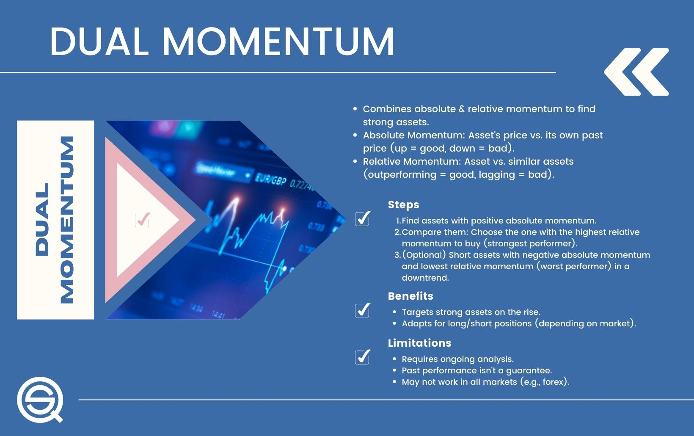

In the fast-paced world of algorithmic trading, momentum strategies have emerged as crucial tools for capturing and exploiting market trends. These strategies are based on the premise that assets which have performed well in the past will continue to do so, while those that have underperformed will likely persist in their downward trajectory. By leveraging momentum, traders can position themselves to capitalize on these continuing trends.

The integration of various momentum strategies can significantly enhance a trader's ability to optimize their portfolio. By combining different approaches, traders can diversify risk and improve potential returns. The synergy resulting from such a combination can serve as a substantial competitive advantage, particularly when market conditions are unpredictable. 



This article focuses on the intricate techniques and strategic methods for effectively combining different momentum strategies. It primarily concentrates on equity momentum strategies and various methods of strategy allocation. Equity momentum strategies include tactics applied specifically to stocks or stock indices, taking into account factors such as price and volume trends.

Furthermore, platforms like Quantpedia offer sophisticated, pre-coded solutions that facilitate strategy allocation. Quantpedia provides a comprehensive database of backtested trading strategies, including tools for multi-strategy allocation, making it easier for traders to implement complex combinations of momentum strategies. These platforms are instrumental in simplifying the process of strategy allocation, thereby allowing traders to focus more on strategy optimization and less on coding and backtesting.

This article will detail the methodologies for combining momentum strategies and the tools available for effective strategy allocation, providing actionable insights for traders aiming to strengthen their trading portfolios. By understanding and applying these techniques, traders can potentially achieve a more balanced risk-return profile in their trading activities.

## Table of Contents

## Understanding Momentum Strategies

Momentum strategies in trading center around capitalizing on the persistence of asset price trends, whether they involve individual stocks, ETFs, or other financial instruments. These strategies are predicated on the notion that assets which have performed well in the past will continue to perform well in the future, and vice versa for poorly performing assets. The successful application of [momentum](/wiki/momentum) strategies heavily depends on the timing of entry and [exit](/wiki/exit-strategy) points, allowing traders to ride the trend until signs of reversal emerge.

### Core Principles of Momentum Strategies

The primary goal of momentum strategies is to detect and exploit trends early in their lifecycle. Early detection allows traders to enter a position at an advantageous point with the intention of securing profits as the trend persists. Identifying the reversal point is equally crucial to avoid losses and capitalize on the gains accrued during the trend's lifetime.

Momentum trading can be formalized mathematically. One basic model involves calculating the momentum as the rate of change of price. For example:

$$
\text{Momentum} = P_t - P_{t-n}
$$

where $P_t$ is the price at time $t$, and $P_{t-n}$ is the past price at time $t-n$. A trader may go long on an asset if the momentum is positive and short if it is negative.

### Algorithmic Implementation

The advent of [algorithmic trading](/wiki/algorithmic-trading) has revolutionized how momentum strategies are executed. Trading algorithms can process large datasets rapidly, identify trends with greater speed and precision, and execute trades without the hesitation or errors that can affect human traders. Here's a simple example of how momentum strategies can be implemented using a trading algorithm in Python:

```python
import numpy as np
import pandas as pd

# Assume we have a DataFrame 'data' with a 'Close' column
data['Momentum'] = data['Close'] - data['Close'].shift(10)  # 10-period momentum
data['Signal'] = np.where(data['Momentum'] > 0, 1, -1)  # Buy signals where momentum is positive

# Backtest performance
data['StrategyReturns'] = data['Signal'].shift(1) * data['Returns']
cumulative_returns = (1 + data['StrategyReturns']).cumprod()
```

### Market Applications

Momentum strategies are applicable to a range of financial markets, including equities, commodities, and foreign exchange. For instance, in the US stock market, specific equities can be selected based on their past performance over a defined period, creating a portfolio that can potentially outperform standard benchmarks.

Some traders incorporate additional technical indicators to confirm trend strength or reversals, such as moving averages or the Relative Strength Index (RSI), to complement the pure momentum signal.

The intrinsic advantage of momentum strategies lies in their simplicity and adaptability across various markets and trading styles. However, challenges such as transaction costs and the risk of sudden market shifts must be accounted for. Strategies may need to be adjusted to account for different market conditions, requiring dynamic parameter adjustments and continuous monitoring.

## Challenges of Combining Multiple Strategies

Combining multiple momentum strategies in algorithmic trading presents several challenges that require careful consideration and skillful handling. One of the primary challenges is balancing the diverse risk and return profiles associated with different strategies. Each strategy inherently possesses its unique risk characteristics and expected returns, which can vary significantly based on market conditions and other factors. Therefore, traders must find a harmonious balance between exploiting high-return opportunities and mitigating risks.

Another critical [factor](/wiki/factor-investing) to address is the potential correlations between strategies. Correlation refers to the degree to which different strategies react to market movements. High correlation between strategies could amplify risks, particularly during market downturns, as simultaneous losses across correlated strategies can result in substantial portfolio drawdowns. Hence, understanding and managing these correlations is vital for minimizing risk. Statistical tools, such as correlation matrices, are often employed to analyze the relationships between strategies and optimize combinations accordingly.

Strategy overlap is also a key concern. Overlapping strategies may target similar market inefficiencies or utilize analogous signals, leading to redundant positions. This overlap can exacerbate risk rather than provide diversification benefits. Distinctiveness in strategy selection and execution is crucial to avoid unnecessary concentration risks.

Diversification plays a pivotal role in countering these challenges. By allocating capital across a range of strategies with low correlation, traders can smooth out the equity curve, reduce [volatility](/wiki/volatility-trading-strategies), and enhance the portfolio's risk-adjusted returns. Diversification is not solely about the number of strategies but the variety of their core mechanisms and underlying assumptions.

The different timeframes over which each strategy operates require harmonization. Short-term momentum strategies may capture quick, fleeting opportunities, whereas long-term strategies might exploit prolonged trends. Allocating appropriate resources and managing transition periods between these different timeframes ensures consistent performance and capital efficiency.

To tackle these challenges, advanced approaches like diversification-focused portfolio construction techniques and sophisticated optimization algorithms are utilized. Methods such as mean-variance optimization, factor analysis, and Monte Carlo simulations can aid in constructing a portfolio that effectively leverages multiple strategies.

In conclusion, the combination of multiple momentum strategies necessitates a multifaceted approach that balances risk and return profiles, diversifies effectively, manages correlations, minimizes strategy overlaps, and accounts for varying timeframes. Through diligent analysis and strategic allocation, traders can unlock significant potential in enhancing their portfolio performance.

## Key Momentum Strategies in Algo Trading

Momentum strategies in algorithmic trading are designed to capture the persistence of equity price trends, leveraging the behavioral tendencies of markets to chase winning stocks and avoid losers. In U.S. equities, several prominent momentum strategies are employed, each with its specific methodology and intention of exploiting market inefficiencies.

**Momentum Factor Effect in Stocks**

The momentum factor effect involves investing in stocks that have shown positive returns over a specific past period, assuming that they will continue to perform well in the future. This strategy relies on empirical evidence suggesting that stocks exhibiting strong relative performance over three to twelve months tend to maintain their trajectory for some time. A typical approach would be to rank stocks based on past returns and form a portfolio by selecting the top performers. This method requires regular rebalancing to ensure alignment with current momentum leaders.

**Residual Momentum Factor**

Residual momentum contrasts with the traditional momentum effect by focusing on the residuals of stock returns after accounting for market, size, and value effects. This involves regressing a stock’s returns against common factors and isolating the portion of returns not explained by these factors. Traders create portfolios based on stocks with high residual returns, banking on the persistence of unexplained momentum.

**Trend-following Effect in Stocks**

Trend-following strategies are predicated on the idea that prices move toward a particular direction over time, influenced by underlying economic dynamics or market sentiment. In algorithmic trading, moving averages are frequently used to identify trends. For instance, if a stock’s short-term moving average crosses above a longer-term average, it may signal a buy action, while the opposite indicates a sell action. This approach is effective in capturing ongoing trends and can be utilized with various timeframe parameters.

**Overlapping Momentum Portfolios**

Overlapping momentum portfolios diversify momentum risk by investing in multiple momentum strategies or periods concurrently. For example, a trader might simultaneously hold a 3-month, 6-month, and 12-month momentum portfolio, each re-balanced on different cycles. This method aims to capture different momentum signals and smooth returns across different market regimes.

**Similar Stock Short-term Momentum**

This strategy focuses on capitalizing on short-term gains by identifying stocks with similar patterns or characteristics that are witnessing price momentum. Short-term momentum is often attributed to event-driven factors, like earnings surprises or news announcements. Traders might develop models to detect clusters of stocks experiencing similar short-term momentum bursts and tactically allocate toward these groups for quick gains.

Incorporating these momentum strategies into an algorithmic trading framework requires a disciplined approach to data analysis, model testing, and execution efficiency to fully exploit the opportunities presented by market momentum while managing the risks associated with sudden reversals.

## Methods for Strategy Allocation

Strategy allocation is a critical aspect of achieving optimal risk-adjusted returns in algo trading. Various methods can be employed to allocate strategies effectively, each offering unique advantages and applications. Below are several popular methods for strategy allocation:

### Equal Weight Strategy Allocation
Equal Weight Strategy Allocation assigns an identical proportion of capital to each momentum strategy. This approach assumes all strategies have equal potential, thus offering simplicity and ease of implementation. It is particularly useful when lacking specific insights into the strategies' future performance. However, its limitation lies in not accounting for varying risk levels across strategies.

### Volatility Targeting
Volatility Targeting involves adjusting the allocation based on the predicted or realized volatility of the strategies. The goal is to maintain a consistent level of portfolio volatility. By increasing the allocation to strategies with lower volatility and reducing it for those with higher volatility, this method seeks to stabilize returns. Mathematically, it can involve calculating the target volatility ($\sigma_t$) and adjusting the weight ($w_i$) as follows:

$$
w_i = \frac{\sigma_t}{\sigma_i}
$$

Where $\sigma_i$ is the historical or forecasted volatility of the i-th strategy.

### Equal Risk Contribution
Equal Risk Contribution focuses on ensuring each strategy contributes equally to the overall portfolio risk. It requires solving an optimization problem where the risk contribution of each strategy is equalized. This method recognizes that risk, rather than capital, should be the balancing metric. By doing so, it maintains a diversified risk approach among strategies.

### Maximum Diversification
Maximum Diversification aims to maximize the diversification ratio of a portfolio, defined as the ratio of the weighted average asset volatility to the portfolio volatility. This method emphasizes benefiting from diversification effects by investing more in assets that improve the portfolio's diversification. It often results in a portfolio with superior risk-adjusted returns.

### Markowitz’s Mean-Variance Optimization
Markowitz's Mean-Variance Optimization uses historical returns and covariances to allocate assets in a way that optimizes the trade-off between expected return and risk (standard deviation). The optimization problem typically involves maximizing the Sharpe ratio or minimizing the variance for a given expected return. This method is mathematically expressed through the optimization of:

$$
\min_w \frac{1}{2} w^T \Sigma w - \lambda \mu^T w
$$

Where $w$ is the weight vector of assets, $\Sigma$ is the covariance matrix, $\mu$ is the vector of expected returns, and $\lambda$ is the risk aversion coefficient.

### Clustering and Cluster Risk Parity
Clustering and Cluster Risk Parity involve grouping strategies based on similarities in their return profiles or other characteristics. Once grouped, the Cluster Risk Parity method allocates risk equally across these clusters rather than individual strategies. This approach aims to enhance diversification by minimizing the impact of correlated strategies. Clustering can be implemented using algorithms like k-means or hierarchical clustering based on correlation matrices.

Each of these strategy allocation methods presents distinct advantages and should be selected based on the specific goals and characteristics of the trading portfolio. By understanding and employing these techniques, traders can optimize their portfolios to align with desired risk and return objectives.

## Case Study: Combining Momentum Strategies

In this case study, we evaluate the integration of five distinct momentum strategies tailored for the US stock market, utilizing advanced allocation techniques to assess the efficacy of each method. The aim is to identify optimal strategies for smoothing equity curves, minimizing drawdowns, and enhancing overall risk-return ratios.

### Momentum Strategies Used:
1. **Momentum Factor Effect in Stocks**: This strategy capitalizes on the tendency of assets with high returns over a specific past timeframe to continue performing well in the future.

2. **Residual Momentum Factor**: By focusing on the residual returns after removing the influence of common risk factors, this strategy identifies unique momentum opportunities within individual stocks.

3. **Trend-following Effect in Stocks**: This involves following market trends, buying stocks in upward trends, and shorting those in downward trends, based on moving averages or other trend indicators.

4. **Overlapping Momentum Portfolios**: This approach constructs portfolios at staggered intervals, reducing the timing risk associated with rebalancing and allowing continuous exposure to momentum.

5. **Similar Stock Short-term Momentum**: Targeting stocks with short-term price movements similar to a chosen benchmark, this strategy exploits transient momentum signals.

### Allocation Methods Applied:
The allocation methods chosen for this case study include:

- **Equal Weight Strategy Allocation**: Each momentum strategy receives an equal proportion of investment capital, simplifying the allocation but potentially ignoring differing risk profiles.

- **Volatility Targeting**: Allocates capital based on the volatility of each strategy, aiming for a predefined volatility level across the combined portfolio.

- **Equal Risk Contribution**: Ensures that each strategy contributes equally to the portfolio's overall risk, balancing the risk exposure among strategies.

- **Maximum Diversification**: Seeks to maximize the diversification ratio by allocating assets to reduce the overall portfolio risk without compromising returns.

- **Markowitz’s Mean-Variance Optimization**: Allocates assets by maximizing expected return for a given level of risk, using historical data to estimate future returns and volatilities.

- **Clustering and Cluster Risk Parity**: Groups similar strategies based on performance characteristics and allocates risk evenly across different clusters, rather than individual strategies.

### Real-Time Performance Analysis:
For empirical analysis, each allocation method was implemented over a defined period, simulating real-time investment conditions. Key performance metrics were evaluated, including:

- **Sharpe Ratio**: Assessed to compare the risk-adjusted return of each allocation strategy.

- **Max Drawdown**: Calculated to determine the largest peak-to-trough decline, highlighting risk exposure during adverse market conditions.

- **Equity Curve Smoothing**: Analyzed by reviewing the volatility and trajectory of the cumulative portfolio value over time.

### Results and Observations:
1. **Volatility Targeting** consistently achieved smoother equity curves by dynamically adjusting portfolio weights in response to market volatility changes.

2. **Equal Risk Contribution** proved effective in balancing risk among strategies, resulting in lower drawdowns compared to equal weight allocation.

3. **Maximum Diversification** demonstrated substantial improvements in the diversification ratio, providing a well-rounded risk-return profile.

4. **Markowitz’s Optimization** yielded high Sharpe Ratios, although it was more sensitive to accuracy in estimating future returns and risks.

5. **Clustering and Cluster Risk Parity** effectively minimized correlated risks by leveraging inherent differences in strategy clusters, enhancing the stability of returns.

In summary, the combination of advanced allocation methods with diverse momentum strategies can significantly enhance the risk-return characteristics of a trading portfolio. Selecting the appropriate method depends on the trader's risk tolerance, investment objectives, and market conditions.

## Results and Analysis

The analysis of combining various momentum strategies reveals significant insights into how distinct allocation methods influence trading performance and risk metrics. Each strategy, when paired with different allocation techniques, showcases unique outcomes, which are quantitatively assessed using statistical measures and visual tools such as graphs.

### Allocation Strategy Outcomes

1. **Equal Weight Strategy Allocation**: This approach involves assigning equal capital weight to each momentum strategy. While straightforward, it often leads to higher volatility due to the lack of consideration for individual strategy risk profiles. However, in periods of strong market trends, equal weight can capture substantial upside potential.

2. **Volatility Targeting**: By focusing on maintaining a consistent level of volatility, this method balances the risk across strategies. The Sharpe ratio, which measures risk-adjusted returns, typically improves under this allocation due to its responsive nature to changing market conditions. 

3. **Equal Risk Contribution**: This method aims to equalize the risk contribution from each strategy, based on their individual volatility. The result is a smoother equity curve, with reduced drawdowns compared to an equal-weighted approach. 

4. **Maximum Diversification**: This strategy enhances portfolio diversity by minimizing correlation between investments. While it often leads to lower volatility and improved risk-adjusted returns, its performance heavily relies on the accuracy of correlation estimates among the strategies.

5. **Markowitz’s Mean-Variance Optimization**: This sophisticated method calculates the optimal distribution of capital to maximize expected returns for a given level of risk. Despite its theoretical appeal, this method can be sensitive to input parameters, potentially causing deviations in real-market performance.

6. **Clustering and Cluster Risk Parity**: By grouping similar strategies and assigning risk parity within clusters, this allocation offers the twin benefits of diversification and risk balancing. The empirical evidence suggests enhanced performance stability and lower risk levels.

### Statistical Analysis

Empirical analysis compellingly illustrates the varying impacts of these allocation methods. Key performance indicators such as the Sharpe ratio, maximum drawdown, and annualized volatility provide a broad view of the strategy effectiveness:

- **Sharpe Ratio**: Strategies like Volatility Targeting and Cluster Risk Parity frequently achieved higher Sharpe ratios, indicating more efficient risk-reward balance.

- **Maximum Drawdown**: Cluster Risk Parity and Equal Risk Contribution strategies showcased the lowest drawdowns, highlighting their ability to mitigate risk during adverse market conditions.

- **Volatility**: Maximum Diversification and Volatility Targeting consistently demonstrated reduced annualized volatility, correlating with smoother equity performance.

### Conclusion

The comprehensive analysis indicates that while all examined allocation methods have merit, those focusing on risk-adjusted returns and diversification, such as Volatility Targeting and Cluster Risk Parity, generally outperform on both fronts of minimizing risk and enhancing returns. Therefore, traders are recommended to consider these strategies within their overall portfolio management, tailoring them according to their specific risk tolerance and market outlook preferences.

Overall, this analysis underscores the critical role of allocation strategy in amplifying the potential of combined momentum strategies, presenting an effective means to navigate the dynamic landscape of algo trading.

## Conclusion

Combining different momentum strategies in algorithmic trading offers significant advantages. A primary benefit is the potential for increased returns. By synergizing multiple strategies, traders can capture a broader range of market trends and opportunities. This translates to enhanced profit potential as each strategy may perform optimally under different market conditions. Moreover, the integration of diverse strategies allows for a reduction in overall portfolio risk. By diversifying across multiple momentum strategies, traders can smooth out volatility and lessen the impact of any single strategy's poor performance on the portfolio as a whole.

However, the combination of multiple strategies also presents challenges. Ensuring a harmonious balance between the risk-return profiles and managing correlations between strategies necessitates careful consideration and expertise. The overlapping of strategies could lead to redundancy, which may negate the diversification benefits. Traders must also navigate different timeframes and the complexity of implementing multiple algorithms simultaneously.

Sophisticated strategy allocation methods can address these challenges, making them crucial for traders aiming to maximize the benefits of combined momentum strategies. Tools such as Markowitz's Mean-Variance Optimization or Volatility Targeting enable traders to allocate resources efficiently, aligning with their risk tolerance and return expectations. By exploring these advanced allocation techniques, traders can strategically enhance their trading portfolios, optimizing both performance and resilience against market fluctuations. Encouraging the use of intelligent strategy allocation is essential for traders seeking to leverage the full potential of combining momentum strategies in algorithmic trading.

## References & Further Reading

[1]: Bergstra, J., Bardenet, R., Bengio, Y., & Kégl, B. (2011). ["Algorithms for Hyper-Parameter Optimization."](https://dl.acm.org/doi/10.5555/2986459.2986743) Advances in Neural Information Processing Systems 24.

[2]: ["Advances in Financial Machine Learning"](https://www.amazon.com/Advances-Financial-Machine-Learning-Marcos/dp/1119482089) by Marcos Lopez de Prado

[3]: ["Evidence-Based Technical Analysis: Applying the Scientific Method and Statistical Inference to Trading Signals"](https://www.amazon.com/Evidence-Based-Technical-Analysis-Scientific-Statistical/dp/0470008741) by David Aronson

[4]: ["Machine Learning for Algorithmic Trading"](https://github.com/stefan-jansen/machine-learning-for-trading) by Stefan Jansen

[5]: ["Quantitative Trading: How to Build Your Own Algorithmic Trading Business"](https://books.google.com/books/about/Quantitative_Trading.html?id=j70yEAAAQBAJ) by Ernest P. Chan