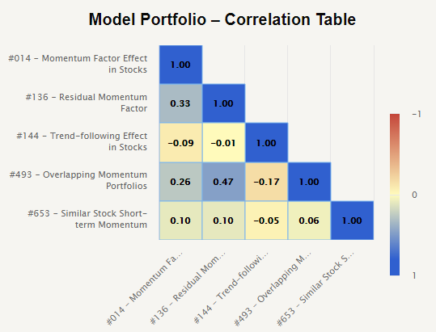

## Table of Contents

## What is a momentum strategy in investing?

A momentum strategy in investing is when you buy stocks or other assets that have been going up in price recently. The idea is that if a stock has been doing well, it will keep doing well for a while longer. So, investors using this strategy look for stocks that are on a winning streak and buy them, hoping to ride the wave of their continued success.

This approach is based on the belief that trends in the market can last longer than many people expect. It's like when you see a popular toy that everyone wants; its popularity might keep growing for some time before it fades. However, momentum investing can be risky because trends can change quickly. If the stock's price starts to fall, momentum investors might sell it fast to avoid losing money. So, while it can lead to big gains, it can also lead to big losses if the timing is off.

## How do different momentum strategies vary from one another?

Different momentum strategies can vary based on how long they look at past performance and how they decide to buy or sell. Some strategies might focus on short-term momentum, looking at how a stock has done over the last few weeks or months. Others might look at longer periods, like a year or more, to decide if a stock is on a good run. The time frame they choose can affect how often they trade and how much risk they take. Short-term strategies might lead to more trading and higher risk, while longer-term strategies might be less active and possibly less risky.

Another way momentum strategies can differ is in how they set rules for buying and selling. Some investors might use strict rules, like buying the top 10% of stocks that have done the best recently and selling them if they start to fall. Others might be more flexible, maybe looking at other things like how much the stock is worth or what's happening in the news. This can make a big difference in how the strategy works and how much it might earn or lose. So, while all momentum strategies aim to ride winning trends, the details of how they do it can lead to very different results.

## What are the basic steps to implement a simple momentum strategy?

To start a simple momentum strategy, first you need to pick a time frame to look at. This could be the last three months, six months, or even a year. You want to find stocks that have gone up a lot during this time. A common way to do this is to look at the stock's returns over your chosen period and rank them from best to worst. Then, you pick the top stocks, maybe the top 10 or 20 percent, to buy. This is because these stocks have shown strong momentum and you hope they will keep going up.

Once you have your list of stocks to buy, you need to decide when to sell them. A simple rule could be to sell a stock if it starts to go down by a certain amount, like 5 or 10 percent, from its highest price since you bought it. This helps you avoid big losses if the stock's momentum changes. Keep checking your stocks regularly to see if they are still doing well or if it's time to sell them and find new stocks with strong momentum. Remember, the key is to keep riding the winners until they start to lose steam.

## Can you explain the concept of time-series momentum?

Time-series momentum is a type of momentum strategy where you look at how a single stock or asset has been doing over time, not how it compares to other stocks. Instead of ranking stocks against each other, you focus on the stock's own past performance. If the stock has been going up in the recent past, you buy it, hoping it will keep going up. If it's been going down, you might sell it or avoid buying it, expecting it might keep falling.

This approach is different from relative momentum, where you compare stocks to each other. In time-series momentum, the decision to buy or sell is based only on the asset's own price history. For example, if a stock has been rising for the last six months, you might buy it, believing it will continue its upward trend. But if that same stock starts to drop, you might sell it to avoid further losses. This strategy relies on the idea that trends in a stock's price can persist for some time, making it important to keep an eye on how the stock is doing over time.

## How does cross-sectional momentum differ from time-series momentum?

Cross-sectional momentum and time-series momentum are two different ways to use momentum in investing. Cross-sectional momentum is about comparing different stocks to each other. You look at how well all the stocks have done over a certain time, like the last six months, and then you pick the ones that did the best. If a stock did better than most other stocks, you buy it, hoping it will keep doing better than the others. It's like [picking](/wiki/asset-class-picking) the fastest runner in a race and betting on them to keep leading.

On the other hand, time-series momentum focuses only on one stock or asset at a time. You don't compare it to other stocks. Instead, you look at how that one stock has been doing over time. If the stock has been going up, you buy it because you think it will keep going up. If it's been going down, you might sell it or not buy it, expecting it might keep falling. It's like watching a single runner and betting on them to keep running fast or slow based on their past performance, not how they compare to others.

## What are the key indicators used to identify momentum in stocks?

To spot momentum in stocks, one of the main things people look at is the stock's price change over time. They might check how much the stock's price has gone up or down in the last few weeks, months, or even a year. If the price has been going up a lot, that's a sign of positive momentum. People often use a tool called the moving average to see this trend. A moving average is just the average price of the stock over a certain time, and if the current price is above this average, it can mean the stock has good momentum.

Another important indicator is the stock's trading [volume](/wiki/volume-trading-strategy). This is how many shares of the stock are being bought and sold. If a lot of people are trading the stock and the price is going up, it can show strong momentum. It means more people are interested in the stock, which can push the price higher. Sometimes, investors also look at other things like the stock's relative strength index (RSI), which measures how fast the price is changing and if it might be overbought or oversold. If the RSI is high and the price is still going up, it can be another sign of strong momentum.

## How can an investor combine multiple momentum strategies to enhance returns?

An investor can mix different momentum strategies to try to get better returns by using both time-series and cross-sectional momentum. Time-series momentum looks at how a single stock has been doing over time. If it's been going up, you buy it, hoping it keeps going up. Cross-sectional momentum compares different stocks to each other. You buy the stocks that have been doing better than others. By using both, you can catch trends in single stocks and also take advantage of which stocks are leading the market. This mix can help you find more opportunities to make money.

Another way to boost returns is to use different time frames for momentum. Some strategies might look at short-term trends, like the last few weeks or months, while others might focus on longer periods, like a year. By combining short-term and long-term momentum, you can catch quick trends and also ride longer ones. This can help you stay in winning stocks longer and also jump on new trends as they start. Just remember, mixing strategies can make things more complicated, so it's important to keep track of how each part is doing and adjust as needed.

## What are the risks associated with combining different momentum strategies?

Combining different momentum strategies can make investing more complicated. When you mix strategies like time-series and cross-sectional momentum, or use different time frames, you have more things to keep an eye on. This can be hard to manage and might lead to mistakes. If you're not careful, you might buy and sell at the wrong times, which can hurt your returns. Also, using more strategies means you might trade more often, and each trade can cost money in fees and taxes, which can eat into your profits.

Another risk is that different momentum strategies might not always work well together. Sometimes, one strategy might tell you to buy a stock while another tells you to sell it. This can be confusing and make it hard to decide what to do. If the strategies clash a lot, you might end up not following any of them well, which can lead to worse results. It's important to understand how each strategy works and make sure they fit well together, or you might find that combining them doesn't help your returns as much as you hoped.

## How can one manage and rebalance a portfolio that uses multiple momentum strategies?

Managing a portfolio with multiple momentum strategies means you need to keep an eye on how each strategy is doing. You'll need to check your stocks regularly to see if they still fit the rules of your strategies. For example, if you're using both time-series and cross-sectional momentum, you might need to look at how each stock has been doing on its own and also how it's doing compared to other stocks. If a stock doesn't meet the rules anymore, like if it starts to go down after being on an upward trend, you might need to sell it and find a new stock that fits your strategies better. This can mean a lot of work, but it helps make sure your portfolio stays on track with your momentum goals.

Rebalancing your portfolio is also important when you're using multiple momentum strategies. This means you might need to adjust your investments to keep them in line with your strategies. If one strategy starts to do better than the others, you might want to put more money into the stocks that fit that strategy. Or if a strategy isn't working as well, you might want to take some money out of those stocks and put it into others that are doing better. Rebalancing can help you keep your portfolio strong and make the most of the momentum trends you're trying to follow. It's like making sure your team is always made up of the best players, even if that means switching some out from time to time.

## What advanced techniques can be used to optimize the performance of combined momentum strategies?

One advanced technique to optimize the performance of combined momentum strategies is to use something called risk parity. This means you spread your money across different strategies in a way that balances the risk each one brings. For example, if one strategy is riskier than the others, you might put less money into it. By doing this, you can make sure that no single strategy can hurt your portfolio too much if it doesn't work out. It's like making sure all the players on your team get a fair chance to contribute, without letting any one player's mistakes ruin the game.

Another technique is to use [machine learning](/wiki/machine-learning) to help you decide which stocks to buy and sell. Machine learning can look at a lot of data quickly and find patterns that might be hard for a person to see. It can help you figure out which momentum strategies are working best at any given time and adjust your portfolio accordingly. This can make your investing decisions smarter and more based on what's actually happening in the market. It's like having a super smart coach who can give you the best advice on how to play the game.

## How do macroeconomic factors influence the effectiveness of combined momentum strategies?

Macroeconomic factors like interest rates, inflation, and economic growth can really change how well combined momentum strategies work. When the economy is doing well and growing, stocks often go up, which can make momentum strategies look good. But if interest rates go up a lot, it can make borrowing more expensive, which might slow down the economy and make stocks go down. This can hurt momentum strategies because the trends they rely on might not last as long or might change direction quickly. So, it's important to keep an eye on what's happening in the bigger picture of the economy when you're using these strategies.

Also, different sectors of the economy can be affected differently by these big economic changes. For example, if inflation is high, companies that can easily raise their prices might do better than others. This can make some stocks look like they have strong momentum, even if it's just because of what's happening with inflation. So, when you're combining different momentum strategies, you need to think about how these big economic factors might be pushing certain stocks up or down. Understanding these influences can help you make better choices about which stocks to buy and when to sell them.

## What are the latest research findings on the efficacy of combining different momentum strategies?

Recent research has shown that combining different momentum strategies can help improve returns and reduce risk. By using both time-series and cross-sectional momentum, investors can catch more trends and make better use of the market's movements. Studies have found that this mix can lead to higher profits because it allows investors to take advantage of different kinds of momentum at the same time. For example, one study showed that a portfolio using both types of momentum did better than portfolios using just one type. This is because the different strategies can balance each other out, making the overall approach more stable.

However, the research also points out that combining strategies can be tricky. It's important to make sure the strategies work well together and don't clash too much. If they do, it can be hard to decide what to do with your investments. Some studies have found that using machine learning to help manage these combined strategies can make them work even better. Machine learning can look at a lot of data and find the best times to buy and sell, which can help investors make smarter choices. Overall, the latest findings suggest that combining momentum strategies can be a good way to boost returns, but it needs careful management to really work well.

## What is the understanding of Momentum Strategies?

Momentum strategies in trading center around capitalizing on the persistence of asset price trends, whether they involve individual stocks, ETFs, or other financial instruments. These strategies are predicated on the notion that assets which have performed well in the past will continue to perform well in the future, and vice versa for poorly performing assets. The successful application of [momentum](/wiki/momentum) strategies heavily depends on the timing of entry and [exit](/wiki/exit-strategy) points, allowing traders to ride the trend until signs of reversal emerge.

### Core Principles of Momentum Strategies

The primary goal of momentum strategies is to detect and exploit trends early in their lifecycle. Early detection allows traders to enter a position at an advantageous point with the intention of securing profits as the trend persists. Identifying the reversal point is equally crucial to avoid losses and capitalize on the gains accrued during the trend's lifetime.

Momentum trading can be formalized mathematically. One basic model involves calculating the momentum as the rate of change of price. For example:

$$
\text{Momentum} = P_t - P_{t-n}
$$

where $P_t$ is the price at time $t$, and $P_{t-n}$ is the past price at time $t-n$. A trader may go long on an asset if the momentum is positive and short if it is negative.

### Algorithmic Implementation

The advent of [algorithmic trading](/wiki/algorithmic-trading) has revolutionized how momentum strategies are executed. Trading algorithms can process large datasets rapidly, identify trends with greater speed and precision, and execute trades without the hesitation or errors that can affect human traders. Here's a simple example of how momentum strategies can be implemented using a trading algorithm in Python:

```python
import numpy as np
import pandas as pd

# Assume we have a DataFrame 'data' with a 'Close' column
data['Momentum'] = data['Close'] - data['Close'].shift(10)  # 10-period momentum
data['Signal'] = np.where(data['Momentum'] > 0, 1, -1)  # Buy signals where momentum is positive

# Backtest performance
data['StrategyReturns'] = data['Signal'].shift(1) * data['Returns']
cumulative_returns = (1 + data['StrategyReturns']).cumprod()
```

### Market Applications

Momentum strategies are applicable to a range of financial markets, including equities, commodities, and foreign exchange. For instance, in the US stock market, specific equities can be selected based on their past performance over a defined period, creating a portfolio that can potentially outperform standard benchmarks.

Some traders incorporate additional technical indicators to confirm trend strength or reversals, such as moving averages or the Relative Strength Index (RSI), to complement the pure momentum signal.

The intrinsic advantage of momentum strategies lies in their simplicity and adaptability across various markets and trading styles. However, challenges such as transaction costs and the risk of sudden market shifts must be accounted for. Strategies may need to be adjusted to account for different market conditions, requiring dynamic parameter adjustments and continuous monitoring.

## What are the methods for strategy allocation?

Strategy allocation is a critical aspect of achieving optimal risk-adjusted returns in algo trading. Various methods can be employed to allocate strategies effectively, each offering unique advantages and applications. Below are several popular methods for strategy allocation:

### Equal Weight Strategy Allocation
Equal Weight Strategy Allocation assigns an identical proportion of capital to each momentum strategy. This approach assumes all strategies have equal potential, thus offering simplicity and ease of implementation. It is particularly useful when lacking specific insights into the strategies' future performance. However, its limitation lies in not accounting for varying risk levels across strategies.

### Volatility Targeting
Volatility Targeting involves adjusting the allocation based on the predicted or realized [volatility](/wiki/volatility-trading-strategies) of the strategies. The goal is to maintain a consistent level of portfolio volatility. By increasing the allocation to strategies with lower volatility and reducing it for those with higher volatility, this method seeks to stabilize returns. Mathematically, it can involve calculating the target volatility ($\sigma_t$) and adjusting the weight ($w_i$) as follows:

$$
w_i = \frac{\sigma_t}{\sigma_i}
$$

Where $\sigma_i$ is the historical or forecasted volatility of the i-th strategy.

### Equal Risk Contribution
Equal Risk Contribution focuses on ensuring each strategy contributes equally to the overall portfolio risk. It requires solving an optimization problem where the risk contribution of each strategy is equalized. This method recognizes that risk, rather than capital, should be the balancing metric. By doing so, it maintains a diversified risk approach among strategies.

### Maximum Diversification
Maximum Diversification aims to maximize the diversification ratio of a portfolio, defined as the ratio of the weighted average asset volatility to the portfolio volatility. This method emphasizes benefiting from diversification effects by investing more in assets that improve the portfolio's diversification. It often results in a portfolio with superior risk-adjusted returns.

### Markowitz’s Mean-Variance Optimization
Markowitz's Mean-Variance Optimization uses historical returns and covariances to allocate assets in a way that optimizes the trade-off between expected return and risk (standard deviation). The optimization problem typically involves maximizing the Sharpe ratio or minimizing the variance for a given expected return. This method is mathematically expressed through the optimization of:

$$
\min_w \frac{1}{2} w^T \Sigma w - \lambda \mu^T w
$$

Where $w$ is the weight vector of assets, $\Sigma$ is the covariance matrix, $\mu$ is the vector of expected returns, and $\lambda$ is the risk aversion coefficient.

### Clustering and Cluster Risk Parity
Clustering and Cluster Risk Parity involve grouping strategies based on similarities in their return profiles or other characteristics. Once grouped, the Cluster Risk Parity method allocates risk equally across these clusters rather than individual strategies. This approach aims to enhance diversification by minimizing the impact of correlated strategies. Clustering can be implemented using algorithms like k-means or hierarchical clustering based on correlation matrices.

Each of these strategy allocation methods presents distinct advantages and should be selected based on the specific goals and characteristics of the trading portfolio. By understanding and employing these techniques, traders can optimize their portfolios to align with desired risk and return objectives.

## References & Further Reading

[1]: Bergstra, J., Bardenet, R., Bengio, Y., & Kégl, B. (2011). ["Algorithms for Hyper-Parameter Optimization."](https://dl.acm.org/doi/10.5555/2986459.2986743) Advances in Neural Information Processing Systems 24.

[2]: ["Advances in Financial Machine Learning"](https://www.amazon.com/Advances-Financial-Machine-Learning-Marcos/dp/1119482089) by Marcos Lopez de Prado

[3]: ["Evidence-Based Technical Analysis: Applying the Scientific Method and Statistical Inference to Trading Signals"](https://www.amazon.com/Evidence-Based-Technical-Analysis-Scientific-Statistical/dp/0470008741) by David Aronson

[4]: ["Machine Learning for Algorithmic Trading"](https://github.com/stefan-jansen/machine-learning-for-trading) by Stefan Jansen

[5]: ["Quantitative Trading: How to Build Your Own Algorithmic Trading Business"](https://books.google.com/books/about/Quantitative_Trading.html?id=j70yEAAAQBAJ) by Ernest P. Chan