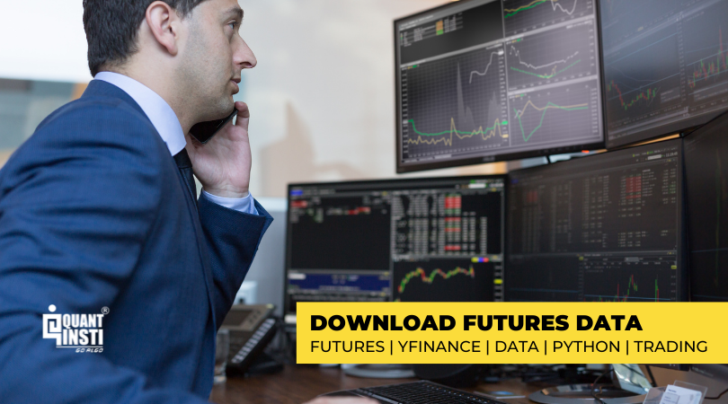

## Table of Contents

## What is Yahoo Finance and why is it useful for data analysis?

Yahoo Finance is a website that gives you lots of information about money and businesses. It has stock prices, news about companies, and other financial data that people can use to make decisions about buying and selling stocks or understanding the economy. You can find out how much a company's stock is worth right now, how it has changed over time, and what experts think about it.

Yahoo Finance is useful for data analysis because it gives you easy access to a lot of financial data all in one place. If you want to study how a company is doing, you can look at its stock price history, financial reports, and news articles. This helps people who want to invest money or just learn more about businesses. By using the data on Yahoo Finance, you can make charts and graphs to see patterns and make better decisions.

## What are the prerequisites for downloading data from Yahoo Finance using Python?

To download data from Yahoo Finance using Python, you need to have Python installed on your computer. You also need to install a special tool called `yfinance`. This tool helps you connect to Yahoo Finance and get the data you need. You can install `yfinance` by using a command in your computer's terminal or command prompt. The command is `pip install yfinance`. Once you have these things set up, you can start writing Python code to download the data.

You should also know some basic Python programming. This means understanding how to write and run Python scripts. If you are new to Python, you might want to learn about variables, loops, and how to use libraries. These are important because they help you handle the data you get from Yahoo Finance. Once you have a good grasp of these basics, you'll be ready to use `yfinance` to download stock prices, financial reports, and other data from Yahoo Finance.

## How do you install the necessary Python libraries to access Yahoo Finance data?

To install the necessary Python libraries to access Yahoo Finance data, you need to use a tool called pip. Pip is a package manager for Python that helps you install and manage other Python libraries. The library you need to install is called `yfinance`. You can install it by opening your computer's terminal or command prompt and typing the command `pip install yfinance`. After you press enter, pip will download and install the `yfinance` library for you. This process might take a few moments, depending on your internet connection.

Once `yfinance` is installed, you can start using it in your Python scripts. Make sure you have Python already installed on your computer. If you don't have Python, you need to download and install it first from the official Python website. After you have both Python and `yfinance` set up, you can write code to get data from Yahoo Finance. This setup makes it easy to work with financial data in your Python programs.

## What is the basic code structure to download historical stock data from Yahoo Finance?

To download historical stock data from Yahoo Finance using Python, you first need to make sure you have the `yfinance` library installed. Once it's installed, you can start by importing the library in your Python script with the line `import yfinance as yf`. After that, you choose a stock symbol, like 'AAPL' for Apple Inc. You create a ticker object by writing `ticker = yf.Ticker('AAPL')`. This object lets you access all the data for that stock from Yahoo Finance.

Next, you download the historical data using the `history` method of the ticker object. You can specify the start and end dates for the data you want. For example, to get data from January 1, 2020, to December 31, 2020, you write `data = ticker.history(start='2020-01-01', end='2020-12-31')`. This command will give you a DataFrame with columns like 'Open', 'High', 'Low', 'Close', and 'Volume'. You can then use this data for analysis or save it to a file for later use.

## How can you specify a date range when downloading data from Yahoo Finance?

To specify a date range when downloading data from Yahoo Finance, you need to use the `history` method of the ticker object. This method lets you set a start date and an end date for the data you want. For example, if you want data from January 1, 2020, to December 31, 2020, you would write `data = ticker.history(start='2020-01-01', end='2020-12-31')`. This tells the `yfinance` library to get all the data for those dates.

When you run this code, you will get a DataFrame with the stock's data for the specified period. The DataFrame will have columns like 'Open', 'High', 'Low', 'Close', and 'Volume'. You can then use this data to look at how the stock did over that time or save it for later analysis.

## What types of financial data can you download from Yahoo Finance using Python?

You can download many different types of financial data from Yahoo Finance using Python. This includes stock prices like the opening price, highest price, lowest price, and closing price of a stock for any day. You can also get the trading [volume](/wiki/volume-trading-strategy), which shows how many shares were bought and sold. Besides daily data, you can download weekly or monthly data too. This helps you see how a stock has done over longer periods.

Another type of data you can get is financial statements. These include income statements, balance sheets, and cash flow statements for companies. This information is useful if you want to understand a company's financial health. You can also download analyst recommendations, which tell you what experts think about a stock. This can help you decide if you should buy, sell, or hold a stock. With all this data, you can do a lot of analysis to make smart decisions about investing.

## How do you handle errors and exceptions when downloading data from Yahoo Finance?

When downloading data from Yahoo Finance using Python, you might run into errors or problems. These can happen because of bad internet, if Yahoo Finance is not working right, or if you type something wrong. To handle these problems, you can use something called "try and except" in your code. This lets you try to get the data, and if it doesn't work, you can do something else instead of stopping your program.

For example, you can use a "try" block to try downloading the data. If it fails, the "except" block will catch the error and let you do something like print a message saying there was a problem, or wait a bit and try again. This makes your program more reliable because it can keep going even if something goes wrong. By using these tools, you can make sure your program works smoothly and handles any issues that come up when getting data from Yahoo Finance.

## How can you download data for multiple stocks simultaneously from Yahoo Finance?

To download data for multiple stocks at the same time from Yahoo Finance, you can use a loop in your Python code. First, you make a list of the stock symbols you want, like 'AAPL' for Apple and 'GOOGL' for Google. Then, you use a "for" loop to go through each symbol in the list. Inside the loop, you create a ticker object for each stock and use the `history` method to get the data. This way, you can download data for all the stocks in your list one after the other.

After you have the data for all the stocks, you can put it together into one big DataFrame. You can use a tool called `pandas` to help with this. You start by making an empty DataFrame, and then you add the data for each stock to it. This makes it easy to look at and compare the data for all the stocks at once. By doing it this way, you can quickly get and work with data for many stocks from Yahoo Finance.

## What are some advanced data manipulation techniques you can apply to the downloaded Yahoo Finance data?

After downloading data from Yahoo Finance, you can use advanced techniques to learn more from it. One way is to use something called "technical analysis." This means you look at the data to find patterns that might help you guess what will happen next with the stock price. You can calculate things like moving averages, which smooth out the price over time, or the Relative Strength Index (RSI), which tells you if a stock is overbought or oversold. These tools help you see trends and make better decisions about buying or selling stocks.

Another technique is to use "pandas" to clean and organize your data. You might find that some data is missing or not in the right format. With pandas, you can fill in missing values, change the data to a better format, and even combine data from different stocks into one big table. This makes it easier to compare and analyze the data. You can also use pandas to create new columns, like calculating the daily return of a stock, which shows how much the stock price changed from one day to the next. This helps you understand the stock's performance better.

Lastly, you can use "visualization" tools like "matplotlib" or "seaborn" to make charts and graphs. Seeing the data in pictures can help you spot patterns and trends that are hard to see in numbers alone. You can make line charts to show how the stock price has changed over time, or use bar charts to compare the performance of different stocks. By using these advanced techniques, you can get a deeper understanding of the financial data you download from Yahoo Finance.

## How can you automate the process of downloading and updating Yahoo Finance data regularly?

To automate the process of downloading and updating Yahoo Finance data regularly, you can use a tool called a "cron job" on your computer. A cron job is like setting an alarm clock for your computer. You tell it to run a Python script at certain times, like every day at 8 AM. In your Python script, you use the `yfinance` library to download the data you need. You can save this data into a file, like a CSV or Excel file, so you can use it later. This way, you don't have to remember to download the data yourself every day. The computer does it for you automatically.

Once you have set up the cron job, your computer will run the Python script at the times you told it to. Each time it runs, the script will get the latest data from Yahoo Finance. You can even set it up to check if the data is new before saving it, so you don't end up with a lot of repeated information. This makes sure your data is always up to date without you having to do anything extra. It's a good way to keep your financial analysis current and save time.

## What are the limitations and considerations when using Yahoo Finance data for financial analysis?

When using Yahoo Finance data for financial analysis, there are some things to keep in mind. First, the data might not always be completely accurate or up-to-date. Sometimes, there can be delays in the data, or it might be wrong because of technical problems or mistakes in how it's collected. This means you should double-check important information with other sources if you can. Also, Yahoo Finance might not have all the data you need for every company, especially smaller ones or those not listed on major stock exchanges. This can limit the kinds of analysis you can do.

Another thing to consider is that Yahoo Finance's data is mostly for individual stocks and basic financial information. If you need more detailed or special kinds of data, like insider trading information or more in-depth financial reports, you might need to look elsewhere. Also, remember that past stock prices and financial data don't always tell you what will happen in the future. So, while Yahoo Finance data can be a good starting point, it's important to use it along with other tools and sources to make the best decisions about investing or analyzing the market.

## How can you integrate Yahoo Finance data with other data sources for more comprehensive analysis?

To make your financial analysis better, you can mix Yahoo Finance data with information from other places. For example, you can use data from government reports, like those from the U.S. Bureau of Labor Statistics, to see how the economy is doing. This can help you understand how economic trends might affect stock prices. You can also get data from financial news websites or special financial databases like Bloomberg or Reuters. These sources might give you more detailed information about companies, like insider trading or analyst forecasts, which Yahoo Finance might not have.

To put all this data together, you can use Python with libraries like pandas. Pandas lets you bring in data from different places and put it into one big table. For example, you can download stock prices from Yahoo Finance and then add economic indicators from government reports. Once you have everything in one place, you can look for patterns and connections between different kinds of data. This can help you make smarter decisions about investing or understanding the market better. By using data from many sources, you get a fuller picture of what's going on.

## References & Further Reading

[1]: ["yfinance GitHub Repository"](https://github.com/ranaroussi/yfinance) - The official repository for the yfinance library, providing resources, documentation, and updates.

[2]: ["Python for Data Analysis"](https://wesmckinney.com/book/) by Wes McKinney - A comprehensive guide covering data analysis techniques in Python, including usage of libraries like pandas, which integrate with yfinance.

[3]: ["Algorithmic Trading: Winning Strategies and Their Rationale"](https://www.wiley.com/en-us/Algorithmic+Trading%3A+Winning+Strategies+and+Their+Rationale-p-9781118460146) by Ernie Chan - Offers insights into developing and implementing trading strategies programmatically.

[4]: ["The Art of Python Real-Time Processing with Web Servers and HTML5"](https://realpython.com/python-web-applications/) by Deitel & Associates - Discusses real-time data processing which can relate to integrating yfinance data in live trading systems.

[5]: ["Pandas Documentation"](https://pandas.pydata.org/docs/) - Official documentation for pandas, essential for manipulating and analyzing data obtained through yfinance.

[6]: ["Quantitative Finance using Python"](https://www.learndatasci.com/tutorials/python-finance-part-2-intro-quantitative-trading-strategies/) by Avinash Chugh - Explores the use of Python in quantitative trading, providing use cases relevant to yfinance's data retrieval capabilities.