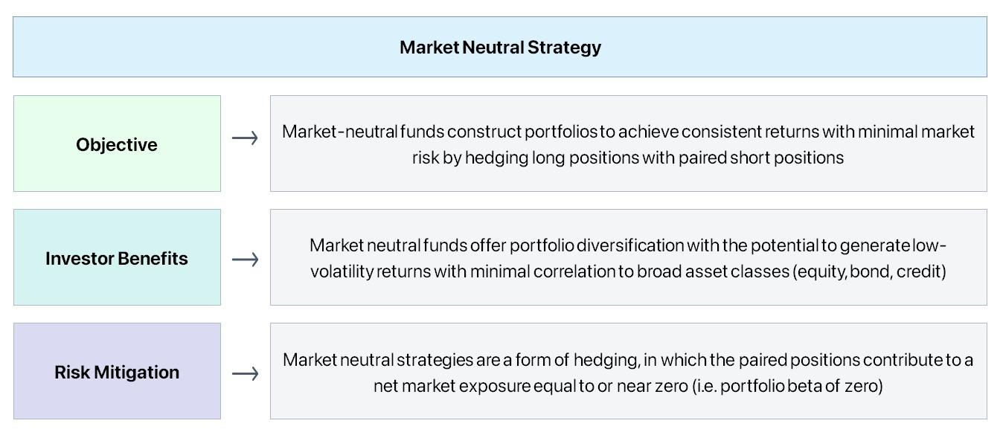

## Table of Contents

## What is a market-neutral strategy?

A market-neutral strategy is a way of investing that tries to make money no matter if the overall market goes up or down. It does this by balancing investments in a way that the gains from some investments can offset the losses from others. For example, an investor might buy some stocks they think will go up and also sell short other stocks they think will go down. By doing this, the strategy aims to have a net zero exposure to the market's movements, focusing instead on the performance differences between the selected stocks.

This strategy often uses pairs trading, where an investor buys one stock and sells short a related stock. If the stocks are in the same industry, the investor hopes that the bought stock will do better than the sold stock. Market-neutral strategies can also use other financial instruments like futures and options to hedge against market risks. While these strategies can reduce risk, they are not risk-free and require careful management and analysis to be successful.

## Why would an investor choose a market-neutral strategy?

An investor might choose a market-neutral strategy because it can help them make money even when the overall market is not doing well. This strategy tries to balance out the ups and downs of the market by making sure that gains from some investments can cover losses from others. For example, if an investor thinks one stock will go up and another will go down, they can buy the first stock and sell the second one short. This way, they are not betting on the whole market going up or down, but on the difference in performance between the two stocks.

Another reason to use a market-neutral strategy is to reduce risk. By balancing investments, the strategy aims to have a net zero exposure to the market's movements. This can be appealing to investors who want to protect their money from big market swings. However, it's important to know that while this strategy can lower risk, it's not completely safe. It still needs careful watching and smart choices to work well.

## What are the basic components of a market-neutral strategy?

A market-neutral strategy has two main parts. The first part is buying stocks that an investor thinks will go up in value. These are called "long" positions. The second part is selling stocks that the investor thinks will go down in value. This is called "short" selling. By doing both, the investor tries to make money no matter if the market goes up or down. The goal is to balance the gains from the long positions with the losses from the short positions, so the overall investment is not affected by the market's ups and downs.

Another important part of a market-neutral strategy is using other financial tools like futures and options. These tools can help protect against big market changes. For example, an investor might use futures to hedge their bets, making sure that if the market moves against them, they have a way to limit their losses. This part of the strategy helps make the investment more stable and less risky. However, even with these tools, a market-neutral strategy still needs careful watching and smart choices to work well.

## How can one identify pairs for a pairs trading strategy?

To identify pairs for a pairs trading strategy, you need to find two stocks that are related to each other. These stocks should be in the same industry or have a strong connection, like two car companies or two tech companies. The idea is to pick one stock that you think will do better than the other. You can look at how these stocks have moved together in the past. If they usually go up and down together, they might be a good pair for trading.

Once you have found a pair, you need to watch their prices closely. You will buy the stock that you think will do better and sell short the stock that you think will do worse. The goal is to make money from the difference in their performance. This means you are not betting on the whole market going up or down, but on one stock doing better than the other. It's important to keep an eye on both stocks and be ready to make changes if the market shifts.

## What are the common statistical methods used in market-neutral strategies?

Common statistical methods used in market-neutral strategies include correlation analysis and cointegration analysis. Correlation analysis looks at how closely two stocks move together. If two stocks usually go up and down at the same time, they have a high correlation. This can help traders find pairs for pairs trading. They will pick one stock to buy and another to sell short, hoping the bought stock will do better than the sold one.

Cointegration analysis is another method used in market-neutral strategies. It is a bit more complex than correlation analysis. Cointegration looks at the long-term relationship between two stocks. Even if the stocks do not move together every day, they might have a stable relationship over time. This helps traders find pairs that might not seem related at first but can still be used for pairs trading. Both methods help traders make smart choices about which stocks to trade to balance out their investments.

## How does one calculate beta and use it in a market-neutral portfolio?

Beta is a way to measure how much a stock moves compared to the whole market. If a stock has a beta of 1, it moves the same way as the market. If it has a beta of 2, it moves twice as much as the market. To calculate beta, you look at the stock's returns and the market's returns over time. You then find how closely the stock's movements match the market's movements. This helps you see if the stock is more or less risky than the market.

In a market-neutral portfolio, you use beta to balance your investments. You want to make sure that the total beta of your portfolio is close to zero. This means you will buy stocks with a positive beta and sell short stocks with a negative beta. For example, if you buy a stock with a beta of 1.5, you might sell short a stock with a beta of -1.5. By doing this, you can reduce the impact of market movements on your portfolio. The goal is to make money from the difference in performance between the stocks you buy and sell, not from the market going up or down.

## What are the risks associated with market-neutral strategies?

Market-neutral strategies try to make money no matter if the market goes up or down. But they still have risks. One big risk is that the stocks you pick might not do what you expect. If the stock you buy goes down and the one you sell short goes up, you could lose money. This can happen even if you use smart methods like correlation and cointegration to pick your pairs.

Another risk is that market-neutral strategies can be hard to manage. You need to keep a close eye on your investments and be ready to make changes if the market shifts. This takes a lot of time and skill. Also, using tools like futures and options to hedge your bets can add more costs and complexity. Even though these strategies aim to reduce risk, they are not completely safe and need careful handling to work well.

## How can leverage be used effectively in market-neutral strategies?

Leverage can be used in market-neutral strategies to boost potential returns. Imagine you have a strategy where you buy one stock and sell another short. If you use leverage, you can borrow money to buy more of the stock you think will go up and sell more of the stock you think will go down. This means you can make more money if your picks are right. But, it's a double-edged sword because if your picks are wrong, you can also lose more money.

Using leverage effectively in market-neutral strategies needs careful management. You have to keep a close eye on your investments and be ready to make changes if the market shifts. Also, you need to understand the costs of borrowing money, as these can eat into your profits. While leverage can make your strategy more powerful, it also makes it riskier, so it's important to use it wisely and not overdo it.

## What are the differences between long/short equity and market-neutral strategies?

Long/short equity and market-neutral strategies are both ways to invest in the stock market, but they have some key differences. In a long/short equity strategy, an investor buys stocks they think will go up (long positions) and sells stocks they think will go down (short positions). The goal is to make money from the stocks that go up and also from the stocks that go down. This strategy can still be affected by the overall market's ups and downs because it doesn't aim to balance out the market's movements completely.

On the other hand, a market-neutral strategy tries to make money no matter if the market goes up or down. It does this by balancing the long and short positions so that the total effect of the market's movements is close to zero. This means an investor will buy stocks they think will do better than others and sell short stocks they think will do worse. The focus is on the difference in performance between the stocks, not on the overall market direction. This makes market-neutral strategies less risky than long/short equity strategies, but they still need careful management to work well.

## How can one monitor and adjust a market-neutral strategy to maintain neutrality?

To keep a market-neutral strategy working well, you need to watch it closely and make changes when needed. This means checking the stocks you bought and the ones you sold short to see if they are still doing what you expected. If the stock you bought starts to go down, or the one you sold short starts to go up, you might need to adjust your positions. This could mean buying more of the stock that's doing well, selling more of the one that's doing poorly, or even changing the stocks you are using altogether.

Keeping the total effect of the market's movements close to zero is key. You can use tools like beta to help with this. Beta tells you how much a stock moves compared to the market. If you have stocks with a positive beta, you need to balance them with stocks that have a negative beta. By doing this, you can make sure that your strategy stays market-neutral. It takes a lot of time and skill to keep everything in balance, but it's important for the strategy to work as planned.

## What advanced techniques can be used to enhance the performance of a market-neutral strategy?

One advanced technique to boost a market-neutral strategy is using [machine learning](/wiki/machine-learning). This means using computers to look at a lot of data and find patterns that might be hard for people to see. For example, a computer can look at how stocks have moved in the past and use that to guess how they might move in the future. This can help pick better pairs of stocks to buy and sell short. Machine learning can also help keep an eye on the strategy and make quick changes when needed, making it easier to stay market-neutral.

Another technique is using more complex financial tools like options and futures. These tools can help protect against big market changes and make the strategy more stable. For example, you can use options to set a limit on how much you might lose if a stock goes down a lot. Futures can help you balance out the risk from the stocks you are buying and selling. Using these tools needs a good understanding of how they work, but they can make a market-neutral strategy work better and be less risky.

## How do regulatory and tax considerations impact market-neutral strategies?

Regulatory and tax rules can affect how well a market-neutral strategy works. Different countries have different rules about what investors can do. For example, some places might have limits on selling stocks short, which is a big part of market-neutral strategies. Also, rules about how much money you can borrow to invest can affect how much you can use leverage. It's important to know these rules and follow them, or you could get in trouble or have to change your strategy.

Taxes can also make a difference in how much money you keep from your investments. When you make money from buying and selling stocks, you usually have to pay taxes on those gains. But the tax rules can be different depending on if you are holding the stocks for a short time or a long time. Also, the way you use leverage and other financial tools can change how much tax you owe. Knowing the tax rules can help you plan your strategy better and keep more of your profits.

## References & Further Reading

[1]: Bergstra, J., Bardenet, R., Bengio, Y., & Kégl, B. (2011). ["Algorithms for Hyper-Parameter Optimization."](https://papers.nips.cc/paper_files/paper/2011/hash/86e8f7ab32cfd12577bc2619bc635690-Abstract.html) Advances in Neural Information Processing Systems 24.

[2]: ["Advances in Financial Machine Learning"](https://www.amazon.com/Advances-Financial-Machine-Learning-Marcos/dp/1119482089) by Marcos Lopez de Prado

[3]: ["Evidence-Based Technical Analysis: Applying the Scientific Method and Statistical Inference to Trading Signals"](https://www.wiley.com/en-gb/Evidence+Based+Technical+Analysis:+Applying+the+Scientific+Method+and+Statistical+Inference+to+Trading+Signals-p-9780470008744) by David Aronson

[4]: ["Machine Learning for Algorithmic Trading"](https://www.amazon.com/Machine-Learning-Algorithmic-Trading-intelligence/dp/9918608013) by Stefan Jansen

[5]: ["Quantitative Trading: How to Build Your Own Algorithmic Trading Business"](https://www.amazon.com/Quantitative-Trading-Build-Algorithmic-Business/dp/0470284889) by Ernest P. Chan