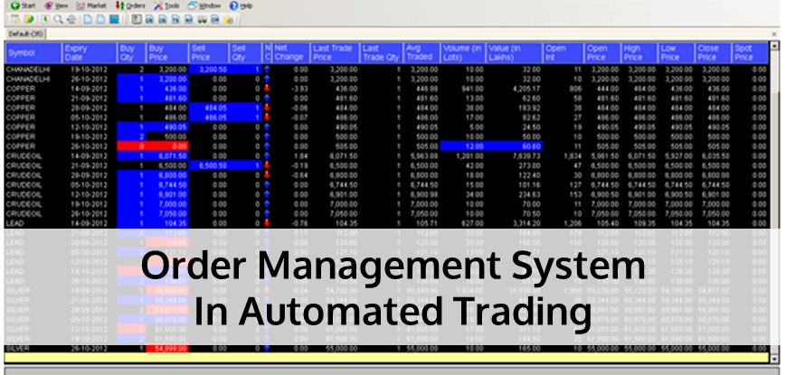

Evaluating and choosing an OMS (Order Management System) requires a meticulous approach, especially for a hedge fund where operations are complex and speed and efficiency are paramount. Here's a more specific and technical guide to making that choice:

**1. Basic OMS features**:

- **Order routing**: OMS must enable frictionless routing of orders to different brokers or trading platforms.
- **Multi-asset**: It must handle a wide range of financial instruments: equities, bonds, derivatives, swaps, etc.
- **Customizable workflows**: The ability to tailor workflows to the specific needs of the hedge fund is crucial.

**2. Technology integration**:

- **API connectivity**: OMS should provide a robust API interface for integration with other systems.
- **EMS compatibility**: Seamless integration with Execution Management Systems is essential for trading operations.
- **Support for standard protocols**: FIX (Financial Information eXchange) is the industry-standard communication protocol. OMS must support it.

**3. Risk management and compliance**:

- **Pre-trade checks**: OMS must perform checks prior to execution, such as verifying risk limits.
- **Real-time monitoring**: Ability to monitor risk exposures in real time to prevent exceeding limits.

**4. Performance and scalability**:

- **Low latency**: In trading, speed is vital. A good OMS must guarantee minimal latency.
- **Processing capacity**: OMS must be able to handle a large number of orders simultaneously without slowing down.

**5. Security and infrastructure**:

- **Encryption**: All data, in transit and at rest, must be encrypted.
- **Authentication**: Strong authentication mechanisms must be in place.
- **Disaster recovery plan**: WHO must have a disaster recovery plan in place.

**6. Analysis and reporting services**:

- **Transaction Cost Analysis (TCA)**: WHO must provide a detailed analysis of the costs associated with each transaction.
- **Regulatory reporting**: Automatic generation of reports to meet regulatory requirements.

**7. Costs and business model**:

- In addition to the purchase or license cost, consider hidden costs such as maintenance, upgrade or training costs.

**8. Support and training**:

- The supplier must offer rapid assistance in the event of problems, and have a competent technical team.

When selecting a supplier, give preference to a trial period or demo to test the platform in real-life conditions. Don't hesitate to ask for feedback from peers or other industry professionals.

Here are a few OMS (Order Management Systems) names that are popular and widely used in the financial industry:

- **FlexTrade**: A widely recognized multi-asset order and execution management system.
- **Eze Software (Eze OMS)**: A comprehensive solution covering many facets of the investment management lifecycle.
- **Charles River Development (CRD)**: An integrated system offering a full range of front and middle office functionality.
- **Fidessa**: Although traditionally focused on equity trading, it has extended its coverage to other asset classes.
- **BlackRock's Aladdin**: Used not only for order management, but also for risk and portfolio management.
- **Bloomberg AIM (Asset and Investment Manager)**: This is a global solution that combines data, trading and post-trade operations.
- **Thinkfolio**: Often used by asset managers for its flexibility and ability to adapt to different workflows.
- **Advent's Geneva & APX**: These are mainly back-office oriented, but also offer order management functionalities.

It is important to note that the choice of OMS should be based on the specific needs of the [hedge fund](/wiki/hedge-fund-trading-strategies) or institution. It is advisable to [carry](/wiki/carry-trading) out a thorough evaluation, consult demos and, if possible, obtain feedback before making a decision.