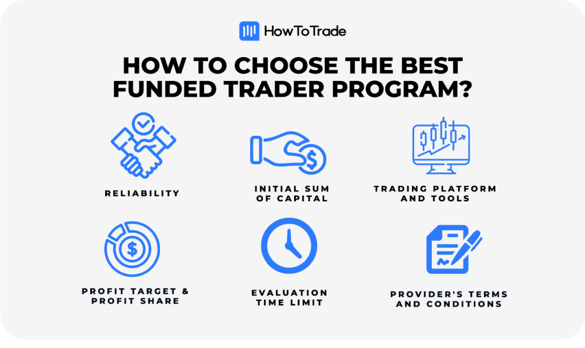

## Table of Contents

## What is trading and why might someone need funding for it?

Trading is when people buy and sell things like stocks, currencies, or goods to make money. They hope to buy something at a low price and sell it later at a higher price. People trade in markets, which can be places like stock exchanges or online platforms. Trading can be risky because the prices of what you're trading can go up and down a lot.

Someone might need funding for trading because they need money to start trading. If they want to buy stocks or other things to trade, they need money to do that. Sometimes, people borrow money to trade because they think they can make more money than what they borrowed. This can help them trade more and possibly make bigger profits, but it also makes trading riskier because if the prices go down, they could lose more money than they started with.

## What are the different types of trading that can be funded?

There are different types of trading that people might need funding for. One type is stock trading, where people buy and sell shares of companies. They hope the price of the stock will go up so they can sell it for more than they paid. Another type is forex trading, where people trade different currencies. They might buy US dollars with euros, hoping the dollar will become worth more euros later. Both of these need money to start because you have to buy the stocks or currencies first.

Another type of trading is commodity trading, where people buy and sell things like gold, oil, or wheat. They might buy gold when the price is low and sell it when the price goes up. There's also futures trading, where people agree to buy or sell something at a future date for a price they set now. This can be used for things like oil or corn. All these types of trading need money upfront to buy the things being traded, which is why people might need funding.

Lastly, there's options trading, where people buy the right to buy or sell something at a certain price in the future. This can be used with stocks or commodities. People might need funding for options trading because they have to pay for the option upfront. Each type of trading has different risks and needs different amounts of money to start, so funding can help people get into these markets.

## What are the basic requirements to qualify for trading funding?

To qualify for trading funding, you usually need to show that you know how to trade well. This means you have to prove you can make money from trading. Many funding companies want to see a record of your past trades to check if you are good at it. They might ask for things like your trading history, how much money you made or lost, and maybe even some tests to see how well you understand trading.

Another important thing is having enough money to start with. Even though you are getting funding, you might still need to put in some of your own money as a kind of promise that you will trade carefully. This is called a deposit or margin. Also, being honest and following the rules is very important. Funding companies want to work with people who they can trust and who will not break the law or cheat.

Lastly, some funding programs might have other rules, like needing a certain amount of experience or specific training. It's good to check what each funding company wants because they can be different. But overall, showing you can trade well, having some money to start, and being trustworthy are the main things you need to qualify for trading funding.

## How can beginners start looking for trading funding?

Beginners who want to start looking for trading funding should first learn as much as they can about trading. They can read [books](/wiki/algo-trading-books), take online courses, or join trading communities to understand how trading works. It's important for them to practice trading with a demo account, which is like a pretend account where they can trade without using real money. This helps them get better at trading and build a trading history that they can show to funding companies. Once they feel ready, they can start looking for funding by searching online for trading funding programs or companies that offer funding for traders.

When looking for funding, beginners should check different companies and see what they need to qualify. Some companies might ask for a trading history, a certain amount of money to start, or even to pass a test. It's a good idea to read reviews and talk to other traders to find out which companies are good and trustworthy. Beginners should also be careful and not rush into the first funding offer they see. They should take their time to understand the terms and conditions of the funding, like how much money they need to put in and what happens if they lose money. By doing their homework and being patient, beginners can find the right funding to help them start trading.

## What are the common sources of funding for trading?

One common source of funding for trading is from trading firms or prop trading companies. These companies give money to traders to trade with. In return, the traders share their profits with the company. To get this funding, traders usually need to show they are good at trading. They might have to pass a test or show a record of their past trades. This type of funding can help traders start trading without using all their own money.

Another source of funding is personal loans or lines of credit from banks or other lenders. Traders can borrow money to use for trading. They need to pay back the loan with interest, so it's important to be careful with this type of funding. If the trading goes well, they can make more money than they borrowed. But if it goes badly, they could lose money and still have to pay back the loan. Some traders also use money from friends or family to start trading, but this can be risky if they lose the money.

Lastly, there are crowdfunding platforms where traders can ask a lot of people to give them small amounts of money to fund their trading. This can be a good way to get started, but it can be hard to convince people to give money for trading. Traders need to be honest and clear about what they are doing and the risks involved. Each source of funding has its own pros and cons, so traders should think carefully about which one is best for them.

## How do trading competitions or contests work as a funding source?

Trading competitions or contests can be a way for people to get funding for trading. In these contests, people trade with pretend money, but they try to make the most profit they can. The winners of the contest can get real money to use for trading. This money is like a prize, and it can help them start trading for real. The contests are usually run by trading companies or websites that want to find good traders to work with.

To join a trading competition, people usually need to sign up and follow the rules. The rules might say how long the contest lasts, what they can trade, and how much pretend money they start with. During the contest, everyone tries to make the best trades they can. At the end, the people who made the most profit win. The winners might get money to trade with, or they might get a job at a trading company. This can be a fun and exciting way for people to show off their trading skills and get the funding they need to start trading.

## What are the pros and cons of using personal savings versus external funding for trading?

Using personal savings for trading means you are using your own money to buy and sell things like stocks or currencies. One big advantage is that you don't have to pay back anyone or share your profits. You keep all the money you make. Also, you have full control over your trading decisions without needing to follow someone else's rules. However, the downside is that if you lose money, it's your own money that's gone. This can be scary and risky, especially if you need that money for other important things like bills or emergencies.

On the other hand, using external funding means you are getting money from someone else, like a bank or a trading company, to trade with. The good thing about this is that you can start trading with more money than you have, which might help you make bigger profits. Some funding sources might also give you advice or support to help you trade better. But there are downsides too. You might have to pay back the money with interest, or share your profits with the funding source. If you lose money, you could still owe them, which can be stressful. Plus, you might have to follow their rules or meet their expectations, which can limit your freedom in trading.

## How can one evaluate the credibility of a funding provider?

To evaluate the credibility of a funding provider, you should first do some research on them. Look for reviews and ratings from other traders who have used their services. Websites like Trustpilot or forums where traders talk about their experiences can be helpful. You should also check if the funding provider is registered with any financial regulatory bodies. This can show that they follow the rules and are less likely to be a scam. It's good to see how long they have been in business too, because a company that has been around for a while is often more trustworthy.

Another way to check a funding provider's credibility is to look at their terms and conditions carefully. Make sure you understand what they expect from you and what you can expect from them. A credible provider will be clear about fees, profit sharing, and what happens if you lose money. They should also have good customer support that you can reach easily if you have questions or problems. Talking to other traders or even asking the funding provider directly for references can give you more confidence in their credibility. By taking your time and doing these checks, you can feel more sure about the funding provider you choose.

## What are the terms and conditions typically associated with trading funding?

When you get funding for trading, there are usually some rules you have to follow. These rules are called terms and conditions. One common rule is that you have to share your profits with the funding provider. This means if you make money from trading, they get a part of it. Another rule might be that you have to pay back the money if you lose it. Some funding providers might also ask you to put in some of your own money first, like a deposit. This shows that you are serious about trading and helps them trust you more.

There are also rules about how you can trade. For example, the funding provider might say you can only trade certain things, like stocks or currencies, and not others. They might also set limits on how much risk you can take. This means you can't make trades that are too big or too risky. It's important to read and understand all these rules before you start trading with the funding. If you don't follow the rules, the funding provider might take away the money they gave you or stop working with you. So, always make sure you know what you're agreeing to.

## How can advanced traders negotiate better funding terms?

Advanced traders can negotiate better funding terms by showing they are good at trading. They can do this by sharing their trading history, which shows how much money they made in the past. If they have made a lot of money and have a good record, funding providers might be more willing to give them better terms. Advanced traders can also talk about their experience and skills. They might say they know how to trade well and can make more money than other traders. This can make the funding provider want to work with them more and offer better deals.

Another way advanced traders can get better terms is by talking directly with the funding provider. They can ask for things like lower profit sharing, where they keep more of the money they make. They might also ask for more freedom in their trading, like being able to trade more things or take bigger risks. It's important for advanced traders to be polite and clear when they ask for these things. They should explain why they deserve better terms and how it can help both them and the funding provider make more money. By showing their value and negotiating well, advanced traders can often get better funding terms.

## What strategies can be used to manage and grow trading capital effectively?

To manage and grow trading capital effectively, it's important to have a good plan and stick to it. This means setting clear goals for how much money you want to make and how much risk you are willing to take. One strategy is to use stop-loss orders, which automatically sell your trade if it starts losing too much money. This helps you protect your capital from big losses. Another strategy is to diversify your trades, which means trading different things like stocks, currencies, or commodities. By spreading your money around, you reduce the risk of losing everything if one trade goes bad.

Another way to grow your trading capital is by using proper risk management. This means only risking a small part of your money on each trade, usually no more than 1-2% of your total capital. This way, even if you lose a few trades, you still have most of your money to keep trading. It's also important to keep learning and getting better at trading. You can do this by studying the markets, reading books, and maybe even talking to other traders. As you get better, you can make smarter trades and grow your capital more quickly. By being patient and sticking to your plan, you can manage and grow your trading capital effectively.

## How can expert traders leverage their track record to secure larger funding?

Expert traders can use their good track record to get more money for trading. If they have made a lot of money in the past, they can show this to funding providers. They can share their trading history, which shows all the trades they made and how much money they earned. When funding providers see that an expert trader has a history of making profits, they might be more willing to give them more money. This is because they believe the trader can keep making money and help them earn more too.

To do this, expert traders should talk directly to the funding providers. They can explain their past successes and how they plan to keep making money in the future. By showing they know what they are doing and have a good plan, they can ask for more money and better terms. This might mean keeping more of the profits or being able to trade more freely. By using their track record well, expert traders can get the bigger funding they need to grow their trading even more.

## References & Further Reading

- ["Trading for a Living"](https://www.amazon.com/Trading-Living-Psychology-Tactics-Management/dp/0471592242) by Dr. Alexander Elder: A classic that covers various aspects of trading psychology, strategies, and risk management.
- ["The Intelligent Investor"](https://www.amazon.com/Intelligent-Investor-Definitive-Investing-Essentials/dp/0060555661) by Benjamin Graham: Offers timeless wisdom on value investing, a useful approach for long-term trading ventures.