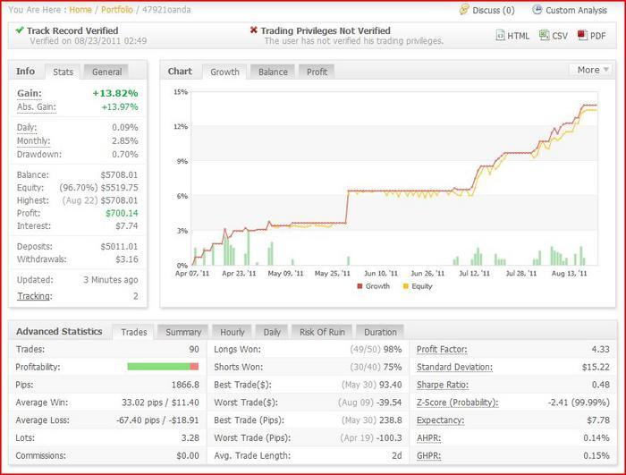

Obtaining funding for trading ventures is a pivotal step in a trader's journey. It's about securing the capital necessary to engage in the markets effectively and sustainably. In the dynamic world of trading, having adequate funding can be the difference between taking advantage of opportunities and sitting on the sidelines. This article is crafted with the purpose of navigating traders through the labyrinth of obtaining funding. We aim to present a comprehensive guide, laying out diverse and practical options for traders at various stages of their trading journey. Whether you're a novice starting fresh or an experienced trader looking to scale, understanding how to secure funding is fundamental. This guide will explore various avenues, from traditional methods to innovative approaches, providing valuable insights and actionable advice to empower traders in securing the financial backing they need to thrive in the trading arena.

## Table of Contents

## Understanding the Basics

Trading capital is the lifeblood of a trader's career. It refers to the amount of money allocated to buy and sell various financial instruments. This capital is not just a means to execute trades; it's a trader's arsenal to leverage opportunities in the market. Without sufficient trading capital, a trader's ability to generate profits can be significantly hampered, as they may not be able to sustain the necessary positions or diversify their portfolio adequately.

However, self-funding trading accounts presents its own set of challenges. One of the primary obstacles is the limitation on trade size and scope. Traders using their own funds often have to **start small**, which can limit their market exposure and potential earnings. Additionally, using personal savings for trading puts one's financial security at risk. The volatility of financial markets means that traders could potentially lose a significant portion of their investment, impacting not only their trading future but also their personal financial stability.

Moreover, **emotional stress** plays a significant role when trading with one's own money. The pressure to not lose personal funds can lead to irrational decision-making or a conservative approach that might miss lucrative opportunities. This emotional aspect can be a significant hindrance to developing a clear, objective trading strategy.

Understanding these dynamics is crucial for traders, as it shapes the approach one takes to acquire and manage their trading capital. Recognizing the limitations of self-funding is the first step towards exploring other avenues of obtaining trading capital, which can provide greater flexibility and potential for growth in the trading world.

## Eight Ways to Get Trading Capital

1. **Signal Service**: Traders with a proven track record can generate income by offering signal services. By sharing their trade signals with others for a fee, traders can earn a steady income, which can then be used to augment their trading capital.
2. **Copy-Trading**: This involves allowing other traders to copy your trades. Platforms that support copy-trading enable successful traders to attract followers who invest their money based on the trader's strategies, often earning the trader a portion of the profits or a fee.
3. **Family and Friends**: Borrowing capital from family and friends is a common way to raise funds. While it can be a quick and accessible source of capital, it also carries the risk of strained relationships in the event of losses. It's crucial to approach this option with clear terms and understanding.
4. **MAM Accounts**: Multi-Account Manager accounts enable skilled traders to manage multiple trading accounts from a single master account. This can be an effective way to scale operations and attract more capital from investors who are willing to pay for account management services.
5. **Broker Funding**: Some brokers offer funding programs or contests that provide traders with capital to trade. These opportunities may come with certain conditions or performance targets, but they can be a great way to gain access to larger capital.
6. **Proprietary Trading Firms**: Prop firms provide funding to traders in exchange for a share of the profits. These firms typically look for traders with solid strategies and consistent performance. Getting into a prop firm often involves a selection process and sometimes a training period.
7. **Online Prop Firms or Funding Firms**: The rise of online prop firms has opened new doors for traders. These firms offer funding in exchange for a share of profits and usually have a more streamlined application process compared to traditional prop firms.
8. **Creating Your Own Fund**: Experienced traders can consider starting their own fund. This involves more than just trading – it includes setting up a legal entity, compliance with regulations, attracting investors, and managing their money. This option requires significant experience and a strong track record to attract investors.

## Alternative Funding Options

### Crowdfunding for Trading

Crowdfunding has emerged as a revolutionary way for traders to raise capital. Platforms like Kickstarter allow traders to present their trading strategies and goals to a wide audience. This method involves creating compelling campaigns that showcase the trader's skills, strategies, and potential returns. Contributors can fund the trader with small amounts of capital, and in return, they may receive a share of the profits or other incentives. This option is particularly appealing for traders with innovative approaches but who lack access to traditional funding sources. However, it requires a strong pitch and the ability to market one's trading plan effectively to potential backers.

### Venture Capital and Angel Investors

Venture capital and angel investors are high-net-worth individuals or firms that invest in ventures with high growth potential, and this can include trading ventures. These investors are typically looking for more than just good performance; they seek traders with a solid business plan, scalability potential, and a deep understanding of the markets. Securing funds from these investors often involves rigorous scrutiny of the trader's track record, risk management strategies, and future profit potential. While this option can provide substantial funding, it often comes with strings attached, such as equity stakes or specific performance benchmarks. Traders considering this route should be prepared for intense due diligence processes and the pressure of delivering consistent results.

## Qualifying for Funding

### Skills and Track Record

For traders seeking funding, demonstrating a robust set of skills and a strong track record is paramount. Investors and funding sources typically look for evidence of consistent performance over time. This includes not just profitability but also risk management, adaptability to market changes, and strategic planning. A solid track record should showcase a history of calculated decisions, an understanding of market dynamics, and the ability to maintain performance under varying market conditions. It's crucial for traders to present a detailed and transparent trading history, including win/loss ratios, drawdown periods, and recovery strategies employed during downturns.

### Building a Compelling Portfolio

Creating an attractive portfolio is another critical step in securing trading funding. This portfolio should go beyond just financial returns; it needs to tell the story of the trader's unique approach, decision-making process, and future potential. It should highlight key trades, strategies used, and the reasoning behind them. Additionally, it's beneficial to include a risk assessment framework, showcasing how risks are identified, measured, and managed. Including testimonials or references from previous associates or mentors can also add credibility. A well-crafted portfolio not only demonstrates the trader's past successes but also conveys their future promise, making it a powerful tool in attracting investors.

## The Application Process

### Application Tips

When applying for funding from prop firms or other sources, it's crucial to approach the process with professionalism and thorough preparation. Start by researching the specific requirements of each funding source. Tailor your application to highlight aspects of your trading style and experience that align with their criteria. Be concise yet comprehensive in detailing your trading strategy, risk management, and performance metrics. Ensure all documentation, including your trading history, is accurate and up-to-date. A well-organized and transparent application increases credibility and demonstrates your seriousness as a trader.

### Preparing for Interviews

Interviews with potential investors or prop firms are a critical step in securing funding. Preparation is key. Anticipate questions related to your trading strategy, decision-making process, and how you handle losses. Be ready to discuss specific trades, what you learned from them, and how you have evolved as a trader. It's also important to show your understanding of market dynamics and how external factors can impact trading decisions. Practicing your responses, ideally with a mentor or peer, can help you articulate your thoughts clearly and confidently. Finally, remember that interviews are not just about assessing your trading skills but also about gauging your fit with the firm's culture and values.

## Risks and Considerations

### Understanding the Risks

Trading with borrowed capital significantly amplifies both potential gains and losses. It's crucial to understand this increased risk exposure. Leverage can lead to rapid losses, especially in volatile markets. Traders must also be aware of the psychological impact of trading with someone else's money, which can lead to increased stress and pressure to perform. This can affect decision-making and risk-taking behavior. It’s vital to have a solid risk management strategy in place and adhere to it strictly.

### Legal and Ethical Considerations

Obtaining funding for trading ventures brings legal and ethical responsibilities. Compliance with financial regulations is a must. Traders must understand the terms and conditions of their funding agreements, including any restrictions on trading strategies, withdrawal limitations, and profit-sharing arrangements. Ethically, it's important to manage borrowed funds with the utmost integrity. This means avoiding any deceptive practices and being transparent about risks and potential outcomes with backers. Mismanagement or misuse of funds can lead to legal consequences and damage your reputation in the trading community.

## Conclusion

In summary, obtaining funding for your trading ventures is a multifaceted process that offers various avenues, each with its unique opportunities and challenges. From leveraging signal services and copy-trading to exploring funding options through family and friends, MAM accounts, broker funding programs, proprietary trading firms, online funding firms, and even starting your own fund, traders have an array of choices to consider. Additionally, alternative options like crowdfunding, venture capital, and angel investors broaden the spectrum of possibilities.

It's essential to recognize the critical role of a solid track record, skill set, and a compelling portfolio in qualifying for funding. The application process demands attention to detail, thorough preparation for interviews, and a clear understanding of the risks and legalities involved.

The journey of securing funding is paved with both success stories and cautionary tales. As traders, you're encouraged to learn from these experiences, adopting responsible trading practices, especially when using external funds. Remember, securing funding is not just about having the capital to trade but also about making informed, ethical, and strategic decisions that align with your long-term trading goals.

As you navigate these options, use the provided resources, including links to reputable prop firms and educational materials, to further your understanding and skills in trading and funding. Carefully weigh your options, considering your personal trading style, risk tolerance, and long-term objectives.

Ultimately, the path you choose should align with your individual goals, capabilities, and understanding of the trading landscape. The right funding source can be a powerful catalyst for your trading career, but it requires a balanced approach, blending ambition with prudence. Take these insights and embark on a journey to secure your trading future with confidence and clarity.

💡 **Read more:**

- Trading strategies papers with code on [Equities](https://wiki.paperswithbacktest.com/trading-strategies/equities), [Cryptocurrencies](https://wiki.paperswithbacktest.com/trading-strategies/cryptocurrencies), [Commodities](https://wiki.paperswithbacktest.com/trading-strategies/commodities), [Currencies](https://wiki.paperswithbacktest.com/trading-strategies/currencies), [Bonds](https://wiki.paperswithbacktest.com/trading-strategies/bonds), [Options](https://wiki.paperswithbacktest.com/trading-strategies/options)
- [A curated list](https://github.com/paperswithbacktest/awesome-systematic-trading) of awesome libraries, packages, strategies, books, blogs, and tutorials for systematic trading
- [A bunch of datasets](https://huggingface.co/paperswithbacktest) for quantitative trading
- [A website to help you](https://paperswithbacktest.com/) become a quant trader and achieve financial independence

## References & Further Reading

- ["Trading for a Living"](https://www.amazon.com/Trading-Living-Psychology-Tactics-Management/dp/0471592242) by Dr. Alexander Elder: A classic that covers various aspects of trading psychology, strategies, and risk management.
- ["The Intelligent Investor"](https://www.amazon.com/Intelligent-Investor-Definitive-Investing-Essentials/dp/0060555661) by Benjamin Graham: Offers timeless wisdom on value investing, a useful approach for long-term trading ventures.